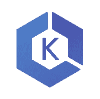
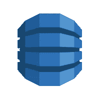
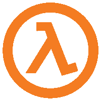
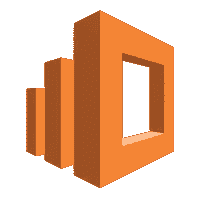
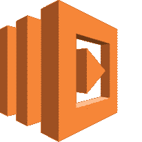
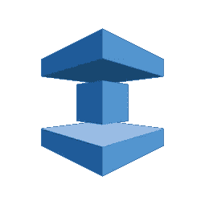
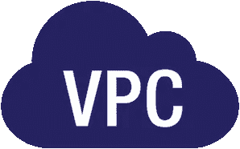
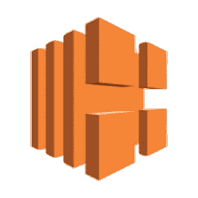
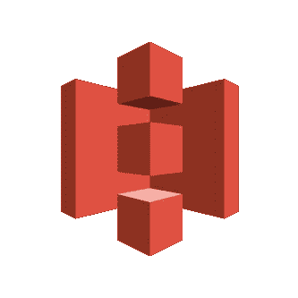
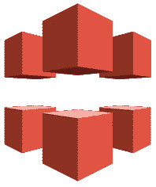

# AWS 宇宙飞船

> 原文：<https://betterprogramming.pub/the-aws-spaceship-7e386dab4f4f>

## 让您的开发团队以光速前进

在技术领域，没有什么比在正确的时间、正确的地点拥有正确的工具更重要了——尤其是当你在一个敏捷团队中工作的时候。敏捷的核心是拥有快速实现目标的方法，同时保持足够的灵活性以适应不断变化的需求。正是因为我们公司需要保持这些敏捷能力，所以我们选择与 AWS 合作。通过这样做，我们成功地大幅降低了运营成本。

在本文中，我们将解释我们使用的 [AWS 服务](https://aws.amazon.com/)，并强调它们的一些主要优势。

## [EKS](https://aws.amazon.com/eks/) (弹性库伯内特服务)

让我们从任何现代分布式系统的面包和黄油开始——[Kubernetes](https://kubernetes.io/)。

因为 EKS 构建在 EC2 实例之上，所以 AWS 可以提供主节点和所有基础设施。您只需要担心服务的定义。

在我们当前的设置中，每个舞台环境都有不同的名称空间。唯一改变的两件事是变量/秘密和运行的实例数量。这样，我们就有了一个非常类似于生产的开发环境。不用说，这是必不可少的，这样您就可以调试并找到困扰您这么多的闪避错误。

使用 Kubernetes 的另一个有力论据是它对基础设施的声明性方法。你声明它应该运行的服务，它会尽最大努力运行它。如果由于某种原因服务停止，Kubernetes 将启动一个新的实例来实现声明的状态。

但是你可能会问，“所以 EKS 将帮助我部署和维护我的服务，但是不同的服务之间将如何相互沟通呢？”

## [驱动力](https://aws.amazon.com/kinesis/)

有了这个服务，您可以将所有消息从一个实例传输到另一个实例，并让解耦的服务很好地交互。

当客户端请求不总是命中同一个实例时，或者当处理不在一个实例中进行并且需要来自其他微服务的额外计算时，这一点很重要。

AWS 为服务通信提供的另一个选项是 SNS 和扇出 [SQS](https://aws.amazon.com/sqs/) (简单队列服务)订阅。你可以在这里阅读更多关于如何设置[的内容。](https://aws.amazon.com/getting-started/tutorials/send-fanout-event-notifications/)

最简单的例子就是让一个服务处理数据，另一个服务对数据进行归档。对于 SQS，这是不可能的，如果没有订阅 SQS 的 Kinesis 流。

此外，Kinesis 与 DynamoDB 和 Lambda 函数深度集成，这是接下来的两个主题。

## [DynamoDB](https://aws.amazon.com/dynamodb/)

这是 NoSQL 文档库持久性的最佳 AWS 解决方案。除了存储 JSON 对象的能力之外，它还为您提供了创建索引和通过索引进行搜索的可能性，这使得读取非常具有操作性。如果在扩展应用程序时，某个索引开始被大量使用，那么可以在表配置中扩展分配给它的资源。

在我们的例子中，我们用代表我们的解决方案的核心概念的领域实体来分隔一切。

蛋糕上的樱桃是，DynamoDB 也可以通过管道连接到 Kinesis，我想你可以看到我们要去哪里。这种事件架构非常适合无服务器。见鬼。无服务器正是为这种情况开发的。

## [λ功能](https://aws.amazon.com/lambda/)(无服务器)

发展世界的另一个热门话题。Lambda 函数因为开发和部署非常简单，最近受到了很多人的喜爱。

在我们的基础设施中，我们将其作为辅助工具。它观察来自我们在 EKS 和 DynamoDB 中的应用程序的 Kinesis 流，并以非常特定的方式对这些事件做出反应。

举个例子，你如何让你的团队知道一个大客户开始使用你的应用程序

*-应用程序在 DynamoDB 上保存了一个新的客户端条目
- DynamoDB 将此事件通过管道传输到 Kinesis 流
- Kinesis 流触发 Lambda 函数，该函数正在监视此类事件
- Lambda 函数向营销渠道发送一条友好的*[*Slack*](https://slack.com)*消息，告知我们有了一个新的酷客户端:)*

另一个例子是弹性搜索指数的更新。

假设您使用 ES 对存储在 DynamoDB 表中的实体进行基于文本的搜索。

*-一条新记录被添加到您的实体表
- DynamoDB 将这个创建的事件传输到 Kinesis 流
-一个 lambda 函数监听这个流，并将信息保存到 Elasticsearch 索引中，使其可以用简单的文本术语进行查询。*

如您所见，这与主应用程序完全分离。它提供即时价值，并提高对正在发生的事情的可见性。

## [弹性搜索](https://aws.amazon.com/elasticsearch-service/)

说到这里，Elasticsearch 是您分析生产日志并获得关于应用程序健康状况的精确信息的最佳方式之一。而且，你猜怎么着——亚马逊提供 Elasticsearch 作为服务，因为它是建立在 EC2 之上的，你可以扩展它以满足你的需求。

不幸的是，这是迄今为止唯一一个与 Kinesis 无关的作品。所以为了填充 ES，我们在 Kubernetes 节点中使用 F [luentd](https://www.fluentd.org/) 。这使容器的输出正常化，并推送到 es。

仅依赖于 ES 数据的 Lambda 函数需要用 cron 事件来触发，例如每五分钟一次。

除了断言系统的健康状况之外，您还可以使用不同的索引(类似于传统数据库中的表)来存储数据和使用度量。结合开箱即用的 UI 和分析工具 [Kibana](https://www.elastic.co/products/kibana) ，您可以获得关于用户如何使用产品的重要信息。

## [步进功能](https://aws.amazon.com/step-functions/)

但是我们如何管理分阶段的执行流程呢？

阶跃函数。这是一个强大的工具，用于触发基于时间的执行，并具有阻止操作的任意机制。

假设我们想给用户发送一条消息，提醒他们完成教程，但是用户可以在没有我们输入的情况下自己开始教程。所以，我们需要一种方法来取消这个提醒的执行。阶跃函数正是允许这一点。您控制执行流，如果执行不再相关，您可以取消它。

## [弹性缓存](https://aws.amazon.com/elasticache/)

Step 函数很棒，但是我们需要将执行的引用保存在某个地方，以便应用程序可以在以后决定是否应该取消执行。亚马逊也为你提供了这方面的服务。

对于任何临时的事情(但不仅仅是临时的)，您可以使用这个可伸缩的服务，它提供了在 [Redis](https://redis.io) 和 [Memcached](https://memcached.org/) 之间的选择。

我们喜欢使用 Redis，AWS 会根据您的需要提供尽可能多的 HA 实例。它们之间有几个主要区别——Redis 的高级数据结构和 Memcache 的对象大小限制(超过 1mb)。

选择适合您使用情形的产品。你也可以把它们结合起来！

## [**云手表**](https://aws.amazon.com/cloudwatch/)

如果您正在使用我们上面提到的任何服务，您将生成被推送到 CloudWatch 并聚合到其中的日志。有了它，可以设置警报和通知，因此您的团队不会丢失基础架构中的状态更改。

## [IAM](https://aws.amazon.com/iam/) (身份访问管理员)

这是运行在 AWS 上的每个服务或访问任何类型信息的用户的核心。IAM 定义了服务运行的每个规则。
例如，lambda 函数可以由事件触发并执行某些动作。为了响应一个事件，你不需要一个特定的规则，但是为了执行动作，你需要声明这个 lambda 函数可以访问这个服务或者资源。

用户也是一样。如果您定义特定用户组没有删除 S3 文件的权限，他们将无法执行此操作。

当您配置这些配置文件和安全组时，您可以尽可能广泛地定义它们。但是，当我们谈论生产环境时，权限范围越细越好。这是因为它对谁被允许执行什么提供了更好的控制。

## [VPC](https://aws.amazon.com/vpc/) (虚拟私有云)

还是说安全性，一件事是确保服务或用户有正确的权限来完成所需的工作。另一个是减少整个基础设施的表面，同时也减少安全响应团队需要处理的范围。记住，你的系统越是开放地连接到互联网，它就越容易受到攻击。

这就是 AWS 实现私有虚拟云的原因，在私有虚拟云中，您可以为面向外部和内部的 EC2 实例定义粒度配置。

## [ELB](https://aws.amazon.com/elasticloadbalancing/) (弹性负载平衡器)

ELB 是 AWS 的一个标准实现，用于提供多实例可伸缩的应用程序环境。有了这个工具，您将能够接收对一个 IP 的请求，并将负载分散到多个实例，这样就可以轻松地进行扩展。

## [ECR](https://aws.amazon.com/ecr/) (弹性容器注册)

如果您要部署一个现代应用程序，我们正在讨论容器映像部署。自 2014 年以来，该行业陷入了一场革命。新技术的出现充分利用了容器技术所能带来的优势。

但是要部署容器，您需要一个存储位置。ECR 正是提供了这一点。跟推新形象一样简单。而且，在 Kubernetes 中，您可以声明一个部署来使用这个特定的映像。因为有了 IAM，您的 Kubernetes 集群无需任何额外的配置就可以获取映像。

## [S3](https://aws.amazon.com/s3/) (简单存储系统)

当您需要部署或存储除容器图像之外的其他工件时，Amazon 已经为您提供了 S3。简单易用，定义一个有权限的桶就可以了。你可以从任何地方访问它——无论是否在互联网上——并且你可以上传新文件到它上面。

没有太多要说的。它简单、快速、可扩展，并且成本几乎为零。

## [亚马逊云锋](https://aws.amazon.com/cloudfront/)

由于我们在讨论 S3 的静态文件分发，通常与之结合使用的服务是 AWS 的 [CDN](https://en.wikipedia.org/wiki/Content_delivery_network) (内容交付网络)解决方案。这利用了 AWS 建立的全球网络，并在你的用户群附近缓存你的内容，降低了存储在 S3 上的工件的整体下载时间。更不用说现成的 DDoS 缓解和其他方便的功能，如缓存失效，如果你需要尽快推出更新。

## [AWS 证书管理器](https://aws.amazon.com/certificate-manager/)

如果您是在 https ( **，这是您绝对应该做的**)下提供服务，那么您只需要信任提供和供应您的 SSL/TLS 证书的服务。除了遵循所有安全标准和最佳实践之外，使用 AWS 解决方案的一大优势是证书的自动更新。这意味着它不需要你的任何输入，如果它是亚马逊发布的。

总而言之，我们推荐 AWS 不仅作为一个构建工具，而且作为一个可靠的、可伸缩的现代应用程序的基础。

如果你有一家重视尖端技术和交付速度的初创公司，订阅 [AWS Activate](https://aws.amazon.com/activate/) 计划以获得亚马逊高级支持、轻松扩大规模的积分，并成为创新公司团队的一员。