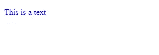
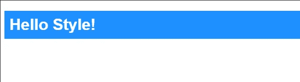
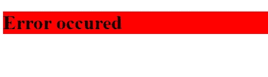
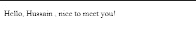
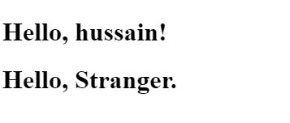
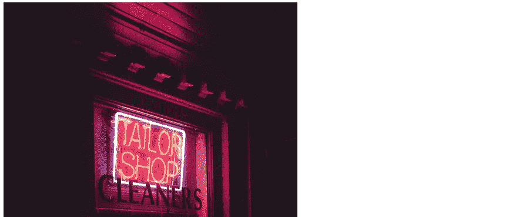

# React 中样式化和编写 CSS 的基础

> 原文：<https://betterprogramming.pub/the-basics-of-styling-and-writing-css-in-react-ff936ac98ffc>

## 如何用 JavaScript 设计 React 组件的样式


来源:[Unsplash.com 的马克·奥利维尔](https://unsplash.com/photos/VHw-2w8zPFY)

在普通 HTML 中，我们设计组件的样式并使用 JavaScript，如下所示:

```
<p style='color:blue;'>Hello, my name is <span id='name'> </span> </p>
<script>
let s = document.getElementById('name')
s.innerText= 'Hussain'
</script>
```

然而在 React 中，我们是这样做:

```
function App() {
  let myName= 'Hussain'
  return(
    <p style={{color:'blue'}}> My name is {myName} </p>
    );
}
ReactDOM.render(<App/>, document.getElementById('root'));
```

在 React 中，我们以不同的方式执行这项任务——以这样一种方式，它在视觉上变得更容易。在本教程中，我们将讨论如何在 React 中使用 CSS 属性，以及如何在 JSX 标签中运行 JavaScript 代码。

# 样式和 CSS

样式化组件有三种方式:内联样式化、CSS 样式表和模块 CSS

## 1.内嵌样式

**单内联样式:**在普通的 HTML 中，我们在你的应用中使用内联样式，就像这样:

```
<p style="color:blue;"> This is a text </p>
```

然而，这个概念在 React 中是不同的。在 React 中使用样式时，我们用双花括号将它们括起来。

例如，让我们用蓝色呈现一个`p`元素:

```
function App() {
  return(
    <p style={{color:'blue'}}> This is a text </p>
    )
}
ReactDOM.render(<App/>, document.getElementById('root'))
```

注意，样式是用双花括号(`{{}}`)括起来的。

这是结果:



代码的输出

## 多重内嵌样式

在内联 CSS 中使用多种样式也很容易。

```
<p style={{color:'white',backgroundColor:'gray'> This is a text </p>
```

记住，React 对 CSS 样式属性使用了`camelCase`符号。比如 CSS 中的`background-color`属性就相当于`backgroundColor`。

## 使用对象变量

使用多个内联样式实际上是不可行的，所以你需要一个变量来存储你所有的样式:

```
const mystyles = {
      color: "white",
      backgroundColor: "DodgerBlue",
      padding: "10px",
      fontFamily: "Arial"
    };
//..further code
<p style={myStyles}> My style! </p>
```

这里，`mystyles`是一个包含所有相关 CSS 样式的对象。
稍后，这个对象在`style`属性中被传递。

这将是输出:



代码的输出

## 2.样式表

作为开发人员，代码模块化应该被视为程序的一个重要阶段。在许多项目中，CSS 样式位于另一个文件中。

要实现这样的行为，创建一个新文件`myStyle.css`，并编写以下代码:

```
body {
  background-color: #282c34;
  color: white;
  padding: 40px;
  font-family: Arial;
  text-align: center;
}
```

*注意:由于这是一个 CSS 文件而不是 React 代码，我们将不再使用* `camelCase` *。*

现在让我们使用以下语法将其导入 React 文件:

```
import "./filename.css"
```

`filename.css`是你的 CSS 文件的名字。*注意，需要指定相对文件路径。*

在 React 代码中使用它:

这是输出:


代码的输出

## 3.模块 CSS

这种方法对于放在单独文件中的 HTML 元素很方便。

它类似于 CSS 样式表方法，但是这次 CSS 文件应该包含`.module.css`扩展名。

例如，创建一个名为`myFile.module.css`的文件:

```
.error {background-color: red;}
```

现在，在 eReact 应用程序中，编写以下代码:

```
import React, { Component } from 'react';import styles from './myFile.module.css'; // Import css modules stylesheet as stylesfunction Error() {return(
 <h1 className={styles.error}>Error Occurred!</h1>;
)
}
```

这将是输出:



代码的输出

假设我们想在 HTML 中运行 JavaScript 表达式。现在让我们来看看 JSX 的 JavaScript。

# JSX 境内的 JavaScript

在 React 中，可以在 JSX 标签之间运行 JavaScript 代码——通过在标签中使用花括号(`{}`)。这些花括号包含 JavaScript 代码。

## 在 JSX 中嵌入表达式

例如，让我们在变量中存储一个名字，`myName`,然后在 HTML 中打印它的值。

首先，声明一个变量， `myName`:

```
function App() {
let myName = 'Hussain'
...
```

现在，在一个`p`标签中显示它的值:

```
return (
 <p> Hello, {myName}, nice to meet you! </p>
);
}
```

注意，JSX 标签中的 JavaScript 代码是在花括号中执行的。

最终，代码看起来像这样:

```
function App() {
  let myName= 'Hussain'
  return(
    <p> My name is {myName} </p>
    );
}
ReactDOM.render(<App/>, document.getElementById('root'));
```

编译器最初以 HTML 的形式执行代码。后来，当它遇到一组花括号时，它就切换到 JavaScript。

输出如下所示:



代码的输出

注意，我们不再需要`span`元素了。这使得开发更加容易。

你甚至可以在 JSX 用 JavaScript 执行函数:

这将是上面代码的输出:


代码的输出

## JSX 也是一种表达方式

编译后，JSX 表达式成为普通的 JavaScript 函数调用，也可以计算 JavaScript 对象。

这意味着您可以在`if`语句和`for`循环中使用 JSX，将其赋给变量，将其作为参数接受，并从函数中返回。

让我们根据函数参数定义一个函数来问候用户:

```
function getGreeting(user) {
  if (user) {
    return <h1>Hello, {user} !</h1>; 
 }
  return <h1>Hello, Stranger.</h1>;
}
```

要在 JSX 使用它:

```
<div>
 With parameter: {getGreeting('Hussain')} 
 {getGreeting()}
<div>
```

代码的输出如下所示:



代码的输出

## 用 JSX 指定元素属性

我们甚至可以使用 JavaScript 指定元素属性。例如，让我们通过 JSX 指定一个`img`标签的`src`属性。一个简单的片段可以是这样的:

```
//..
const src= 'image.jpg'
return(

)
//..
```

最终，我们可以像这样在代码中使用它:

输出将如预期的那样:



代码输出

# 概述

## 半铸钢ˌ钢性铸铁(Cast Semi-Steel)

**内联样式:**使用双花括号在 React 中使用 CSS 样式

遵循`camelCase`符号。

```
return(
<h1 style={{color:'white',backgroundColor:'black'}}> Text </h1>
)
//... other code 
```

**外部样式表:**使用`import`关键字，然后使用 CSS 文件的名称。

```
import "./myFile.css"
//.. other code
```

**CSS 模块:**

`myFile.module.css`

```
.error {
//styles
}
```

您的 React 文件:

```
import myStyle from "./myFile.module.css"
function App() {
return (
  <h1 style={myStyle.error}> Text </h1>
  )
}
```

## JSX 境内的 JavaScript

使用大括号来使用 JavaScript。

```
const myNumber = 9
return(
  <p> My lucky number : {myNumber} </p>
)
```

# 结论

如果你觉得这些令人困惑，我给你的建议是摆弄代码，解构上面的示例程序。这会帮助你理解这些概念。不要放弃！

谢谢你坚持到最后！我希望你从这个话题中学到了很多。祝您愉快！

上一篇:[如何入门 React](http://medium.com/easyread/how-to-get-started-with-react-js-805bf57826ad)
下一篇:[React 中的道具指南](https://medium.com/better-programming/a-guide-to-props-in-react-d6980f947ea9)

# 进一步阅读

*   【React 组件的 5 种风格化方法
*   [添加 CSS 模块样式表](https://create-react-app.dev/docs/adding-a-css-modules-stylesheet/)
*   [React CSS](https://www.w3schools.com/react/react_css.asp)
*   [介绍 JSX](https://reactjs.org/docs/introducing-jsx.html)
*   [深入 JSX](https://reactjs.org/docs/jsx-in-depth.html)