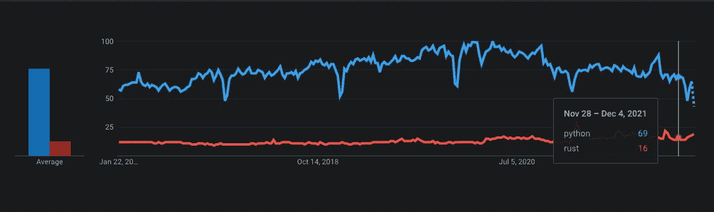

# 对数据工程师最喜爱的编程语言的争夺还没有结束

> 原文：<https://betterprogramming.pub/the-battle-for-data-engineers-favorite-programming-language-is-not-over-yet-bb3cd07b14a0>

## 让我们讨论 2022 年的下一个竞争者


海梅·斯巴尼奥[https://unsplash.com/photos/-L0N74GWsq8](https://unsplash.com/photos/-L0N74GWsq8)拍摄的[数字图像]

为正确的工作选择正确的编程语言可能是一项挑战，因为技术发展很快，并且出现了许多框架。

让我们分解这些过去的年份，了解数据工程师当前的编程语言生态系统以及 2022 年的理想候选。**斯卡拉**、**戈朗**或**铁锈**会是我们下一个最爱吗？让我们找出答案。

# 脚本和 SQL 的早期💾

当 Python 对我们大多数人来说还是一条蛇的时候，Perl 就像其他脚本语言一样被很好地使用。

Perl 最初是为文本处理而开发的，比如从指定的文本文件中提取所需的信息，并将文本文件转换成不同的形式。它非常适合数据用途。

Perl 是与 SQL 数据库接口的一种极好的方式，这是当时的标准。请记住，没有云，也没有我们今天这样的 API 主导时代。

值得注意的是，在数据用例中主要驱动 Perl 的是 **SQL** 。Perl 用于对数据库执行这些 SQL 命令。

# Python 的统治地位🐍

如今，数据工程师的工作不仅是与 SQL 数据库交互和运行查询，还包括以下内容:

*   管理基础设施(通过像 Terraform/Pulumi 这样的框架将基础设施作为代码)
*   开发数据管道
*   开发微服务/API/数据框架
*   与云服务 SDK 交互

当转向大数据时，我们看到了 Java 的大量使用。它仍然作为幕后或第一个开发 API(👋Trino，Flink，Akka 等。).

Scala 试图崛起(通过 Databricks 的 Spark)，但即使它在规模上更具性能，并且可能是更适合数据管道的语言，它在 Spark 用例之外缺乏更大的采用。

Databricks [报告称，他们的大多数 API 调用都是通过 Python 和 SQL](https://towardsdatascience.com/highlights-from-data-ai-summit-2021-3abfd9aaccaa) 完成的，这迫使他们在 Python 绑定上提供类似的性能 Scala 的另一个败笔？

**Python** 如今被大量采用，原因如下:

*   新程序员的学习曲线非常简单(笔记本很有帮助)。
*   数据科学生态系统:机器学习，可视化，深度学习。
*   云的采用:所有主要的云提供商都有一个支持良好的 Python SDK。

有什么是你用 Python 做不到的吗？

# 光明的未来和铁锈的潜力✨

SQL 将在这里停留一段时间。尽管有其局限性，但从总体上来说，它是民主化数据使用的一个较低的技术起点，而且它仍然是与 SQL/分析数据库交互的最简单的方法。

Golang 似乎是一个不错的竞争对手。Terraform 和 Kubernetes 被大量采用，并且都是用 Golang 编写的。它也是由一个主要的云提供商 Google 设计和支持的。

也就是说，围绕 Golang 构建的数据框架并不多。对于 Python 的数据普通用户来说，学习曲线也是一个很大的障碍。

那么谁会是下一个候选人呢？铁锈色。以下是四个非详尽的原因:

## 1.普遍受欢迎

根据一项[栈溢出研究](https://insights.stackoverflow.com/survey/2021#most-loved-dreaded-and-wanted-language-love-dread)，Rust 已经连续四年成为最受欢迎的编程语言！

谷歌趋势也显示出 Python 的 Rust 和[普遍疲劳的稳步增长。](https://towardsdatascience.com/why-python-is-not-the-programming-language-of-the-future-30ddc5339b66)



谷歌趋势——Python vs . Rust

另一个大消息是 Rust 将成为正式 Linux 内核的[第二语言！这将获得疯狂的牵引力。](https://www.zdnet.com/article/rust-in-the-linux-kernel-why-it-matters-and-whats-happening-next/)

## 2.性能和低内存占用

Python 能慢不是什么大新闻。Rust 的性能处于另一个水平，因为它直接编译成机器代码。没有虚拟机，在你的代码和计算机之间没有解释器。

在我们的云计算时代，您的程序在计算系统上的足迹会直接影响您的成本，还会影响电力使用，从而影响环境。

由 New Stack 进行的一项有趣的研究揭示了哪种编程语言耗电最少。Rust 在列表的顶部，而 Python…在底部。

## 3.与 Python 的互操作性

如果您可以重写现有 Python 代码库的一部分，并且仍然在您的主 Python 程序中使用它，会怎么样？那是结合了两个世界的精华。

一个具体的用例是对 s3 文件执行特定的操作，这在 Python 中可能相当慢。随着 AWS 最近在开发者预览版 Rust 中宣布他们的 AWS SDK，这是你可以在 Rust 中执行的事情。使用像 [PyO3](https://github.com/PyO3/PyO3) 这样的 Python 库的 Rust 绑定，可以让你快速地做一个简单的接口来调用 Python 中的 Rust 程序！

甚至微软也发布了一个 [windows 机箱](https://github.com/microsoft/windows-rs)，让[你可以从 Rust 访问 Win32 API！](https://blogs.windows.com/windowsdeveloper/2021/01/21/making-win32-apis-more-accessible-to-more-languages/)

## 4.许多数据项目正在 Rust 中重建

[Apache Arrow](https://github.com/apache/arrow-rs) 是构建数据处理框架的关键公共接口。它有一个很棒的 Rust 实现，并且正在推动其他数据项目的发展:

*   火花的锈当量称为[数据融合](https://github.com/apache/arrow-datafusion)
*   Delta Lake [有一个本地 Rust 接口](https://github.com/delta-io/delta-rs)，用 Python 和 Ruby 绑定。

其他大玩家，如融合的卡夫卡[现在提供一个铁锈绑定](https://www.confluent.io/blog/getting-started-with-rust-and-kafka/)。

有许多新的项目来处理数据。它仍处于早期阶段，但由于采用的增长，我们甚至可以看到 Java 不再是默认的选择。

# 然而，这值得吗？🤔

最初，Rust 和 Python 的目标不同。Rust 的学习曲线更陡峭，一些数据公民(数据科学家、数据分析师)将很难跳上船。您正在性能和简单性之间进行权衡。

作为开发运维/后端工程师，数据工程师的角色发展得更加强大，而不仅仅是“SQL 人员”在这种情况下，在一些用例中尝试 Rust 是有意义的。Rust 的思维模式对你接下来要学习的任何未来编程语言都是有价值的。如果你想亲自动手，我最喜欢的 Rust 资源之一是 YouTube 频道[让我们开始 Rust](https://www.youtube.com/c/LetsGetRusty)。

最终，编程语言只是你的工具带的一部分，拥有多种语言也无妨，尤其是当你看到数据工程师的范围最近正在呈指数级扩展的时候！🚀

```
**Want to Connect With the Author?**Follow me on 🎥 [YouTube](https://www.youtube.com/channel/UCiZxJB0xWfPBE2omVZeWPpQ),🔗 [LinkedIn](https://linkedin.com/in/mehd-io/)
```