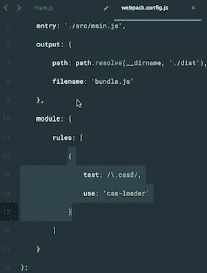

# Rollup vs. Parcel vs. webpack:哪个是最好的捆扎机？

> 原文：<https://betterprogramming.pub/the-battle-of-bundlers-6333a4e3eda9>

## 邦德勒之战


卷装 vs .包裹 vs .网袋:谁是捆扎机的最佳选择？

最近，我向 npm 发布了一个库，我想用我将要打包的代码的 bundler 进行试验。虽然 [webpack](https://webpack.js.org/) 一直是我的标准选择，但我决定让它与另外两个流行的捆扎机— [Rollup](https://rollupjs.org/guide/en/) 和 [Parcel](https://parceljs.org/) 竞争。

对于那些来自非 JavaScript 背景的人来说，bundler 是一个工具，它递归地跟踪来自应用程序入口点的所有导入，并将它们打包成一个文件。打包程序还可以通过删除不必要的空白、新行、注释和块分隔符来缩小文件，而不会影响它们的功能。

让我们通过一个简单的代码片段来理解这一点:

```
var test = [];
for (var i = 0; i < 100; i++) {
  test[i] = i;
}
```

我们刚刚创建了一个名为 test 的数组，并将它的成员初始化到 100。该代码的简化版本看起来有点像这样:

```
for(var a=[i=0];++i<20;a[i]=i);
```

更少的字符和行数。你可能会说代码不可读，但是谁在乎呢？一旦你的代码准备好了，你就把它打包，精简的代码很容易被浏览器获取和解释。

现在你一定很容易猜到捆绑器的重要性，对吗？

假设您的代码没有作为多个文件的包捆绑和托管在服务器上。为了导入这些文件以运行代码，浏览器必须向服务器发送一个单独的 HTTP 请求。这种传输的效率与被请求文件的数量和大小成正比。对于像脸书这样的大型应用程序，这可能会导致灾难性的性能和 UX。

然而，随着 bundler 的加入，应用程序的性能大大提高，因为现在浏览器只需请求一个文件就可以向用户显示您的应用程序。此外，获取一个几千字节重的缩小文件比实际文件更快，实际文件可能会达到几兆字节，从而缩短了应用程序的加载时间。

# 既然我们可以自己动手，为什么还要安装捆扎机？

当然可以，但是当处理大型代码库时，手动缩小应用程序不是一个可扩展的解决方案。让捆绑者为你做它！

根据使用情况，从众多可用的捆绑器中做出正确的选择可能会改变您的应用程序的命运。回到我在开始时谈到的实验:我想与你分享我的发现，关于 webpack、Rollup 和 package 如何满足开发人员的一些重要需求。

## **捆扎机的配置**

**package 在这里胜出**，因为它根本不需要配置文件。只需安装 package 并运行 package build，它将为您做开箱即用的一切。

webpack 和 Rollup 都需要一个配置文件来指定条目、输出、加载器、插件、转换等。然而，有一点小小的不同:

*   Rollup 具有用于导入/导出的节点聚合填充，但 webpack 没有。
*   Rollup 支持 config 中的相对路径，但 webpack 不支持——这就是为什么您使用`path.resolve`或`path.join`。

webpack 配置可能会变得复杂，但是它提供了对第三方导入、图像、CSS 预处理程序等等的广泛支持。

我很难使用 Rollup 来捆绑我的应用程序，该应用程序使用了 [axios](https://www.npmjs.com/package/axios) ，这是一个非常常用的 HTTP 请求库——不仅仅是 axios，其他第三方集成也是如此。在取得胜利之前，我不得不做了大量的研究，并尝试安装了许多插件——代价是放弃了一些导入。

## **死码消除**

死代码消除，或者通常所说的*树抖动*，对于实现最佳的包大小和应用性能非常重要。

在这里，包裹成了赢家。Parcel 支持 ES6 和 CommonJS 模块的树摇动。这是革命性的，因为 npm 上的库中大多数代码仍然使用 [CommonJS](https://www.npmjs.com/search?q=commonjs) 。

大部分工作包在树抖动时完成，也是通过使用大量工作进程的多核处理并行完成的，并且也缓存在文件系统上。这意味着构建仍然很快，重建也快得惊人。

在比赛中，罗博获得第二名。开箱即用，它静态地分析您正在导入的代码，并将排除任何实际上没有使用的代码。这可以让你避免在配置中写入更多的行，增加额外的依赖和增加应用程序的大小。

webpack 需要一些手动操作来实现树抖动:

*   使用 ES6 语法(即`import`和`export`)。
*   在您的`package.json`中设置`SideEffects`标志。
*   包括一个支持死代码移除的 minifier(例如:`UglifyJSPlugin`)。

Rollup 和 webpack 更关注 ES6 的树抖动，因为它更容易进行静态分析，但为了真正产生重大影响，我们还需要分析 CommonJS 依赖关系，为此它们都需要导入插件。

然而，鉴于 JavaScript 是动态的这一事实，该语言中的几乎每一个结构都可能在运行时以无法预测的方式被改变。

实际上，这意味着作为一个引用导入的实体(如类)不能被静态分析来删除不使用的成员(静态和实例)。因此，与其过度依赖捆绑器来帮你做这件事，不如在你编码之前可视化你的组件，然后分析它们以获得最佳结果。

## **代码拆分**

随着应用的增长，你的捆绑包大小也会增长，尤其是第三方导入。你的应用程序的加载时间与其包的大小成正比。

代码分割帮助浏览器*延迟加载*应用程序运行所需的东西，显著提高性能和 UX。

**webpack 在这方面胜出**，工作量最小，加载时间更快。它提供了三种方法来启用 webpack 中可用的代码拆分:

*   **定义入口点** —使用`[entry](https://webpack.js.org/configuration/entry-context)`配置手动分割代码。
*   **使用** `[CommonsChunkPlugin](https://webpack.js.org/plugins/commons-chunk-plugin)`对数据块进行重复数据删除和拆分。
*   **动态** i **导入** —在模块内使用内联函数调用。

在通过 Rollup 进行代码拆分的过程中，您的代码拆分块本身是标准的 es 模块，它们使用浏览器的内置模块加载器，没有任何额外的开销，同时仍然可以获得 Rollup 的树摇动特性的全部好处。对于还不支持 ES 模块的浏览器，你也可以使用`SystemJS`或者任何 AMD loader。它是完全自动化的，结果是零代码重复。

宗地支持零配置代码分割。在这里，代码拆分是通过使用动态`import()` [函数语法建议](https://github.com/tc39/proposal-dynamic-import)来控制的，它的工作方式类似于普通的`import`语句或`require`函数，但返回的是`Promise`。这意味着模块是异步加载的。

对于代码分割来说，Rollup 和 package 比 webpack 更受欢迎，但是它们都是最近才引入这个特性的，并且也报告了一些问题。所以坚持使用老的网络包是安全的。

我注意到的一个引人注目的事实是，对于启用了代码拆分的相同代码，使用 webpack 的构建时间最少，其次是 Rollup，最后是 package。

## 实时重装

在开发过程中，如果你的应用程序用你写的新代码更新，而不是手动刷新来查看变化，那就太好了。具有实时重新加载功能的捆扎机可以为您刷新。

除了调试和开发所必需的其他实用程序之外，Bundlers 还以开发服务器的形式为您提供了一个运行时环境。

Parcel 已经非常周到地内置了一个开发服务器，它会在您更改文件时自动重建您的应用程序。但是当使用 HTTP 日志、钩子和中间件时，会有一些相关的问题。

在使用 Rollup 时，我们需要安装并配置`rollup-plugin-serve`，它将为我们提供 live reload 功能。然而，它需要另一个插件`rollup-plugin-livereload`才能工作。这意味着它不是一个独立的插件，需要额外的依赖才能运行。

有了 webpack，你只需要添加一个名为`webpack-dev-server`的插件，它提供了一个简单的开发服务器，默认情况下开启了实时重载功能。什么更好？在开发服务器启动并运行之后，您可以使用钩子做一些事情，添加中间件，还可以指定我们运行开发服务器时要服务的文件。**web pack 的这种可定制性胜过了 Rollup 和 package。**

## **热模块更换**

热模块替换(HMR)通过在运行时自动更新浏览器中的模块而无需刷新整个页面，从而改善了开发体验。当您对代码进行小的更改时，可以保留应用程序状态。

你可能会问 HMR 和实弹有什么不同。

当一个文件改变时，实时重新加载会重新加载整个应用程序。例如，如果你进入应用导航的第五层并保存了更改，实时重新加载会重新启动应用并将其加载回着陆/初始路线。

另一方面，热重装仅刷新被改变的文件，同时仍然保持应用的状态。例如，如果你在应用导航的第五层保存了一个 CSS 修改，状态不会改变:你仍然在同一个页面上，但是新的样式是可见的。

webpack 有自己的网络服务器，称为`webpack-dev-server`，通过它支持 HMR。它可以在开发中作为一个实时重载的替代品。

虽然 package 已经内置了对热模块替换的支持，但 Rollup 上个月发布了一个插件`rollup-plugin-hotreload`来支持热重装。

由于这一功能在 roll up and package 这样的捆绑器中相当新，**我仍然选择 webpack 作为安全的赌注**，因为我不想在开发过程中遇到可避免的问题。

## 模块变压器

捆绑器通常只知道如何读取 JS 文件。变形金刚本质上是教师，他们教捆绑者如何处理 JS 以外的文件，并将它们添加到应用程序的依赖图和捆绑包中。



用于转换 css 模块的加载程序

例如，在上面的图片中，您可以看到一个 webpack 配置，在第 13 行到第 15 行之间有一个关于如何读取 CSS 的指令。它基本上是说，“嘿 webpack，每当你遇到一个被解析为`.css`的文件，使用上面导入的`css-loader`来读取它并将其导出为一个字符串。”类似地，一个 HTML 加载器会告诉 webpack 如何读取它在你的应用中遇到的`.html`文件，并将它们作为字符串导出到你的包中。

**Parcel 非常巧妙地处理了转换过程。**与 Rollup 和 webpack 不同，它们需要您指定要转换、安装和配置的文件类型，以及转换它们的插件，Parcel 为许多常见的转换和 transpilers 提供了内置支持。

当 package 找到`.babelrc`、`.postcssrc`、`.posthtml`等配置文件时，它会自动运行相应的转换器。在模块中。除了在`.babelrc`中指定的任何转换，Parcel 总是在所有模块上使用 [Babel](https://babeljs.io/) 将现代 JavaScript 编译成浏览器支持的形式。

# 简单地

以下是我实验发现的关键:

构建一个基本的应用程序，并希望它快速启动和运行？使用包裹。

用最少的第三方导入构建一个库？使用汇总。

构建一个包含大量第三方集成的复杂应用？需要良好的代码分割、静态资产的使用和 CommonJs 依赖吗？使用 webpack。

就个人而言，我将继续在我的项目中使用 webpack。有人可能会说，在许多情况下，Parcel 提供了内置配置，这可能会简化开发，但很难忽视 webpack 提供的广泛支持和可定制性。

归根结底，这是每个开发人员需要根据自己的需求做出的个人决定。这有点像开自动档汽车和手动档汽车的区别。有时你需要额外的控制，有时你不需要。