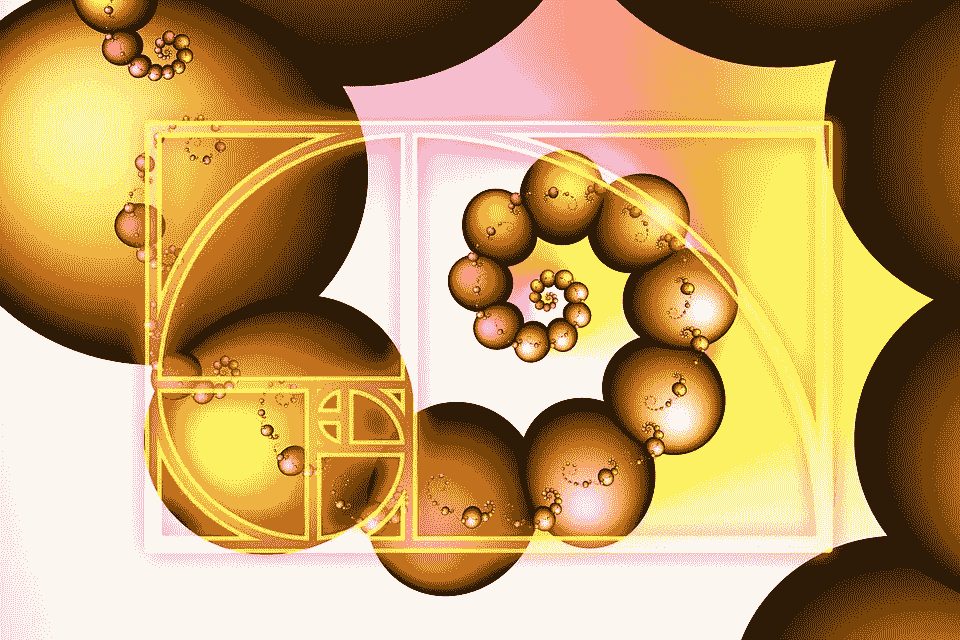
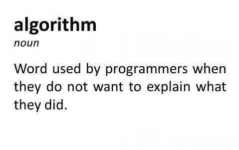
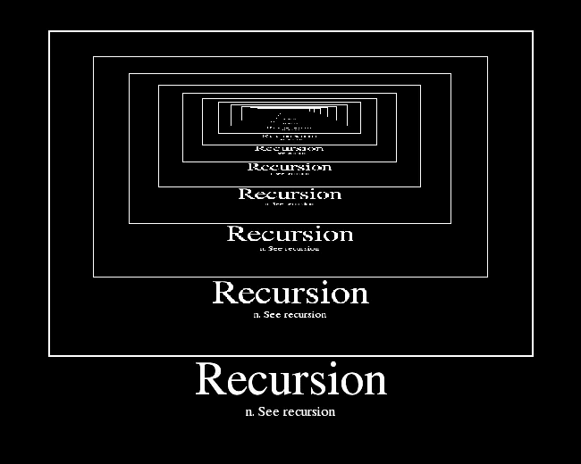
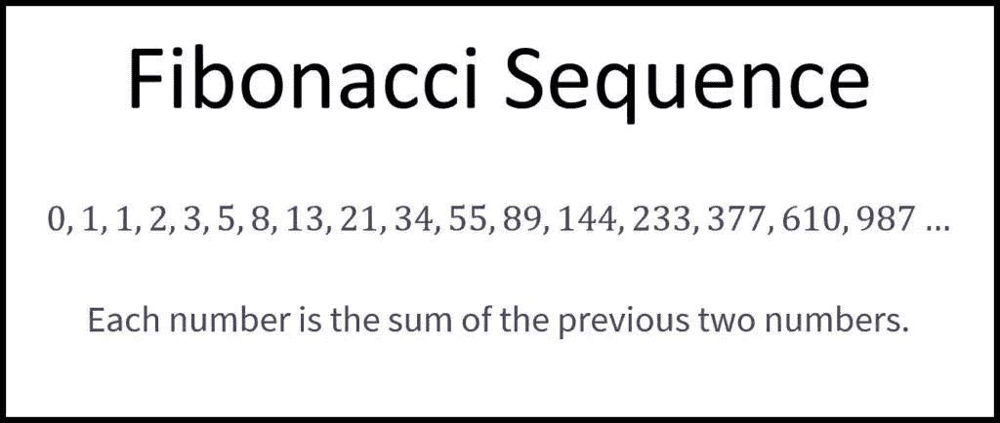
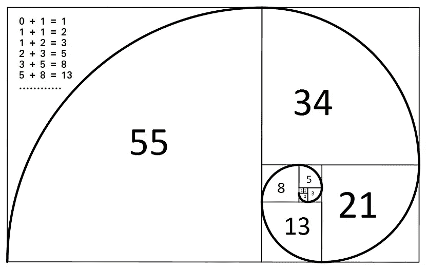

# 斐波那契数列的魅力

> 原文：<https://betterprogramming.pub/the-beauty-of-the-fibonacci-sequence-c6f95674b94e>

## 一个基本但漂亮的算法



图片由 [Pixabay](https://pixabay.com/illustrations/fibonacci-spiral-science-golden-3210944/) 上的 [Gerd Altmann](https://pixabay.com/users/geralt-9301/) 拍摄

在学习和研究数据处理、计算以及其他相关的计算机或数学运算时，我们会遇到许多算法。尽管有时我们并不真的喜欢数学，但我们确实被自然界中非常美好的事物包围着，甚至我们自己都不知道。

最有趣的事情之一是弄清楚斐波那契数列是如何工作的。这些序列在日常生活中随处可见:一朵花的花瓣数，一朵向日葵的螺旋数，等等。


图片由 [Pxfuel](https://www.pxfuel.com/en/free-photo-jrhxg) 提供

在编码时，我们会用到许多不同的算法。虽然有大量的递归、分治、随机化和蛮力算法，但最有用的算法之一是递归算法。

# 那么到底什么是算法呢？



首先，算法是我们解决一个问题需要遵循的一组任务。算法的运行时间是完成这些任务所需的总步骤数(在 CS 中也称为 BigO 符号，用于描述算法的性能)。

那么什么是递归，递归函数是如何工作的？



图片由 [Flickr](https://www.flickr.com/photos/torley/2361164281) 上的 [TORLEY](https://www.flickr.com/photos/torley/) 拍摄

*递归*的意思是当某个东西在调用自己或者把自己描述成一个自引用，直到条件为真而停止。

*递归函数*是一个在执行过程中调用自身的函数，也称为*直接递归。*与此相反的是两个函数相互调用——称为*间接递归*。

# 我们如何计算斐波那契数列，为什么知道它很重要？

对于刚接触编程的人来说，它肯定会帮助你了解如何以及何时使用递归或迭代函数。

对于数学家来说，当从微分方程开始时，这个顺序有助于他们更批判性地思考并发展他们的逻辑。

## 斐波那契的数学公式

斐波纳契数列的工作方式是，数列中的每个数字都是它前面两个数字的和。

对于 n=0，我们得到 F0=0，对于 n=1，我们得到 F1=1。记住我们总是有序列的前两个值。我们的工作是弄清楚序列的其余部分是如何生成的，以及我们想要检查的 n 值的结果是什么。所以我们总是从 n>1 开始。

斐波纳契数列是用上面的公式计算的:

F0=0，F1=1

对于 n>1，Fn=Fn-1 + Fn-2



计算 n=6 的斐波那契数列的步骤:

n=0 => F0=0

n=1 => F1=1

n = 2，而 n > 1 = > F2 = F2–1+F2–2 = F1+F0 = 1+0 = 1

n = 3 = > F3 = F3–1+F3–2 = F2+F1 = 1+1 = 2

n = 4 = > F4 = F4–1+F4–2 = F3+F2 = 2+1 = 3

n=5 =>F5=F4+F3=3+2=5

n=6 => F6=F5+F4=5+3=8，以此类推，n>1

那么，如果我们对斐波那契数列求平方，会发生什么呢？

1, 1, 4, 9, 25, 65, 169, 441, …

1 + 1 + 4 =6 = 2 x 3

1 + 1 + 4 + 9 =15 = 3 x 5

1 + 1 +4 + 9 + 25 =40 = 5 x 8

1 + 1 +4 + 9 + 25 + 64 =104 = 8 x 13 …

结果不是斐波那契数列，但它们埋藏在我们加在一起的值中。这让我们思考:实际上几乎每一个和都是斐波那契数列的一部分。

让我们检查一下黄金矩形，看看斐波那契数列是如何工作的。



我们都知道:

矩形的面积= b x h => b 底和 h 高

那么，如果我们像上面那样对平方数求和，会发生什么呢？

矩形的面积= 1 + 1 + 2 +3 +5 + 8 +13 = 273= 13x21

我们还有一些斐波纳契数列。

例如，如果我们将序列中较大的数字除以较小的数字:

13/8=1.625,21/13=1.615,34/21=1.619,

55/34=1.6176,89/55=1.61818 …

这也被称为*黄金比例*或 1.618022。除以的数字越大，我们就越接近黄金分割率的数值。

下面是计算斐波那契数列的 JavaScript 代码。时间复杂度是线性的，因为循环从 2 运行到 n。它在 O(n)时间内运行。

```
function fibonacci(n) {
    var fibonacciNumbers = [],
    firstNumber = 0, 
    secondNumber = 1;
    if (n <= 0) { return fibonacciNumbers;
    } if (n === 1) {
        return fibonacciNumbers.push(firstNumber);
    } fibonacciNumbers[0] = firstNumber;
    fibonacciNumbers[1] = secondNumber; for (var i = 2; i <= n; i++) { fibonacciNumbers[i] = fibonacciNumbers[(i — 1)] +           fibonacciNumbers[(i — 2)];
   } return fibonacciNumbers;}var result = fibonacci(3); if(result){
     for (var i = 0; i < result.length; i++) {
          console.log(result[i]);
    }
}
```