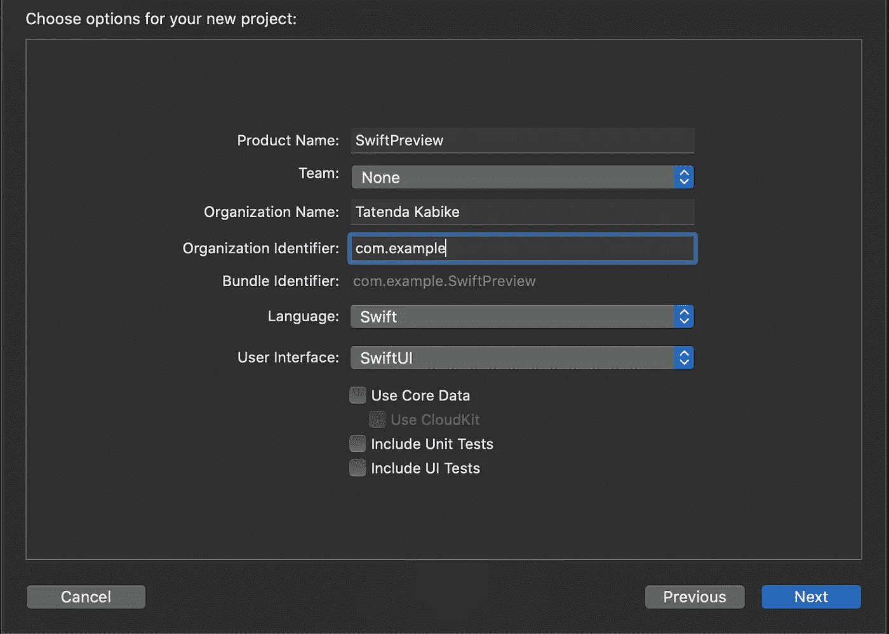
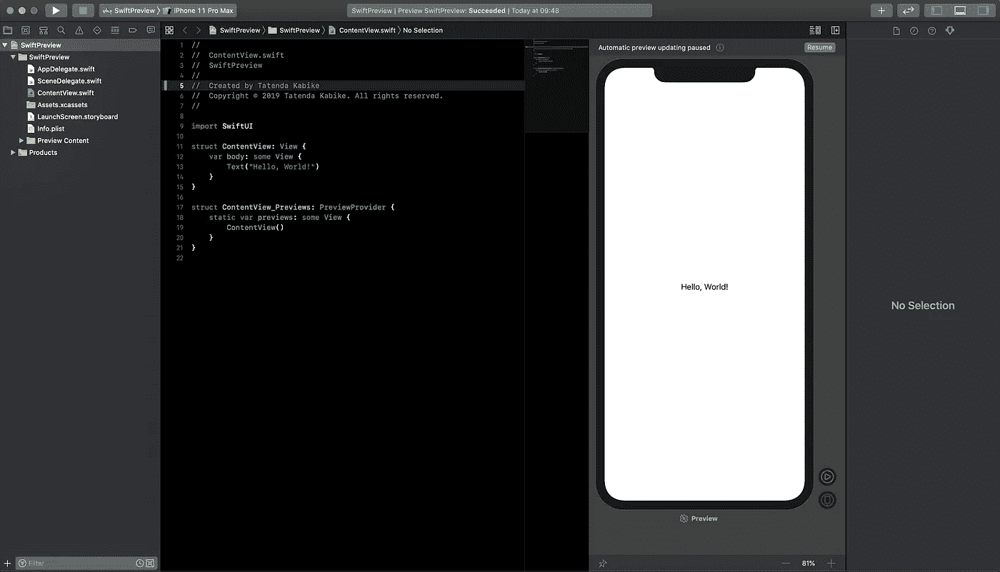
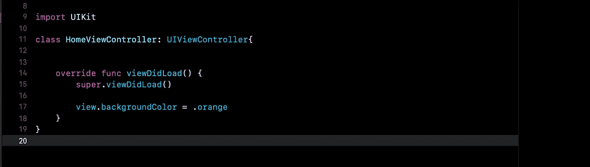
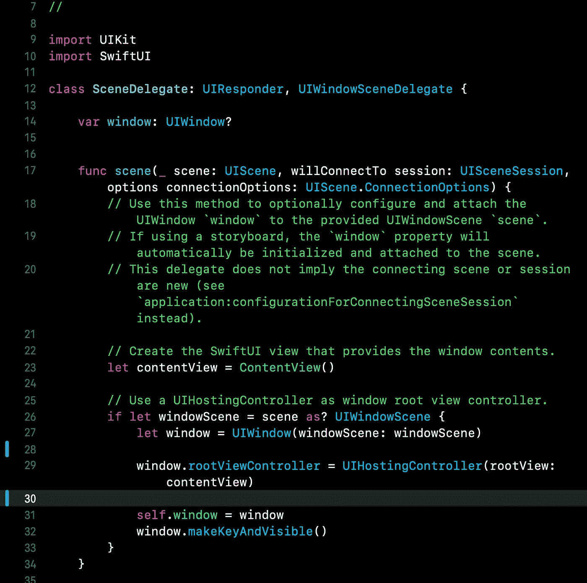
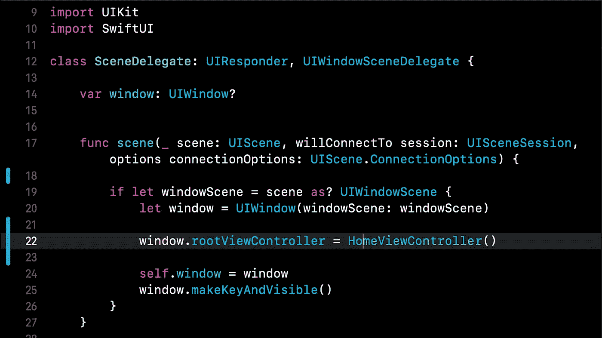
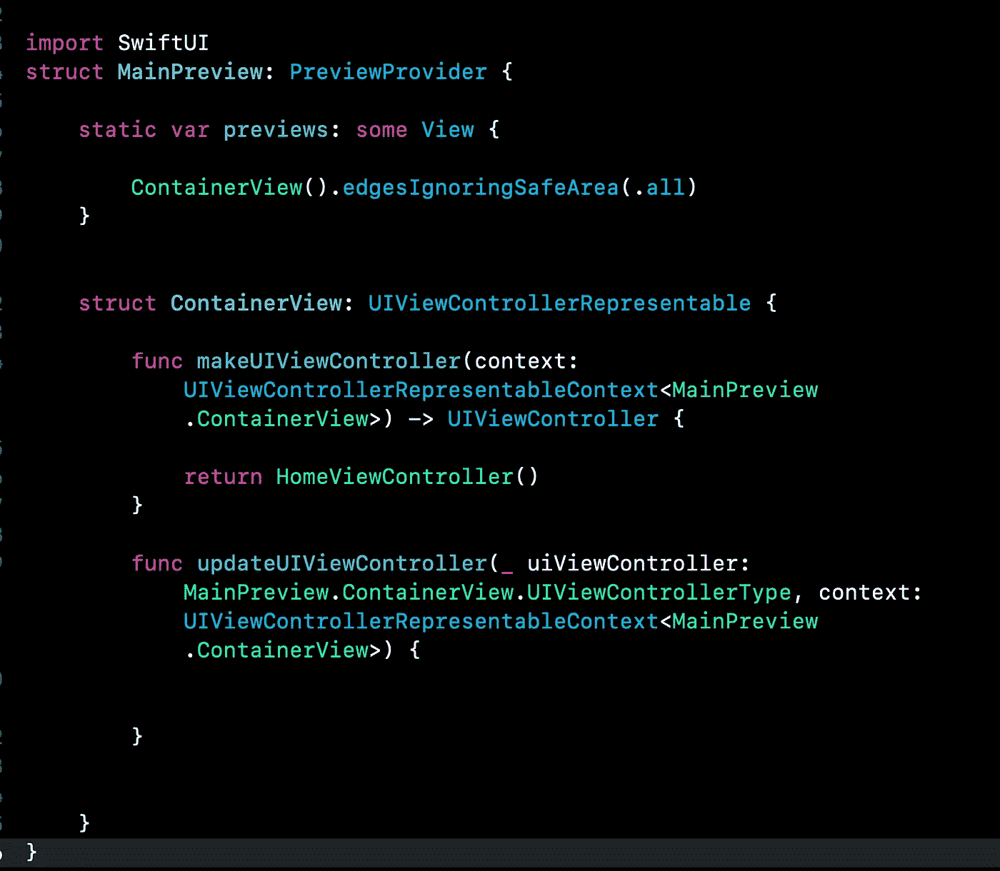
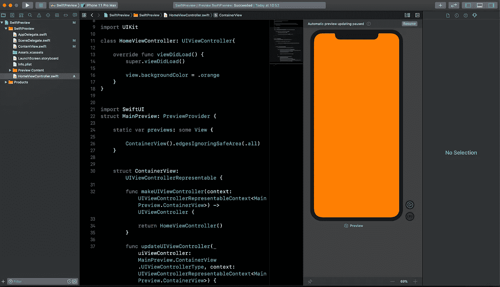
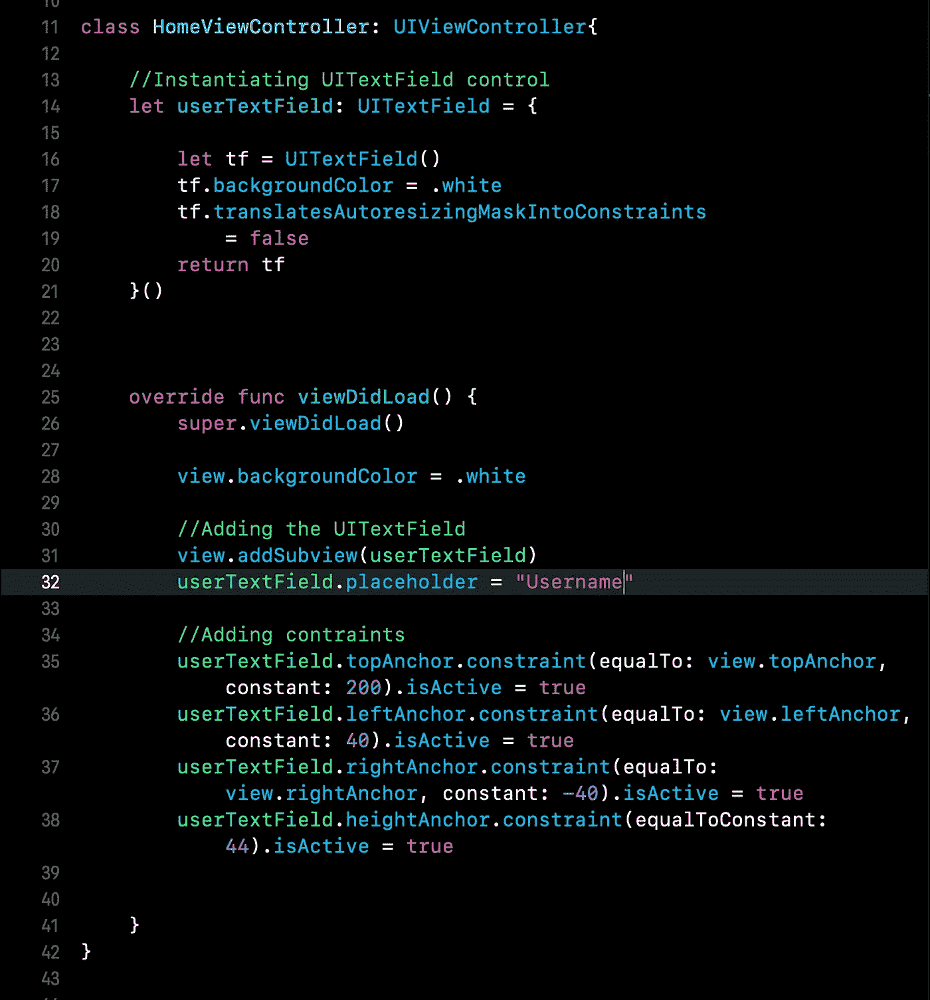

# 配合 Xcode 11 预览版使用 UIKit 的强大功能

> 原文：<https://betterprogramming.pub/the-beauty-of-using-uikit-with-xcode-11-preview-6f01b3ea9c06>

## 发展更多、更快

格伦·卡斯滕斯-彼得斯在 [Unsplash](https://unsplash.com/s/photos/preview?utm_source=unsplash&utm_medium=referral&utm_content=creditCopyText) 上的照片

在 WWDC 2019 大会期间宣布的 [SwiftUI](https://developer.apple.com/xcode/swiftui/) 和 Xcode 11 在 iOS 开发领域带来了一个巨大的里程碑。

这非常令人兴奋，当我写这篇文章时，我更加兴奋，因为这一发展使我的 iOS 开发变得非常容易和快速。我将向你展示如何在 Xcode 11 和 [UIkit](https://getuikit.com/) 中使用预览画布，让我们开始吧。

# 创建新的 Xcode 项目

创建新项目时，确保在用户界面部分选择 SwiftUI。创建新项目后，您的项目应该如下所示。

这是默认的 SwiftUI 项目预览。在您的右侧是默认的实时预览查看器，它会在您处理用户界面代码时更新 UI。

但是，我们希望在我们通用的遗留 UIkit 框架中使用这种美。首先，我们需要确保我们将要添加的`ViewControllers`将在预览画布中预览。

让我们添加我们将在 UIkit 框架项目中使用的视图控制器，添加一个新的 [Swift](https://developer.apple.com/swift/) 文件，并按照您想要的方式命名它。我的，我已经把它命名为`HomeViewController.swift`，你可以把你的命名为你想要的，编辑如下。

HomeController.swift

这是我们都熟悉的通用视图控制器文件结构，对吧！

因此，现在我们需要让我们刚刚创建的视图控制器在我们运行项目时作为主视图加载。目前，如果您将代码运行到模拟器或设备中，它将加载默认的 SwiftUI 代码。

我将简要解释当您运行 SwiftUI 代码时，它是如何运行其初始视图的。让我们看看`ContentView.swift`，这是显示当前预览的代码。

内容视图. swift

`ContentView_Previews`结构负责加载`ContentView`结构中的内容。然后，在运行应用程序时，`SceneDelegate.swift`文件开始发挥作用。让我们打开看看。

SceneDelegate.swift

场景函数提供了加载初始视图所需的所有魔法。

`ContentView`被初始化，然后添加到窗口的根视图中。所以，我们现在需要做的是预览我们的`HomeViewController`，并在`SceneDelegate.swift`文件中修改你的场景函数，如下所示。

所以，我们现在已经让我们的`HomeViewController.swift`成为主要玩家了。我们就快到了，去你的`HomeViewController`添加下面的代码。

HomeViewController.swift

添加以下代码后，您应该可以在预览中看到您的`HomeViewController`。刷新:CMD + option + P，你的 UI 应该如下图所示。

干得好，您已经成功地在实时预览画布中加载了视图控制器。现在，您可以在使用 UIkit 框架方法的同时进入 SwiftUI 快速用户界面开发世界。

为了测试它，让我们添加一个控件，看看效果如何。

HomeViewController.swift

添加上面的代码后，刷新预览画布。您应该会看到`UITextField`很好地显示了一个占位符。尝试编辑您的编辑文本占位符。你应该看到你的预览实时响应。

我认为，现在，您可以看到如何通过编程使用 UIKit 框架和用户界面开发来改进您的工作流。

非常感谢您花时间阅读并坚持到底。如果你发现自己迷路了，我已经在 Git 上添加了源代码，链接在下面。

 [## AfroCyberGuy/SwfitUIKitPreview

### 此时您不能执行该操作。您已使用另一个标签页或窗口登录。您已在另一个选项卡中注销，或者…

github.com](https://github.com/AfroCyberGuy/SwfitUIKitPreview)