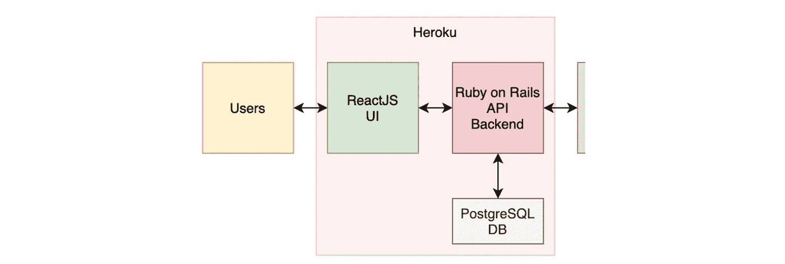
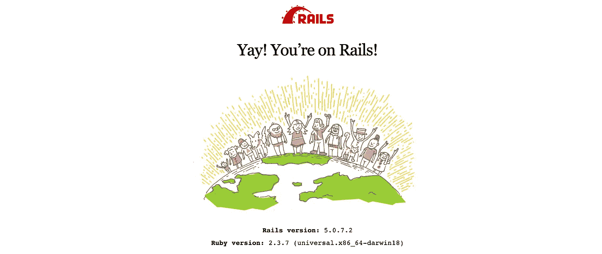
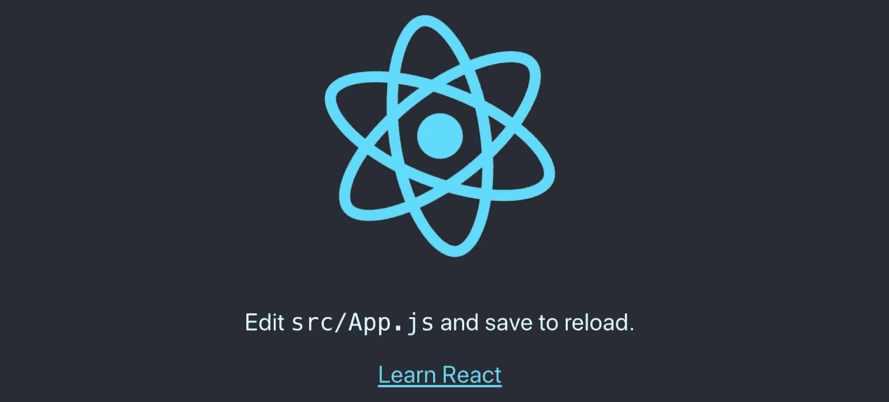
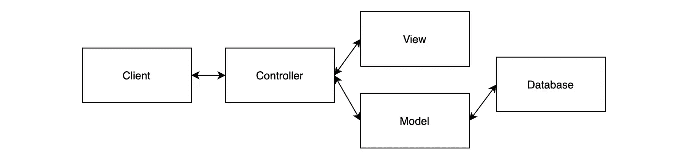
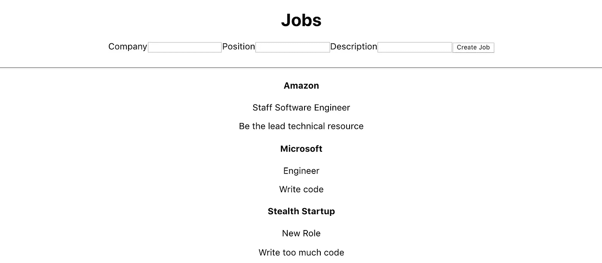
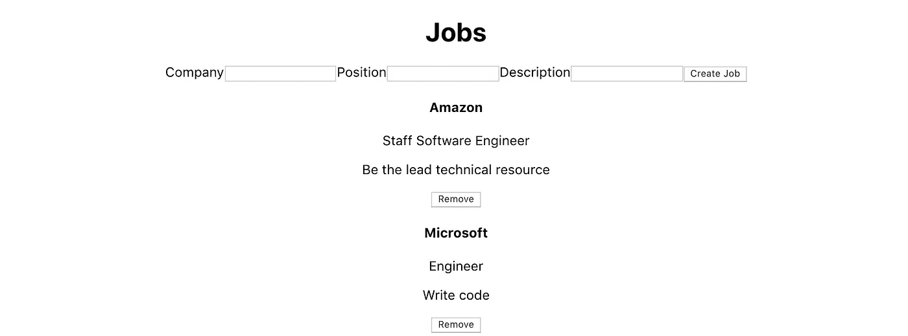
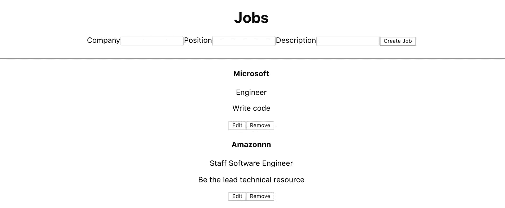

# 使用 React 挂钩和 Rails API 后端构建应用程序的初学者指南

> 原文：<https://betterprogramming.pub/the-beginners-guide-to-building-apps-with-react-hooks-and-a-rails-api-back-end-a414dade8e28>

## 用 React 挂钩和横杆搭建一个全堆叠工作板


康斯坦丁·普拉宁斯基在 Unsplash[拍摄的照片](https://unsplash.com/s/photos/rails?utm_source=unsplash&utm_medium=referral&utm_content=creditCopyText)

我的第一份软件工作是构建一个完整的 Ruby on Rails 应用程序。那时我讨厌前端开发，避免任何 JavaScript 特性。这是在 React 流行之前。从那时起，我意识到在堆栈上上下下编码的能力是无价的。

我在后 Hooks 时代开始有所反应，并且很难找到使用 Hooks、功能组件和数据库持久性的完整教程。我写这篇文章是为了给其他人弥合这些差距。希望对你有帮助。

我非常感谢下面的文章，它们对于弄清楚如何将这些碎片组合在一起非常有价值(尽管它们都没有做到)。

*   [创建 React App & Rails API 部署激增& Heroku](https://medium.com/@christine_tran/create-react-app-rails-api-deployment-to-surge-heroku-4f549f2812e6)
*   [用钩子在 React 中构建一个 CRUD 应用](https://www.taniarascia.com/crud-app-in-react-with-hooks/)
*   [坚如磐石的现代网络堆栈](https://blog.heroku.com/a-rock-solid-modern-web-stack)

我们正在构建一个带有 ReactJS 钩子前端和 Rails API 后端的作业板，后者将数据保存到`Postgres`。这个应用程序允许创建，查看，更新和删除工作。



这是我们正在建造的

## **目录**

*   [设置 App](#c6fd)
*   [工作模式](#347d)
*   [作业控制器](#b9e5)
*   [铁路路线](#681d)
*   [种子数据库](#4620)
*   [在前端显示作业](#f478)
*   [创建工作岗位](#44f9)
*   [删除作业](https://medium.com/p/a414dade8e28/edit#4200)
*   [编辑现有作业](#1ad9)
*   [结论](#ec1a)

# 设置应用程序

这种前端应用程序/后端 API 设计模式由同一个项目中的两个独立应用程序组成，尽管它们在部署时作为单个应用程序运行。

前端位于 Rails 应用程序根目录下的文件夹`/client`中。

初始化 Rails 应用程序并将`cd`放入其中。

```
$ rails new job-board --api --database=postgresql -T
$ cd job-board/
```

我们在这里用了一些旗子。`--database=postgresql`在`database.yml`中将`postgres`设置为默认数据库，`-T`跳过添加测试文件。

要基于`database.yml`生成数据库，运行:

```
$ rake db:create
```

在另一个终端中，创建一个 React 应用程序，我们将使用它作为前端，并将`cd`放入其中。

```
$ npx create-react-app client
$ cd client
```

添加代理中间件来连接我们的前端和后端:

```
$ yarn add http-proxy-middleware
```

在`/src`中，创建一个名为`setupProxy.js`的文件。如果你感兴趣，文档在这里。这避免了 CORS 问题，并允许命中像`/api/posts`而不是`[http://localhost:3001/api/posts](http://localhost:3001/api/posts.)`这样的端点。它应该是这样的:

```
const { createProxyMiddleware } = require('http-proxy-middleware');
module.exports = function(app) {
    app.use(
        '/api',
        createProxyMiddleware({
            target: 'http://localhost:3001',
            changeOrigin: true,
        })
    );
};
```

让我们检查一下到目前为止我们所做的一切是否有效。从根目录启动 rails 服务器:

```
$ rails s -p 3001
```

导航到 [http://localhost:3001/](http://localhost:3002/) :



从`/client`启动客户端应用程序:

```
$ npm run start
```

导航到 [http://localhost:3000/](http://localhost:3003/) :



如果这两种观点你都没有看到，那么回头看看哪里出了问题。

# 工作模型

在命令行上从根目录生成迁移文件。

迁移文件是 Rails 告诉数据库要做什么更改而不需要编写 SQL 的方式。

```
$ rails g migration CreateJobs
```

该文件将在`/db/migrate`中创建。编辑文件，如下所示:

```
class *CreateJobs* < ActiveRecord::Migration[5.0]
  def change
    create_table :jobs do |*t*|
      *t*.string :company
      *t*.string :position
      *t*.string :description
    end
  end
end
```

按照此次迁移迁移数据库:

```
$ rake db:migrate
```

现在我们将创建模型本身。创建`/app/models/job.rb`并编辑如下:

```
class *Job* < ApplicationRecord
end
```

# 作业控制器

在 Rails 所基于的 MVC(模型-视图-控制器)设计模式中，控制器是在模型和视图之间传递信息的看不见的手。



创建`/app/controllers/api/v1/jobs_controller.rb`并更新如下。

在 Rails 101 应用程序中，您不会在`/api/v1/`中命名控制器，但是在构建 API 时这样做是最佳实践。`/v1/`模式允许为现有用户创建 API 的新版本，而不破坏旧版本(尽管在这种情况下，React 是用户)。

# 铁路路线

路由将 URL 映射到控制器动作，因此请求由其目标逻辑处理。

编辑`/config/routes.rb`:

```
Rails.application.routes.draw do
  namespace :api do
    namespace :v1 do
      get '/jobs', to: 'jobs#index'
      post '/jobs', to: 'jobs#create'
      get '/jobs/:id', to: 'jobs#show'
      patch '/jobs/:id', to: 'jobs#update'
      delete '/jobs/:id', to: 'jobs#destroy'
    end
  end
end
```

要查看 Rails 应用程序中当前设置的所有路线，请在命令行上运行`rake routes`。

我们的基本 rails 应用程序现在已经设置好了。

# 为数据库设定种子

Rails 附带了一个叫做 Rake 的自动化工具。

通过在带有`.rake`扩展名的`/lib/tasks/`中定义任务，我们可以通过命令行运行应用程序中定义的脚本。如果我们想安排代码在特定时间运行，或者手动改变数据库的状态，这是非常有用的。

让我们定义一个 rake 任务，用一些我们可以在前端查看的作业来播种我们的数据库。

创建一个名为`/lib/tasks/seed_jobs.rake`的文件，并复制以下代码。运行时，这将在数据库中创建两个作业:

我们将开始在前端 UI 上工作，它将显示后端中存在的作业。

更新`/client/src/App.js`使其看起来如下。别担心，我们将更改“Hello World ”,并很快开始显示 jobs:

现在我们的前端是一个空白页，上面写着“Hello World”:


现在让我们创建显示作业的组件。

首先，安装我们将用来发出 API 请求的库。在`/client`中，安装 axios:

```
$ yarn add axios
```

创建`/client/src/components/JobsList.js`:

在这一点上，这是非常基本的，但这里已经有一些事情在进行了:

*   `const JobsList`定义一个功能组件
*   `const [jobs, setJobs] = useState([])`为`jobs`变量创建一个 getter 和 setter。
*   `useEffect()`该组件初始化后，通过 axios 向 Rails 后端发送请求，并将返回的作业添加到`jobs`。
*   `return()`迭代现有作业并显示它们。

现在更新`App.js`,让它呈现这个组件。添加导入并编辑返回块。

我们的应用程序当然还没有一个伟大的用户界面/UX！但是只要确保前端和后端在通信就可以了。如果您在 UI 中看不到作业，请停下来，修复您到目前为止已经构建的内容。


# 创造就业机会

现在开始变得有趣了。我们将允许创建作业并将作业保存到数据库中。

创建一个名为`/client/src/components/NewJobForm.js`的新文件:

这里发生了很多事情。

*   `const NewJobForm`是我们的功能组件。
*   `const handleInputChange()`在我们键入时更新当前作业:

```
const handleInputChange = event => {
  const { name, value } = event.target
  setJob({ ...job, [name]: value })
};
```

*   `const [job, setJob] = useState(props.initialFormState)`用空字符串初始化表单字段。

在`<form>`标签中，我们有这样的逻辑:

*   防止提交时重新呈现默认页面`。
*   如果任何表单域为空，则提前返回。
*   将表格中输入的文本传递给`addJob()`。
*   将表单域重置为空。

`<input>`字段接受值并将它们传递给`handleInputChange()`。

在`JobsList.js`中，我们也需要更新一些东西。增加`initialFormState`、`addJob()`，更新`return`块:

*   `initialFormState`:作为道具传递给`NewJobForm`。
*   `addJob()`:向 Rails 后端发出 post 请求，然后更新视图中显示的作业。这将作为道具传递给`NewJobForm`。

检查用户界面，确保它看起来像这样:


我们现在可以创造就业机会了！如果我们刷新页面，它们也不会丢失，因为它们也是在数据库中创建的。

# 作业组件

开始变得有点乱了。让我们将呈现每个作业的逻辑放入它自己的组件`Job`。

创建`/client/src/components/Job.js`:

ttps://gist . github . com/better programming/3b 34d 4242511 a0d 7c 5425737024334 ca . js

更新`JobsList.js`中的返回块，为每个作业呈现我们的新组件:

视图现在应该是这样的:



# 删除作业

现在我们可以创建作业了，让我们添加从数据库中删除它们的功能，并从前端删除它们。

在`JobsList`中定义一个函数，并将其传递给我们刚刚创建的`Jobs`:

```
const removeJob = id => {
  axios.delete( '/api/v1/jobs/' + id )
      .then(response => {
        setJobs(jobs.filter(job => job.id !== id))
      })
      .catch(error => console.log(error))
};
```

上面使用应该销毁的作业的 id 向后端发出删除请求。在下面，我将它作为道具传递给了`Job`组件:

```
return (
    <div>
      <div className="jobs-list">
        <div>
          <NewJobForm addJob={addJob} />
        </div>
        <br/>
        <hr/>
        {jobs.map((job, _) => (
            <Job job={job} **removeJob={removeJob}** />
          ))}
      </div>
    </div>
)
```

现在编辑作业组件。我们将添加一个按钮来触发这个删除逻辑。

```
import React from 'react';

const Job = ({ job, removeJob }) => (
    <div className="job" key={job.id}>
      <h4>{job.company}</h4>
      <p>{job.position}</p>
      <p>{job.description}</p>

      <button onClick={() => removeJob(job.id)}>Remove</button>
    </div>
);

export default Job;
```

如果刷新视图，您现在应该能够单击“Remove”并删除作业记录。好吧！



# 编辑现有作业

但是如果我们不想删除一个作业，只是想改变它呢？让我们为此添加编辑/更新功能。

创建一个名为`EditJobForm.js`的新文件。

这里我们根据从`JobList`传来的道具，将`job`的初始状态设置为空字符串。

我们定义了一个与之前相同的`handleInputChange()`函数。

然后我们有了使用`updateJob()`的表单，我们将在`JobList`中定义它。

在`JobsList.js`中，我们将添加一些函数和变量:

`editJob()`设置编辑作业字段的初始状态。`updateJob()`将数据发送给 Rails API 并更新视图。

另外，请注意，我们已经向`Job`组件传递了更多的道具。

现在修改`Job.js`:

我们在这里所做的是，如果当前没有编辑另一个作业，则有条件地显示编辑按钮。

现在看一下用户界面:



漂亮！(在功能上，而不是外观上)。

尝试创建、删除、更新作业。一切都应该正常。

# 结论

我们已经构建了一个完整的 stack React on Rails 应用程序，允许查看、创建、删除和更新作业。它还保存对数据库的更改。

很明显，在这款应用成为产品之前，我们还缺少很多东西。我们当然需要身份验证，以及部署身份验证的 devops。

但我希望这能让你理解在一个应用中同时运行 React 和 Rails 所需的架构。