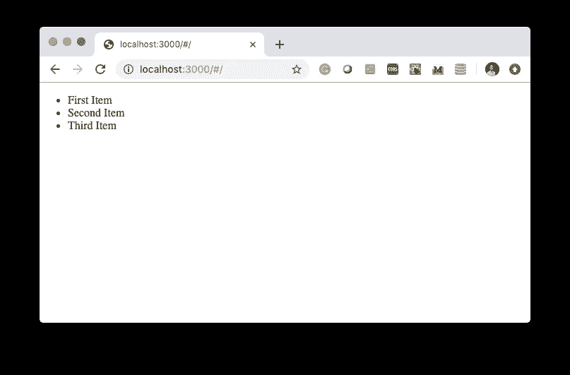
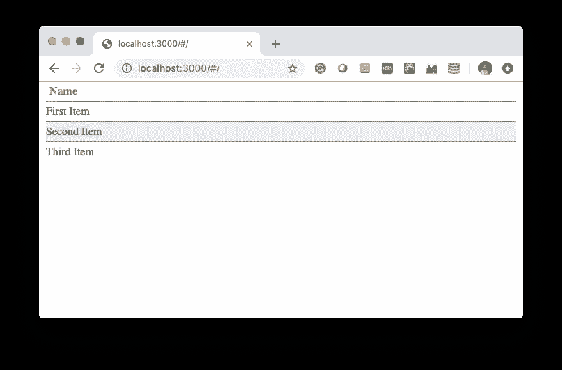
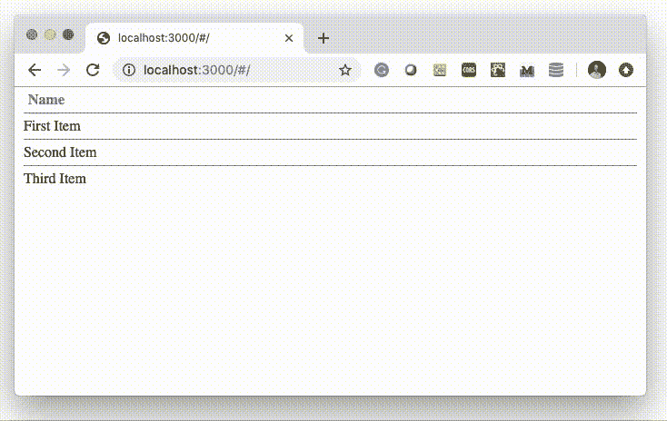

# 使用 React 创建交互式列表的初学者指南

> 原文：<https://betterprogramming.pub/the-beginners-guide-to-creating-an-interactive-list-with-react-28c8af880f35>

## 学习创建一个支持拖放的样式列表


格伦·卡斯滕斯-彼得斯在 [Unsplash](https://unsplash.com/s/photos/list?utm_source=unsplash&utm_medium=referral&utm_content=creditCopyText) 拍摄的照片

TL；DR: 这是一个关于如何用 [React](https://reactjs.org/) 创建交互式列表的初级循序渐进教程。我们将:

*   使用[基础设施-组件](https://www.infrastructure-components.com/page?ref=medium_dnd&dest=/)设置项目；
*   用[样式化组件](https://www.styled-components.com/)样式化组件；
*   使用 [react-sortable-hoc](https://www.infrastructure-components.com/page?ref=medium_dnd&dest=https://github.com/clauderic/react-sortable-hoc) 添加拖放功能。

# 创建 React 应用程序

脸书的脚本`[create-react-app](https://github.com/facebook/create-react-app)`是启动 React 项目的默认方式。但是[它让你在部署它的时候得不到支持](https://www.infrastructure-components.com/page?ref=medium_dnd&dest=https://codeburst.io/is-create-react-app-a-dead-end-5baae1568f89)。为此，我们可以使用[基础设施-组件](https://www.infrastructure-components.com/page?ref=medium_dnd&dest=/)。这些 React 组件让我们将基础设施架构定义为 React 应用的一部分，这意味着其他配置如 [Webpack](https://webpack.js.org/) 、 [Babel](https://babeljs.io/) 或[无服务器](https://serverless.com/)不再是必要的。

有三种方法可以设置项目:

1.  从[www.infrastructure-components.com](https://www.infrastructure-components.com/page?ref=medium_dnd&dest=/)下载定制的样板代码；
2.  克隆这个 [GitHub-repository](https://www.infrastructure-components.com/page?ref=medium_dnd&dest=https://github.com/infrastructure-components/singlepage_example) (模板)或者[这个 repository](https://www.infrastructure-components.com/page?ref=medium_dnd&dest=https://github.com/infrastructure-components/interactive-list) (本帖完整源代码)；
3.  手动安装库。

您将获得以下文件结构:

```
menu/
├── src/
│   └── index.tsx
├── .env
├── .gitignore
├── LICENSE
├── package.json
└── README
```

`package.json`指定了项目的所有依赖项。在本教程中，我们使用通过`npm install`安装的以下库:

```
**"dependencies"**: {
  **"infrastructure-components"**: **"^0.3.1"**,
  **"react"**: **"^16.10.2"**,
  **"react-dom"**: **"^16.10.2"**,
  **"react-sortable-hoc"**: **"^1.10.1"**,
  **"styled-components"**: **"^4.1.3"** },
**"devDependencies"**: {
  **"infrastructure-scripts"**: **"^0.3.1"**,
  **"serverless-single-page-app-plugin"**: **"^1.0.2"** }
```

最重要的文件是你的`src/index.tsx`文件。这是你的 React 应用的入口。在这个文件中，您导出了一个`<SinglePageApp/>`组件。一旦`src/index.tsx`文件准备好了，您就可以开始构建您的项目了(`npm run build`)。

一个基本的无服务器单页 React 应用程序的源代码

构建步骤向您的`package.json`添加一个命令。这个命令以热开发模式启动您的单页面应用程序:`npm run interactive-list`(用您的单页面应用程序的名称替换`interactive-list`)。当您在浏览器中打开`localhost:3000`时，您应该会看到文本“Hello Infrastructure-Components！”到目前为止，一切顺利。

让我们创建一个简单的无序列表，在一个新文件中包含三个条目:`src/list.tsx`。每个项目都有一个复选框:

列表组件(`src/list.tsx`)

由于我们在`list.tsx`中`export default`了我们的函数，我们需要从`index.tsx`中的模块导入默认值。我们在第 9 行这样做。在第 22 行，我们呈现了导入的组件:

将清单纳入 index.tsx

下图显示了我们的列表。目前为止没什么特别的:



# 互动风格

在 React 中管理样式最方便的方法是借助于[样式组件](https://www.infrastructure-components.com/page?ref=medium_dnd&dest=styled-components.com)库。样式化组件允许您通过本地 CSS 文本来样式化 React 组件。

让我们看看我们的第一个样式组件。我们将跳过代码中没有变化的部分:

项目的样式

首先，我们从库中导入默认模块(`styled`)。`styled`模块是`styled-components`库的默认导出。这是一个低级工厂，以`styled.tagname`的形式提供 helper 方法。

`tagname`是任何有效的 HTML 标签。例如，`styled.li`创建一个列表项组件(`<li/>`)。`styled.li`函数接受模板字符串中的 CSS 定义(用反斜杠``...``括起来)。

然后，我们创建一个`Item`组件(`<li/>`)并对其应用一个简单的样式。将格式化上下文设置为`display: block;`。在块格式上下文中，组件一个接一个地垂直布局。每个组件的外边缘接触包含块的边缘。简单来说:我们让组件取整行。

每个项目的顶部都有一个细(`1px`)、灰色(彩色`#888`)的边框。并且我们去掉了未编号列表元素通常会有的点(`list-style-type: none;`)。

`padding: 5px 0;`将顶部和底部的(内部)空间区域设置为`5px`，并将组件的左侧和右侧设置为`0`。

我们来添加一些交互风格。`&:hover { background: #EEE }`当用户将鼠标指针悬停在该项上时，将该项的背景设置为浅灰色。

在我们导出的组件中，我们用样式化的`<Item/>`组件替换未样式化的`<li/>`元素。

在这一步中，我们将样式应用于列表，并向其添加标题，再次跳过未更改的部分:

设置列表样式

我们希望我们的`<List/>`组件(`<ul/>`)填充浏览器的整个宽度，除了一点点空间。我们通过将`width`设置为`100%`减去我们想要留出的空间:`20px`来实现这一点。(注意:`calc`功能中的“`-`”-符号前后必须有空格)。平均分配剩余的(外部)空间，因此使我们的列表居中。还有其他方法可以达到同样的效果。

其他风格现在应该不言自明了。

让我们看看我们的应用程序:



截图里鼠标不见了…但是我可以确认是在第二个项目上面

# 高级用户交互

任何 React 应用程序的视觉和交互功能都不仅仅是将 CSS 样式应用于组件。拖放手势就是一个例子。拖放是一种在 web 和移动应用程序中移动和重新排列元素的直观方式。它监听指针(鼠标或触摸)事件，处理数据，并更改 DOM。

拖放是 HTML5 的一部分(如这里描述的)。因此，我们可以将这个手势添加到基于低级 HTML5 API 的应用程序中。然而，有相当多的库将这种手势包装成程序员友好的高级 API。`[react-sortable-hoc](https://www.infrastructure-components.com/page?ref=medium_dnd&dest=https://github.com/clauderic/react-sortable-hoc)`就是一个很好的例子。它提供了一组高阶的 React 组件，将任何列表转换成一个动画的、触摸友好的、可排序的列表。

一个*高阶 React 组件* (HOC)是 React 中重用组件逻辑的高级技术。通常，React 组件将属性转换成可见的东西，比如链接、列表或任何其他 HTML 元素。高阶组件增加了将一个组件改变为另一个组件的功能。

我们可以使用高阶组件`react-sortable-hoc`向我们的组件添加拖放功能。

但是在我们将拖放功能添加到列表之前，我们需要将布局和数据分开。现在，我们的数据(项目的名称)被混合到可视化的 React 组件中。每一项都是硬编码的:`<Item>Hard-coded Item Name</Item>`。这既不灵活也不可扩展。

下面描述了我们如何分离布局和数据:

在 list.tsx 中分离布局和数据

在我们导出的函数中，我们定义了一个常量`items`。这是一个字符串数组:我们之前在`<Item/>`组件中硬编码的数据。

在第 7 行和第 11 行之间的代码块中，我们将分离的数据(`items`数组)重新整合到`<Item/>`组件中。一个数组提供了`[map](https://www.infrastructure-components.com/page?ref=medium_dnd&dest=https://developer.mozilla.org/en-US/docs/Web/JavaScript/Reference/Global_Objects/Array/map)`的[函数](https://www.infrastructure-components.com/page?ref=medium_dnd&dest=https://developer.mozilla.org/en-US/docs/Web/JavaScript/Reference/Global_Objects/Array/map)。这个函数获取数组中的每一项，根据我们作为参数提供的函数对其进行转换，然后在一个新的数组中返回结果。它不会改变原始数组。

我们作为参数提供的函数从第 8 行开始。它是一个匿名函数(没有名字)，遵循箭头符号:
`(arguments) => ("returned result")`。

我们使用两个参数`item`和`index`。虽然这两种观点的名称由我们决定，但它们的立场很重要。第一个参数是当前项。这是字符串。第二个参数是数组中当前项的索引。

因为在我们的`items`数组中有三个条目，所以`map`函数调用了提供的函数三次。首先，用参数`item="First Item"`和`index=0`。然后，用参数`item="Second Item"`和`index=1`。最后…我想你可以算一下。

该函数转换这两个参数并返回一个`<Item/>`组件。它将`{item}`指定为可见内容，并将一个字符串(`"item-0"`和`item-1`)指定为`key`属性的值。这是有技术原因的。当我们在 JSX 中提供一个返回数组的代码块时(就像`map`函数所做的那样)，React 要求我们为数组的每个项提供一个唯一的`key`属性。

如果你运行应用程序，你应该看不到任何区别。但是现在我们的所有数据都在一个没有任何布局的数组中。我们准备通过`react-sortable-hoc`库添加拖放功能。让我们先看看代码:

添加拖放功能

在第 2 行，我们导入两个高阶组件:`SortableContainer`和`SortableElement`。

`SortableElement`函数使一个组件可拖动。在第 3 行，`SortableElement`将`Item`函数作为参数，并返回一个类似的可拖动函数(注意:这里不要用`<Item/>`将其作为渲染组件提供)。

函数准备一个父组件来包含可拖动的子组件。我们可以像以前一样将`List`函数传递给它。但是还有另一种方法。让我们看一看。

React 函数将属性转换成可见的东西，就像这个
`const Component = (props) => <div/>`。

高阶组件接受组件(`Component`)或其主体(`(props) => <div/>`)的函数声明(名称)。在第 5 行，我们使用后一种形式。我们用一个`<Header/>`和映射的`items`数组将`props`转换成`<List/>`。

我们只期望`props`包含`items`。当我们在导出的函数中返回呈现的`<SortableList/>`时，我们提供了`items`数组。结果是一个简洁的导出函数。所有与 frag 相关的逻辑都保存在`<SortableList/>`组件中。

在第 11 行，我们将`index`属性添加到了`<SortableFile/>`中。这是`react-sortable-hoc`库所需数组中的`sortableIndex`元素。

如果你看应用程序，你现在可以拖动这两个文件。但是一旦你放下它们，它们就会回到原来的位置。他们当然会，因为我们的`items`阵列不会改变。



## 本地组件状态

当您查看`react-sortable-hoc`的[引用](https://www.infrastructure-components.com/page?ref=medium_dnd&dest=https://github.com/clauderic/react-sortable-hoc)时，您会看到`SortableContainer` HOC 将`onSortEnd`属性添加到我们的`<List/>`中。该属性将一个函数作为排序结束时调用的参数。它接收被拖动项目的`oldIndex`和`newIndex`。

但是我们如何改变我们的`items`数组呢？是不可改变的`const`。将其更改为可变的`var`对我们没有帮助，因为无论 React 何时渲染组件，它都会重新开始。它不会“记住”变量的值。除非 React 重新渲染组件，否则我们看不到任何变化。

解决方案是`useState` React 钩子(React 16.8.0 起支持)。钩子提供了一种将可重用行为“附加”到组件上的方法。因此，钩子类似于高阶组件。但是，虽然高阶组件需要外部包装器，从而改变了组件层次结构，但是钩子允许您在不改变逻辑的情况下重用逻辑。

以下代码向我们的列表添加了一个状态:

添加 useState 挂钩

`useState`是函数。我们从`react`导入它，并在第 4 行使用它。它只需要一个参数。这是初始状态。因此，我们提供先前放入`items`数组的相同数据。

`useState`返回包含两个元素的数组。第一个元素是当前状态。因为我们没有改变它，所以它是我们的初始状态:我们的`items` 数组。我们像以前一样使用它。在第 6 行，我们将其作为属性提供给`<SortableList/>`组件。

新的是二次元。这是一个设置状态的函数。我们可以使用任意的名称；姑且称之为`setItems`。我们在第 11 行的`onSortEnd`函数中使用这个函数；我们提供了一个新的`items`数组，其中包含更新后的项目顺序。

在第 8 行，我们创建了一个新的临时数组，没有被拖动的文件。数组的`slice`函数返回数组的一部分。`slice`的两个参数指定了`begin`和`end`(不包括`end`)的指标。数组的`concat`函数连接两个数组。因此，我们从开始到被拖动的项(排除)取子数组，并将其连接到从被拖动的项之后到结尾的子数组(当用单个参数调用`slice`时，如第 9 行)。

我们将这个临时数组从开始分割到新的位置，将它与被拖动的项(取自原始的`items`数组)连接起来，并将它与临时数组的其余部分连接起来。这是我们提供给`setItems`函数的重新排序的`items`数组。

第四行有错误吗？我们将`items`数组声明为`const`。但是你不能换一个`const`！

`setItems`功能不会改变这些值。它使 React 使用新值重新呈现用户界面。React 用新的替换旧的`<SortableList/>`。新的`<SortableList/>`有自己的不可变的`items`数组。它只知道当前状态；过去的状态并不重要，国家是如何建立的也不重要。

现在让我们来看看我们的互动列表:


运行中的交互式列表。

以下是完整的`list.tsx`:

你可以在 GitHub-repository 中找到完整的源代码。

[](https://medium.com/dailyjs/how-to-build-and-deploy-a-full-stack-react-app-4adc46607604) [## 如何构建和部署全栈 React-App

### 用 Express.js 和 DynamoDB 补充你的 React-app。

medium.com](https://medium.com/dailyjs/how-to-build-and-deploy-a-full-stack-react-app-4adc46607604) [](https://codeburst.io/do-you-want-to-become-a-full-stack-developer-e532dd2b7714) [## 你想成为一名全栈开发者吗？

### 然后你需要学习如何防止时间悖论！

codeburst.io](https://codeburst.io/do-you-want-to-become-a-full-stack-developer-e532dd2b7714) [](https://codeburst.io/why-should-i-even-bother-with-full-stack-development-142b9c4c7c3f) [## 我为什么要为全栈开发费心呢？

### 全栈开发不再需要多种编程语言。它需要你像一个…

codeburst.io](https://codeburst.io/why-should-i-even-bother-with-full-stack-development-142b9c4c7c3f)