# Apache JMeter 性能测试初学者指南

> 原文：<https://betterprogramming.pub/the-beginners-guide-to-performance-testing-with-apache-jmeter-5cc52c327ff6>

## 在需要之前对应用程序进行负载测试


杰森·库德里特在 [Unsplash](https://unsplash.com/s/photos/test?utm_source=unsplash&utm_medium=referral&utm_content=creditCopyText) 上拍摄的照片

开发人员的工作不仅仅是开发。有时，他们会被要求对二进制文件进行性能测试，以了解它在特定负载下的表现。

为性能测试编写代码可能会变得非常耗时。开发人员可以使用他们已经掌握的工具，比如 [JMeter](https://jmeter.apache.org/) 、 [k6](https://k6.io/) 等。

# 什么是性能测试？

> 性能测试是软件测试的一种形式，主要关注运行系统的系统在特定负载下的表现。性能测试应该为组织提供消除瓶颈所需的诊断信息。— [Stackify](https://stackify.com/performance-testing-business-explanation/)

有两种类型的性能测试:

1.  负载测试
2.  压力测试

负载测试是在软件上施加预期的负载，并观察其行为和性能。

压力测试施加的负载远远超过了软件想要处理的负载。当软件开始出错或变慢时，可以通过这个测试来确定软件的断点。

# 为什么需要它？

需要了解二进制文件或软件在不中断的情况下可以处理的负载。这种测试的唯一责任是找到断点。有时，在高负载的情况下，可能会出现由这种高负载引起的问题或错误。

# JMeter 是如何工作的？

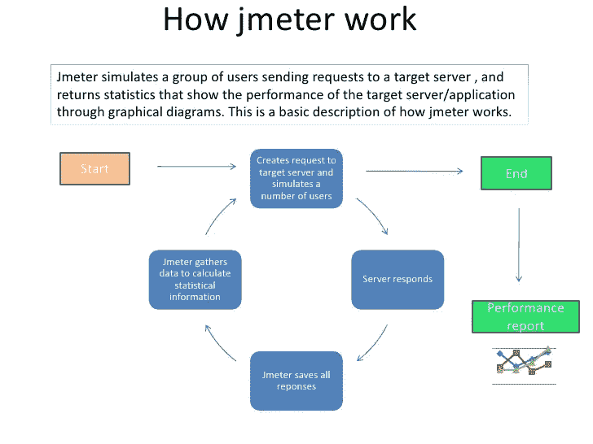

图片鸣谢:[https://octo perf . com/img/blog/jmeter-tutorial/how-jmeter-works . jpg](https://octoperf.com/img/blog/jmeter-tutorial/how-jmeter-works.jpg)

JMeter 是一个 HTTP 客户端，可以并行运行多个会话。它可以根据您的需要进行配置。这难道不是最棒的部分吗？但是，JMeter 不仅仅局限于 HTTP，尽管它用于 HTTP 测试。还有 FTP、SMTP 和更多的采样器。

# 我们开始吧！

在本文中，我们将集中讨论 JMeter 如何安装它，以及如何根据特定的需求配置负载测试。

## 装置

1.  安装最新的 64 位 JRE 或 JDK。

**窗户**

[](https://www.guru99.com/install-java.html) [## 如何在 Windows 中下载和安装 Java JDK 8

### 在本教程中，学习如何在 Windows 中下载和安装 Java JDK 8 并设置环境变量。

www.guru99.com](https://www.guru99.com/install-java.html) 

**Linux**

[](https://www.guru99.com/how-to-install-java-on-ubuntu.html) [## 如何在 Linux(Ubuntu)中下载和安装 Java

### 步骤 1)在开始设置 Java 之前，您需要从系统中删除 OpenJDK/JRE。要做到这一点…

www.guru99.com](https://www.guru99.com/how-to-install-java-on-ubuntu.html) 

**macOS**

 [## 在 macOS 上安装 JDK 和 JRE

### 转到主要内容本主题包括以下几节:以下是安装的系统要求…

docs.oracle.com](https://docs.oracle.com/javase/10/install/installation-jdk-and-jre-macos.htm#JSJIG-GUID-F9183C70-2E96-40F4-9104-F3814A5A331F) 

请按照文章中提到的步骤为您的相关操作系统安装 Java。

2.为您的电脑安装最新版本的 JMeter。

为您的电脑找到并下载最新版本的 JMeter。

[](http://jmeter.apache.org/download_jmeter.cgi#binaries) [## 下载 Apache JMeter

### 我们建议您使用镜像来下载我们的发布版本，但是您必须验证下载文件的完整性…

jmeter.apache.org](http://jmeter.apache.org/download_jmeter.cgi#binaries) 

将下载的文件移动到所需的位置并解压缩。

如果您进入该文件夹，然后进入`bin`文件夹，您可以看到有各种脚本以不同的模式运行 JMeter。

## 如何运行 JMeter GUI？

**窗户**

运行`jmeter.bat`来启动 GUI，它位于`bin`目录中。

**Linux/Unix/macOS**

从终端移动到`bin`目录，使用`./jmeter.sh`运行 JMeter。

## 还看不到 GUI 吗？

如果您还看不到 GUI，您应该检查以下内容:

*   `JAVA_HOME`环境指向 JRE 或 JDK 安装文件夹。
*   `JAVA_HOME/bin`文件夹已经被添加到`PATH`环境变量中。

如果您看到 GUI，JMeter 应该已经启动并运行了。

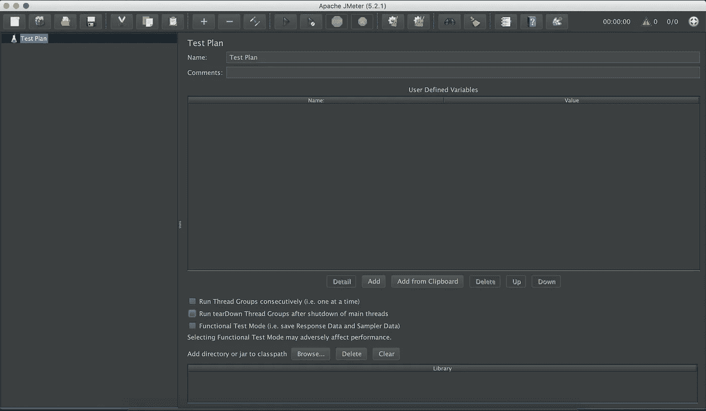

# 什么是测试计划？

在您的测试计划中，您应该指定总体设置，并概述您希望 JMeter 在运行时执行的步骤。供自己参考，也可以起个名字，加上评论。

# 让我们学习如何创建一个测试计划

让我们创建一个简单的测试计划。

## **1。添加一个线程组**

右键点击测试计划。点击*添加*->-*线程(用户)*->-*线程组*。

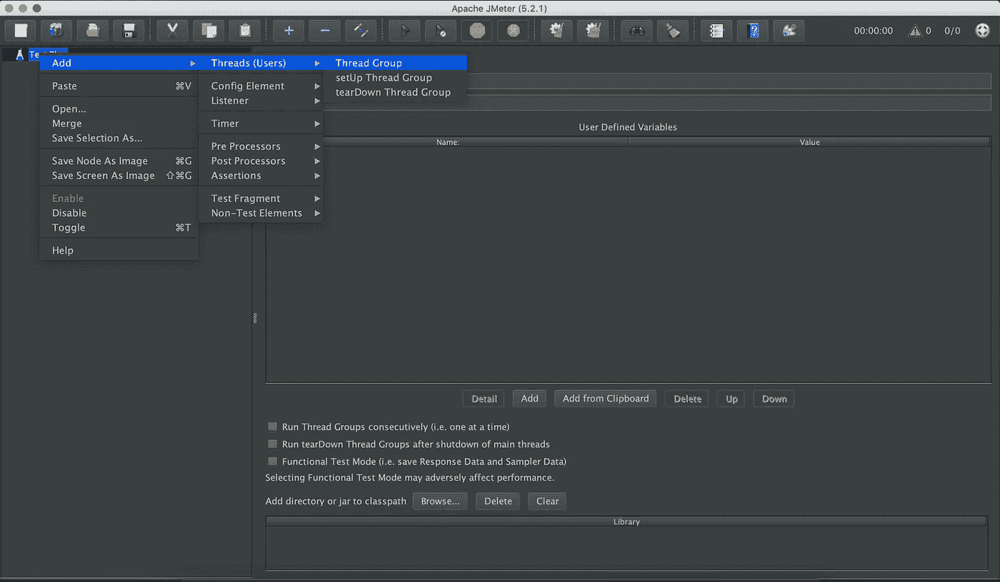

线程组是保存应该如何模拟用户或线程的逻辑的容器。

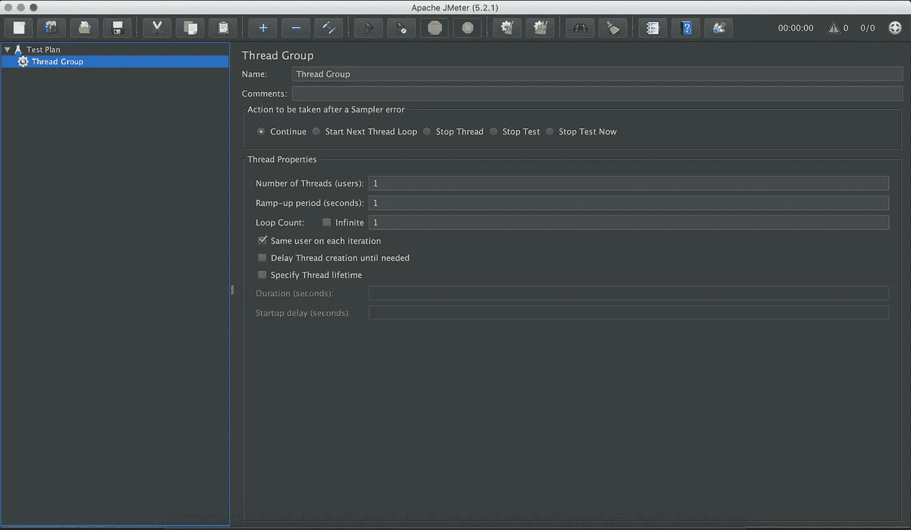

下面说说线程组面板中的设置。

**样本错误后采取的措施**

如果在测试执行过程中出现错误，您可以让测试执行以下操作之一:

*   继续:跑步
*   停止线程:停止当前线程
*   停止测试:完全停止测试

**线程数量(用户)**

测试期间模拟的线程数。

**上升周期(秒)**

要执行的线程数的持续时间。

**循环计数**

每个用户或线程的迭代次数。

**调度程序配置**

*   持续时间(秒):应该执行的测试的持续时间。
*   启动延迟(秒):每个上升周期之前的秒数。

## **2。创建一个 HTTP 请求**

右击线程组然后选择*添加*->-*采样器*->-*HTTP 请求。*

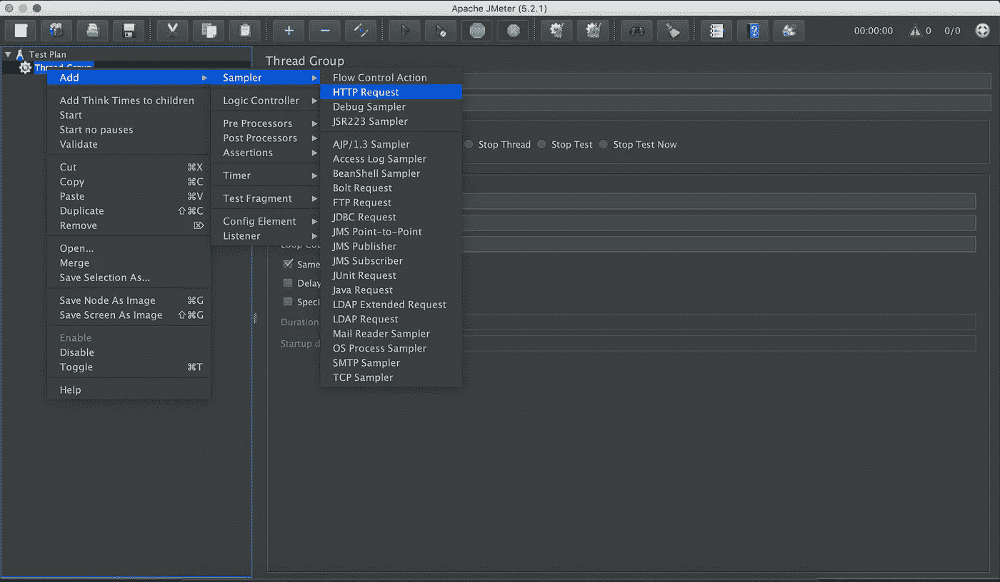

我将向[https://httpbin.org](https://httpbin.org/)展示一个简单的 GET 请求示例。

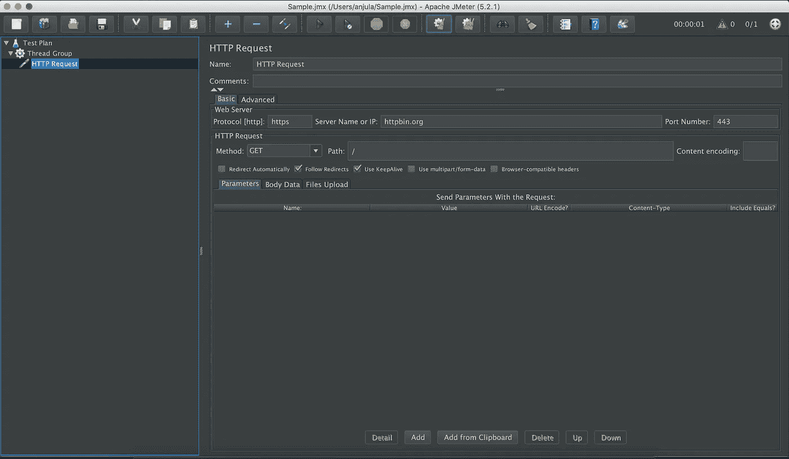

因此，当我执行对[https://httpbin.org](https://httpbin.org/)的 GET 请求时:

*   议定书:HTTPS
*   服务器名称或 IP:[httpbin.org](https://httpbin.org/)
*   端口号:443(默认 HTTPS 端口，可以省略)
*   方法:获取
*   路径:/

## 3.添加视图结果树

在使用查看结果树执行我们的请求后，我们可以看到结果。

右键点击线程组，然后选择*添加*->-*监听器*->-*查看结果树*。

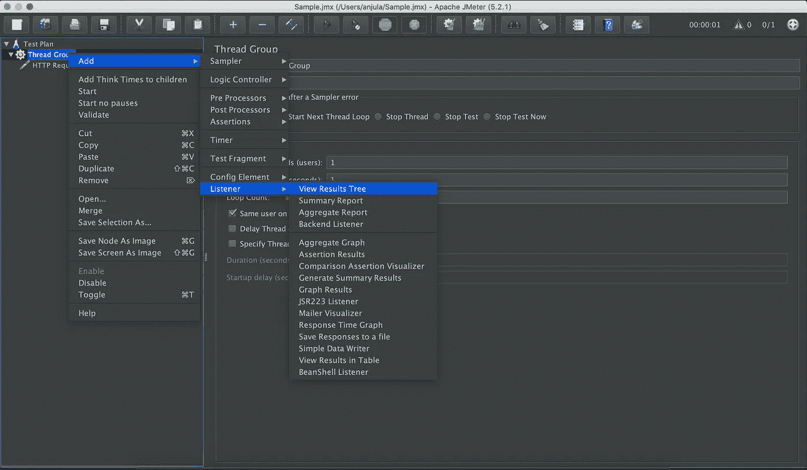

点击*运行*按钮运行测试。

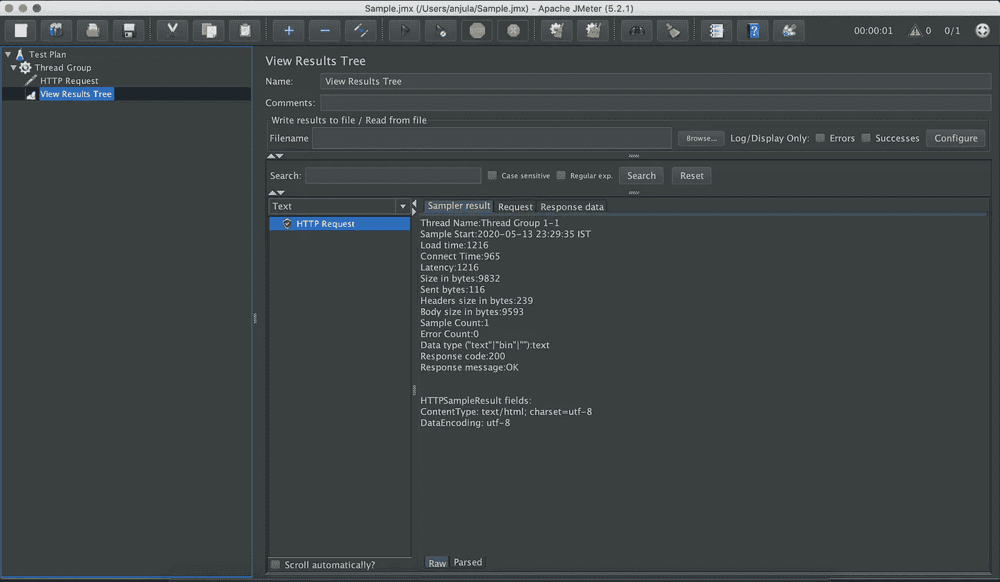

UI 侦听器让您看到执行的结果和请求。

*   绿色:表示成功。
*   抽样结果:给出请求和响应时间的度量。
*   请求:显示已经运行的请求。
*   响应:显示请求的响应。

JMeter 存储所有收到的请求和响应。该侦听器不是为运行多个当前用户而设计的。

文章写完了吗？一点也不！

# 高级场景

让我们深入一个高级场景，比如电子商务网站测试计划。

您可以[下载示例 JMX](https://octoperf.com/img/blog/jmeter-tutorial/jpetstore.zip) 并在 JMeter 中打开它。

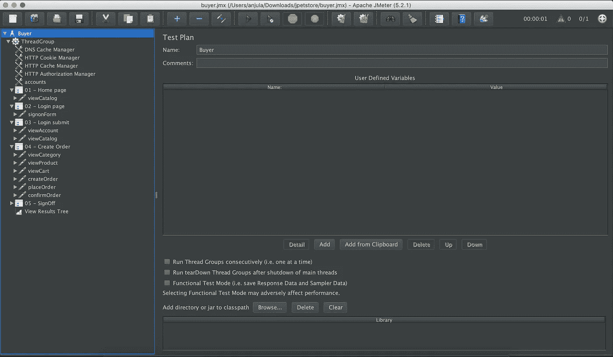

那么，JPetStore 的买家是怎么做的呢？

*   登录他们的帐户。
*   查看目录。
*   选择一个随机类别。
*   从先前选择的类别中随机选择一个产品。
*   将产品添加到购物车。
*   订购购物车中的产品。
*   签出。

这是一个非常常见的电子商务网站的模拟。让我们来谈谈使用的重要功能。

## 1.CSV 数据集配置

如果以电子商务网站为例，每个客户都有自己的账户。我们需要模拟它。因此，我们需要使用 CSV 加载用户数据来发出请求。

为此，我们添加 CSV 数据集配置。

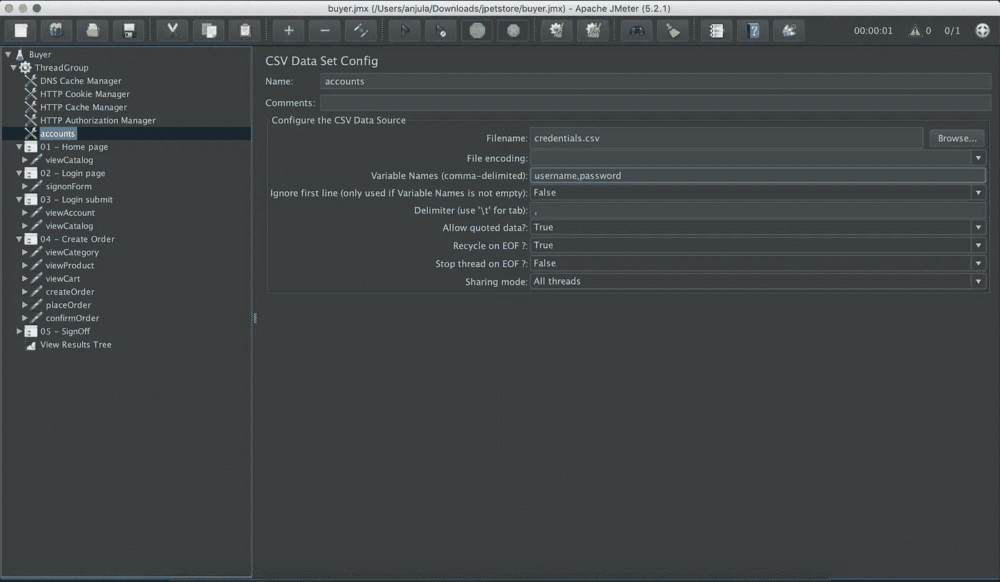

以便它指向 CSV 文件，如下所示。

```
username1,pass1
username2,pass2
username3,pass3
username4,pass4
```

如您所见，我们已经定义了:

*   变量名:用户名和密码。
*   分隔符:`,`(CSV 的值用逗号分隔)。

如果 CSV 如下所示，则不需要变量名(保留为空):

```
username,password
username1,pass1
username2,pass2
username3,pass3
username4,pass4
```

让我们检查加载的变量是如何用来模拟用户登录的。

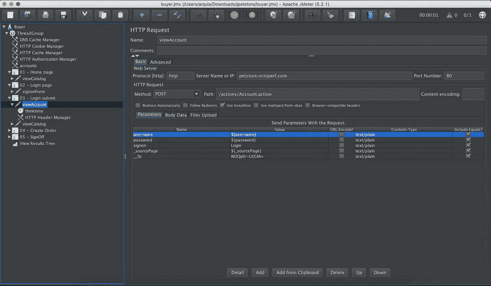

如您所见，加载的变量已经被定义为用户名和密码字段值。现在，模拟不同用户登录。

## **2。动态参数**

> 动态参数是请求中的参数，每次运行时都会发生变化。这些参数在以前的服务器响应中发送。— [十月十日](https://octoperf.com/blog/2018/03/29/jmeter-tutorial/)

这是负载测试时需要知道的一件非常重要的事情。你需要把它们联系起来。你可以遵循四步程序。

*   确定一个动态参数。看起来很神秘！

```
e.g.: RbLmXwd9bLS0l….
```

*   从服务器响应中找到隐含的值。
*   您可以使用[正则表达式提取器](https://octoperf.com/blog/2017/09/07/jmeter-regular-expression-extractor/)或 [JSON 提取器](https://octoperf.com/blog/2017/03/09/how-to-extract-data-from-json-response-using-jmeter/)将值提取到变量中以备后用。
*   用请求的变量替换该值。

让我们来看看服务器的响应。

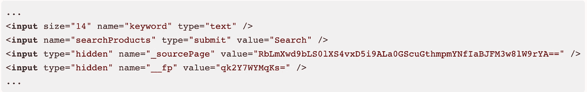

现在，让我们对其响应使用动态参数`_sourcePage`的请求使用正则表达式提取器。

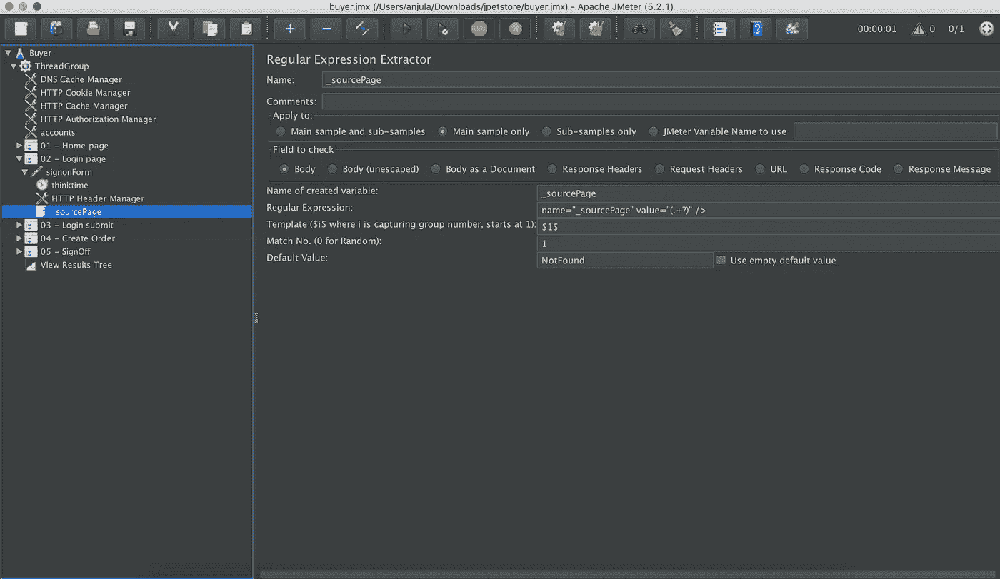

*   名称:`_sourcePage`
*   正则表达式:`name="_sourcePage" value="(.+?)" />`
*   模板:`$1$`
*   匹配号码:`1`

## 3.随机行为

让我们抽取随机的`categoryId`和`productId`变量来模拟一个动态用户。

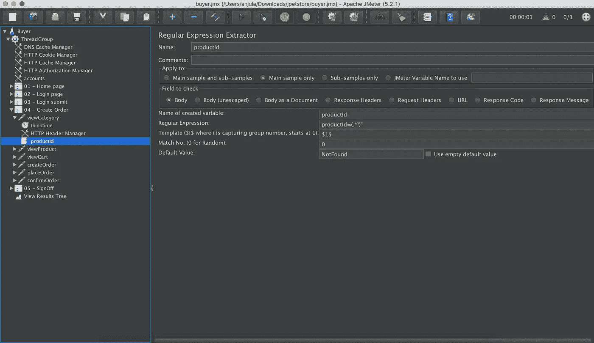

我们对包含相关 id 的页面进行了提取。

*   `categoryId`:所有类别的列表页面。
*   `productId`:所有产品列表页面。

所以，我们用这些变量来模拟用户。

我希望您现在理解了如何使用 JMeter 进行性能测试。

# 参考

*   [使用 Apache JMeter 进行负载测试](https://itnext.io/load-testing-using-apache-jmeter-af189dd6f805)
*   [JMeter 初学者教程](https://octoperf.com/blog/2018/03/29/jmeter-tutorial/)
*   [使用 CSV 数据集配置](https://guide.blazemeter.com/hc/en-us/articles/206733689-Using-CSV-DATA-SET-CONFIG)