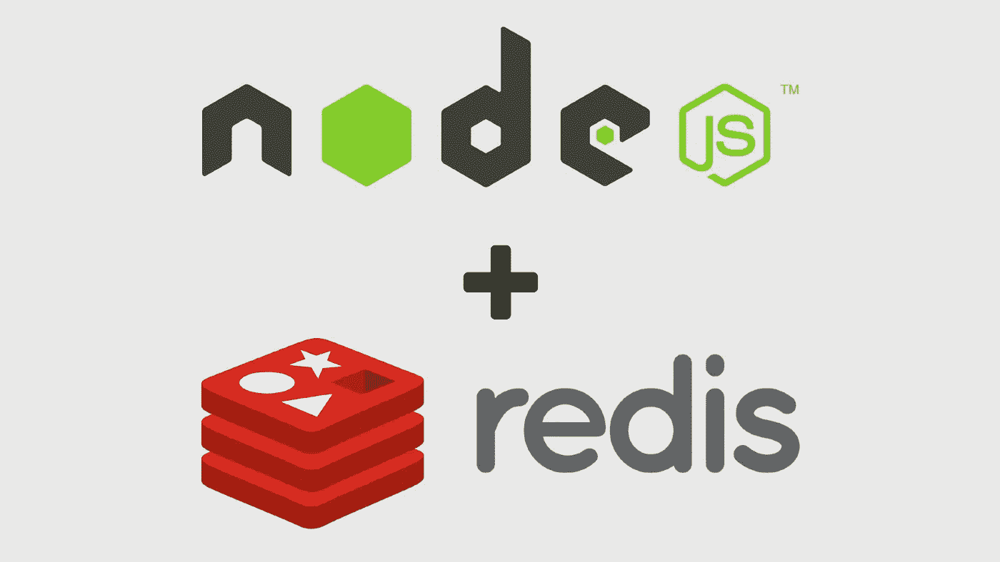
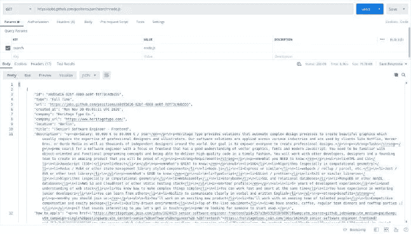
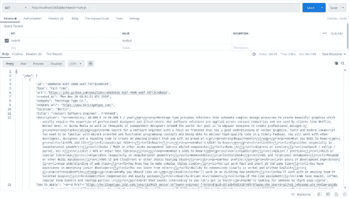
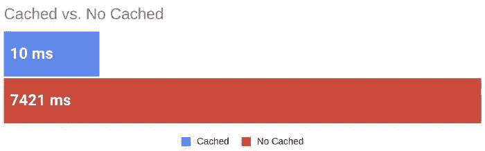

# Redis 和 Node.js 缓存初学者指南

> 原文：<https://betterprogramming.pub/the-beginners-guide-to-redis-and-caching-with-node-js-5a48eac0929e>

## 通过 Redis 缓存加速您的节点应用程序



图片来源:作者

近年来， [Redis](https://redis.io/) 已经成为 Node.js 应用栈中的常事。尽管 Redis 最受欢迎的用例是缓存，但它还有许多其他用例，您可以在这些用例中利用其超快的内存数据库。

在本教程中，我们将向您快速介绍 Redis。我们还将使用 Redis 为一个节点应用程序创建一个简单的缓存，看看它如何影响其性能。

# Redis 是什么？

Redis 是一个开源的(BSD 许可的)、内存中的数据结构存储，用作数据库、缓存和消息代理。

你可以把它想象成一个 NoSQL 数据库，在系统内存中以键值对的形式存储数据。如果需要，Redis 也支持磁盘持久数据存储。

Redis 支持存储[多种数据结构和数据类型](https://redis.io/topics/data-types)，包括字符串、列表、散列、集合和排序集合。受支持的数据结构为 Redis 提供了许多用例的通用性。

Redis 最适合需要在最短的时间内检索数据并交付给客户机的情况。

# Redis 用例

## Redis 用于缓存

Redis 最流行的用例之一是缓存。

**什么是缓存？**

*缓存*是在缓存中存储数据副本的过程，以允许应用程序更快地访问和检索数据。缓存的目标是比数据库或远程服务器更好地加速数据访问操作。对于昂贵的(及时的)操作尤其如此。

作为后端开发人员，我们的任务是尽快完成客户的请求。有时，查询需要几项操作，如从数据库中检索数据、执行计算、从其他服务中检索附加数据等。，这拖累了我们的表现。

这就是缓存的优势所在，因为我们可以处理一次数据，将它存储在缓存中，然后直接从缓存中检索它，而无需执行所有那些昂贵的操作。然后，我们会定期更新缓存，以便用户可以看到更新的信息。

**缓存& Redis**

因为 Redis 是一个内存数据库，所以它的数据访问操作比任何其他磁盘数据库都要快。这使得 Redis 成为缓存的完美选择。它的键值数据存储是另一个优势，因为它使数据存储和检索更加简单。

在本教程中，我们将了解如何使用 Redis 和 Node 进行缓存。

## Redis 用于实时分析

Redis 承诺进行亚毫秒级的数据处理操作。这使得 Redis 成为依赖实时数据分析的应用程序的完美候选。

例如，在实现实时欺诈检测服务时，可以使用 Redis 来存储用户身份及其交易细节。Redis 甚至提供了人工智能支持的更快的交易评分系统和更快的统计模型，以更好地执行这一用例。

实时分析的其他用例包括实时库存管理系统和游戏排行榜。

## 用于会话管理的 Redis

如果您的应用程序使用会话来跟踪经过身份验证的用户和管理特定于用户的数据，Redis 非常适合用作会话存储。使用 Redis 可以显著提高系统的性能，同时使处理用户数据变得更容易，包括凭证、最近的活动，甚至是类似购物车的系统。

## Redis 作为一个队列

您可以使用 Redis 对需要很长时间才能完成的应用程序任务进行排队。您可以实现 FIDO(先进先出)队列或创建延迟队列，以将任务实现延迟到预先安排的时间。

# 使用节点和 Redis 缓存

让我们从本教程的主要焦点开始:在节点应用程序中使用 Redis 进行缓存。

使用 Redis 进行缓存的过程非常简单。当我们收到用户对启用了缓存的路由的请求时，我们首先检查所请求的数据是否已经存储在缓存中。如果是，我们可以快速从 Redis 检索数据并发送响应。

然而，如果数据没有存储在缓存中，我们称之为*缓存未命中*，我们必须首先从数据库或外部 API 检索数据，并将其发送给客户端。我们还确保将检索到的数据存储在缓存中，以便下次收到相同的请求时，我们可以更快地将缓存的数据发送给用户。

现在你对我们要做的事情有了一个清晰的想法，让我们开始实施吧。

# 安装 Redis

如果您还没有安装 Redis，那么您需要安装本教程的 Redis。

您可以下载二进制文件，并使用以下命令轻松编译它们。

```
wget https://download.redis.io/releases/redis-6.0.9.tar.gz
tar xzf redis-6.0.9.tar.gz
cd redis-6.0.9
make
make install
```

为了确保 Redis 服务器运行没有问题，使用`redis-cli`向服务器发送一个 ping。

```
redis-cli ping
```

如果您收到的响应是`pong`，那么 Redis 服务器正在成功运行。

如果出现问题，请阅读[官方快速入门指南](https://redis.io/topics/quickstart)以获得更好的想法。

# 构建节点应用程序

## 基本设置

像这样为节点应用程序设置初始样板文件。

注意我们如何使用另外两个名为`axios`和`redis`的包。`redis`是 Node 的标准 Redis 客户端。在本教程中，我们使用`axios`从外部 API 检索数据。

在继续之前，请确保使用 npm 安装这两个软件包。

```
npm install axios redis --save
```

## 从外部 API 检索数据

我们将使用 [GitHub Jobs API](https://jobs.github.com/api) 来获取与世界各地的编程工作相关的数据。

您可以将与您正在寻找的工作相关的搜索词传递给 API，并检索一组 JSON 格式的可用工作。对 API 的示例请求如下所示。

```
[https://jobs.github.com/positions.json?search=node.js](https://jobs.github.com/positions.json?search=node.js)
```



POSTMAN-GitHub 作业 API 结果

在我们的节点应用程序中，我们定义了一个名为`/jobs`的路由，它从上面的 API 中检索作业数据，并将它们发送回客户端。

这里我们使用`axios`向 GitHub Jobs API 发送一个 GET 请求，其中包含用户提供的搜索词。

现在让我们使用 Postman 来看看路线是如何工作的。



邮递员—我们的 API 结果

## 缓存结果

现在让我们看看如何通过缓存来提高应用程序的性能。

首先，我们需要通过应用程序连接到 Redis 服务器。我们使用安装的 Redis 包来完成这项任务。

默认情况下，Redis 服务器监听端口 6379。我们传递端口号来连接 Redis 并创建一个客户机。

然后实现从缓存中存储和检索数据的逻辑。

## **这是怎么回事？**

当我们接收到一个客户端对`/jobs`路由的请求时，首先我们会收到带有请求查询参数的搜索词。

```
const searchTerm = req.query.search;
```

然后，我们尝试通过传递搜索词从缓存中检索请求的数据，在缓存中存储数据时，我们将搜索词用作关键字。由于 Redis 包没有对承诺的本地支持，我们必须传递一个回调来处理检索到的数据。

```
client.get(searchTerm, async (err, jobs) => {
    if (err) throw err;
});
```

如果 Redis 返回的值不为 null，这意味着相关数据存在于缓存中，因此很容易在响应中返回该数据。只要确保将字符串转换回 JSON 就行了。

```
if (jobs) {
    res.status(200).send({
        jobs: JSON.parse(jobs),
        message: "data retrieved from the cache"
    });
}
```

如果返回值为 null，我们必须向外部 API 发送请求来检索相关数据。

当我们从 API 获取数据时，在发送回之前，我们将数据存储在 Redis 中，以便下次将相同的请求发送到节点服务器时，它可以使用存储在缓存中的数据进行响应，而不是从 API 请求数据。

注意我们如何使用`setex`函数在缓存中存储数据。具体使用`setex`函数，而不是常规的`set`函数，我们可以为存储的键-值对设置一个到期时间。因为我们为过期时间设置了一个值，所以当经过时间过期时，Redis 将自动从缓存中删除这个键-值对。

# 完整源代码

就是这样。我们已经为我们的应用程序创建了一个简单的缓存。这并不难，是吗？

# 关键时刻:时间对比

我们将了解缓存的使用如何影响我们应用的性能。我使用 Postman 向服务器发送请求，并测量请求完成时间。



表演

第一次使用新的搜索词向服务器发送请求时，应用程序需要更长的响应时间(超过 7 秒)，因为它必须从外部 API 获取数据。当您第二次发出相同的请求时，服务器的响应速度会更快，因为结果已经存在于缓存中。

请求在 10 毫秒内完成。与我们之前看到的没有缓存的应用程序相比，这是一个巨大的性能提升。

# 摘要

在本教程中，我们简要介绍了 Redis，并用它为一个节点应用程序创建了一个简单的缓存。现在，您可以使用 Redis 来缓存应用程序中频繁查询的数据，从而获得可观的性能提升。

您还可以研究如何在其他用例中利用 Redis 的最佳特性。

感谢阅读！