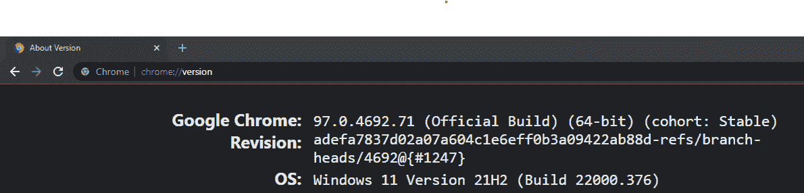
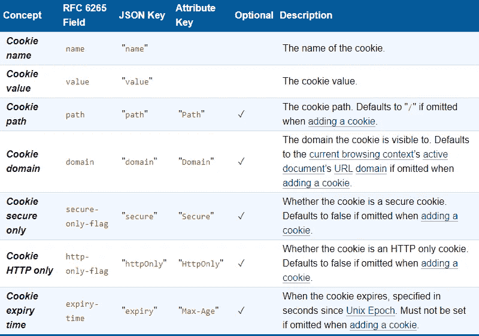

# 使用 Python 学习 Selenium 的初学者指南

> 原文：<https://betterprogramming.pub/the-beginners-guide-to-selenium-with-python-cde1937585c6>

## 开始使用 Selenium 的分步教程


[克莱门特·赫拉尔多](https://unsplash.com/@clemhlrdt?utm_source=medium&utm_medium=referral)在 [Unsplash](https://unsplash.com?utm_source=medium&utm_medium=referral) 拍摄的照片

# 硒是什么？

从其正式定义来看，“Selenium 是一套自动化 web 浏览器的工具”，事实也确实如此。虽然我认为有些人可能会像我最初一样将其误解为一种测试工具，但我已经认识到 Selenium 更像是一种通用工具，可以用于浏览器测试。事实上，对于您发现自己在做的任何重复性的基于 web 的任务，您都应该让 Selenium 来为您做！

> 事实上，我自己创建了一个名为 Readminder 的项目，它可以帮助我自动搜索最新章节和/或我最喜欢的网络漫画的章节，并给我发送电子邮件提醒。看看这里的！

# 入门指南

在我们开始之前，设置 Selenium 有三个重要步骤:

1) [为您想要的编程语言安装](https://www.selenium.dev/documentation/webdriver/getting_started/install_selenium_library/)Selenium 库

Selenium 目前支持多达 6 种不同的编程语言:Java、Python、C# Ruby、JavaScript 和 Kotlin。我在这里选择了 Python，因为它是自动化/脚本语言，不可否认它是我最喜欢的语言:)

```
pip install selenium
```

2) [下载](https://www.selenium.dev/documentation/webdriver/getting_started/install_drivers/)与您的浏览器驱动程序匹配的版本

我选择 Chrome 是因为它是最流行的网络浏览器。首先，进入`chome://version`，确保您正在下载正确版本的驱动程序



在这里，你可以看到我的版本是`97.0.4692.71`，你的可能会有所不同。如果中没有列出完全匹配的版本[，也不用担心。选择最接近的版本。可能要选择的是最后两个数字不匹配的地方，这很好。](https://chromedriver.storage.googleapis.com/index.html)

3)为驱动程序设置必要的路径

取决于你的系统，你如何将你的驱动程序的位置添加到你的`PATH`环境变量看起来会有一些不同。

## 尝试

```
echo 'export PATH=$PATH:/path/to/driver' >> ~/.bashrc
source ~/.bashrc
```

## Zsh

```
echo 'export PATH=$PATH:/path/to/driver' >> ~/.zshrc
source ~/.zshrc
```

## Windows 操作系统

```
setx PATH "%PATH%;C:\path\to\driver"
```

一旦以上步骤完成，你现在就可以开始自动化你的浏览器了！

# 自动化您的浏览体验

让我们来看看使用 Selenium 自动化浏览器时可以采取的 8 个基本步骤或行动。

# 步骤 1:开始会话

```
driver = webdriver.Chrome()
```

# 步骤 2:在浏览器上采取行动

```
driver.get("http://www.google.com")
```

您可以采取的最常见的 web 浏览器操作是导航到网页。在上面的例子中，我们打开了一个 URL 为`http://www.google.com`的网页。其他一些有用的 web 浏览器操作包括:

## 其他浏览器导航

```
driver.back()    # Clicks the browser’s back button
driver.forward()    # Clicks the browser’s forward button
driver.refresh()    # Refreshes the current browser's page
```

## 添加或删除 Cookie

Cookies 对于存储和加载用户信息非常有用。要将 cookie 添加到当前浏览上下文中，我们可以使用接受 cookie 可序列化 JSON 对象的`add_cookie`函数。

```
driver.add_cookie({"name": "key", "value": "value"})
```

下面的[表](https://www.w3.org/TR/webdriver1/#cookies)描述了序列化 cookie 的字段，以及在提供添加 cookie 时是否可选。



## 使用窗口和标签

每个窗口和标签都有一个窗口句柄，用来唯一地标识它。要获取当前窗口或选项卡的窗口句柄，我们可以使用以下属性:

```
driver.current_window_handle
```

当我们创建一个新的选项卡或窗口时，焦点将转移到屏幕上的新窗口或选项卡上

```
driver.switch_to.new_window('tab')    # Switch to a new tab
driver.switch_to.new_window('window')    # Switch to a new window
```

要切换回我们原来的窗口，我们可以简单地使用一个变量来存储我们原来存储的窗口句柄并切换回它。

```
original_window = driver.current_window_handle
...
some window/tab switching logic...
...
driver.switch_to.window(original_window)
```

最后，要关闭当前窗口或标签，我们可以调用:

```
driver.close()
```

# 步骤 3:请求浏览器信息

```
driver.title          # get title
driver.current_url    # get current URL
```

除了标题和当前 URL 之外，您还可以请求许多类型的浏览器信息，包括以下内容:

## 饼干

如果我们之前添加了一个 cookie，我们可以通过`get_cookie`函数根据它的名称获取它的详细信息，如下所示:

```
driver.get_cookie("foo")    # Get details of a cookie named 'foo'
```

## 窗口大小

```
size = driver.get_window_size()
width = size.get("width")
height = size.get("height")
```

## 窗口位置

```
position = driver.get_window_position()
x1 = position.get('x')
y1 = position.get('y')
```

# 第四步:建立等待策略

通常，我们希望建立一个等待策略，以便在中的元素被加载并准备好进行交互时，与该元素进行交互。让我们来看看两种等待策略。

## 隐式等待

```
driver.implicitly_wait(10)
```

最简单的策略是隐式等待策略。当试图查找元素时，它告诉 WebDriver 在指定的时间内轮询或重复检查 DOM，如果在指定的时间内找到了元素，那么我们继续，而不等待整个持续时间(在上面的例子中是 10 秒)。这种等待策略主要用于确保我们等到元素准备好，如果它们不能立即可用的话。

## 显式等待

```
from selenium.webdriver.support import expected_conditions as EC
wait = WebDriverWait(driver, timeout=10)
element = wait.until(EC.element_to_be_clickable((By.ID, 'someid')))
```

当您需要更大的灵活性来定义您希望 WebDriver 等待多长时间时，显式等待策略就出现了。这种等待策略允许您的代码暂停程序执行或冻结线程，直到您指定的条件解决。这意味着在超时(在上面的例子中是 10 秒)过去之前，它将继续尝试并等待条件，直到它返回一个`true`值。

> 注意，结合使用隐式和显式等待策略会导致不可预测的等待时间，因为隐式等待没有预定义的等待时间。例如，将隐式等待时间设置为 10 秒，显式等待时间设置为 15 秒，可能会导致超时发生在 20 秒后，而不是 25 秒后。

# 第五步:找到一个元素

```
from selenium.webdriver.common.by import By
search_box = driver.find_element(By.NAME, "q")
search_button = driver.find_element(By.NAME, "btnK")
```

在与元素交互之前，我们必须首先找到元素。这种搜索是通过指定和过滤所需元素的属性来完成的。在上面的例子中，我们通过`name`属性进行过滤。By 类的其他可用属性如下:

```
ID = "id"
XPATH = "xpath"
LINK_TEXT = "link text"
PARTIAL_LINK_TEXT = "partial link text"
NAME = "name"
TAG_NAME = "tag name"
CLASS_NAME = "class name"
CSS_SELECTOR = "css selector"
```

> 如果您想通过指定的属性查找多个元素，还有一个`find_elements()`方法。该方法将返回找到的元素列表。

# 步骤 6:对元素采取行动

```
from selenium.webdriver.common.keys import Keys
search_box.clear()
search_box.send_keys("Selenium" + Keys.ENTER)
search_button.click()
```

有 4 种基本类型的命令可以在元素上执行。

`send_keys()` —将提供的密钥键入可编辑的元素中。

`click()` —在元素中心执行点击命令。

`clear()` —重置元素的内容。

`select` —有一个选择类可以更容易地对`<select>`元素采取行动。首先，使用引用了`<select>`元素的`WebElement`创建一个选择对象。

```
from selenium.webdriver.support.select import Select
select_element = driver.find_element(By.ID, 'selectElementID')
select_object = Select(select_element)
```

然后使用以下方法之一选择一个选项:

## 1.基于`<select>`元素的内部索引选择一个`<option>`

```
select_object.select_by_index(1)
```

## 2.根据其值属性选择一个`<option>`

```
select_object.select_by_value('value')
```

## 3.根据文本选择一个`<option>`

```
select_object.select_by_visible_text('text')
```

或者，如果您只是对`<select>`元素包含哪些`<option>`元素以及选择了哪些`<option>`元素感兴趣:

```
all_available_options = select_object.options
all_selected_options = select_object.all_selected_options
```

# 步骤 7:请求要素信息

```
driver.find_element(By.NAME, "q").get_attribute("value")
```

元素包含我们可以从中提取的信息。请注意，在上面的例子中，我们是如何直接定位元素并向其请求 value 属性的。

很多时候，我们需要在请求元素信息之前重新定位元素，因为自从我们第一次定位它以来，DOM 已经发生了变化。现在，我们可以从 4 个常见类别中查询元素信息:

## 1.属性和特性

使用`get_attribute`和`get_property`方法，我们可以从元素中获取我们想要的属性和特性。

```
link_text.get_attribute("href")
img.get_attribute("src")
search_input.get_property("value")
```

## 2.文本内容

```
text = driver.find_element(By.CSS_SELECTOR, "h1").text
```

## 3.CSS 值

```
cssValue = driver.find_element(By.LINK_TEXT, "See More").value_of_css_property('color')
```

## 4.州

```
isDisplayed = driver.find_element(By.ID, 'textLbl').is_displayed()
```

`is_displayed`检查元素是否可见。

```
isSelected = driver.find_element(By.CSS_SELECTOR, "input[type='checkbox']").is_selected()
```

`is_selected`检查元素是否被选中。

```
isEnabled = driver.find_element(By.NAME, 'btnK').is_enabled()
```

`is_enabled`检查元件是启用还是禁用。这些方法返回一个布尔值。如果检查通过，则为 True，否则为 False。

# 步骤 8:结束会话

```
driver.quit()
```

默认情况下，这将退出浏览器，并且该会话的自动化结束。

就是这样！使用这 8 个简单的步骤，你应该能够用 Python 中的 Selenium 在你的浏览器上自动化任何事情！

希望本指南对您有所帮助，一如既往地感谢您的阅读！