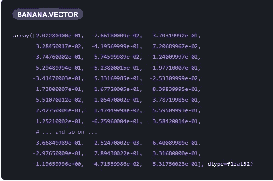

# 使用 spaCy 进行相似性匹配的初学者指南

> 原文：<https://betterprogramming.pub/the-beginners-guide-to-similarity-matching-using-spacy-782fc2922f7c>

## 利用 spaCy 和 Python 检测句子间的相似性


图片取自 [spaCy](https://spacy.io/static/social_default-1d3b50b1eba4c2b06244425ff0c49570.jpg) 官网

这篇文章讲述了使用一个叫做 spaCy 的自然语言处理模块来确定两个句子之间相似性的基本步骤。以下教程基于 Python 实现。这对于将用户输入与 FAQ 机器人的可用问题进行匹配特别有用。

给出以下句子:

1.  我如何加入一个公会？
2.  我怎么加好友？
3.  什么是坐骑？
4.  如何增加我的战斗等级？
5.  我可以在坐骑上攻击吗？

哪些句子彼此相似？从人类的角度来看，我们可以很容易地识别出句子 3 和句子 5 彼此有一些相似之处，因为两者都包含单词 mount。至于计算机，它们必须依靠比较单词向量(单词嵌入)，这代表每个单词的多维意义。例如,“香蕉”的单词向量表示如下:



图片取自 https://spacy.io/usage/vectors-similarity

这些单词向量是使用一种称为 word2vec 的算法生成的，可以使用任何开源库(如 Gensim 或 FastText)进行训练。幸运的是，spaCy 内置了自己的单词向量，随时可以使用(仅适用于某些语言和模型)。

本教程共有五个部分:

1.  设置和安装
2.  用法和 API 调用
3.  自定义功能
4.  估价
5.  结论

我们开始吧！

# 设置和安装

如官网所述，“spaCy 兼容 64 位 CPython 2.7 /3.5+，可在 Unix/Linux、macOS/OS X、Windows 上运行。最新的 spaCy 版本可通过 [pip](https://pypi.python.org/pypi/spacy) 和 [conda](https://anaconda.org/conda-forge/spacy) 获得。”如果您在安装时遇到问题，请参考[快速入门](https://spacy.io/usage)页面。

## 计算机编程语言

在本教程中，我将使用安装在虚拟环境中的 Python 3.7.1

## 空间模块

检查以下命令，并在命令提示符下运行它们:

*   通过 pip 为没有 GPU 的用户安装

```
pip install spacy
```

*   通过 conda 安装

```
conda install -c conda-forge spacy
```

*   通过 pip 升级空间

```
pip install -U spacy
```

*   为使用 GPU 的用户通过 pip 安装

```
pip install -U spacy[cuda92]
```

本教程我使用的是 spaCy 2.0.18。一旦安装了 spaCy，在实际使用它之前，需要下载语言模型。

## 语言模型

您可以在下面的[链接](https://spacy.io/models)中找到完整列表和可用型号。我将使用大的英国模型。在命令提示符下，输入以下代码:

```
python -m spacy download en_core_web_lg
```

如果你想有一个模型的特定版本，使用下面的命令(例子为下载小英文模型版本 2.1.0):

```
python -m spacy download en_core_web_sm-2.1.0 --direct
```

# 用法和 API 调用

一旦你安装好了所有的东西，让我们测试一下基本的 API 调用。

## 导入和加载模块

第一步是导入 spaCy 模块并加载我们刚刚下载的语言模型。我正在使用 Jupyter Notebook 并运行以下代码:

如果您对符号链接有问题，您可以使用以下代码来加载模型:

## 停用词

停用词是在文本的预处理或后处理期间被过滤掉的词。要获取英语模型的停用词，可以使用以下代码:

```
#assign the default stopwords list to a variable
STOP_WORDS = spacy.lang.en.stop_words.STOP_WORDS
```

从版本 2.0.11 开始，它包含了一些语法糖，允许您添加或删除停用词。

*   检查当前停用词:

```
#nlp refers to the name of the model loaded, change the name accordingly
#nlp = en_core_web_lg.load() or nlp = spacy.load("en_core_web_lg")
print(nlp.Defaults.stop_words)
```

*   添加一个停用字词:

```
nlp.Defaults.stop_words.add("add")
```

*   添加几个停用词:

```
nlp.Defaults.stop_words |= {"stop","word",}
```

*   删除单个停用字词:

```
nlp.Defaults.stop_words.remove("remove")
```

*   删除几个停用词:

```
nlp.Defaults.stop_words -= {"stop", "word"}
```

## 相似性匹配

要比较两个句子之间的相似性，请使用以下代码:

```
doc1 = nlp("How do I turn sound on/off?")
doc2 = nlp("How do I obtain a pet?")
doc1.similarity(doc2)
```

您应该得到以下输出，尽管您的结果可能会因使用的版本而有所不同:

```
0.8680366536690709
```

该值的范围从 0 到 1，1 表示两个句子相同，0 表示两个句子没有相似之处。正如你所注意到的，结果是相当高的，尽管从人类的角度来看，这些句子似乎并不相关。这是因为这两个句子都是以“我该怎么做”开头，以“？”结尾。然而，可能存在这样的情况，其中句子没有任何共同的单词，但是仍然具有高度的相似性。为了解决这个问题，我们需要将文本预处理成相关的部分。例如，如果我们要测试的是使用下面的例子:

```
doc1 = nlp("turn sound on/off")
doc2 = nlp("obtain a pet")
doc1.similarity(doc2)
```

这里的相似度应该会少很多。运行代码后，我收到了以下结果:

```
0.49538299705127853
```

因此，文本预处理在任何自然语言处理项目中都是非常重要的。让我们继续下一节，我们将为文本预处理编写一些自定义函数。

# 自定义功能

自定义函数的目的是通过预处理输入或输出数据来提高准确率。

## 使用 for 循环删除停用词

我们将从删除停用词的函数开始。查看以下代码:

1.  将文本转换为小写(不区分大小写的匹配)。
2.  声明一个列表变量来存储结果。
3.  循环每个单词。
4.  检查该单词是否在停用词列表中。
5.  将单词追加到列表变量中。
6.  将这些单词组成一个句子，并返回结果。

## 使用列表理解删除停用词

我们可以通过将 for 循环改为 list comprehension 来进一步优化代码:

如您所见，代码没有那么冗长。让我们测试一下速度，看看有什么不同。我将使用 Jupyter 笔记本的神奇功能。您可以实现自己的函数来计时结果:

```
sample = "Thanks for the cool story bro!"
%timeit remove_stopwords(sample)
%timeit remove_stopwords_fast(sample)
```

我得到了以下结果(可能因机器而异):

```
6.87 ms ± 274 µs per loop (mean ± std. dev. of 7 runs, 100 loops each)
6.54 ms ± 70.5 µs per loop (mean ± std. dev. of 7 runs, 100 loops each)
```

注意，有时 for 循环比列表理解执行得更好。您还需要考虑代码的可读性。确保你不会为了一点点收益而过度优化你的代码。

## 删除代词

使用 token 可以很容易地确定哪些单词是代词。lemma_ call:

如果您只想获得单词的词汇化形式，可以将代码修改为如下形式:

## 删除停用词、标点和代词

在下面的代码片段中，我将向您展示如何在一个函数中包含多个预处理功能。您可以遵循相同的结构，并根据您的使用情况添加额外的功能。将它们放在一起的好处是减少了多次循环单词的需要。

## 用预处理函数计算相似度

您可以在相似性函数之前调用预处理函数，如下所示:

# 估价

一旦您准备好了函数，您就可以轻松地调用它们，并将用户输入与文本文件或数据库中的问题列表进行比较。我将使用一些来自 Yoozoo Games 的游戏《不和谐遗产-愤怒之翼》的常见问题。该列表可通过以下[链接](https://support.gtarcade.com/faq?gid=182&cid=651)获得。这些问题包括:

```
...
What can I do if there is emergent game issue?
What can I do if my Flash Player version is too old?
What can I do if the game stuck on loading page?
What can I do if the Flash Player crashed?
What can I do if I can't login?
How could I get the chance to play the game?
Will my Beta Release account be deleted? Can I recharge during Beta Release?
Can I get high quality souls with my low quality souls?
How many qualities of Hero Souls there are?
What's the usage of Hero Soul?
Why some players get better reward from Conquest?
What's the benefit if a guild occupied a mine area?
Why can't I attack some players' mine?
Is all the mining area the same?
Why other player get better reward than I do?
Can I control the skills manually in Arena?
Why I can't explore a certain stage?
Can I challenge the stage I already passed?
What's the usage of Mount?
...
```

我将测试几个不同的样本输入，并评估结果。结果基于具有最高值的三个。

## 权力的游戏版本

关键词版本是相似度高的关键因素。

```
'What can I do if my Flash Player version is too old?' #0.7180225711646898'How could I get the chance to play the game?' #0.6954108074024377"Why can't I enter the game?" #0.6835874250781667
```

## 坐骑有什么用？

请注意前 1 名和前 2 名之间的相似性值有很大差异。这允许我们设置一个阈值，只显示超过它的结果。

```
"What's the usage of Mount?" #0.8644284544385071'How many sockets does a equipment have?' #0.5640873317116436'How do I change audio setting?' #0.5242988083830281
```

## 我是一名学生

与列表中的任何问题都没有关系的随机句子。

```
"What's the highest level I can reach?" #0.42903297878853114"Why I can't explore a certain stage?" #0.40936269689262966'How do I gain Activity points?' #0.3974547468215102
```

## 卡哇伊·德苏内

I am using the romaji form of 可愛いですね just for fun. As I have mentioned, the language model that I am using is for English text. Using other language will resulted in similar results with very low similarity.

```
'How many types of Heroes in LOA III?' #0.2616090637978352'How to be VIP?' #0.15710692304217794'Can I recycle the gem I already used?' #0.14802936240064615
```

# 结论

恭喜你走了这么远！本教程仅演示了使用 spaCy 计算相似性的基本概念。根据您的用例，您可以在它的基础上进一步构建。例如，一个简单的 API 调用根据用户输入确定前三个最相似的问题。可能性是无穷无尽的，只要你有正确的心态和利用它的知识。请随意使用 spaCy，因为它有更多的内置功能可用。我们将在下一节课中再见！

# 参考

1.  [https://spacy.io/usage/vectors-similarity](https://spacy.io/usage/vectors-similarity)
2.  [https://spacy.io/models](https://spacy.io/models)
3.  https://support.gtarcade.com/faq?gid=182&cid = 651T2
4.  [https://stack overflow . com/questions/41170726/add-remove-stop-words-with-spacy](https://stackoverflow.com/questions/41170726/add-remove-stop-words-with-spacy)