# Neo4j 图形平台初学者指南

> 原文：<https://betterprogramming.pub/the-beginners-guide-to-the-neo4j-graph-platform-a39858ccdeaa>

## 理解 Cypher，Neo4j 的声明式图形查询语言

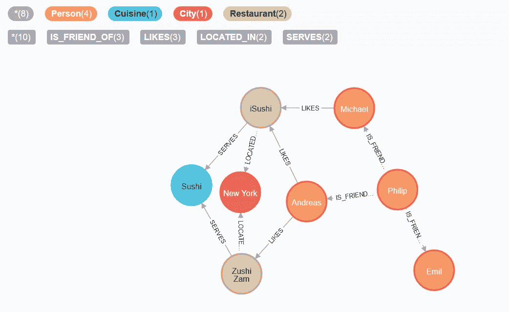

图片由作者提供。

通过阅读这篇文章，您将接触到 Neo4j 的基本概念，这是一个本地图形数据库。基于[官方文档](https://neo4j.com/)，Neo4j 为:

> “…从头开始构建，不仅利用数据，还利用数据关系*。* Neo4j *连接*存储的数据，以前所未有的速度实现前所未有的查询。”

图形数据库是一种用于将数据建模为图形的数据库。图形数据库的结构基于以下内容:

*   `Nodes` —代表记录/数据。您可以向一个节点添加零个或多个标签。
*   `Relationships` —代表节点之间的连接。每个连接都有一个方向。
*   `Properties` —代表指定的数据值。适用于节点和关系。

本教程涵盖了 Neo4j 入门的基本步骤。您可以利用图形数据库来解决相当多的问题，从推荐系统到欺诈检测。

让我们继续下一部分，从安装开始。

# 1.设置

## Java 语言(一种计算机语言，尤用于创建网站)

在继续安装之前，您需要确保您的机器上安装了 OpenJDK 11 或 Oracle Java 11。您可以通过在终端中运行以下命令来轻松检查它。

```
java --version
```

您应该会看到以下输出

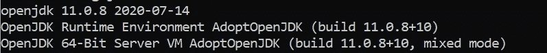

作者图片

我用的是 [AdoptOpenJDK](https://adoptopenjdk.net/index.html?variant=openjdk8&jvmVariant=hotspot) 做的 OpenJDK 11 build，开源免费。

## Neo4j

在撰写本文时，最新的社区版本是 4.1.1。前往官方[下载页面](https://neo4j.com/download-center/#community)，根据您的操作系统下载 neo4j 主文件。单击下载链接后，下载将开始，您将被重定向到包含安装步骤的新页面。

在本教程中，提供的步骤基于 Windows 平台。如果您使用其他操作系统，请参考官方安装步骤。将文件解压缩到您选择的目录中。您应该会看到以下文件和文件夹。

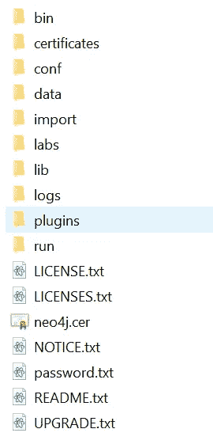

作者图片

运行 Neo4j 有两种方法:

*   作为控制台应用程序
*   作为服务

## 控制台应用程序

最简单的方法是通过以下命令将其作为控制台应用程序运行。`NEO4J_HOME`指的是您解压文件的基本目录。

```
<NEO4J_HOME>\bin\neo4j console
```

以下输出将显示在您的终端上:

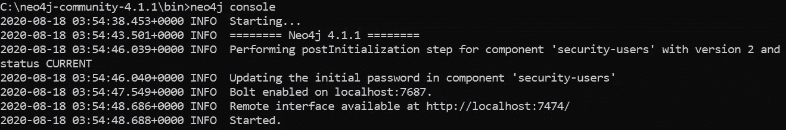

作者图片

在控制台模式下，进程被绑定到终端。它需要在前台保持打开。

## 服务

另一方面，服务在后台运行流程。即使终端关闭，它也会继续运行。要将其作为服务安装，请运行以下命令:

```
<NEO4J_HOME>\bin\neo4j install-service
```

之后，您可以通过以下命令正常启动它:

```
neo4j start
```

以下列表包含一些基于 Windows PowerShell 模块的有用命令:

*   `stop` —停止进程
*   `restart` —重新开始流程
*   `status` —检查流程的状态
*   `uninstall-service` —移除 neo4j 作为服务

## Neo4j 控制台

下一步是在浏览器中访问它。打开浏览器并转到以下 URL。

```
[http://localhost:7474](http://localhost:7474)
```

它会将您重定向到:

```
[http://localhost:7474/browser/](http://localhost:7474/browser/)
```

使用以下用户界面:


作者图片

如果您是第一次访问它，只需通过以下用户名和密码连接到数据库:

*   `username` — neo4j
*   `password` — neo4j

它会提示您更改密码。请务必记住新密码，因为后续登录将使用新密码。登录后，您应该会看到以下界面:

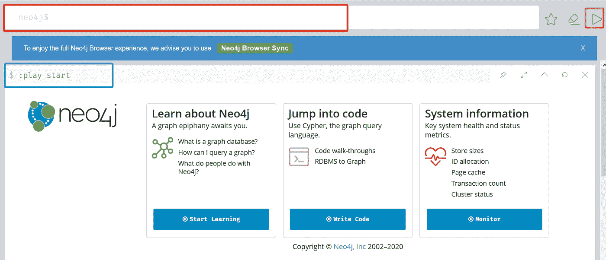

作者图片

用红色突出显示的部分代表输入区域，您可以在这里键入要执行的查询语言。

您可以在右侧找到如下三个按钮:

*   `star` —将查询更新为您的最爱
*   `eraser` —清除输入区域
*   `play` —执行查询。您可以使用快捷键`Ctrl+Enter`来触发执行。

每次运行一个命令，结果都会显示并记录下来。以蓝色突出显示的部分表示内置命令，每次刷新浏览器时都会运行该命令。

## 样本数据集

Neo4j 为您提供了两个样本数据集。如果您打算遵循内置教程，请运行以下命令。

第一个数据集展示了交叉引用流行文化中演员和电影的常见查询模式。在输入区域运行以下命令来启动教程。

```
:play movie graph
```

此外，第二个数据集涵盖了从外部 csv 文件加载数据。您将学习使用一些经典数据集从 RDBMS 模式转换到图结构。您可以通过以下命令启动教程:

```
:play northwind graph
```

# 2.信息、文档和配置

在左侧，有一个导航面板，根据您的需要包含一些有用的按钮。

## 数据库信息

第一个按钮显示了数据库的概况。

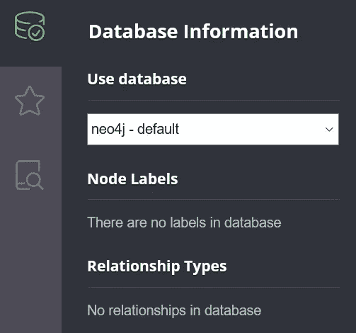

作者图片

一旦您向它添加了一些数据，它应该显示节点及其关系，如下所示:

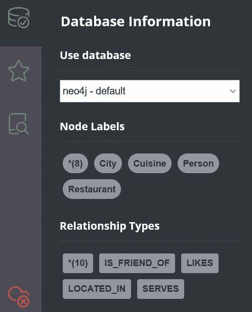

作者图片

## 最喜欢的剧本

“下一步”按钮包含一些现成的示例脚本供您参考。脚本是指可以在输入区域执行的查询文本。任何保存的脚本也将存储在这里。您可以将所有保存的脚本导出到一个 zip 文件中。

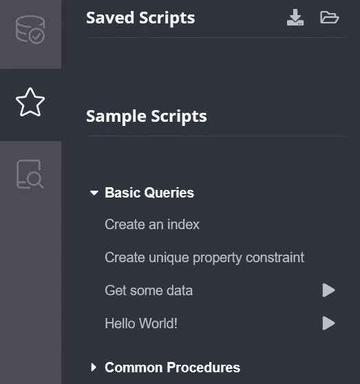

作者图片

## 文件

如果您曾经迷路，不知道如何继续，强烈建议您查看文档。其中一些是示例脚本，您可以在其中作为教程运行，而一些是在线文档的外部链接。

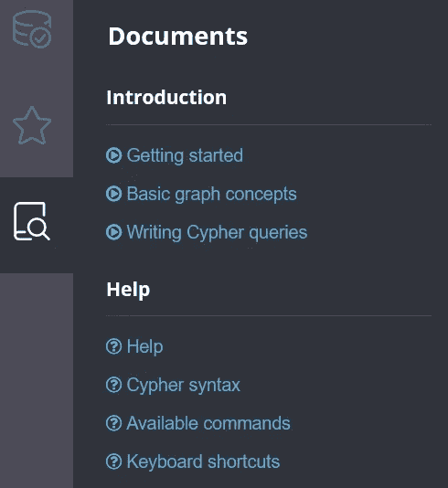

作者图片

## 浏览器同步

此外，Neo4j 还带有在线同步功能，你可以通过他们的云服务保存你的数据库。您需要登录才能使用此功能。

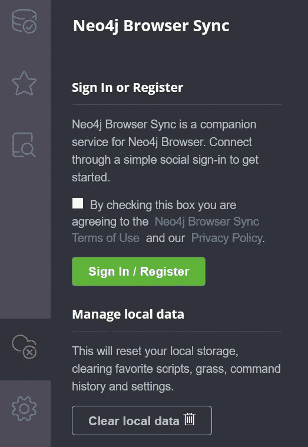

作者图片

## 浏览器设置

您可以通过**浏览器设置**按钮根据自己的喜好修改配置。这包括用户界面以及开始时要执行的代码。

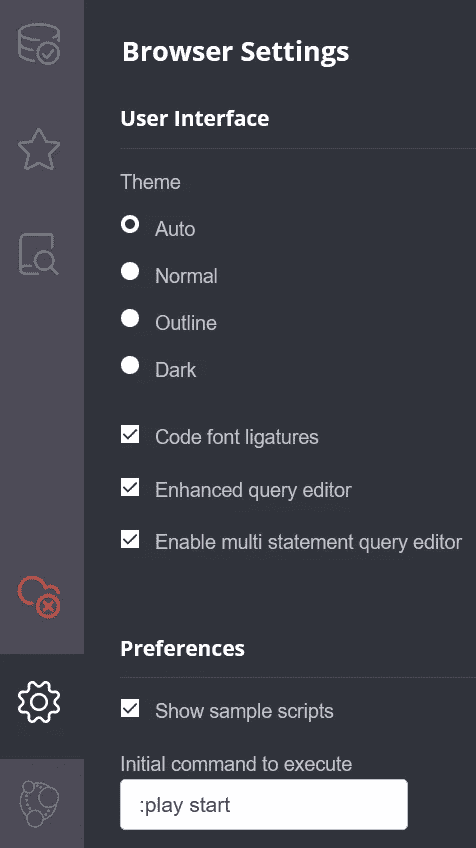

作者图片

# 3.密码—图形查询语言

Cypher 用于从 Neo4j 中查询数据。它是一种高度优化的查询语言，能够理解每个节点之间存储的连接。它与通常的 SQL 查询有很大的不同，因为在图形数据库中不存在表的概念(查询数据库时不再有连接噩梦)。

大多数情况下，您会用到以下子句:

*   比赛
*   创造
*   合并

## 比赛

`MATCH`子句用于读取数据。你可以把它想象成 SQL 中的`SELECT`子句。它描述了图形数据的模式，Neo4j 将使用该模式来检索与该模式匹配的所有路径。以下示例说明了从现有数据库中获取所有数据的查询。为了获取数据，您需要显式指定`RETURN`子句。

```
MATCH (n) RETURN (n)
```

Neo4j 根据您的需求为我们提供了四种不同的最终结果:

*   图表
*   桌子
*   文本
*   密码

图形显示了节点之间的可视化以及它们之间的关系。

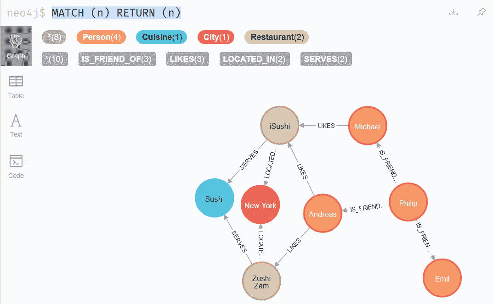

作者图片

表在表中显示每个节点的信息，如标签和属性。


另一方面，文本显示整个查询输出，就像您在查询 SQL 数据库时看到的一样。

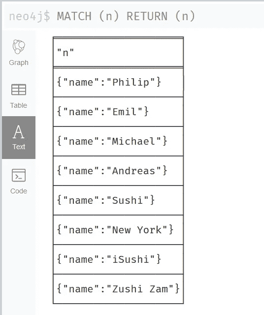

作者图片

如果您通过代码进行查询，代码会为您提供响应信息。

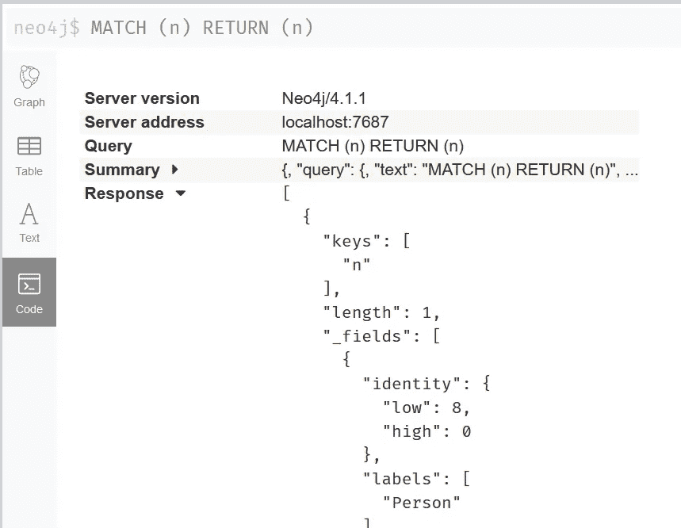

作者图片

你可以把它限制在一个特定的模式。例如，要返回数据库中的所有电影:

```
MATCH (movie:Movie)
RETURN movie.title
```

此外，它还经常与`WHERE`子句成对出现，因为`MATCH`子句只描述结构，而`WHERE`子句决定查询的内容。让我们看看下面这个例子，它找到了由一个叫`Steven Spielberg`的导演执导的所有电影。

```
MATCH (director:Person)-[:DIRECTED]->(movie)
WHERE director.name = "Steven Spielberg"
RETURN movie.title
```

上面给出的例子是基于一个传出的关系。在引入关系中，箭头的方向将反转。例如，获得所有在一部名为`Wandering Earth`的电影中表演过的演员。

```
MATCH (m:Movie { title: 'Wandering Earth' })<-[:ACTED_IN]-(actor)
RETURN actor.name
```

通过管道符号匹配多个关系，如下所示:

```
MATCH (m:Movie { title: 'Wandering Earth' })<-[:ACTED_IN|:DIRECTED]-(person)
RETURN person.name
```

返回所有出演或执导过一部名为`Wandering Earth`的电影的名字。

## 创造

`CREATE`子句主要用于创建数据，就像 SQL 中的`INSERT`子句一样。您需要指定命名节点及其与内联属性的关系。您可以很容易地创建一个新节点来表示一个`PERSON`标签，如下所示:

```
CREATE (n:Person)
```

一个节点可以有零个或多个标签。下面的查询创建了一个带有两个标签的节点(`Person`和`Malaysian`)。

```
CREATE (n:Person:Malaysian)
```

节点也可以有自己的属性。您可以使用字典样式的语法创建同时具有标签和属性的节点:

```
CREATE (n:Person { name: 'Wai Foong', title: 'AI Engineer' })
```

您可以通过`RETURN`子句查询并返回新创建的数据。以下示例将返回一行数据`AI Engineer`。

```
CREATE (n:Person { name: 'Wai Foong', title: 'AI Engineer' })
RETURN n.title
```

可以通过以下语法创建节点之间的关系，其中 A 和 B 表示节点。

```
A-[:RELTYPE]->B
```

要创建新的节点和关系，可以按如下方式指定:

```
CREATE (a:Person {name:"A"})-[:IS_FRIEND_OF]->(b:Person {name:"B"})
```

如果您已经有了现有的节点，并且想要在它们之间创建连接，您需要首先通过`MATCH`子句获得节点。

```
MATCH (a:Person),(b:Person)
WHERE a.name = 'A' AND b.name = 'B'
CREATE (a)-[:IS_FRIEND_OF]->(b)
```

## 合并

与`CREATE`子句不同，`MERGE` 子句将在创建新数据之前首先确定图形中是否存在模式。您可以将它看作是`MATCH`和`CREATE`的组合，它要么基于模式匹配现有数据，要么从中创建新数据。以下示例将创建一个新节点，因为并非所有属性都与任何现有节点匹配(与我们之前创建的节点相比，有一个额外的属性调用年龄)。

```
MERGE (n:Person { name: 'Wai Foong', title: 'AI Engineer', age: 28})
RETURN n
```

您可以将 MERGE 子句与两个附加子子句结合起来:

*   `ON_CREATE` —未找到匹配项且创建了新节点时要执行的操作
*   `ON_MATCH` —发现匹配时要执行的操作

以下示例创建了一个具有`name`和`created`属性的新`Person`节点。在创建时，创建的属性将被设置为当前时间戳。

```
MERGE (n:Person { name: 'Wai Foong' })
ON CREATE SET n.updatetime = timestamp()
RETURN n.name, n.updatetime
```

另一方面，当且仅当找到匹配时，下面的示例设置`updatetime`属性。

```
MERGE (n:Person { name: 'Wai Foong' })
ON MATCH SET n.updatetime = timestamp()
RETURN n.name, n.updatetime
```

您可以组合这两个子子句，并根据是找到匹配项还是创建新节点来设置属性。

```
MERGE (n:Person { name: 'Wai Foong' })
ON CREATE SET n.created = timestamp()
ON MATCH SET n.found = TRUE
RETURN n.name, n.created, n.found
```

当使用`MERGE`子句时，记住[以下几点](https://neo4j.com/developer/kb/understanding-how-merge-works/):

*   没有绑定变量的`MERGE`可以创建重复的元素。
*   带有绑定变量的`MERGE`重用现有的图形元素。
*   `MERGE`为不同的用例使用绑定和未绑定变量的组合。
*   请记住，也将创建未绑定的关系。
*   根据`MERGE`行为使用`MERGE`到`SET`属性后的`ON MATCH`和`ON CREATE`。
*   `MERGE`创建模式时，获取模式中节点和关系的锁。
*   出于性能原因，强烈建议在使用`MERGE`时，在标签或属性上创建一个[模式索引](https://neo4j.com/docs/cypher-manual/4.1/administration/indexes-for-search-performance/)。

## 帮助

您可以利用 help 命令显示特定条款的更多信息。例如，执行以下命令以了解有关 match 子句的更多信息:

```
:help match
```

您应该会看到以下界面:

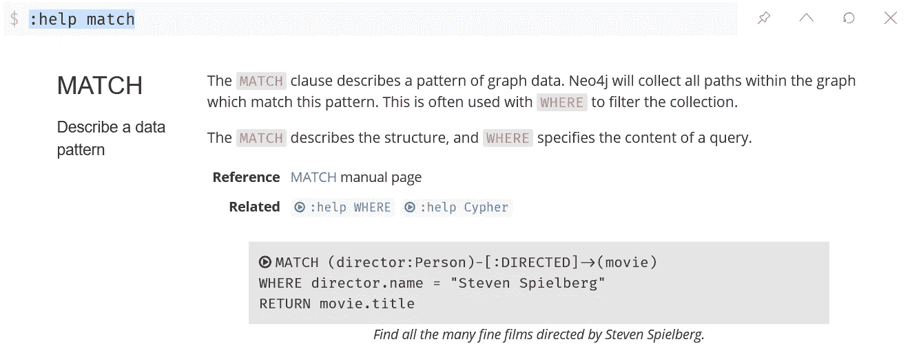

作者图片

您甚至可以按如下方式调用它来显示可用子句的列表:

```
:help cypher
```

以下界面将显示在您的 Neo4j 浏览器上。

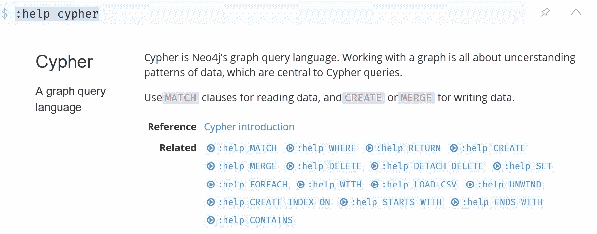

作者图片

# 4.结论

让我们回顾一下今天所学的内容。

我们从简单解释图形数据库及其背后的概念开始。

然后，我们继续安装 OpenJDK 11 并下载主要的 Neo4j 文件。我们将它提取到一个文件夹中，并作为控制台应用程序或后台服务正常运行。

完成后，我们在浏览器中访问 Neo4j 浏览器控制台。我们了解了用户界面、配置以及一些内置文档。

最后，我们使用了 Cypher，Neo4j 中使用的图形查询语言。我们使用`MATCH`、`CREATE`和`MERGE`子句测试了对现有数据库的读写数据。

感谢你阅读这篇文章。希望在下一篇文章中再见到你！

# 参考

1.  [Neo4j 图形平台](https://neo4j.com/)
2.  [AdoptOpenJDK 最新发布](https://adoptopenjdk.net/releases.html?variant=openjdk8&jvmVariant=hotspot#x64_win)