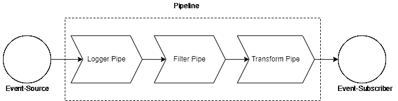

# 中管道体系结构的最佳方法。网

> 原文：<https://betterprogramming.pub/the-best-approach-for-a-pipeline-architecture-in-net-d0ad0332ea24>

## 用最少的代码创建一个干净的管道

照片由[西格蒙德](https://unsplash.com/@sigmund?utm_source=medium&utm_medium=referral)在 [Unsplash](https://unsplash.com?utm_source=medium&utm_medium=referral) 拍摄

在我最近的项目中，我面临了一个相当简单的挑战，就是将 Azure Blob 存储中的数据与本地文件存储同步。然而，在同步时，应该对 blob 或文件的元数据应用若干过滤和转换，例如，通过特定位置过滤，将文件的路径转换为 blob 路径等

在我的白板上画出数据流后，我很快意识到，过滤和转换只是简单的链式操作，就像流水线一样。我决定使用管道和过滤器模式作为架构的应用程序逻辑部分，但是在。网？

# 要求

带有源和订户的管道草图

我们想要完成的是将几项任务分解成一系列逻辑步骤。此外，我们的目标是在每个单独的步骤中遵循单一责任原则。一个步骤应该只关注一件事。如果我们需要另一件东西，我们只需在中间增加一个步骤。同样非常需要的是，通过依赖注入使管道可注入，同时还保持可配置性。

综上所述，我们要完成以下要求:

*   一种按照逻辑顺序快速设置管道的方法。
*   可以用依赖注入来构造管道。
*   管道应该是可配置的。
*   管道应该将一个事件流作为输入，输出另一个事件流。事件类型可能因此而改变。

## 方法

在我的研究中，我发现了许多在。然而，在我看来，它们都太复杂，不够灵活。这就是为什么我决定重新创造这种建筑风格。NET，使用[反应式扩展](https://github.com/dotnet/reactive)使它更加干净和直观。

根据我的经验，处理事件流的最佳方法是[反应式扩展](https://github.com/dotnet/reactive)。Reactive Extensions 是一个库，它使您能够用类似 LINQ 的操作符处理异步数据流。这是使用观察者模式实现的。

简单来说，你有一个`IObservable<T>`，它发出数据/事件。然后，您可以像使用 LINQ 的`IEnumerable<T>`一样处理这些数据，对其进行过滤、转换等等，之后数据到达名为`IObserver<T>`的订户，他订阅流并处理结果。

单单反应式扩展库就足以满足我们一半的需求。我们可以设置一个事件源，一个管道，它过滤和转换数据，最后设置一个订户来处理事件。

然而，我们仍然缺少使用依赖注入的能力，我个人认为，在一个大的`Reactive.Linq`链中，很难在一个类中实现单一的职责。

如果你还没有和 Rx.Net 合作过，我强烈推荐你去看看李·坎贝尔的以下教程:

 [## 欢迎

### 编辑描述

introtorx.com](http://introtorx.com/) 

# 具有 IObservable 的流水线结构

首先，我们需要一个接口，我们可以用它来声明一个管道。界面应该明确什么进什么出。我决定把它叫做`IPipe<TIn, TOut>`。这个管道必须包含一个方法，该方法将一个`IObservable<TIn>`作为输入并返回一个`IObservable<TOut>`。我们称之为`Handle()`。

这个管道的实例现在可以一个接一个地链接起来，同时是类型安全的。为了能够将多个管道链接在一起，最好有一个简单的扩展方法，而不是将那些`Handle()`调用一个嵌套在另一个中。这就是我们创建以下扩展方法的原因:

这样，我们可以一个管道接一个管道地进行链接，而不用在代码中深度嵌套我们的调用链。

具有单个源的示例管道

太好了！我们现在可以创建并链接单个负责的管道，从而创建一个相当干净的管道。然而，我们仍然缺少依赖注入部分。

为了能够从依赖注入创建管道，必须将管道和依赖项添加到阿迪容器中。问题就在这里:当一个管道是从一个全局 DI-Container 创建的时候，我们如何具体地配置和重用它呢？

看看这个过滤管的例子:

过滤管道的示例实现

为此，我们需要注入一个`ILogger`，它通常被添加到全局 DI-Container 中，以及一个特定的 Options-Instance，我们当然不希望它是全局可用的。为了实现这一点，我们需要每个管道有一个单独的 DI 容器，在这里我们为每个管道添加特定的配置。

我决定为这件事创建一个`IPipelineBuilder`。构建器应该有自己的 DI 容器，它是从全局容器派生出来的。在这个容器中，我们可以安全地为我们的管道添加选项。此外，我们将使用这个生成器以类型安全的方式设置管道本身。

IPipelineBuilder 的实现

`PipelineBuilder`有两种方法:`ConfigureOptions()`和`ConfigurePipeline()`。您可以使用第一种方法将您的特定管道选项添加到构建器的 DI 容器中，第二种方法用于将可观察管道链接在一起。

我的目标是，使管道的创建尽可能简单，需要尽可能少的参数。出于这个原因，我决定强制将 Source-Observable 添加到`IPipelineStepBuilder`中，因为这为我们节省了多个额外的泛型类型参数。

正如您所看到的，在添加一个源之后，您可以添加一个管道，处理`ChatMessage`。该步骤由`LoggerPipe`处理，并将`ChatMessage`返回到下一个管道。`MessageFilterPipe`也处理`ChatMessage`，只让符合特定标准的消息通过。`MessageTransformPipe`显示了一个转换是如何在一个管道中发生的，并返回另一个类型`IdentifiedChatMessage`。

另一个好处是，您可以决定要么向管道添加一个`IPipe<TIn,TOut>`实例，这不需要您添加通用参数，要么让它由构建器中的 DI 容器构建，遗憾的是，您必须指定管道的传出类型，因为这是无法推断的。

调用`Build()`后，会收到一个`IObservable<TOut>`，可以订阅。

剩下要做的唯一一件事，就是向一个类提供一个`IPipelineBuilder`的实例，这个类正在建立一个管道。为此，我们为`IServiceCollection`实现了一个扩展方法:

这使得 DI-Container 可用于 PipelineBuilder 进行克隆，并且还将构建器添加为临时服务，这总是会产生一个新的、干净的`IPipelineBuilder`实例。

# 结论

有了这些模块，我们能够最大限度地减少所需的代码，创建一个干净的管道。管道可以承载无限的管道，并且可以使用依赖注入以类型安全的方式构造。此外，我们能够添加特定的配置选项，以便我们可以托管多个管道，这些管道具有相同的管道，但具有不同的配置。

pipline 架构本身实施了一个更干净的代码，因为它非常清楚一步一步发生了什么。当您遵循单一责任原则并提供良好的命名时，在构建管道时，您将不会有任何问题，可以识别错误发生的位置，或者添加额外功能的位置。此外，通过在管道之间或管道末端添加额外的管道，扩展功能是非常容易的。

我相信这个功能对你的项目非常有用——以管道架构为特色——我决定把它作为一个包发布在 NuGet 上:

 [## 可观察管道 0.0.2

### 一个简单的。NET 包来实现一个具有可观察性和可注入管道的干净的管道架构。这个包裹是…

www.nuget.org](https://www.nuget.org/packages/ObservablePipelines/) 

您还可以在我的 GitHub 上找到源代码和展示:

 [## GitHub-TobiStr/observable pipelines。NET 包来实现一个干净的管道架构。

### 一个简单的。NET 包来实现一个具有可观察性和可注入管道的干净的管道架构。这个包裹是…

github.com](https://github.com/TobiStr/ObservablePipelines) 

感谢您花时间阅读这篇文章。我希望，你会觉得它有知识性、教育性和趣味性。非常感谢您的支持和参与。

如果您有兴趣了解干净架构、干净编码和最新技术栈的最新趋势、技巧和诀窍，尤其是在 C#环境中。净和有棱角——如果你考虑跟踪我，我会很感激。

祝你有美好的一天！

如果你还没有每天使用媒体来增长你的知识，现在是开始的最佳时机！借助 Medium，您可以轻松获得更多关于高度专业的主题的知识，发布高质量的内容，并接触到更广泛的受众。要开始，只需使用以下链接创建一个中型帐户:

[*现在加入中等*](https://medium.com/@tobias.streng/membership)

通过这样做，你将获得一个强大的平台，可以帮助你联系新的作者和读者，每天学习新的东西。