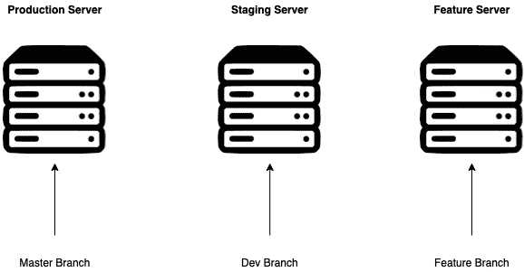
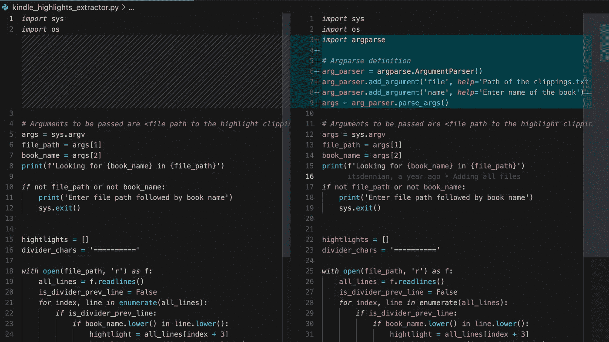
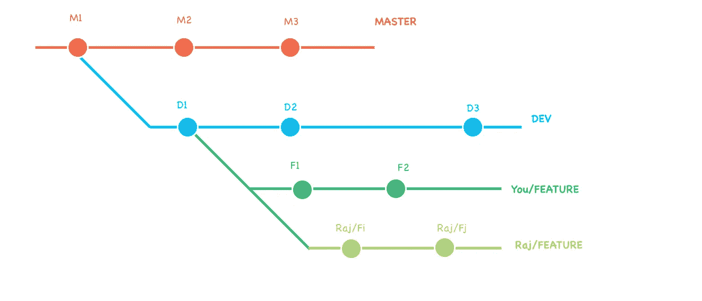
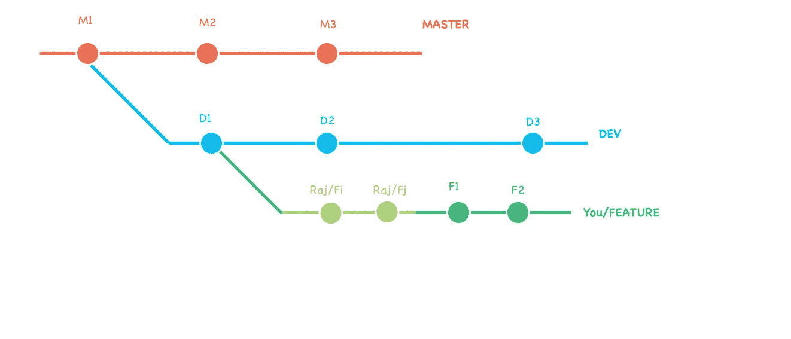
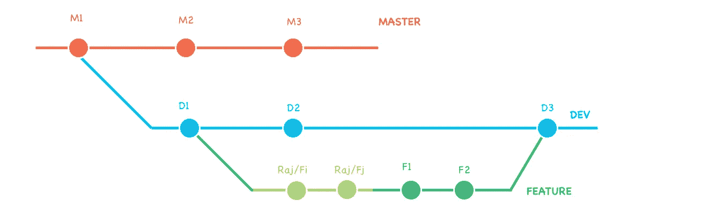
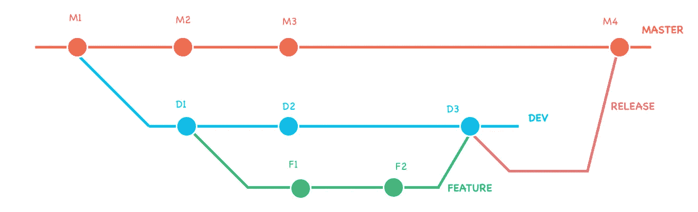
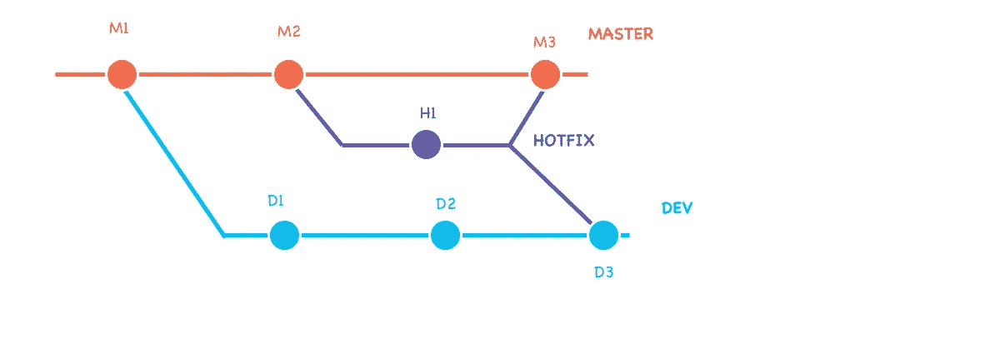

# 软件工程团队的最佳 Git 工作流程

> 原文：<https://betterprogramming.pub/the-best-git-workflow-for-your-software-engineering-team-6cfec81d4d78>

## 使用 git 应该不难吧？


由 [Roman Synkevych](https://unsplash.com/@synkevych?utm_source=unsplash&utm_medium=referral&utm_content=creditCopyText) 在 [Unsplash](https://unsplash.com/s/photos/git?utm_source=unsplash&utm_medium=referral&utm_content=creditCopyText) 上拍摄

开发者对 Git 又爱又恨。Git 可能是开发人员生活中无处不在的东西之一。然而，当我们作为一个整体开始时，我们并不真正关心这个问题。

其他一些我们认为理所当然但也很重要的事情是:

1.  Bash 脚本
2.  记录您的软件

我将在接下来的文章中讨论这两个主题。关于 Git 有很多误解。我想在另一期上写他们。如果你想听，请通过评论告诉我。

今天我们来讨论一下我最喜欢的 Git 工作流。

# TLDR

1.  我遵循的工作流程类似于 [Gitflow 工作流程](https://www.atlassian.com/git/tutorials/comparing-workflows/gitflow-workflow)。
2.  为生产创建`master`分支，为试运行创建`dev`分支，为个别特性创建`feature`分支。
3.  当你必须将另一个队友的更改整合到你的分支中时，你可以使用 [git-rebase](https://git-scm.com/docs/git-rebase) 命令。但是这有点危险，所以要小心使用。
4.  `release`分支用于将一堆变更合并到`master`分支。
5.  `hotfix`分支用于修复生产服务器中的问题。

# 那么，什么是 Git 工作流呢？

Git 工作流是您在使用 Git 时遵循的策略。

一个单独的开发人员的 Git 工作流程可以简单到处理一个分支，提交给它，并把它作为唯一的事实来源。

但是对于一个团队，我们需要一个合适的分支策略。否则你同事的提交可能会被你的覆盖(这是无数可能发生的危险之一)。

这篇文章是为那些想了解这个策略的人写的

# 一些不常用的 Git 命令

有很多很好的指南描述 Git 的基本命令，比如[和](https://www.freecodecamp.org/news/learn-the-basics-of-git-in-under-10-minutes-da548267cc91/)，所以我不会深究。但是让我向您介绍几个鲜为人知的命令

`git-switch and git-restore`:

大家都很熟悉`git-checkout`。目前，`git-checkout`处理两件事情

1.  将索引(或其他来源)中的文件内容恢复到工作树中
2.  切换分支

但是几年前，git 工程师意识到一个命令处理两个完全不同的函数可能会令人困惑，所以他们把它分成两个独立的命令

a.`[git-switch](https://git-scm.com/docs/git-switch)`:处理分支切换

```
git switch <branch-name>
```

b.`[git-restore](https://git-scm.com/docs/git-restore)`:处理工作树文件的恢复

```
git restore <file-path>
```

此更新是 git 2.23 版本的一部分。相同的发行说明可在[这里](https://github.com/git/git/blob/master/Documentation/RelNotes/2.23.0.txt)找到:

`git-rebase`:

这被认为是一个危险的命令。但它在某些情况下非常有用。该命令用于将提交从一个分支应用到另一个分支。

> ***【⚠️】一句忠告*** *:不要使用这个命令来改变任何公共分支上的历史。*
> 
> 你可以和没有远程跟踪分支机构的当地分支机构打交道。但是如果你改变了其他开发者使用的公共分支的历史，那将会导致很多混乱。

我将演示如何在我自己的工作流程中使用它。

# 我的 Git 工作流



你的工作流程主要取决于你的公司有多少种服务器。

许多公司遵循以下配置:

1.  **生产服务器**，面向客户的公共服务器。在临时服务器上进行严格测试后，部署到该服务器上。
2.  **暂存服务器**，在向公众发布之前，由团队成员进行测试。
3.  **特性测试服务器**(通常为每一个特性而启动)，在新特性被推送到登台服务器之前，由个体开发人员对其进行测试。

理想的设置是每种服务器类型都有一个专用的分支

这意味着:

1.  主分支→用于生产服务器
2.  开发/临时分支→用于临时服务器
3.  功能分支→用于功能测试服务器

我们公司遵循的工作流程&我将在这里展示的是与流行的 [Gitflow 工作流程](https://www.atlassian.com/git/tutorials/comparing-workflows/gitflow-workflow)密切相关的。

> 当谈到比较 git 的变化时，我并不是终端的超级粉丝。
> 
> 我宁愿在我的 VS 代码编辑器上查看修改，在那里我可以有效地比较修改前后的效果。
> 
> *看看下面我的 VS 代码编辑器的截图，显示了一些变化。*



图形方式看变化更直观！

我的 git 工作流由各种分支和附加到这些分支的某些规则组成。

# 💪🏼主分支

这是主要的分支，将被认为是真理的唯一来源。

对此分支所做的更改将部署到生产服务器上。

您不应该直接对这个分支进行任何更改。创建任何分支来创建特性也是被禁止的，除非它是一个产品 bug(在这种情况下，您将创建热修复分支，我将在下面详细解释)。


`*master branch with 3 commits*`

# 🤙🏼发展处

一旦你建立了`master`分支，你应该从中派生出一个`dev`分支。

该分支用于在部署到生产环境之前测试所有功能。对此分支的更改被部署到临时服务器并进行测试。


`*dev branch merged out of master at the M1 commit (first commit on master) & having it’s own commits*`

# 🖖🏼特征分支

每个功能都有一个单独的分支。

特征分支从`dev`分支分出，在特征完成后合并回`dev`分支。

为了更好地识别，可以根据特征来命名特征分支。

让我们取一个特性，为它建立一个分支。


这里，您分支出一个`feature`分支，并在其上创建了两个提交，`F1` & `F2`

现在假设，您的同事 Raj 也在研究同一个特性，他在他的本地特性分支上创建了 2 个提交。



嗯，越来越棘手了。在推送到 dev 分支之前，如何将他的变更集成到您的分支中？

这里是我们使用上面提到的`git-rebase`命令的地方。在某种程度上，您是在他的分支上重新设置您的更改，以便特性分支处于一个提交的线性结构中(注意，您和 Raj 的分支具有相同的名称，而远程只包含一个同名的分支)。

在您这边，您将输入命令

```
git rebase <Raj's branch>
```

让我们看看我们的树枝现在是什么样子。



您的提交已被“附加”到他的提交中。现在你既有你的改变也有拉吉的改变。

> *请注意，由于您没有编辑任何主要分支，因此以这种方式重新设定基准是可以的。至于 Raj，他可以从* `*feature*` *分支获得拉力，只要你把它推到远程，他也可以看到你的提交。*

我们使用`rebase`命令而不是 git 的`merge`命令的原因是为了有一个线性的、简单的 git 分支，这是使用 merge 无法实现的。

是时候将`feature`合并回`dev`了，通过`feature`分支中的变化创建一个`D3`提交。



`*Merging feature into dev creating a D3 commit with changes of feature*`

# 🤘🏼释放分支

一旦足够的特性被部署到临时服务器并经过测试，您就可以通过首先合并`dev`到`master`分支的变更来将它们部署到生产服务器。

为了合并到`master`中，你创建一个`release`分支，在`dev`分支之外。这个分支将合并成`master`。

之后，您可以将`release`分支合并到`dev`中。



`*release branch merged into master creating M4 commit*`

# 🔥修补程序分支

当您的产品服务器中出现问题时，没有足够的时间从`dev`中分支出来，将其合并回去，创建一个发布分支，等等。

最简单的方法是执行以下操作:

1.  从`master`分支出一个`hotfix`分支
2.  对其进行必要的更改
3.  将`hotfix`分支合并回`master`
4.  合并同到`dev`分公司

类似这样的东西



# 一些需要遵守的礼仪

当您在协作环境中工作时，您需要在使用 Git 时遵循一些礼仪。

1.  **每一个合并到公共分支机构的都要进行审核。**每当你试图合并到`dev`分支或主分支时，创建一个拉请求，让你的队友知道你想合并你的一些变更。这将有助于他们采用最新的代码。
2.  **不要乱分支的历史。Git 提交是不可变的。但是 git 中有一些命令可以使用以前的提交来创建提交，使它看起来像是恢复到了以前的提交。这可能会导致其他团队成员的工作代码出现问题。只有在绝对必要的情况下才这样做。此外，在你这样做之后，遵循提示 1。**

```
**Want to Connect?**[Software Engineering Weekly](https://softwareengineeringwk.substack.com/) is my weekly newsletter where I publish similar articles to make your software engineering journey easy. Subscribe to it for more!
```