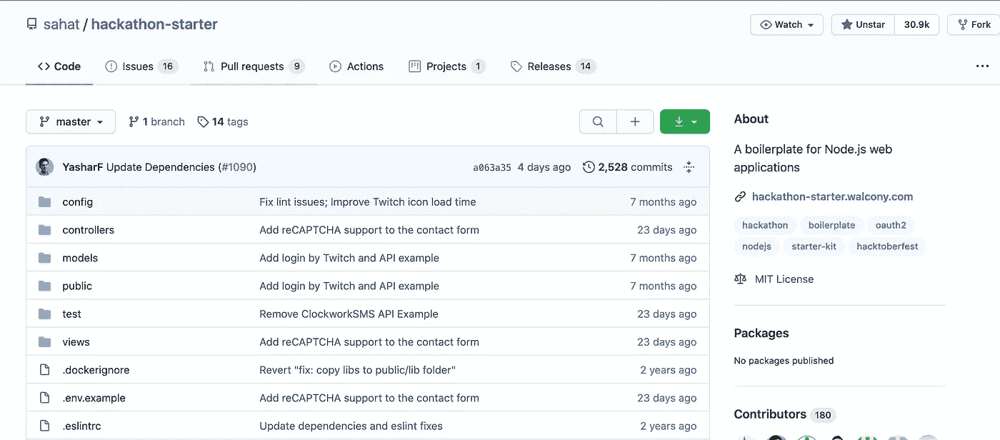
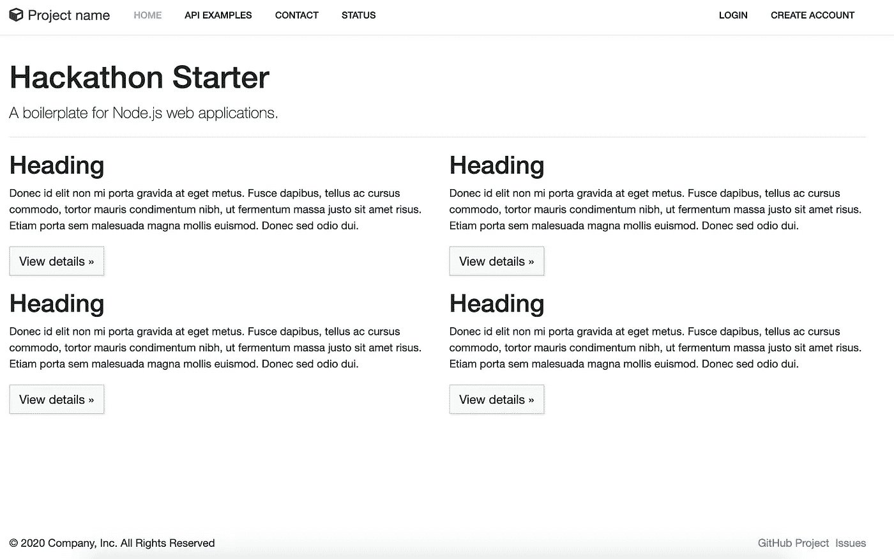
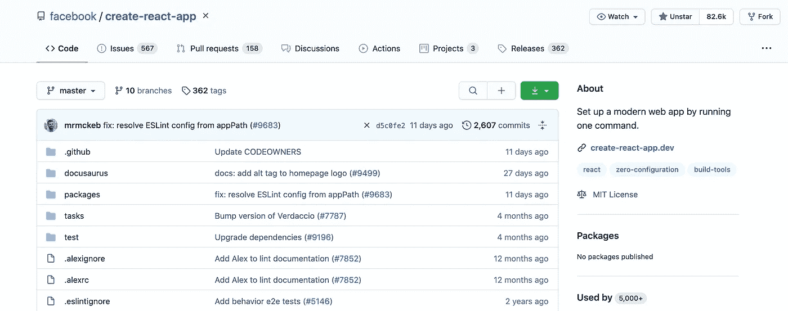
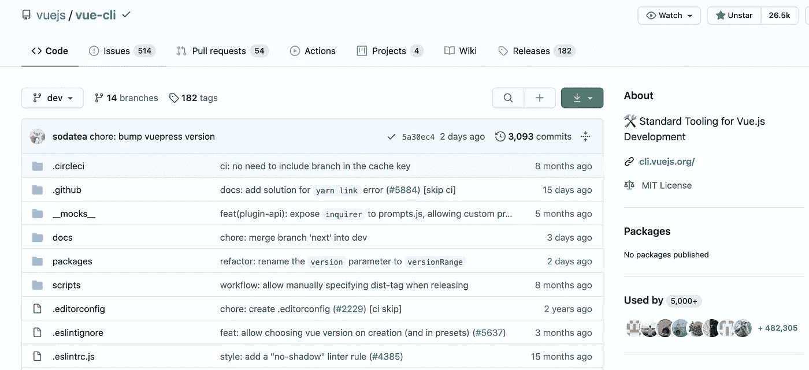
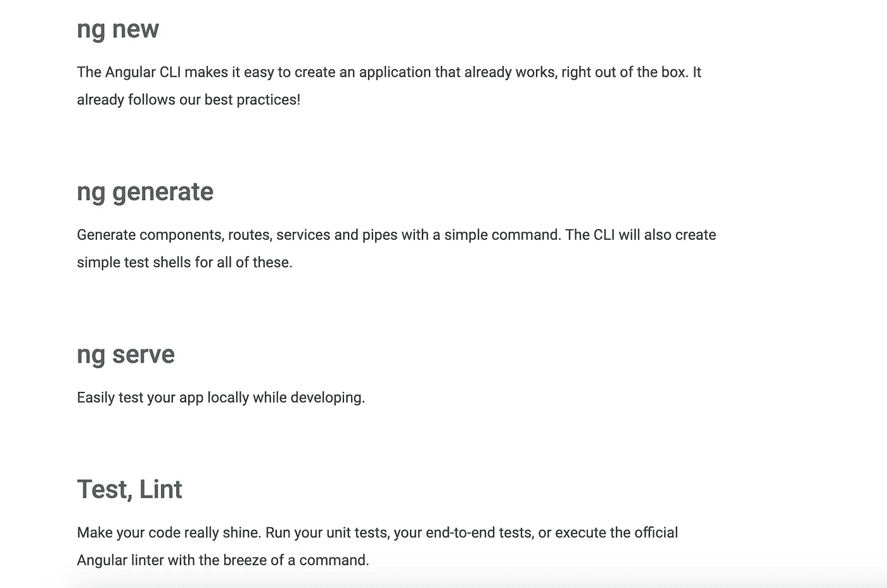

# 下一个项目的最佳 JavaScript 初学者工具包

> 原文：<https://betterprogramming.pub/the-best-javascript-starter-kits-for-your-next-project-c83439a4fb08>

## 节省时间，减少每次开始新项目时必须编写的样板文件的数量


在 [Unsplash](https://unsplash.com?utm_source=medium&utm_medium=referral) 上 [Tekton](https://unsplash.com/@tekton_tools?utm_source=medium&utm_medium=referral) 拍摄的照片。

初学者工具包，也称为代码模板，有助于加快项目的开发。通过自动化日常任务节省的时间越多，开发周期就越有效率和生产力。

简而言之，初学者工具包通常是某种形式的预先存在的代码，您可以将其用作新项目的发射台。想要 ORM 吗？你猜对了。想要包括用户认证吗？没问题。

与其花几个小时来建立一个新项目，不如用这些时间来构建实际上最重要的特性。

事不宜迟，这里有一个您今天就可以开始使用的初学者工具包列表。

*注意:该列表包括 JavaScript 相关的初学者工具包。*

# 黑客马拉松启动程序

> “如果你过去参加过任何黑客马拉松，那么你就会知道启动一个项目需要多少时间:决定构建什么，选择一种编程语言，选择一个 web 框架，选择一个 CSS 框架。一段时间后，你可能在 GitHub 上有了一个初始项目，只有那时其他团队成员才能开始贡献。或者做一些简单的事情怎么样，比如用脸书认证进行*登录？如果你不熟悉 OAuth 2.0 的工作方式，你可以花上几个小时。”— [黑客马拉松启动者](https://github.com/sahat/hackathon-starter)*



图片来自 [GitHub](https://github.com/sahat/hackathon-starter) 。

## 现场演示

这是初学者工具包中包含的内容的现场演示。查看一下，点击一下，发现开箱即用的所有功能。



[现场演示](https://hackathon-starter.walcony.com/)。

# pwa-启动器

渐进式 web 应用程序是一种新技术，它使您能够使用标准 web 技术(如 JavaScript、HTML 和 CSS)构建自然的应用程序。

> “希望构建一个新的[渐进式 Web 应用程序](https://medium.com/better-programming/everything-you-need-to-know-about-pwas-8e41a7e745aa)，但不确定从哪里开始？
> 
> 这就是你要找的！PWA-starter 包括开始构建生产就绪的 PWA 所需的一切，并遵循所有最佳实践。”— [pwa-starter](https://github.com/pwa-builder/pwa-starter)


图片来自 [GitHub](https://github.com/pwa-builder/pwa-starter) 。

如果你不太清楚什么是渐进式网络应用程序(PWA ),我可以帮你搞定。阅读本文，了解更多关于 pwa 及其工作方式的信息。

# 创建 React 应用

Create React App (CRA)是新 React 项目的行业标准官方启动平台。我认识的几乎每个人都在使用它，并且非常积极地维护它。



图片来自 [GitHub](https://github.com/facebook/create-react-app) 。

## 入门指南

```
npx create-react-app my-appcd my-appnpm start
```

> “如果您之前已经通过`npm install -g create-react-app`全局安装了`create-react-app`，我们建议您使用`npm uninstall -g create-react-app`或`yarn global remove create-react-app`卸载该软件包，以确保 npx 始终使用最新版本。”— [创建 React 应用程序](https://github.com/facebook/create-react-app)

查看[官方文档](https://create-react-app.dev/)并学习如何使用 Create React App 开发应用程序。

# 谷歌网络初学者工具包

> [“Web Starter Kit](https://developers.google.com/web/tools/starter-kit/)是一个固执己见的 Web 开发样板。用于在多种设备上构建卓越体验的工具以及[面向性能的](https://github.com/google/web-starter-kit#web-performance)。遵循谷歌[网络基础](https://developers.google.com/web/fundamentals/)中概述的最佳实践，帮助你保持高效。专业人士和行业新人的坚实起点。”— [网络入门套件](https://github.com/google/web-starter-kit)


图片来自 [GitHub](https://github.com/google/web-starter-kit) 。

这个库对于理解我们用于精益和渐进式网站和应用程序的基础技术非常有用。

# Vue CLI

> “你可以用一个带有`vue serve`和`vue build`命令的`*.vue`文件快速制作原型，但是它们需要一个全局插件和 Vue CLI 一起安装。”— [Vue 的官方文件](https://cli.vuejs.org/guide/prototyping.html)



图片来自 [GitHub](https://github.com/vuejs/vue-cli) 。

## 装置

```
npm install -g @vue/cli @vue/cli-service-global
# or
yarn global add @vue/cli @vue/cli-service-global
```

## Vue 创建

要创建新项目，请运行:

```
vue create hello-world
```

# 角度 CLI

> “Angular CLI 可以轻松创建现成可用的应用程序。它已经遵循了我们的最佳实践！”— [Angular CLI 官网](https://cli.angular.io/)
> 
> “Angular CLI 创建、管理、构建和测试您的 Angular 项目。它建立在 Angular DevKit 之上。”—[GitHub 上的 Angular CLI](https://github.com/angular/angular-cli)


图片来自 [GitHub](https://github.com/angular/angular-cli) 。



照片来自 [Angular CLI](https://cli.angular.io/) 。

## 装置

```
npm install -g @angular/cli new my-dream-appcd my-dream-appng serve
```

# 结论

感谢阅读！我希望您获得了新的、高效的工具，可以将其添加到您的工具箱中。编码快乐！