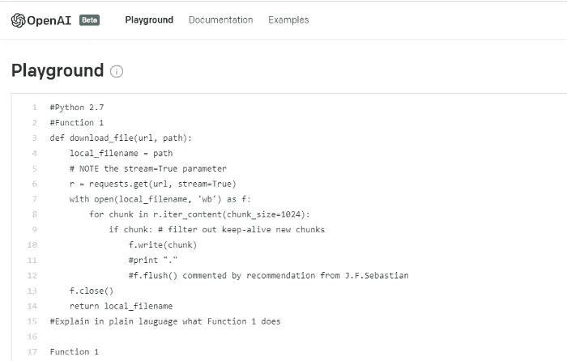
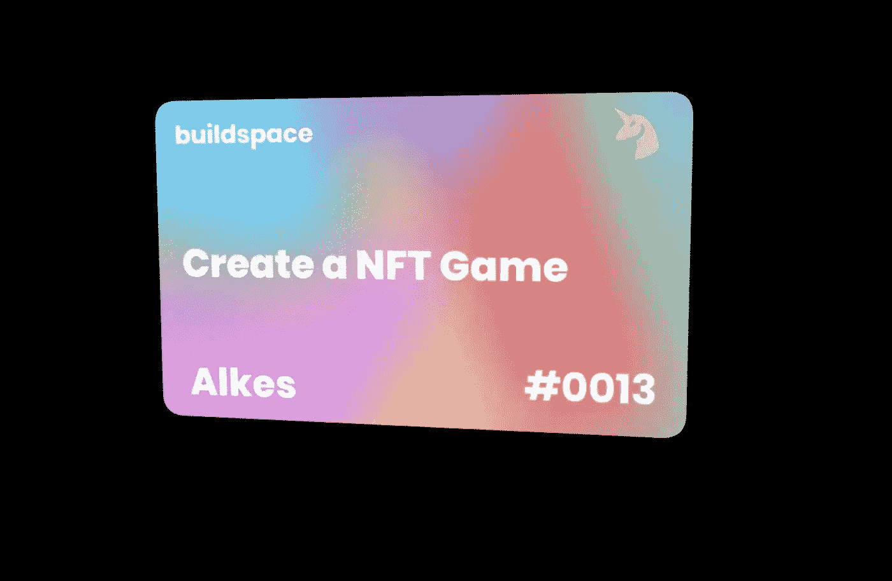
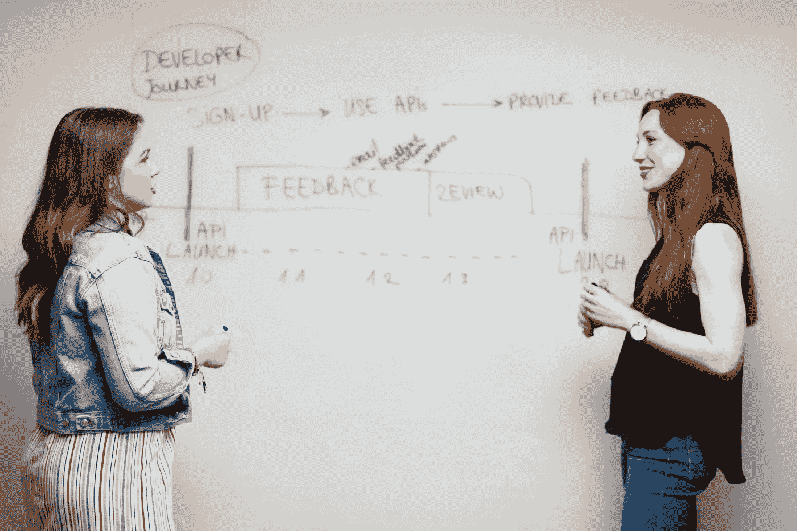
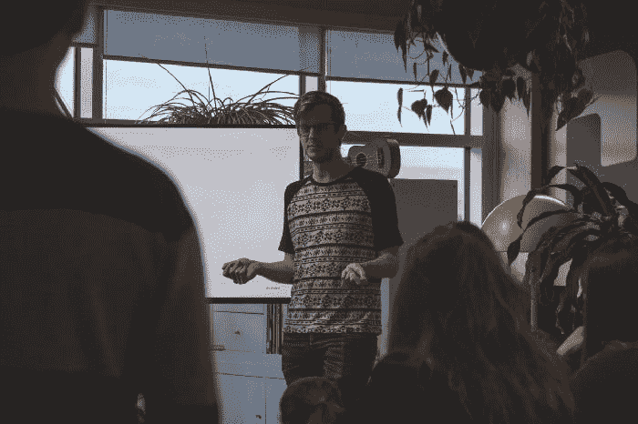

# 2021 年最佳节目

> 原文：<https://betterprogramming.pub/the-best-of-better-programming-from-2021-c14193a5eae6>

## 过去一年中我们最喜欢的 10 本书

嘿大家好，

我们希望你的新年有一个好的开始。在我们 2022 年的第一期时事通讯中，我们收集了 10 个 2021 年的故事，读者会非常喜欢。

事不宜迟，以下是我们去年最喜欢的精选——排名不分先后。

## [我测试了 OpenAI 的 Codex，结果令人毛骨悚然](/i-beta-tested-openais-codex-and-the-results-are-spooky-good-e282a1874c79)

作者供图

[Thomas Smith](https://medium.com/u/d00bc5bb7954?source=post_page-----c14193a5eae6--------------------------------) 被邀请在 Codex 工具发布一周后对其进行测试。他在这篇振奋人心的文章中分享了他的发现:

> Codex 还成功解决了来自 Hacker Rank 的一个更复杂的挑战，其中涉及编写两个正则表达式来验证邮政编码，Hacker Rank 表示这对人类程序员来说“很难”。

## [用 Solidity，Web3，Vue.js](/create-a-blockchain-game-with-solidity-web3-and-vue-js-c75eed4b49a6) 创建一个区块链游戏

作者图片

在这个实践教程中，Zouheir Layine 向我们展示了如何使用以太坊区块链构建一个分散式游戏。

## [在编码面试中回答技术问题的逐步指南](/the-step-by-step-guide-to-answering-a-technical-question-in-a-coding-interview-37928490d4e2)

照片由[this is 工程](https://www.pexels.com/@thisisengineering?utm_content=attributionCopyText&utm_medium=referral&utm_source=pexels)从[像素](https://www.pexels.com/photo/photo-of-women-talking-beside-whiteboard-3861952/?utm_content=attributionCopyText&utm_medium=referral&utm_source=pexels)拍摄

回答技术面试问题需要一个有效的计划？ [Megan Chang](https://medium.com/u/7a6e814190e5?source=post_page-----c14193a5eae6--------------------------------) 撰写了一篇关于如何使用 REACTO(重复、举例、方法、编码、测试和优化)方法回答问题的深度指南。

## [让 SwiftUI 预览为您服务](/making-swiftui-previews-work-for-you-6e54f46afbf)

作者图片

从可以直接复制到 SwiftUI 项目中的视图构建器，到为使用数据库中保存的数据(如 Realm 或 Core Data)的视图编写预览， [Andrew Morgan](https://medium.com/u/c1a6e3441e1a?source=post_page-----c14193a5eae6--------------------------------) 向我们介绍了一些鲜为人知的技巧，让 SwiftUI 预览成为一种乐趣。

## [在软件领域，当一个工程师离开团队时](/in-software-when-an-engineer-exits-the-team-1e550303cff8)

照片:Unsplash 上的 Eutah Mizushima

> 一旦这个人离开，团队自然不喜欢真空。其他人也有机会。他们站起来伸展身体。没有人是不可替代的，也没有人是一座孤岛。但是知识丢失了，声望消失了，这是一个支点，现在，这个新团队。

由[道格·阿库里](https://medium.com/u/a6199784ecae?source=post_page-----c14193a5eae6--------------------------------)

## [AWS kine sis vs . SNS vs . SQS——与 Python 示例的比较](/aws-kinesis-vs-sns-vs-sqs-a-comparison-with-python-examples-6fc688bfd244)

Wil Stewart 在 [Unsplash](https://unsplash.com/?utm_source=medium&utm_medium=referral) 上拍摄的照片

在本文中， [Anna Geller](https://medium.com/u/5bdf5a3385cd?source=post_page-----c14193a5eae6--------------------------------) 展示了 SNS、SQS 和 Kinesis 数据流之间的差异，这三种 AWS 服务可以帮助您选择适合您工作的 apt 解耦服务。

## [作为产品工程问题的技术债务](https://medium.com/better-programming/technical-debt-as-a-product-engineering-issue-2d805ab49e8c)

照片由[埃胡德·纽豪斯](https://unsplash.com/@paramir?utm_source=unsplash&utm_medium=referral&utm_content=creditCopyText)在 [Unsplash](https://unsplash.com/?utm_source=unsplash&utm_medium=referral&utm_content=creditCopyText) 上拍摄

> 技术债是过去写的代码不适合满足今天的需求。如果未来环境发生变化，即使是高质量的代码也可能成为技术债务。它是任何产品的一部分，不能保证我们可以完全避免它。

安德烈亚·杜洛维奇

## [并非所有智能合同都是不可变的——创建可升级的智能合同](/not-all-smart-contracts-are-immutable-create-upgradable-smart-contracts-e4e933b7b8a9)

照片由 [Cytonn 摄影](https://unsplash.com/@cytonn_photography?utm_source=medium&utm_medium=referral)在 [Unsplash](https://unsplash.com/?utm_source=medium&utm_medium=referral) 上拍摄

您可能需要升级智能合约来修复错误或添加新功能。 [Patrick Collins](https://medium.com/u/589c510eb216?source=post_page-----c14193a5eae6--------------------------------) 重点介绍了升级智能合约的三种主要方法:“非真正升级方法”、“社交 Yeet/迁移方法”和“代理”。

## [深入了解 GitHub Copilot](/ai-review-github-copilot-d43afde51a5a)

[Florian Olivo](https://unsplash.com/@florianolv?utm_source=medium&utm_medium=referral) 在 [Unsplash](https://unsplash.com/?utm_source=medium&utm_medium=referral) 上拍摄的照片

GitHub Copilot 在过去的一年里一直是人们谈论的焦点。在这篇文章中， [Aidan Tilgner](https://medium.com/u/375f469e54e7?source=post_page-----c14193a5eae6--------------------------------) 向我们展示了人工智能工具在创建不同类型的功能和构建应用程序时的表现。

## [面试首席软件工程师时要避免的 6 个错误](/6-mistakes-to-avoid-while-interviewing-lead-software-engineers-dd34d90baf71)

照片由[西格蒙德](https://unsplash.com/@sigmund?utm_source=medium&utm_medium=referral)在 [Unsplash](https://unsplash.com/?utm_source=medium&utm_medium=referral) 拍摄

> 一个工程师与其他人的区别在于他们对指导、训练和提升周围人的关注和意愿。询问候选人如何促进其同事的成长，有助于了解候选人是否感激/愿意为他人的生活带来价值，提升他们和整个组织。

罗伯特·科纳斯基

这星期到此为止！感谢阅读。直到下一次，

[Anupam](https://medium.com/u/9833cc01f515?source=post_page-----c14193a5eae6--------------------------------) 和更好的编程团队。