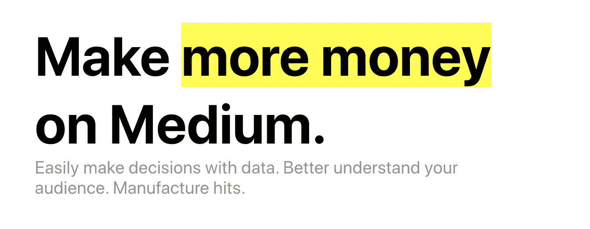

# 最佳节目(2020 年 10 月 10 日至 16 日)

> 原文：<https://betterprogramming.pub/the-best-of-better-programming-october-10-16-2020-c4c28cd64ba6>

## 过去两周我们发表的最好的东西！(双重发行)

**本周由**[**【money ball for Medium】**](https://usemoneyball.com/)**为您带来的最佳编程，这是我们的团队为跨越媒介的作家打造的一个分析平台！**

在 3 天免费试用后，Moneyball for Medium 每月收费 10 美元。

[**今天报名公测！**](https://docs.google.com/forms/d/e/1FAIpQLSeOq5o2OluLKygoLWZo0WlKjUeNdKDTOB5GTVofkVBgnnU95A/viewform)

*感谢上周注册测试版的许多人！我们继续每周增加更多的用户到测试版。*

我想上周出了点小问题，时事通讯没有发出来。我把上周的链接作为第二份简讯放在了本周十大新闻下面。

事不宜迟，以下是本周十大新闻:

1.  [面向软件专业人员的现代架构设计模式](https://medium.com/better-programming/modern-day-architecture-design-patterns-for-software-professionals-9056ee1ed977)作者[Tanmay desh pande](https://medium.com/@tanmay.avinash.deshpande)——这篇关于微服务架构的文章彻底颠覆了我们本周发表的其他文章。它曾一度登上黑客新闻的榜首，并收到了不少评论。对微服务以及如何最好地设计微服务感到好奇？读一读这篇文章。
2.  [我如何在 6 个月内让自己成为一名更有价值的程序员(你也可以这样做)](https://medium.com/better-programming/how-i-made-myself-a-more-valuable-programmer-in-6-months-and-how-you-can-too-97f3323f9035)作者[扎卡里·迈诺特](https://medium.com/@zack_minott)——我最喜欢的建议是“学会控制你的时间”在一个不断分心的世界里，时间管理可能是最难培养的技能之一。扎卡里有一些很好的建议。
3.  [我的 2020 年顶级自制软件包(第二部分)](https://medium.com/better-programming/my-top-homebrew-packages-for-2020-part-2-8fbe66949701)作者[Jovan Hernandez](https://medium.com/@jovanshernandez)——Jovan 继他成功的第一部分之后，又推出了另一个很棒的自制软件包清单。
4.  [我们丢掉了为他人工作的工程师的权力](https://medium.com/better-programming/we-throw-away-our-power-as-engineers-working-for-other-people-8aeb36fca691)作者[Zack Shapiro](https://medium.com/@zackshapiro)——这是我在一年半的时间里写的第一篇关于运行更好的编程的文章，不是与出版物相关的 how to。在这篇文章中，我探讨了做后空翻如何像创办一家公司，你为之工作的首席执行官们如何真的*没那么特别，以及(最重要的)你如何能收回自己的权力。*
5.  [以一种新的方式理解 RxJava](https://medium.com/better-programming/understand-rxjava-in-a-new-way-3f43f2696c8c)作者[Anas Altair](https://medium.com/@anasaltair)——Anas 有一些关于 rx Java 的有用提示，以及如何用它做得更好。
6.  [现在是开始量子计算的最佳时机的 4 个理由](https://medium.com/better-programming/4-reasons-why-now-is-the-best-time-to-start-with-quantum-computing-753437487ef4)Sara a . Metwalli[——我对量子计算很着迷。Sara 本周写了一篇关于如何在一个新兴领域起步的文章。](https://saraametwalli.medium.com)
7.  [使用 React 和 React-Chrono](https://medium.com/better-programming/build-a-timeline-component-with-react-and-react-chrono-fb1b962b020e) 构建一个时间线组件[ind rek Lasn](https://medium.com/@indreklasn)——向用户展示应用程序中发生的事情的顺序总是很好，无论是关于制作和交付的食品订单还是正在完成的定制订单，我们的大脑喜欢组织，还有什么比时间线更好的呢？
8.  [处理碎片反压的新方法](https://medium.com/better-programming/a-new-way-to-handle-back-press-in-fragments-8a67cdcda75e)作者[西瓦·甘内什·坎塔马尼](https://medium.com/@sgkantamani)——西瓦在安卓碎片上检查`OnBackPressedDispatcher`。
9.  [由](https://medium.com/better-programming/the-dos-and-don-ts-of-python-list-comprehension-5cd0f5d18500)[崔永博士](https://medium.com/@yong.cui01)撰写的 Python 列表理解的“该做什么”和“不该做什么”——为您的 Python 项目提供更好的列表理解。让我们稍微清理一下代码。
10.  [如何在一个完全远程的世界中构建可扩展的现代网络应用](https://medium.com/better-programming/how-to-build-scalable-modern-web-apps-in-an-all-remote-world-e62b8710f957)作者[扎蒂斯](https://medium.com/@zartis_tech_blog)——最后，本周我们有一篇关于不在同一个办公室工作时如何大规模构建的文章，这是数百万开发者正在进行的调整。

这星期到此为止！祝你周末愉快，以防上周的没有发出来(我认为没有)，你可以在下面找到它。

嘿大家好！

我希望你度过了愉快的一周。似乎世界上的每个人都认为昨天是星期五，但是唉，我们在这里。

以下是本周表现最好的故事:

1.  [三本提高你的编码技能的书](https://medium.com/better-programming/3-books-to-improve-your-coding-skills-afa67621192)作者[Dmytro Khmelenko](https://medium.com/@d.khmelenko)——为了节省你的点击量，这三本书分别是罗伯特·塞奇威克的《算法》、史蒂夫·麦康奈尔的《代码全集》和尼尔·福特的《函数思维》。请阅读这篇文章，了解更多关于每一个方面的信息，以及为什么您应该考虑阅读它们。
2.  10 Side 作为一名软件工程师努力赚取额外的钱，作者是乔治·菲尔德，我将开始写一些关于更好的编程的个人内容:作为工程师，我们拥有巨大的力量，这种力量是人类历史上“工人”所没有的。我们不需要我们的工作和老板。我们可以比以前更容易地单干。乔治在这里为你提供了一些如何利用你的专业知识在工作时间之外赚钱的想法！
3.  [服务网格和 API 网关在微服务架构中的作用](https://medium.com/better-programming/the-roles-of-service-mesh-and-api-gateways-in-microservice-architecture-f6e7dfd61043)作者[tan may desh pande](https://medium.com/@tanmay.avinash.deshpande)—tan may 撰写了一些关于微服务和微服务架构的最佳文章。总是值得一读。
4.  [《我不够聪明，做不了程序员》](https://medium.com/better-programming/i-am-not-smart-enough-to-be-a-programmer-9a342480b635)作者[Szymon Adamiak](https://medium.com/@sadamiak)——我坚信任何人都可以学习编码。不，你不用学数学。我是自学的。我有新闻学学位。我从 21 岁开始在我的 iPad 上用一本 Rails 书籍编写代码。你可以做到，刚开始，持之以恒，坚持一门语言。
5.  [10 个令人困惑却又至关重要的 Swift 功能](https://medium.com/better-programming/10-confusing-but-crucial-swift-functions-f290dfaaf-f29080bdfaaf)由[杨梦](https://medium.com/@ericleiyang)–`sort`vs`sorted`、`reverse`vs`reversed`等等！
6.  [由](https://medium.com/better-programming/create-a-custom-navigation-view-in-swiftui-88e70c32ffed) [Sarah](https://medium.com/@sarah.h.alsharif) 在 SwiftUI 中创建自定义导航视图——Sarah 撰写了一些我们最好的 SwiftUI 和动画文章。这一个没有什么不同。如果你正在学习 SwiftUI 或者你对 SwiftUI 很好奇，看看这个吧。
7.  [为软件工程师编写代码的最佳实践](https://medium.com/better-programming/best-practices-when-documenting-your-code-for-software-engineers-941f0897aa0)Tanmay desh pande[Tanmay desh pande](https://medium.com/@tanmay.avinash.deshpande)—Tanmay 本周有两篇文章！写软件的时候文档是必须的恶。保持更新可能很难。记录你的决定也很难。以下是一些最佳实践。
8.  [迈克尔·博根](https://medium.com/better-programming/6-productivity-practices-for-developers-at-any-level-dc840b91557)针对任何级别开发人员的 6 种生产力实践——第五:倾听你的 IDE。作为初级工程师，我犯的一个最大的错误是忽略错误文本，去找高级工程师寻求帮助。工程师史蒂夫会告诉我去读错误。它通常有答案，如果没有答案，至少有从哪里开始的线索，要扫描的行号，*什么的。*错误信息是你的朋友。给你指路。
9.  Anupam Chugh 为开发者准备的 iOS 14 清单——anu PAM 本周回归，带来了你在为 iOS 14 推出应用之前应该考虑的一些事情。我知道 iOS 14 已经发布几周了，但这仍然是一份有价值的清单。
10.  [5 个被低估的 Python 库，将在你的下一个数据科学项目](https://medium.com/better-programming/5-underrated-python-libraries-to-use-in-your-next-data-science-project-4ae2a73c4728)中使用，作者[萨拉·a·梅特沃利](https://medium.com/@eng.sam92) — Modin、Transformers、Streamlit、LightGBM 和 Theano，另外还提到了 AutoScraper。很棒的清单，谢谢莎拉！

这就是这周的内容。注意安全，周末愉快。

**如果你在美国，别忘了在 11 月 3 日或之前投票！我们不在乎你投谁的票，就投吧。**

–[扎克·夏皮罗](http://twitter.com/zackshapiro)更好的编程团队