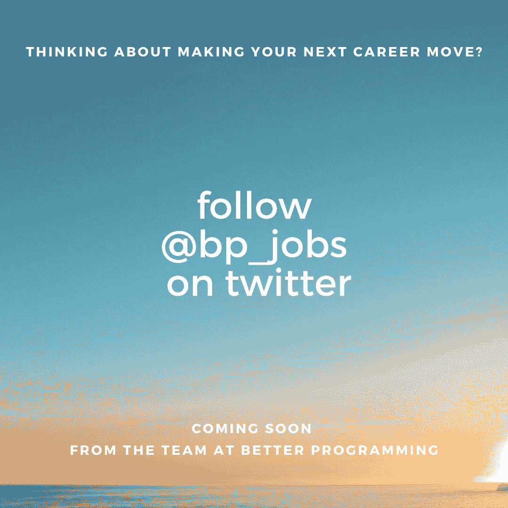

# 最佳节目(2020 年 10 月 17 日至 23 日)

> 原文：<https://betterprogramming.pub/the-best-of-better-programming-october-17-23-2020-eefbded7cd22>

## 我们本周出版的最好的东西

点击上图或[在此填写调查](https://forms.gle/o77bLWK1oE2jVC8b6) (3 分钟)

在我们本周开始之前，我们有两个项目需要你的帮助。

1.  填写我们上面的更好的节目观众调查。这将极大地帮助我们了解我们不断增长的受众，并在未来几个月改进我们的内容。
2.  我们很快将推出我们的工作板。在 Twitter 上关注 [@BP_Jobs](http://twitter.com/bp_jobs) ，看看并申请来自世界各地一些最好的创业公司和科技公司的令人兴奋的编程工作！

事不宜迟，以下是我们本周的最佳文章:

1.  [通过将副作用从逻辑中分离出来写出更好的 JavaScript](https://medium.com/better-programming/write-better-javascript-by-separating-side-effects-from-logic-b6f3f1d3ef4d)作者[伊克拉木·阿克塔什](https://medium.com/@ekremaktas)——伊克拉木向我们展示了三种将副作用从代码中的逻辑中分离出来的尝试，这是一种最佳实践，可以产生更多可测试的代码和更强的关注点分离。
2.  [5 大 MLOps 工具启动你的下一个机器学习模型](https://medium.com/better-programming/5-great-mlops-tools-to-launch-your-next-machine-learning-model-3e403d0c97d3)作者 [SeattleDataGuy](https://medium.com/@SeattleDataGuy) —机器学习文章爆了，SeattleDataGuy 在这里为你带来了 5 个有用的工具。
3.  [7 种让你的新 Python 技能更上一层楼的方法](https://medium.com/better-programming/7-ways-to-take-your-new-python-skills-to-the-next-level-1698335844bd)作者:[马丁·安德松·阿伯格](https://martinaaberge.medium.com)——从脚本到数据分析到网络应用等等，马丁列出了你可以拓展你的 Python 技能的方法，不管你的专业是什么。
4.  [5 个你可能不会经常使用的 Git 命令](https://medium.com/better-programming/5-git-commands-that-you-probably-arent-using-much-5da9a0b95399)作者[阿努帕姆·丘格](https://medium.com/@anupamchugh) — `git bisect`、`git cherry-pick`、`git add -p`如果你还没有在工作流程中使用它们，这 5 个命令只是其中的 3 个。
5.  [数据科学家如何在没有复杂 ETL 的情况下分析数据](https://medium.com/better-programming/how-to-analyze-data-without-complicated-etls-for-data-scientists-ffb818208618)作者[SeattleDataGuy](https://medium.com/@SeattleDataGuy)—SeattleDataGuy 本周有两篇文章，介绍了使用数据虚拟化、自动化 ETL 和无代码/低代码解决方案分析数据的不同方法。
6.  [如果你想成为一名更好的程序员…停止编程](https://medium.com/better-programming/if-you-want-to-become-a-better-programmer-stop-programming-5be7e7cd2db0)由[Zachary Minott](https://medium.com/@zack_minott)——通常当我们在做其他事情，而不是盯着 VS 代码，试图找出我们问题的答案时，最好的想法就会出现。多花点时间离开你的机器，好事可能会发生在你身上。
7.  [James Briggs](https://medium.com/better-programming/getting-started-with-kubernetes-for-python-254d4c1d2041)[的 Kubernetes for Python](https://jamescalam.medium.com) 入门——Kubernetes 的文章在更好的编程方面做得非常好。有很多人感兴趣，James 有一篇关于如何开始使用 K8s 和 Python 的文章。
8.  [Alex Nekrasov](https://medium.com/better-programming/extending-uiviewcontroller-with-popups-c39a08592784)用弹出窗口扩展 UIViewController——Alex 在这里提供了更好的 API 来完成我们在 UIViewController 上经常做的重复的、常见的任务。如果我再也不用写了，我会觉得很酷。
9.  [帮助你成为一名经验丰富的 Python 程序员的 4 本书](https://medium.com/better-programming/4-books-to-help-you-become-a-seasoned-python-programmer-7dea2fade7ed)作者[崔永博士](https://medium.com/@yong.cui01)—《Python 速成教程》、《Python 食谱》、《有效的 Python》、《流畅的 Python》是 Yong 推荐的书。请阅读这篇文章，了解每本书的更多信息。
10.  [了解 Kubernetes 部署策略](https://medium.com/better-programming/understanding-kubernetes-deployment-strategies-12535c3cb379)作者[gaur av Agarwal](https://medium.com/@bharatmicrosystems)——gaur av 本周回来讲授 Kubernetes 和滚动更新、娱乐、斜坡部署、金丝雀部署等等。

这就是本周的内容，我们希望你喜欢！

在推特上关注 [@bp_jobs](http://twitter.com/bp_jobs)

如果你在美国，别忘了在 11 月 3 日或之前投票！我们不在乎你投谁的票，只要投票😃。

祝你周末愉快，

[扎克·夏皮罗](http://twitter.com/zackshapiro)和更好的编程团队