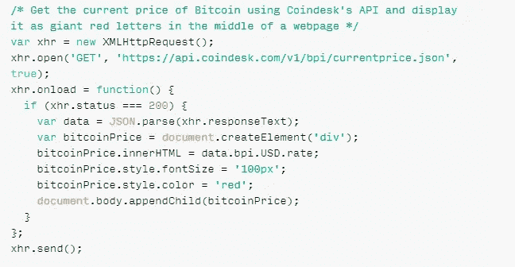
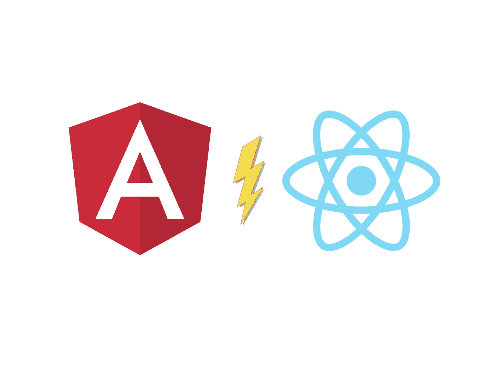
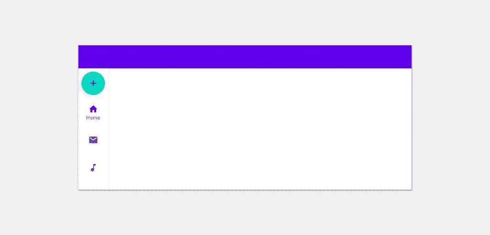

# 最佳媒体节目(2021 年 8 月)

> 原文：<https://betterprogramming.pub/the-best-of-programming-on-medium-august-2021-c02db5fa90bb>

## 上个月发表的我们最喜欢的文章

嘿大家好，

我希望你们都很好。在对我们最喜爱的作品做了几次每周和每两周一次的综述后，这里是我们的第一期月刊。

从 OpenAI 的 Codex 工具到 TypeScript 的最新特性，有很多好东西。事不宜迟，以下是 2021 年 8 月在 Medium 上发布的最佳编程——排名不分先后。

## 📸特色文章

OpenAI 最近发布了 [Codex](https://openai.com/blog/openai-codex/) ，这是一个将简单英语查询转换为代码的人工智能工具。作者 [Thomas Smith](https://tomsmith585.medium.com/) 得到了一个测试系统的机会，结果令人毛骨悚然——就像下面的比特币价格获取器代码，它是通过一行提示符生成的:

按作者分类的法典结果

*   [我测试了 OpenAI 的代码，结果令人毛骨悚然](/i-beta-tested-openais-codex-and-the-results-are-spooky-good-e282a1874c79)
*   [以下是 OpenAI Codex 将如何革新编程(和世界)](https://towardsdatascience.com/heres-how-openai-codex-will-revolutionize-programming-and-the-world-e8432aafc5f7)作者 [Alberto Romero](https://medium.com/u/7ba6be8a3022?source=post_page-----c02db5fa90bb--------------------------------)
*   [open ai 的 Codex，行动中](https://towardsdatascience.com/codex-by-openai-in-action-83529c0076cc)Vlad Alex(Merzmensch)

## 编程；编排

Jonas Jacobsson 在 [Unsplash](https://unsplash.com/?utm_source=medium&utm_medium=referral) 上拍摄的照片

*   读了拉斐尔·阿索尔[的](https://medium.com/u/11690cd32722?source=post_page-----c02db5fa90bb--------------------------------)的《干净的代码》后，我学到了 30 个编码概念
*   [厌倦了 VS 代码？试试](/bored-of-vs-code-try-lite-xl-76d4cb3f8dda)[的 Shalitha Suranga](https://medium.com/u/ce00b3e87ebf?source=post_page-----c02db5fa90bb--------------------------------) 的 Lite-XL
*   [Sejal Dua](https://towardsdatascience.com/extracting-metadata-from-medium-daily-digest-newsletters-via-gmail-api-97eee890a439)通过 Gmail API 从媒体每日文摘简讯中提取元数据
*   [我们从 AWS Lambda 迁移到 ECS，但希望最终由](/we-migrated-from-aws-lambda-to-ecs-but-hope-to-eventually-migrate-back-8ad25a60501b) [Geoff Cox](https://medium.com/u/b27544631c6c?source=post_page-----c02db5fa90bb--------------------------------) 迁移回
*   [18 种常见的 Python 反模式，我希望我在](https://towardsdatascience.com/18-common-python-anti-patterns-i-wish-i-had-known-before-44d983805f0f)之前就知道了 [Ahmed Besbes](https://medium.com/u/adc8ea174c69?source=post_page-----c02db5fa90bb--------------------------------)
*   [6 个谷歌搜索技巧，让谷歌搜索代码变得更容易](https://medium.com/madhash/6-google-search-tips-to-make-googling-code-easier-da362e21b9da)

## 数据科学

由[灭沙少女](https://www.pexels.com/@miphotography?utm_content=attributionCopyText&utm_medium=referral&utm_source=pexels)在[像素上拍摄的照片。](https://www.pexels.com/photo/pineapple-with-brown-sunglasses-459601/?utm_content=attributionCopyText&utm_medium=referral&utm_source=pexels)

*   [7 个很酷的 Python 包，Kagglers 在没有告诉你的情况下正在使用](https://towardsdatascience.com/7-cool-python-packages-kagglers-are-using-without-telling-you-e83298781cf4)
*   [为什么我在 Jupyter 笔记本上使用 vs code](https://towardsdatascience.com/why-im-using-vscode-for-jupyter-notebooks-abd2a6a157b9)作者[阿兰·琼斯](https://medium.com/u/7d3f5fb94faa?source=post_page-----c02db5fa90bb--------------------------------)
*   [数据科学不是你唯一的职业选择。](https://towardsdatascience.com/data-science-isnt-your-only-career-option-2b02787cca22)由[纳塔莎·塞尔瓦拉吉](https://medium.com/u/6a2ef1b1f09d?source=post_page-----c02db5fa90bb--------------------------------)
*   [如果我必须从](https://towardsdatascience.com/how-i-would-learn-python-for-data-science-if-i-had-to-start-over-83fc40ab93ba) [Nicholas](https://medium.com/u/50a17028094c?source=post_page-----c02db5fa90bb--------------------------------) 的开始，我将如何学习数据科学的 Python
*   [作为数据科学家，你需要订阅的 10 份简讯](https://towardsdatascience.com/10-newsletters-you-need-to-subscribe-to-as-a-data-scientist-d12c7f33fbab)作者: [Sara A. Metwalli](https://medium.com/u/7938431b336a?source=post_page-----c02db5fa90bb--------------------------------)

## Java Script 语言

作者图片

*   [我作为 React 开发者尝试过 Angular。下面是我喜欢它的 6 点](https://javascript.plainenglish.io/angular-vs-react-8125a541dd2a)
*   TypeScript 4.4 有什么新功能？作者[穆格兰哈](https://medium.com/u/8ae6a5b70ece?source=post_page-----c02db5fa90bb--------------------------------)
*   打字稿 4.4:好的、坏的和不那么坏的
*   [next . js 如何解决你的 React 应用的局限性](/how-next-js-can-solve-the-limitations-of-your-react-app-c3f69a796242)作者 [Lanka Rathnayaka](https://medium.com/u/77ba1dda5131?source=post_page-----c02db5fa90bb--------------------------------)

## 机器人

[来源](https://medium.com/google-developer-experts/exploring-the-material-navigation-rail-fe0c82dadc98)

*   [探索材料导航轨道](https://medium.com/google-developer-experts/exploring-the-material-navigation-rail-fe0c82dadc98)作者[乔伯奇](https://medium.com/u/61b7f64f0302?source=post_page-----c02db5fa90bb--------------------------------)
*   [Meghan Mehta](https://medium.com/androiddevelopers/seamless-account-transfers-with-block-store-987a38517311)[与 Block Store](https://medium.com/u/401951cd4c3e?source=post_page-----c02db5fa90bb--------------------------------) 进行无缝账户转账
*   [探索 Jetpack 中的应用程序栏](/exploring-app-bars-in-jetpack-compose-94a7e0920e32)作者 [Siva Ganesh Kantamani](https://medium.com/u/d70ea3470e6a?source=post_page-----c02db5fa90bb--------------------------------)

## ios

由[马克斯韦尔·尼尔森](https://unsplash.com/@maxcodes?utm_source=medium&utm_medium=referral)在 [Unsplash](https://unsplash.com/?utm_source=medium&utm_medium=referral) 拍摄的照片

*   [2021 年的 SwiftUI:好的，坏的，丑陋的](/swiftui-2021-the-good-the-bad-and-the-ugly-458c6ee768f9)作者 [Chrys Bader](https://medium.com/u/37825fdece46?source=post_page-----c02db5fa90bb--------------------------------)
*   [Swift 中针对不可变对象的案例](/the-case-against-immutable-objects-88343bbd7912) [麦龙](https://medium.com/u/ba1bf5213360?source=post_page-----c02db5fa90bb--------------------------------)
*   [在 iOS 中使用 Swift async/await](/the-problem-with-how-youre-doing-your-networking-in-ios-6ec7ed43a4e) 构建健壮的网络层 [Sean Goudarzi](https://medium.com/u/c9b993b9dc25?source=post_page-----c02db5fa90bb--------------------------------)
*   [2021 年十大趋势颤振包](/top-10-trending-flutter-packages-in-2021-51977d0ff528)作者 [Luciano Jung](https://medium.com/u/a0365826277b?source=post_page-----c02db5fa90bb--------------------------------)

## 软件工程

照片由[天线](https://unsplash.com/@antenna?utm_source=medium&utm_medium=referral)在 [Unsplash](https://unsplash.com/?utm_source=medium&utm_medium=referral)

*   [在软件工程面试中展示的 6 项软技能](/6-soft-skills-to-showcase-during-software-engineering-interviews-a8129b39fbbe)作者[林赛·周](https://medium.com/u/635e55ca4116?source=post_page-----c02db5fa90bb--------------------------------)
*   [“如果软件工程很吃香，为什么找一份软件工程的工作这么难？”](/if-software-engineering-is-in-demand-why-is-it-so-hard-to-get-a-software-engineering-job-c043a964e463)由 [Curt Corginia](https://medium.com/u/88466123bc8d?source=post_page-----c02db5fa90bb--------------------------------)
*   你是一名工程经理。你应该编码吗？作者[克里斯特斯·索蒂里欧](https://medium.com/u/f3b71075cb79?source=post_page-----c02db5fa90bb--------------------------------)
*   [无限吞吐量:如何提高自动合并性能](https://medium.com/bumble-tech/unlimited-throughput-how-to-increase-auto-merge-performance-d555e10e5ecd)作者[鲁斯兰·奥斯马诺夫](https://medium.com/u/3e2223c623b6?source=post_page-----c02db5fa90bb--------------------------------)
*   编写你自己的操作系统:驱动程序

## 工作

图片由 [Vinita](https://medium.com/u/b892e7626234?source=post_page-----c02db5fa90bb--------------------------------) 提供

*   [4 个让员工对工作负责的简单行动](/4-simple-actions-to-hold-people-accountable-at-work-25fc1e9b4cf8)作者[维尼塔](https://medium.com/u/b892e7626234?source=post_page-----c02db5fa90bb--------------------------------)
*   [经验丰富的面试官给软件工程师的 7 个面试技巧](/7-job-interview-tips-for-software-engineers-from-an-actual-interviewer-9d32be1720cb)安德烈·格里德涅夫
*   [资深开发者毁掉初级开发者职业生涯的 5 种方式](/5-ways-senior-developers-destroy-junior-developers-career-7ef84b94e58)由 [Lokajit Tikayatray](https://medium.com/u/b2092d476f15?source=post_page-----c02db5fa90bb--------------------------------)
*   [今天成为优秀老板的 7 个简单方法](https://emaxklein.medium.com/7-simple-ways-to-be-an-excellent-boss-today-d5f0a1680cbd)作者[马克斯·克莱恩](https://medium.com/u/29166e259f4c?source=post_page-----c02db5fa90bb--------------------------------)

这就结束了这篇时事通讯！查看 [betterprogramming.pub](https://betterprogramming.pub/) 了解更多有趣的故事。

感谢阅读。直到下一次，

Anupam 和更好的编程团队