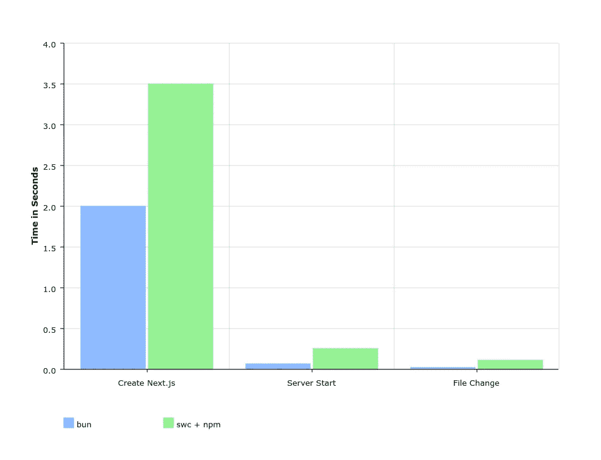
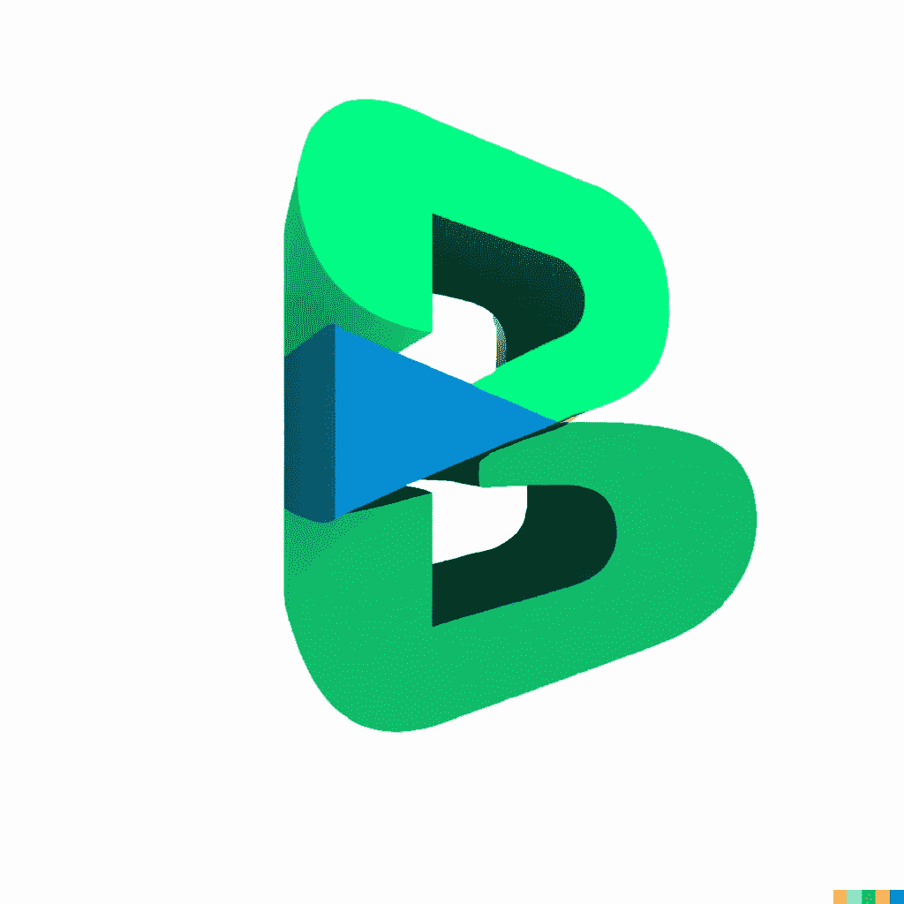
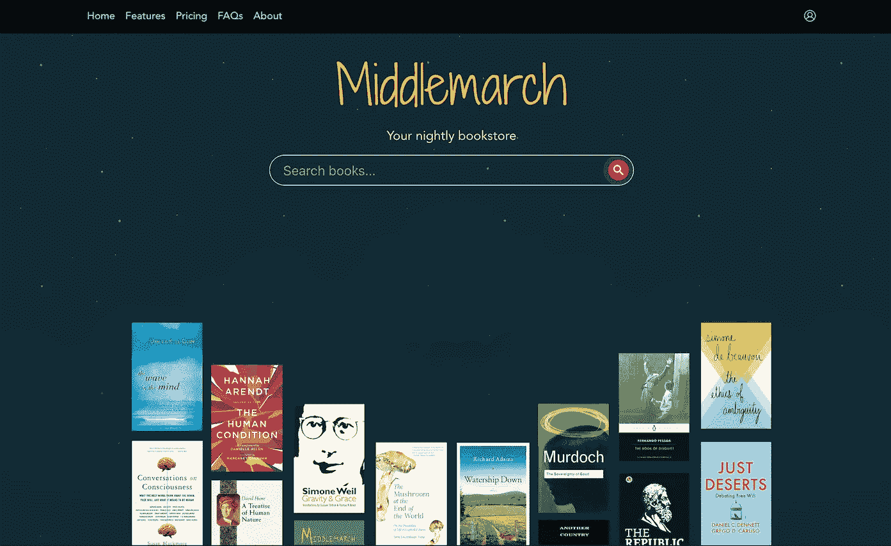
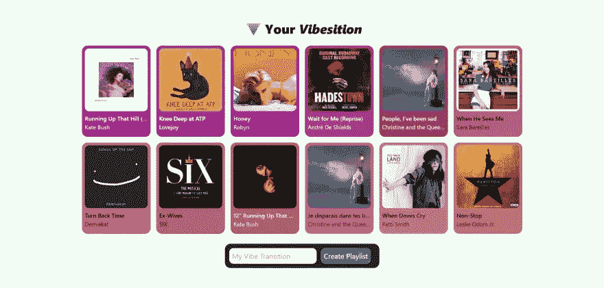
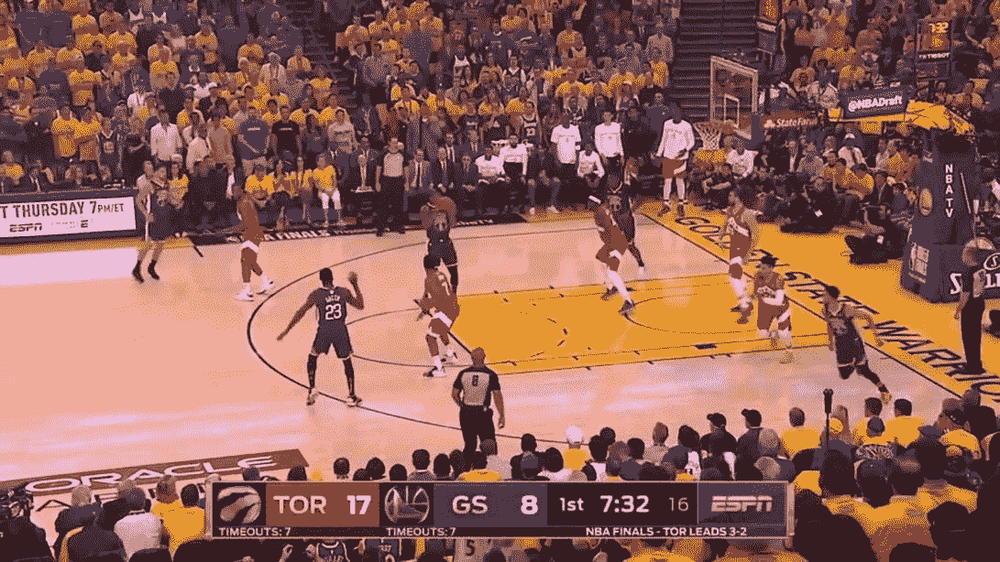

# 最佳媒体节目—2022 年 7 月

> 原文：<https://betterprogramming.pub/the-best-of-programming-on-medium-july-2022-378271458f8c>

## 上个月精选的故事

嘿大家好，

欢迎回到另一期的咖啡字节，由更好的编程每月通讯。

在这一版中，我们已经初步了解了 Carbon——谷歌的一种新编程语言——帮助您开始使用 Deno 的 Fresh framework 和 Bun.js 的有用指南，一些方便的教程以获得创造性的灵感，以及一些可行的建议。

此外，还有许多来自人工智能的很酷的故事，我们很高兴与你分享。

让我们直接开始吧。

# 本月新增

对于许多开发人员来说，开始使用一种新的编程语言及其语法是一个永无止境的挑战。很高兴， [Lorenzo Zarantonello](https://medium.com/u/124a4892b24e?source=post_page-----378271458f8c--------------------------------) 很兴奋地向我们介绍了[他学到的一些碳的工作实例](/carbon-programming-language-tutorial-6d67b4cc16ae)。这种语言仍处于实验阶段，但尝试起来很有趣，也很有启发性。谢谢洛伦佐。

接下来， [Foyzul Karim](https://medium.com/u/819510bfc516?source=post_page-----378271458f8c--------------------------------) 探索 Bun.js，一个新的 JavaScript 运行时。他分享了他对 JavaScript 生态系统当前问题的想法以及测试新工具时的一些实验和错误。今年早些时候， [Jose Granja](https://medium.com/u/8ae6a5b70ece?source=post_page-----378271458f8c--------------------------------) 做了一个[bun 与其他运行时](/is-bun-the-next-big-thing-after-webpack-d683441f77b9)的基准比较。新工具看起来很有前途:

Jose Granja 拍摄的图片

第三个是 Deno 的新框架。它已经发布了一段时间，你可以在詹妮弗·傅(Jennifer Fu)的下一代网络框架(next-gen web framework)完整指南和演练中读到更多关于它的特性，她说，“Deno 还年轻，正处于黄金时代的黎明。”

# AI 在酝酿什么？

OpenAI 的 DALL-E 颠覆了这个行业，但它远非完美。 [Hannah Johnston](https://medium.com/u/fc47b458c57d?source=post_page-----378271458f8c--------------------------------) [讨论了图像生成工具中的问题，并提供了一些指导](https://uxdesign.cc/user-experience-principles-for-ai-art-tools-e3e9c7885a71)以将课程引向更有意义和用户友好的交互工具。对于开发人员和设计人员来说，这非常值得一读。

我喜欢她为有经验的艺术家建立微调互动模式的想法，以及她对使用限制的深思熟虑——在创作 BP 的标志时，我差点搞砸了。下面是生成的结果:

喜欢吗？不，还没有更新！

向前迈进， [Andrew Blance](https://medium.com/u/a3bf842cf0ff?source=post_page-----378271458f8c--------------------------------) 向我们展示了如何[使用 NVIDIA 的 NeRF 软件](https://towardsdatascience.com/using-ai-to-generate-3d-models-2634398c0799)从图像中生成 3D 模型……这似乎是一个令人印象深刻的为 AR/VR 应用程序生成资产的工具。

有许多运动检测技术和实现它们的方法。 [Safa Abbes](https://medium.com/u/4879884b6638?source=post_page-----378271458f8c--------------------------------) [用 OpenCV 工作示例](https://medium.com/@abbessafa1998/motion-detection-techniques-with-code-on-opencv-18ed2c1acfaf)探究了其中的四个。我喜欢里面提到的乌贼游戏。

接下来， [Rares Finatan](https://medium.com/u/f47f2b7893c8?source=post_page-----378271458f8c--------------------------------) 展示了如何[使用 Python 和 PyTorch 为网站生成 SEO 元描述](/automatically-generate-site-wide-meta-descriptions-with-python-bart-for-pytorch-cd0e14dd40d3)，而 [Cesar Diniz Maciel](https://medium.com/u/4007fe9f1fac?source=post_page-----378271458f8c--------------------------------) 使用[微软 Azure 的图像描述生成工具](https://medium.com/@cesardinizmaciel/a-picture-is-worth-a-thousand-words-leveraging-ai-to-generate-and-enrich-image-descriptions-1562f2aa5159)进行了探索。

想要在基于 OpenAI 的移动应用中领先一步吗？斯科特·哈特菲尔德展示了[如何在不使用第三方插件的情况下将 OpenAI 的 API 集成到 Flutter 中](https://medium.com/@Toglefritz/use-openais-apis-in-flutter-without-plugins-3d183baa0ff0)。与此同时， [Go Woojin](https://medium.com/u/9eba79f954e4?source=post_page-----378271458f8c--------------------------------) [用 OpenAI Codex](/ive-been-using-openai-codex-how-far-can-ai-code-go-23833074fd4c) 进行实验，该工具为经典的 Python 编码问题提供了准确的结果。希望这能为在你的应用程序中集成 Codex APIs 提供一些启发！

# SwiftUI 教程

Ricardo Montemayor 是更好编程的新手，在他上个月发表的几篇文章中，他在流行明星和 MVVM 建筑模式之间做了一个有趣的类比。

我们的长期贡献者通过有用的指南继续探索应用程序架构:

*   [蝰蛇换 SwiftUI？求你了。](/viper-for-swiftui-please-no-ee61ce99694c)号由[迈克尔龙](https://michaellong.medium.com/)
*   [Riccardo Cipolleschi](/scalable-navigation-with-deep-links-in-swiftui-96cea1764994)[在 SwiftUI](https://riccardocipolleschi.medium.com/) 中使用深度链接进行可扩展导航
*   [swift ui 4](/flow-navigation-with-swiftui-4-e006882c5efa)流量导航[尼克·麦康奈尔](https://medium.com/@nicmcconn)

# “隐私。那是 i̶P̶h̶o̶n̶e̶ API？”

如果隐私是一个 API 呢？以下是一些利用 API 来保护数据的帖子:

*   [John Vester](https://medium.com/u/643304666902?source=post_page-----378271458f8c--------------------------------) 带我们试驾 Skyflow 平台，帮助[保护敏感数据](/can-data-privacy-vaults-have-apis-yes-3a62a2fae7ad)。
*   [通过 Relayer](/how-to-deploy-smart-contracts-via-relayer-db438ad7c399) 部署智能合约——为了避免暴露私钥， [Stephen Lloyd Webber](https://medium.com/u/4cc5efd75bce?source=post_page-----378271458f8c--------------------------------) 有一个使用 OpenZeppelin Defender 的 Relayer API 的分步程序指南。
*   [从 GitHub 中删除敏感数据和明文秘密](/how-to-remove-sensitive-data-and-plaintext-secrets-from-github-ca8ca0b7675a) —安全工程师， [Miguel A. Calles MBA](https://medium.com/u/d894583788f0?source=post_page-----378271458f8c--------------------------------) 展示了他如何通过使用 Java 程序删除提交的秘密来清理提交。

# 与工作相关的建议

Scrum 教练 Donovan Brown 写了一些有价值的课程，值得加入你的阅读清单。“[估计是估计](/estimates-are-estimates-ca0a31d737dc)！”是我本月的最佳选择。

厌倦了对最后一刻的请求说好吗？“知道何时以及为什么说不与知道如何说不一样重要，”Vinita 说。阅读她的指南，轻松地说不。

# 🧠有趣的项目，你可以开始建设

## [使用 React 18、Vite 和 Netlify 功能构建、测试和部署书店应用](/learn-how-to-build-test-and-deploy-a-bookstore-app-with-react-18-vite-and-netlify-functions-1e1050c8711)

由 [Kapelianovych Yevhen](https://medium.com/u/ff27fa27a8e2?source=post_page-----378271458f8c--------------------------------)

## [创建一个成熟的 Spotify 播放列表生成器](/creating-a-full-fledged-spotify-playlist-generator-in-a-weekend-498bb488c275)

由[乔丹威尔斯](https://medium.com/u/2446061ffe48?source=post_page-----378271458f8c--------------------------------)

## [用 Go 构建一个无服务器的 URL shorter](/build-a-serverless-url-shortener-with-go-ca198cb4d627)

阿布舍克·古普塔

## [带 Rust 的高性能物体跟踪引擎](https://medium.com/@kudryavtsev_ia/high-performance-object-tracking-engine-with-rust-59ccbc79cdb0)

由[伊万·库德里亚夫采夫](https://medium.com/u/8a28c638d22d?source=post_page-----378271458f8c--------------------------------)

## [如何建立一个众筹网站 3 Dapp](/how-to-build-a-crowdfunding-web3-dapp-76eb534eddf4)

泰勒·霍金斯

## [使用 Kotlin 中的 LibGDX 为 Android 构建 3D 版本](/build-in-3d-for-android-using-libgdx-in-kotlin-1cbf496cae2e)

费德里科·乔丹

## [用几行 Python 代码自动创建 NBA 集锦](/automatically-creating-nba-highlights-in-5-minutes-7f90bfedd775)

不再展示这个很酷的项目是不负责任的！
作者[诺姆·伊法特](https://medium.com/u/ef89ab3f04db?source=post_page-----378271458f8c--------------------------------)

这一期到此结束。直到你下次喝咖啡，

[Anupam](https://anupamchugh.medium.com/) 以及更好的编程团队。