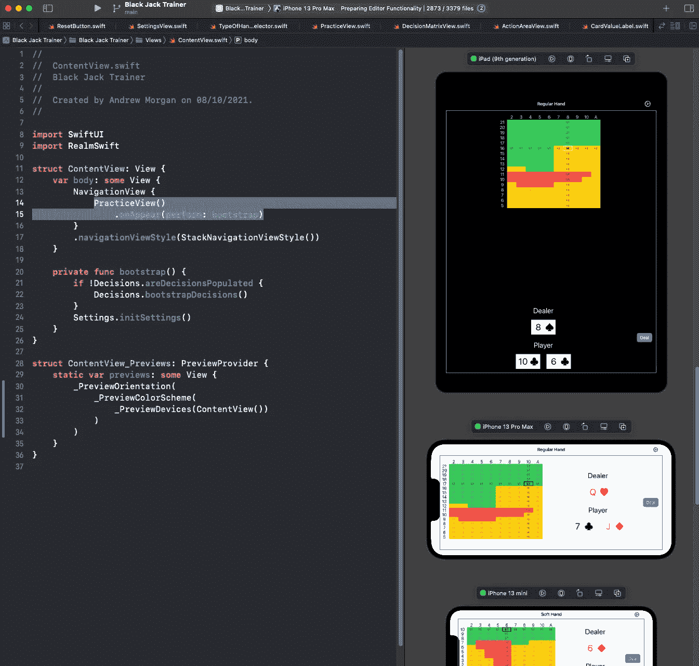
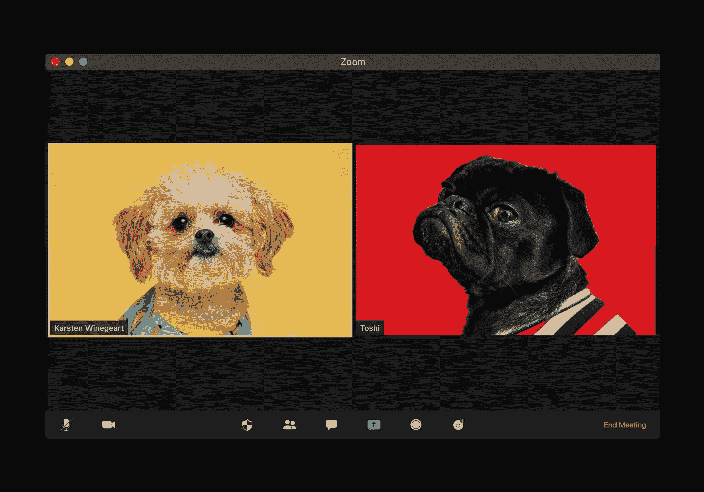

# 最佳媒体节目(2021 年 11 月)

> 原文：<https://betterprogramming.pub/the-best-of-programming-on-medium-november-2021-cb4525b88656>

## 上个月发表的我们最喜欢的故事

嘿大家好！我希望你一切都好。

今年还剩下不到四周的时间，我们有很多有见地的故事供你阅读。从对 Go 1.18 的初步了解到使用 Python 探索关键字提取任务，再到充分利用 SwiftUI 预览，以及大量的职业建议。

事不宜迟，我们开始吧。

# 编程；编排

安东尼奥·加波拉在 [Unsplash](https://unsplash.com/?utm_source=medium&utm_medium=referral) 上的照片

*   [遇见心流:邮差的新酷功能](/postman-flows-54ede6e0b558)作者[马加里特·霍尔姆](https://medium.com/u/5dbdfd10e839?source=post_page-----cb4525b88656--------------------------------)
*   [深入探究 GitHub 副驾驶](/ai-review-github-copilot-d43afde51a5a)作者 [Aidan Tilgner](https://medium.com/u/375f469e54e7?source=post_page-----cb4525b88656--------------------------------)
*   [Golang 1.18:你需要知道的事情](/golang-1-18-what-you-need-to-know-a5701f7e14ab)作者 [Marvin Wendt](https://medium.com/u/e13cbd7a05b7?source=post_page-----cb4525b88656--------------------------------)
*   [表情符号作为 Python 变量？当然，为什么不呢！](/emojis-as-python-variables-sure-why-not-96ce955dada1)作者[普拉蒂克·乔德里](https://medium.com/u/8259c215b23a?source=post_page-----cb4525b88656--------------------------------)
*   [6 款 Mac 开发工具，非 IDEs](/6-developer-tools-for-mac-that-arent-ides-b1419ffec2c1) 泰特·加尔布雷斯[所作](https://medium.com/u/1d89fcc3b0d?source=post_page-----cb4525b88656--------------------------------)
*   [我最喜欢的前端开发人员的编码面试任务](/my-favorite-coding-interview-task-for-frontened-developers-f3e984fa49e2)作者 [Edgar Abgaryan](https://medium.com/u/e87b87c78079?source=post_page-----cb4525b88656--------------------------------)
*   [用](/create-your-unique-newsletter-with-pipedream-f0bc2de1a067) [Kirshi Yin](https://medium.com/u/6fff8a84be27?source=post_page-----cb4525b88656--------------------------------) 的 Pipedream 创建您独特的简讯
*   [想要自定义 Python 类中正确的字符串表示吗？通过](/want-proper-string-representations-in-custom-python-classes-use-these-2-built-in-methods-72731434d7c8)[崔永](https://medium.com/u/88ff1e2545d0?source=post_page-----cb4525b88656--------------------------------)使用这两个内置方法
*   [面向高级开发人员的十大高级 VS 代码设置](https://javascript.plainenglish.io/top-10-advanced-vs-code-settings-for-senior-developers-46e348351bd6)作者[Derek Austin 博士](https://medium.com/u/e5294c417caf?source=post_page-----cb4525b88656--------------------------------)

# 软件工程

由[埃胡德·纽豪斯](https://unsplash.com/@paramir?utm_source=unsplash&utm_medium=referral&utm_content=creditCopyText)在 [Unsplash](https://unsplash.com/?utm_source=unsplash&utm_medium=referral&utm_content=creditCopyText) 上拍摄的照片

*   [作为产品工程问题的技术债务](/technical-debt-as-a-product-engineering-issue-2d805ab49e8c)作者[Andreja du lovi](https://medium.com/u/f966b0e47d6?source=post_page-----cb4525b88656--------------------------------)
*   [33 个优雅代码评审的最佳实践](/graceful-code-reviews-62c0cb5789ff)作者 [Rashi Karanpuria](https://medium.com/u/1b46310d9152?source=post_page-----cb4525b88656--------------------------------)
*   [如何有效地扩展你的网络应用](/how-to-effectively-scale-your-web-application-7e3917bb98f)
*   [避免过早的软件抽象](/avoiding-premature-software-abstractions-8ba2e990930a)作者 [Jonas Tulstrup](https://medium.com/u/175522a2102a?source=post_page-----cb4525b88656--------------------------------)
*   [如何在 AWS Cloud 上部署 Kotlin 微服务——App Runner](/how-to-deploy-your-kotlin-microservice-on-aws-cloud-app-runner-14f35185c6e7)作者[玛丽娜·切尔尼亚夫斯卡](https://medium.com/u/23b07d8d1650?source=post_page-----cb4525b88656--------------------------------)
*   [在 Lyft(第一部分)](https://eng.lyft.com/scaling-productivity-on-microservices-at-lyft-part-1-a2f5d9a77813)上扩展微服务的生产力
*   [网飞视频质量与宇宙微服务](https://netflixtechblog.medium.com/netflix-video-quality-at-scale-with-cosmos-microservices-552be631c113)由[网飞科技博客](https://medium.com/u/c3aeaf49d8a4?source=post_page-----cb4525b88656--------------------------------)

# 数据科学

图片由 [Bilal Himite](https://medium.com/u/719b2acce22f?source=post_page-----cb4525b88656--------------------------------) 提供

*   [由](https://towardsdatascience.com/replicating-minecraft-world-generation-in-python-1b491bc9b9a4)[毕拉尔·希米特](https://medium.com/u/719b2acce22f?source=post_page-----cb4525b88656--------------------------------)用 Python 复制《我的世界》世界一代
*   [监控还是不监控模型——有问题吗？](https://towardsdatascience.com/to-monitor-or-not-to-monitor-a-model-is-there-a-question-c0e312e19d03)作者[德万什·维尔马](https://medium.com/u/17f6509269ee?source=post_page-----cb4525b88656--------------------------------)
*   [训练 CNN 在没有任何手动注释图像的情况下检测停车标志](https://towardsdatascience.com/training-a-cnn-to-detect-stop-signs-without-any-manually-annotated-images-715a91954006)作者 [Sébastien Gilbert](https://medium.com/u/975aef8c496a?source=post_page-----cb4525b88656--------------------------------)
*   [使用 Ray](https://towardsdatascience.com/scaling-time-series-forecasting-with-ray-arima-and-prophet-e6c856e605ee) 大规模运行 ML Python 代码 [Christy Bergman](https://medium.com/u/f18ab4254b46?source=post_page-----cb4525b88656--------------------------------)
*   [处理金融数据的 5 个 Python 技巧](https://towardsdatascience.com/5-python-tips-to-work-with-financial-data-8907e17a7c91)作者:高
*   [一个好的特征](https://towardsdatascience.com/characteristics-of-a-good-feature-4f1ac7a90a42)作者[康纳·奥沙利文](https://medium.com/u/4ae48256fb37?source=post_page-----cb4525b88656--------------------------------)
*   [关键词提取——由 Andrea D'Agostino](https://towardsdatascience.com/keyword-extraction-a-benchmark-of-7-algorithms-in-python-8a905326d93f) 撰写的 Python 中 7 种算法的基准测试

# Java Script 语言

照片由[胡佛·董](https://unsplash.com/@lozt?utm_source=medium&utm_medium=referral)在 [Unsplash](https://unsplash.com/?utm_source=medium&utm_medium=referral) 上拍摄

*   [JavaScript 引擎如何实现卓越性能](https://medium.com/@robinheggelundhansen/how-javascript-engines-achieve-great-performance-fb0b36601557)作者 [Robin Heggelund Hansen](https://medium.com/u/5bd4064179a5?source=post_page-----cb4525b88656--------------------------------)
*   TypeScript 4.5 有什么新功能？作者[穆格兰哈](https://medium.com/u/8ae6a5b70ece?source=post_page-----cb4525b88656--------------------------------)
*   [15 个 JavaScript 代码示例及其 Dart 对应物](/15-javascript-code-snippets-and-their-dart-counterparts-45a9427c8366)作者 [Matthew Croak](https://medium.com/u/4180c044f281?source=post_page-----cb4525b88656--------------------------------)
*   揭开 JavaScript 中承诺的神秘面纱:它们是如何工作的？作者[迈克尔·E·科利](https://medium.com/u/7f583e9af6c7?source=post_page-----cb4525b88656--------------------------------)
*   [反应上下文+打字稿——最简单的方法](/how-to-use-react-context-with-typescript-the-easy-way-2ed1010f6e84)作者[斯潘塞](https://medium.com/u/fe03e8a8c97?source=post_page-----cb4525b88656--------------------------------)
*   [用](/writing-high-order-functions-for-general-process-like-a-senior-javascript-developer-4d025baa3dc6) [bytefish](https://medium.com/u/dac47b3482f4?source=post_page-----cb4525b88656--------------------------------) 像高级 JavaScript 开发者一样为通用流程编写高阶函数
*   [Angular v13 现由](https://blog.angular.io/angular-v13-is-now-available-cce66f7bc296)[马克·汤普森](https://medium.com/u/c8e30afa4390?source=post_page-----cb4525b88656--------------------------------)公司提供

# ios

图片由安德鲁·摩根[拍摄](https://medium.com/u/c1a6e3441e1a?source=post_page-----cb4525b88656--------------------------------)

*   [让 SwiftUI 预览为你工作](/making-swiftui-previews-work-for-you-6e54f46afbf)作者[安德鲁·摩根](https://medium.com/u/c1a6e3441e1a?source=post_page-----cb4525b88656--------------------------------)
*   [如何使用测试驱动开发编写 SwiftUI】作者](/how-to-write-swiftui-using-test-driven-development-ace8e2f6132b)[罗布·斯特金](https://medium.com/u/1de9d252156e?source=post_page-----cb4525b88656--------------------------------)
*   [管理 SwiftUI 列表视图中的焦点](/managing-focus-in-swiftui-list-views-286b139e6bca)作者 [Peter Friese](https://medium.com/u/ea0b1eb1f5d2?source=post_page-----cb4525b88656--------------------------------)
*   [Mark luck ing](/build-a-sliding-puzzle-game-with-swiftui-60a76be88bb5)用 SwiftUI 构建一个滑动益智游戏
*   [如何检查一款 iOS 应用](/how-to-reverse-engineer-an-ios-app-313a95950aff)作者[扎法尔·伊瓦耶夫](https://medium.com/u/2bbfa9d2f44f?source=post_page-----cb4525b88656--------------------------------)
*   [由](/ios-region-monitoring-with-swiftui-b1028fa8b95f) [Sachinthana Aluvihare](https://medium.com/u/a6a63158ed46?source=post_page-----cb4525b88656--------------------------------) 使用 SwiftUI 进行 iOS 区域监控
*   [如何通过](/how-to-create-a-looping-video-background-in-swiftui-3-0-b4844553880d) [Mirhat Rama](https://medium.com/u/f61e1bf7f67f?source=post_page-----cb4525b88656--------------------------------) 在 SwiftUI for iOS 15 中创建循环视频背景
*   [由](/composing-swiftui-navigation-3d67198b6acb) [Riccardo Cipolleschi](https://medium.com/u/4ebe4ef7da18?source=post_page-----cb4525b88656--------------------------------) 创作 SwiftUI 导航
*   [嘲讽 iOS 15 章节标题](/mocking-ios-15-section-headers-ef6ff33750e9)作者[赞·卡特](https://medium.com/u/8364b81bad38?source=post_page-----cb4525b88656--------------------------------)

# 区块链

下一届学院在 [Unsplash](https://unsplash.com/?utm_source=medium&utm_medium=referral) 上的照片

*   [利用这 5 种资源](/transform-into-a-web3-crypto-nft-and-blockchain-development-expert-5-resources-8fdd11037eb8)转变为 Web3、加密、NFT 和区块链开发专家 [Eric Kleppen](https://medium.com/u/1e2ea32699c9?source=post_page-----cb4525b88656--------------------------------)
*   [如何成为区块链工程师](/how-to-become-a-blockchain-engineer-fa4386a0504f)作者[帕特里克·柯林斯](https://medium.com/u/589c510eb216?source=post_page-----cb4525b88656--------------------------------)
*   [通过](/generate-your-nft-metadata-11a878c082b9) [Ewoud](https://medium.com/u/d852141f761f?source=post_page-----cb4525b88656--------------------------------) 生成你的 NFT 元数据
*   [教程:撰写一份 NFT 可收集智能合同](https://medium.com/@rounakbanik/tutorial-writing-an-nft-collectible-smart-contract-9c7e235e96da)
*   [在 4 分钟内部署以太坊智能合约](https://ethr.me/deploy-an-ethereum-smart-contract-in-3-minutes-ccb8f8f22598)由 [Ethan Roberts](https://medium.com/u/5a8e561b7336?source=post_page-----cb4525b88656--------------------------------)
*   [由](https://medium.com/@vietjs/blockchain-explained-in-50-lines-of-code-1dbf4eda0201) [Viet Nguyen](https://medium.com/u/a98557290109?source=post_page-----cb4525b88656--------------------------------) 用 50 行代码讲解区块链

# 工作

由[视觉效果](https://unsplash.com/@visuals?utm_source=medium&utm_medium=referral)在 [Unsplash](https://unsplash.com/?utm_source=medium&utm_medium=referral) 上拍摄

*   [成为编码面试官后学到的 11 件事](/11-things-i-learned-after-becoming-a-coding-interviewer-b951370ebda7)作者[孟泰宁](https://medium.com/u/ab0f20086e89?source=post_page-----cb4525b88656--------------------------------)
*   [由](/20-principles-to-learn-and-lead-8367191e94a8) [Vinita](https://medium.com/u/b892e7626234?source=post_page-----cb4525b88656--------------------------------) 学习和领导的 20 条原则
*   [开发团队对截止日期的通常反应导致](/the-usual-response-to-deadlines-in-development-teams-causes-delays-b2d19b2ba07a) [Maarten Dalmijn](https://medium.com/u/b40569a4ce51?source=post_page-----cb4525b88656--------------------------------) 的延迟
*   [克服冒充软件工程师综合症的 10 条规则](https://levelup.gitconnected.com/10-rules-to-overcome-imposter-syndrome-as-a-software-engineer-88654e2adaa6)作者[伊斯雷尔·迈尔斯](https://medium.com/u/bda88a564e0d?source=post_page-----cb4525b88656--------------------------------)
*   [设计师和开发人员:如何高效和平静地工作](/designer-and-developer-how-want-to-work-efficient-and-peaceful-70417c2f0371)作者[安娜斯塔西娅·诺连科](https://medium.com/u/4c7450bfffa4?source=post_page-----cb4525b88656--------------------------------)
*   [21 种保持团队开发人员快乐的方法](/21-ways-to-maintain-developer-happiness-in-your-team-7df811ca1d75)作者 [Elye](https://medium.com/u/5742b4fcf89e?source=post_page-----cb4525b88656--------------------------------)
*   [我开始扮演高级开发人员](/the-day-i-started-acting-like-a-senior-developer-93e216b19d45)的那一天 [Razvan Dragomir](https://medium.com/u/2f6bca23648e?source=post_page-----cb4525b88656--------------------------------)
*   [如何管理软件开发团队而不被生吞活剥](/how-to-manage-a-software-development-team-without-getting-eaten-alive-652ec2fbe58c)作者[詹姆斯·威廉姆斯](https://medium.com/u/67c3de49dc2f?source=post_page-----cb4525b88656--------------------------------)
*   [科技职业生涯早期需要学习的 9 项技能](/9-skills-to-learn-early-in-your-tech-career-a7e2f28f2027)作者[林赛·周](https://medium.com/u/635e55ca4116?source=post_page-----cb4525b88656--------------------------------)

这就结束了这篇时事通讯！查看 [betterprogramming.pub](https://betterprogramming.pub/) 了解更多有趣的故事。

感谢阅读。直到下一次，

Anupam 和更好的编程团队