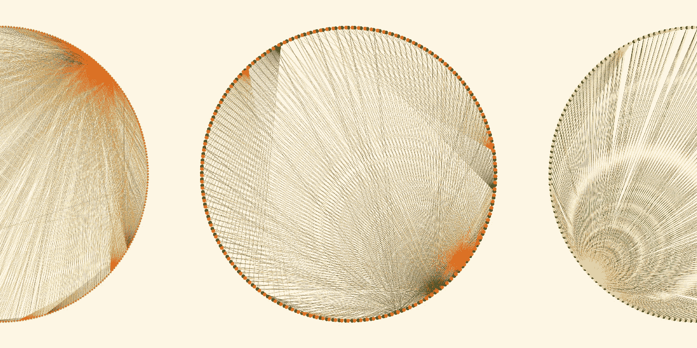
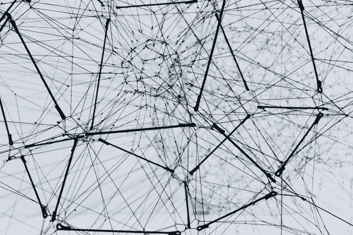
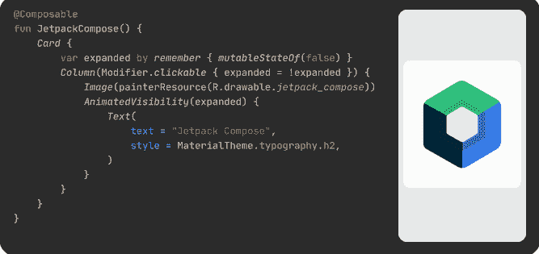

# 最佳媒体节目(2021 年 10 月)

> 原文：<https://betterprogramming.pub/the-best-of-programming-on-medium-october-2021-24a7e724f0ab>

## 上个月发表的我们最喜欢的故事

嘿大家好，

我希望你们都过得很好，并在上周过了一个愉快的万圣节周末。在这期杂志中，我们有许多有趣的故事发表在过去一个月的媒体上。

从第一眼看到 vscode.dev 到在 AWS 上挖掘以太坊，再到在 iOS 中构建一个类似抖音的滚动 feed 我们已经涵盖了所有内容。让我们开始吧。

# 编程；编排

[韦雪恩(魏贤)成龙](https://unsplash.com/@weixian?utm_source=medium&utm_medium=referral)在 [Unsplash](https://unsplash.com/?utm_source=medium&utm_medium=referral) 上的照片

*   [在浏览器中遇见 VS 代码(VS Code . dev)——VS 代码用于 Web](https://towardsdatascience.com/meet-vs-code-in-the-browser-vscode-dev-vs-code-for-the-web-cf8740211967) 作者[崔永](https://medium.com/u/88ff1e2545d0?source=post_page-----24a7e724f0ab--------------------------------)
*   [为什么 vscode.dev 是代码评审的游戏规则改变者](https://medium.com/pullflow/why-vscode-dev-is-a-game-changer-for-code-reviews-808fb1c16f08)作者[Zak man hro](https://medium.com/u/f91fbe55f747?source=post_page-----24a7e724f0ab--------------------------------)
*   [我承认，在我的职业生涯中，我从来没有反转过链表。现在还有人这么做吗？](/ill-admit-it-i-ve-never-had-to-reverse-a-linked-list-in-my-career-does-anyone-do-that-anymore-7e643904f191)作者[费尔南多·多利奥](https://medium.com/u/d55832d5b3b1?source=post_page-----24a7e724f0ab--------------------------------)
*   瑞安·科林汉姆撰写的
*   [欧文·威廉姆斯](https://medium.com/@ow/the-2021-guide-to-coding-on-an-ipad-pro-5428d062c5ff)[撰写的《2021 年 iPad Pro 编码指南](https://medium.com/u/9cca1cc5944f?source=post_page-----24a7e724f0ab--------------------------------)
*   [由](/create-your-own-nft-collection-with-python-82af40abf99f) [Ewoud](https://medium.com/u/d852141f761f?source=post_page-----24a7e724f0ab--------------------------------) 用 Python 创建自己的 NFT 收藏
*   [我如何通过在 AWS 上挖掘以太坊获利](/how-i-made-a-profit-mining-ethereum-on-aws-2ffe3aab579)作者[詹姆斯·罗宾逊](https://medium.com/u/a534c6efc04a?source=post_page-----24a7e724f0ab--------------------------------)
*   [7 VS 代码速记编码更快](https://medium.com/madhash/7-vs-code-shorthand-to-code-faster-ecfb57767c19) by [Aphinya Dechalert](https://medium.com/u/3ac3fb3f09e0?source=post_page-----24a7e724f0ab--------------------------------)
*   [为什么 Kotlin 是全天候编程语言](/why-kotlin-is-an-intelligent-bet-as-the-all-weather-programming-language-378eee69a850)的明智选择

# 数据科学

图片由[西蒙·约翰逊](https://medium.com/u/9e766e1c846c?source=post_page-----24a7e724f0ab--------------------------------)

*   [从基因组数据中创建生殖艺术 NFT](https://towardsdatascience.com/creating-generative-art-nfts-from-genomic-data-16a48ae4df99)作者[西蒙·约翰逊](https://medium.com/u/9e766e1c846c?source=post_page-----24a7e724f0ab--------------------------------)
*   [我如何构建自己的约会应用程序算法](https://towardsdatascience.com/how-i-built-my-own-dating-app-algorithm-2f6def15feb1)作者[马可·桑托斯](https://medium.com/u/e06d69ac26aa?source=post_page-----24a7e724f0ab--------------------------------)
*   [由](https://towardsdatascience.com/a-data-storytelling-project-with-some-advanced-visualization-in-ggplot2-fb60dfc56dde) [Rashida Nasrin Sucky](https://medium.com/u/8a36b941a136?source=post_page-----24a7e724f0ab--------------------------------) 在 ggplot2 中使用一些高级可视化的数据讲述项目
*   [在分析了由](https://towardsdatascience.com/the-most-popular-languages-on-reddit-analyzed-with-snowflake-and-a-java-udtf-4e58c8ba473c)[菲利佩·霍法](https://medium.com/u/279fe54c149a?source=post_page-----24a7e724f0ab--------------------------------)发表的约 100 万条评论后，Reddit 上最受欢迎的语言
*   [将 Julia 用于令人敬畏的数据科学项目](/use-julia-for-awesome-data-projects-71d39c345aa9)
*   [数据分析师的生活](https://towardsdatascience.com/the-life-of-a-data-analyst-263050370272)作者[梅根·迪布尔](https://medium.com/u/271578f29747?source=post_page-----24a7e724f0ab--------------------------------)
*   [如何使用费曼技术成为数据科学中最复杂概念的专家](https://towardsdatascience.com/how-to-use-the-feynman-technique-to-become-an-expert-in-the-most-complicated-concepts-in-data-cecf33d7d518)作者[麦迪逊·亨特](https://medium.com/u/6a8c6841e521?source=post_page-----24a7e724f0ab--------------------------------)
*   [Barrett Studdard](https://towardsdatascience.com/detecting-outliers-using-python-66b25fc66e67)使用 Python 检测异常值
*   [Sheenal Srivastava](https://towardsdatascience.com/eliminating-ai-bias-5b8462a84779)消除 AI 偏见
*   [Nikos Kafritsas](/installing-tensorflow-on-apple-m1-with-new-metal-plugin-6d3cb9cb00ca)用新的金属插件在苹果 M1 上安装 Tensorflow
*   [由](https://towardsdatascience.com/automatic-video-editing-using-python-324e5efd7eba) [Dmytro Nikolaiev](https://medium.com/u/97b5279dad26?source=post_page-----24a7e724f0ab--------------------------------) 使用 Python 进行自动视频编辑

# 软件工程

*   [用 PostgreSQL 和 Node.js 创建图形数据库和 API](/create-a-graph-database-and-api-with-postgresql-and-node-js-d7bddcc00bbb)作者[尼克·帕什科夫](https://medium.com/u/3b24166a3d85?source=post_page-----24a7e724f0ab--------------------------------)
*   [如何处理卡夫卡](/how-to-handle-duplicate-messages-and-message-ordering-in-kafka-82e2fef82025)中的重复信息和信息排序
*   [从整体服务过渡到微服务](/transitioning-from-monolith-to-microservices-428f95c17c3e)作者 [Michael Bogan](https://medium.com/u/2b0f7c850aed?source=post_page-----24a7e724f0ab--------------------------------)
*   [如何让软件设计讨论更有成效](/how-to-make-software-design-discussions-more-productive-19a950489261)作者[梅格娜·巴韦](https://medium.com/u/aa12f3a5ed91?source=post_page-----24a7e724f0ab--------------------------------)
*   [敏捷 20 年:广泛采用但仍有相同的成长烦恼](/state-of-agile-widespread-adoption-but-still-the-same-growing-pains-dc75ee166277)作者:Andrew Quan
*   [如何在 AWS Cloud-Fargate 上部署 Kotlin 微服务](/how-to-deploy-your-kotlin-microservice-on-aws-cloud-fargate-6b7fba42a70b)作者 [Maryna Cherniavska](https://medium.com/u/23b07d8d1650?source=post_page-----24a7e724f0ab--------------------------------)
*   你的软件过程还有意义吗？由[爱丽耶](https://medium.com/u/5742b4fcf89e?source=post_page-----24a7e724f0ab--------------------------------)
*   [重访 BetterTLS:证书路径构建](https://netflixtechblog.com/revisiting-bettertls-certificate-path-building-4c978b79843f)作者[网飞科技博客](https://medium.com/u/c3aeaf49d8a4?source=post_page-----24a7e724f0ab--------------------------------)
*   [andréRibeiro](/deploy-a-reddit-bot-using-aws-lambda-and-eventbridge-7df793b979b2)使用 AWS Lambda 和 EventBridge 部署一个“提醒”Reddit 机器人

# Java Script 语言

由[牡蛎李](https://medium.com/u/b4a1dabb6722?source=post_page-----24a7e724f0ab--------------------------------)设计的图像

*   [7 牡蛎李](/7-advanced-usages-of-typescript-f9abb0dd64ff)[打字稿](https://medium.com/u/b4a1dabb6722?source=post_page-----24a7e724f0ab--------------------------------)的高级用法
*   [受控和非受控组件在反应](https://levelup.gitconnected.com/the-difference-between-controlled-and-uncontrolled-components-in-react-b76ac333db4d)中的区别由[查德·室林](https://medium.com/u/6bb3c9d1a1f4?source=post_page-----24a7e724f0ab--------------------------------)
*   [如何在 React 应用中实现富文本编辑器](/how-to-implement-a-rich-text-editor-in-your-react-app-5c64d56ddec7)作者[比安卡·德拉戈米尔](https://medium.com/u/e6dea663e8ef?source=post_page-----24a7e724f0ab--------------------------------)
*   使用 Rust 创建高性能的 JavaScript APIs
*   7 个未被发现的 YouTube 频道来学习反应
*   [如何在](/how-to-create-circuit-breaker-in-ts-1416ba076760) [Oleh Zaporozhets](https://medium.com/u/262dcfc8102b?source=post_page-----24a7e724f0ab--------------------------------) 的打字稿中创建断路器
*   [观察和承诺——你应该用哪一个？](/observables-vs-promises-which-one-should-you-use-c19aef53c680)作者[荷西格兰哈](https://medium.com/u/8ae6a5b70ece?source=post_page-----24a7e724f0ab--------------------------------)
*   [Tom emmer son](https://medium.com/@tom_86064/monetize-a-nodejs-api-with-paypi-7800efa7fe6)[用 PayPI](https://medium.com/u/6ea8ef98f469?source=post_page-----24a7e724f0ab--------------------------------) 将 NodeJS API 货币化

# 机器人

[来源](https://d.android.com/jetpack/compose)

*   [内部 Jetpack 由](https://medium.com/@takahirom/inside-jetpack-compose-2e971675e55e) [takahirom](https://medium.com/u/c781a202ce0a?source=post_page-----24a7e724f0ab--------------------------------) 合成
*   [面向安卓工程师的 M1 Pro](https://gpeal.medium.com/the-m1-pro-for-android-engineers-a144093aa1ec)作者[加布里埃尔·皮尔](https://medium.com/u/bfa26a83c4b6?source=post_page-----24a7e724f0ab--------------------------------)
*   [使用 CameraX 曝光补偿 API](https://medium.com/androiddevelopers/using-camerax-exposure-compensation-api-11fd75785bf) 由 [Wenhung](https://medium.com/u/548be30f5e75?source=post_page-----24a7e724f0ab--------------------------------)
*   [由](https://hosseinaminii.medium.com/android-parcelable-in-kotlin-multiplatform-bce42ea5ceb7)[霍辛·阿米尼](https://medium.com/u/3a7a4f3a20b9?source=post_page-----24a7e724f0ab--------------------------------)开发的可在 Kotlin 多平台中打包的 Android
*   [如何在 Android 中使用 Jetpack Compose 验证字段](/how-to-validate-fields-using-jetpack-compose-in-android-5ea1522331c7)Siva Ganesh kanta mani

# ios

作者演示

*   [使用声明域范例](/build-a-swift-snake-game-using-declarative-domain-paradigm-7eb34a139017)在 Swift 中构建一个贪吃蛇游戏，作者[曼纽尔·迈耶](https://medium.com/u/11f6da876891?source=post_page-----24a7e724f0ab--------------------------------)
*   [为你的 iOS 应用添加排行榜](/add-a-leaderboard-to-your-ios-app-d457697f4616)作者[朱莉·伊莉斯](https://medium.com/u/fae05a2fa5f4?source=post_page-----24a7e724f0ab--------------------------------)
*   [构建抖音:由](https://nickconfrey.medium.com/build-tiktok-create-a-smooth-scrolling-video-feed-in-swift-on-ios-ee2095278609) [Nick Confrey](https://medium.com/u/c8fbb23f8de0?source=post_page-----24a7e724f0ab--------------------------------) 在 iOS 上的 Swift 中创建平滑滚动的视频源
*   [Riccardo Cipolleschi](/6-principles-to-write-better-modules-for-your-ios-applications-3257c26e5df2)[为您的 iOS 应用程序编写更好模块的 6 条原则](https://medium.com/u/4ebe4ef7da18?source=post_page-----24a7e724f0ab--------------------------------)
*   [Marina Gornostaeva](/debugging-on-ios-15-with-xcode-12-8d3ca7487bd2)在 iOS 15 上使用 Xcode 12 进行调试
*   [了解 Swift 5.5 任务组](/understanding-swift-5-5-task-groups-f49fe7c5f873)作者 [Lee Kah Seng](https://medium.com/u/69f6bded953d?source=post_page-----24a7e724f0ab--------------------------------)
*   [六种(左右)口味的依赖注入 Swift](/six-or-so-flavors-of-dependency-injection-in-swift-cd3d72651662) 作者[祖博夫](https://medium.com/u/63310a0d2b01?source=post_page-----24a7e724f0ab--------------------------------)
*   [在 SwiftUI 中使用视图模型协议？你做错了](/swiftui-view-models-are-not-protocols-8c415c0325b1)由[迈克尔龙](https://medium.com/u/ba1bf5213360?source=post_page-----24a7e724f0ab--------------------------------)
*   [在 SwiftUI](/3-ways-to-create-the-iconic-matrix-opening-credits-scene-in-swiftui-dcdfac072175) 中创建标志性矩阵开场演职员表场景的 3 种方法[马克·卢金](https://medium.com/u/cad7f7bef2a?source=post_page-----24a7e724f0ab--------------------------------)

# 区块链

作者图片

*   [由](/create-a-blockchain-game-with-solidity-web3-and-vue-js-c75eed4b49a6) [Zouheir Layine](https://medium.com/u/317e44358ade?source=post_page-----24a7e724f0ab--------------------------------) 用 Solidity、Web3、Vue.js 创建区块链游戏
*   [了解以太坊 ERC-20 元交易](/ethereum-erc-20-meta-transactions-4cacbb3630ee)作者 [Pascal Marco Caversaccio](https://medium.com/u/1f9d692afd8b?source=post_page-----24a7e724f0ab--------------------------------)
*   [Patrick Collins](/use-multicall-to-save-tons-of-api-requests-to-your-blockchain-node-f759d09a8ef5)[使用 Multicall 将大量 API 请求保存到您的区块链节点](https://medium.com/u/589c510eb216?source=post_page-----24a7e724f0ab--------------------------------)
*   [所有初学者都应该知道的关于稳健的 3 个事实](/3-facts-about-solidity-that-all-beginners-should-know-248165adc00e)作者[凯莉·哈特](https://medium.com/u/72b521258045?source=post_page-----24a7e724f0ab--------------------------------)
*   [教程:编写一份 NFT 可收集智能合同](https://medium.com/@rounakbanik/tutorial-writing-an-nft-collectible-smart-contract-9c7e235e96da)
*   [通过例子理解可靠性](https://mcarlomagno.medium.com/understanding-solidity-by-example-b2394f7cea8f)作者[马科斯·卡洛马尼奥](https://medium.com/u/b5d174077410?source=post_page-----24a7e724f0ab--------------------------------)
*   [10 分钟内从零开始建造以太坊](https://medium.com/@gabriellimaguimaraes/building-ethereum-from-scratch-in-10-minutes-fe74519ef8c8)作者[加布里埃尔·吉马雷斯](https://medium.com/u/d6a76e8b2ad3?source=post_page-----24a7e724f0ab--------------------------------)

# 工作和职业建议

来自 [Pexels](https://www.pexels.com/photo/boy-in-white-t-shirt-sitting-on-chair-in-front-of-computer-4709285/?utm_content=attributionCopyText&utm_medium=referral&utm_source=pexels) 的 [cottonbro](https://www.pexels.com/@cottonbro?utm_content=attributionCopyText&utm_medium=referral&utm_source=pexels) 摄影

*   [我是不是太年轻了，不适合做高级开发者？](/am-i-too-young-to-be-a-senior-developer-64294bcff5c8)作者[玛丽莎·霍尼格](https://medium.com/u/3f117654a175?source=post_page-----24a7e724f0ab--------------------------------)
*   [成为一名高级软件工程师需要什么？](/what-does-it-take-to-become-a-senior-software-engineer-8accd950d98)作者[伊曼纽尔·德·索萨](https://medium.com/u/e6b0ce3b3618?source=post_page-----24a7e724f0ab--------------------------------)
*   [学会良好的招聘，你永远不会失去](https://hunterwalk.medium.com/learn-to-hire-well-and-youll-never-lose-c8e254665cfd)
*   工作中会议太多？以下是如何停止疯狂会议的方法
*   当人们谈论你时，你会怎么做？作者[乔安娜·莱文蒂耶娃](https://medium.com/u/27cfe7e2ca16?source=post_page-----24a7e724f0ab--------------------------------)
*   [为什么“免费工作”并不总是为了钱](/why-working-for-free-isn-t-always-about-money-1f97164f0cad)作者[英格利泽·德·弗里斯](https://medium.com/u/ea61be369cd6?source=post_page-----24a7e724f0ab--------------------------------)
*   [你是在面试一个高级职位吗？不要试图通过伊曼纽尔·马克斯的](/are-you-interviewing-for-a-senior-position-dont-try-to-show-you-know-everything-90b1bb7dcf81)来展示你什么都知道
*   当我 50 岁时，你还会雇用我吗？作者[海登·马尔尚](https://medium.com/u/9e65e2a4d7ad?source=post_page-----24a7e724f0ab--------------------------------)
*   [另一个技术面试指南](/yet-another-guide-to-tech-interviews-d7ed52454155)作者 [Rina Artstain](https://medium.com/u/f540d518c481?source=post_page-----24a7e724f0ab--------------------------------)

这就结束了这篇时事通讯！查看 [betterprogramming.pub](https://betterprogramming.pub/) 了解更多有趣的故事。

感谢阅读。直到下一次，

Anupam 和更好的编程团队