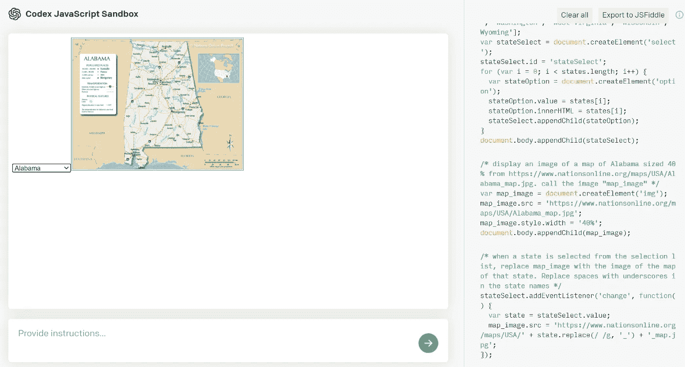
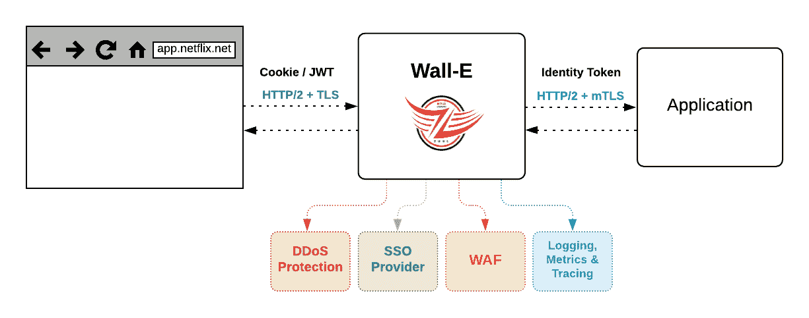

# 最佳媒体节目(2021 年 9 月)

> 原文：<https://betterprogramming.pub/the-best-of-programming-on-medium-september-2021-f644b025681f>

## 上个月发表的我们最喜欢的故事

大家十月快乐，

为了帮助您获得灵感并编写更多代码，我们已经收集了上个月发布的一些精彩故事。顺便说一下，脸书昨天宿醉了。如果你想知道故障的原因，[这里有一个他们全球中断](https://engineering.fb.com/2021/10/05/networking-traffic/outage-details/)的详细解释。

事不宜迟，以下是 2021 年 9 月我们最喜欢的故事——排名不分先后。

# 编程；编排

作者图片

*   [初尝抄本](https://towardsdatascience.com/a-first-taste-of-codex-71385ee8aaa4)由[马克·瑞安](https://medium.com/u/c73eee31cfa3?source=post_page-----f644b025681f--------------------------------)
*   [Flutter 2.5 的新特性](https://medium.com/flutter/whats-new-in-flutter-2-5-6f080c3f3dc)作者[克里斯销售](https://medium.com/u/e0fa815e608b?source=post_page-----f644b025681f--------------------------------)
*   [Parker Ferguson](/creating-generative-art-nfts-with-python-solidity-a95eaeea515e)[用 Python 和 Solidity 制作的生成艺术 NFTs](https://medium.com/u/f7487aad842c?source=post_page-----f644b025681f--------------------------------)
*   [没有 Docker 桌面，开发生活还能存在吗？](/can-development-life-exist-without-docker-desktop-93791a3dc977)作者 [Randal Kamradt Sr](https://medium.com/u/b9c2dfd1e199?source=post_page-----f644b025681f--------------------------------)
*   流行编程语言的问题
*   [玛丽安·贝洛蒂](https://bellmar.medium.com/learning-almost-nothing-about-llvm-e6aea9b243d9)[对 LLVM](https://medium.com/u/d196ba9afc2d?source=post_page-----f644b025681f--------------------------------) 几乎一无所知

# 数据科学

Pawel Czerwinski 在 [Unsplash](https://unsplash.com/?utm_source=medium&utm_medium=referral) 上的照片

*   [用](https://towardsdatascience.com/prettifying-pandas-dataframes-75c1a1a6877d) [Zolzaya Luvsandorj](https://medium.com/u/5bca2b935223?source=post_page-----f644b025681f--------------------------------) 美化熊猫数据帧
*   [厌倦了 AI？再说说 CI。](https://towardsdatascience.com/tired-of-ai-lets-talk-about-ci-eb54f7a2d393)作者[布莱斯·默里博士](https://medium.com/u/edf807bcc160?source=post_page-----f644b025681f--------------------------------)
*   [PixelCNN 的盲点](https://towardsdatascience.com/pixelcnns-blind-spot-84e19a3797b9)作者[杰西卡·达弗伦](https://medium.com/u/f7d3236aa7d5?source=post_page-----f644b025681f--------------------------------)
*   [网刮熊猫不够用吗？试美汤](/how-to-use-pandas-for-web-scraping-not-enough-try-beautiful-soup-98d0362d5bb1)由[崔永](https://medium.com/u/88ff1e2545d0?source=post_page-----f644b025681f--------------------------------)
*   [SHAP:解释 Python 中的任何机器学习模型](https://towardsdatascience.com/shap-explain-any-machine-learning-model-in-python-24207127cad7)作者 [Khuyen Tran](https://medium.com/u/84a02493194a?source=post_page-----f644b025681f--------------------------------)

# Java Script 语言

作者图片

*   我指示 GitHub Copilot 在 React 中编写一个 Instagram 个人资料提要。事情是这样的。作者[阿尤什·辛格](https://medium.com/u/25a08b9a9a36?source=post_page-----f644b025681f--------------------------------)
*   [用 JavaScript 计算斐波那契数列最快最有效的方法](/fibonacci-algorithm-in-javascript-45743f3a0ff6)作者 [Arek Jaworski](https://medium.com/u/e98d079ebca8?source=post_page-----f644b025681f--------------------------------)
*   [为什么你应该使用 Next.js 作为 React 应用的默认框架](/why-you-should-use-next-js-as-the-default-framework-in-react-apps-e1d453336d38)作者[杰罗姆·莫特](https://medium.com/u/cf2ada1997bb?source=post_page-----f644b025681f--------------------------------)
*   [由](/architecting-a-graphql-api-codebase-in-node-js-3a951cd7f0f4) [Haseeb Anwar](https://medium.com/u/c273c56a57d4?source=post_page-----f644b025681f--------------------------------) 在 Node.js 中架构一个 GraphQL API 代码库

# 软件工程

作者图片

*   [表演必须继续:保护网飞工作室的规模](https://netflixtechblog.com/the-show-must-go-on-securing-netflix-studios-at-scale-19b801c86479)由[网飞科技博客](https://medium.com/u/c3aeaf49d8a4?source=post_page-----f644b025681f--------------------------------)
*   生成随机数比你想象的要困难得多
*   [自主监控和自愈网络](https://engineering.salesforce.com/autonomous-monitoring-and-healing-networks-52d2e2258d01)作者 [Kshitij 多格拉](https://medium.com/u/a0c3e7fde512?source=post_page-----f644b025681f--------------------------------)
*   [大规模自动化数据保护，第 1 部分](https://medium.com/airbnb-engineering/automating-data-protection-at-scale-part-1-c74909328e08)作者 [elizabeth nammour](https://medium.com/u/ee5a09983527?source=post_page-----f644b025681f--------------------------------)

# ios

照片由[赞](https://unsplash.com/@zanilic?utm_source=medium&utm_medium=referral)在 [Unsplash](https://unsplash.com/?utm_source=medium&utm_medium=referral) 上拍摄

*   [Xcode 13 有什么新功能？](/whats-new-in-xcode-13-a48d5158f98) by [戴儒 N](https://medium.com/u/84a9ca570a94?source=post_page-----f644b025681f--------------------------------)
*   [由](/creating-confetti-particle-effects-using-swiftui-afda4240de6b)[莎拉](https://medium.com/u/267e16a7c893?source=post_page-----f644b025681f--------------------------------)使用 SwiftUI 创建五彩纸屑粒子效果
*   [在 iOS 15 中用 SwiftUI 探索 ShazamKit】作者](/exploring-shazamkit-with-swiftui-in-ios-15-577a7ce1dc51) [Rudrank Riyam](https://medium.com/u/f79b60908c24?source=post_page-----f644b025681f--------------------------------)
*   [Mark luck ing](/implementing-swiftui-canvas-view-in-ios-15-b7909eac207)[在 iOS 15](https://medium.com/u/cad7f7bef2a?source=post_page-----f644b025681f--------------------------------) 中实现 swift ui Canvas
*   [Peter Friese](/building-dynamic-lists-in-swiftui-for-ios-15-a2e470fb37cb)[为 iOS 15](https://medium.com/u/ea0b1eb1f5d2?source=post_page-----f644b025681f--------------------------------) 在 SwiftUI 中构建动态列表
*   [Roman Luz gin](/build-your-own-blog-app-with-swiftui-3ee8196ecb84)[用 SwiftUI](https://medium.com/u/ed8ad381a341?source=post_page-----f644b025681f--------------------------------) 构建自己的博客应用
*   [使用 Swift](/preventing-data-races-using-actors-in-swift-ed3d8a69adf3) 中的演员防止数据竞争[李嘉盛](https://medium.com/u/69f6bded953d?source=post_page-----f644b025681f--------------------------------)

# 工作和生产力

卡尔·约根森在 [Unsplash](https://unsplash.com/?utm_source=medium&utm_medium=referral) 上拍摄的照片

*   [有效学习新事物的 5 个步骤](/5-steps-to-learn-new-things-effectively-2679a3a6a05a)作者 [Vickie Li](https://medium.com/u/871f2599811b?source=post_page-----f644b025681f--------------------------------)
*   公司怎样做才能留住员工超过六个月？作者[曼迪·冈宁厄姆](https://medium.com/u/fd374bd5824e?source=post_page-----f644b025681f--------------------------------)
*   [如何转“你有什么问题要问我吗？”詹姆森·萨巴洛斯](/how-to-turn-do-you-have-any-questions-for-me-into-a-job-offer-eb9a71931705)提供的工作机会
*   [我对职业倦怠的看法是错误的(你可能也是如此)](/i-was-wrong-about-burnouts-and-you-are-too-probably-b2af1600cd6e)Vinita
*   [为什么“你认为自己在 5 年后会怎样？”是乔治·j·齐奥斯](https://medium.com/publishous/why-where-do-you-see-yourself-in-5-years-is-a-bullshit-question-447c5365a12b)提出的一个扯淡的问题
*   你应该花更多的时间无所事事——那是你真正成长的时候

# 幽默

在 [Unsplash](https://unsplash.com/?utm_source=medium&utm_medium=referral) 上由 [S & B 冯兰森](https://unsplash.com/@blavon?utm_source=medium&utm_medium=referral)拍摄的照片

*   [杰西·布拉马尼](/what-miscellaneous-bugs-and-fixes-really-mean-3c190aa9f22f)所说的的“杂项错误和修复”到底是什么意思
*   [如果编程语言是黄道十二宫](/what-your-favorite-programming-language-says-about-your-personality-73c74c3bc1dc)由[迈克尔·米勒](https://medium.com/u/f9335e955a0b?source=post_page-----f644b025681f--------------------------------)

这就结束了这篇时事通讯！查看 [betterprogramming.pub](https://betterprogramming.pub/) 了解更多有趣的故事。

感谢阅读。直到下一次，

Anupam 和更好的编程团队