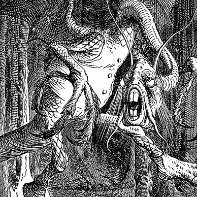

# 2022 年更好编程的 Python 精华

> 原文：<https://betterprogramming.pub/the-best-of-python-on-better-programming-in-2022-b7495c5d7f39>

*免责声明:本期的 Coffee Bytes 很大程度上是使用由 OpenAI 开发的语言模型 ChatGPT 编写的。虽然我们已尽一切努力确保所提供信息的准确性，但本文的内容不应被视为权威或详尽。*

Python 爱好者们你们好，

当我们回顾过去的一年时，我们想花一点时间来庆祝我们与您分享的所有精彩的 Python 故事。从新工具到提高编码技能的技巧和诀窍，我们涵盖了广泛的主题，我们希望这些主题既有启发性又有启发性。

当我们把注意力转向未来的一年时，我们想回顾一下 2022 年以来我们最喜欢的一些故事。因此，请加入我们的回忆之旅，重温过去一年的一些亮点。

这里是我们推荐阅读的 2022 年最受欢迎的 Python 主题故事的[列表。](https://anupamchugh.medium.com/list/9ae200065eae)

[阿努帕姆丘格](https://anupamchugh.medium.com/?source=post_page-----b7495c5d7f39--------------------------------)

## 更好的 Python 2022

[View list](https://anupamchugh.medium.com/list/better-python-2022-9ae200065eae?source=post_page-----b7495c5d7f39--------------------------------)67 stories

## [Python 异步编程简介](/an-intro-to-asynchronous-programming-in-python-3-7cfa9173234)

异步编程是我们工具箱中的一项宝贵技能。Samuel Cook 通过理论和实际应用对该主题进行了全面介绍。

## [硬盘损坏？巨蟒来救援了！](/corrupted-hard-drive-python-to-the-rescue-6feb2a9e0422)

Angela Kochoska 有一个关于 Python 化险为夷的有趣故事。她的脚本从损坏的硬盘上恢复了 78%的数据，而其他工具都失败了。

## [使用这个 Streamlit 应用程序从网页中快速提取链接](/quickly-extract-links-from-a-webpage-with-this-streamlit-app-fcb5a548c58)

[Luke Gloege 博士](https://medium.com/u/780866762df?source=post_page-----b7495c5d7f39--------------------------------)探索了 Python 异步函数创建快速链接提取器的能力。SEO 分析、内容聚合和查找链接到相似内容的网站是从网页中提取链接的一些用例。

## [构建一个 Python Web 应用程序，使用 Streamlit 将视频转换为 Gif](/building-a-web-application-to-convert-a-video-to-a-gif-using-streamlit-2ab3b377eac1)

厌倦了试图找到一个可靠且易于使用的工具来将您的视频转换为 gif？[尤金妮亚·阿内洛](https://medium.com/u/86fdc517c278?source=post_page-----b7495c5d7f39--------------------------------)向我们介绍 MoviePy，这是一个 Python 库，支持广泛的视频编辑功能，包括剪切、拼接和改变 fps。

## [设计一个 Python Wordle 助手](/python-wordle-helper-b81aa05680aa)

Wordle 在 2022 年初获得了广泛的欢迎。如果你还在唠叨，[约翰·克拉克克雷格](https://medium.com/u/667cfc1401ea?source=post_page-----b7495c5d7f39--------------------------------)有一个 Python 脚本来帮助我们减少可能的 5 个字母单词列表。

## [我分叉了“Asyncpg”——它将数据库记录解析到 Numpy 快了 20 倍](/i-forked-asyncpg-and-it-parses-database-records-to-numpy-20x-faster-e71024a84bff)

[Vadim Markovtsev](https://medium.com/u/9114102f2482?source=post_page-----b7495c5d7f39--------------------------------) 描述了他分叉`asyncpg`的原因 Python 的异步 PostgreSQL 客户端。它应该会引起那些寻找优化数据库管理方法的人的兴趣。

## [用几行 Python 代码自动创建 NBA 集锦](/automatically-creating-nba-highlights-in-5-minutes-7f90bfedd775)

喜欢 NBA，但由于比赛时间太晚，很难跟上完整的比赛？如果是这样的话， [Noam Ephrat](https://medium.com/u/ef89ab3f04db?source=post_page-----b7495c5d7f39--------------------------------) 展示了如何通过使用开源计算机视觉模型跟踪视频帧的时钟时间来自动化创建高光的过程。

## [使用 PyScript 在网络上运行 Python 脚本](/running-python-script-on-the-web-using-pyscript-the-next-big-thing-8ace9543d75)

在 PyCon US 2022 上，Anaconda 发布了 PyScript，这是一种在浏览器中编写 Python 的方法。崔永在这里帮助我们理解这种很有前途的新网络开发工具的优点和缺点。

## [Python 3.11 中的 4 项新类型注释特性](/4-new-type-annotation-features-in-python-3-11-84e7ec277c29)

崔永在这期的详细教程中有很多故事——从安装 Python 3.11 到探索类型注释特性——他都涉及到了。

## [用 Python 语法认识 py web 3d—three . js](/three-js-with-python-syntax-pyweb3d-2152bed1a43d)

想要轻松地将 3D 图形整合到 Python 项目中吗？只看 PyWeb3D！PyWeb3D 是由 [Bruno Odinukweze](https://medium.com/u/9055f33b18ea?source=post_page-----b7495c5d7f39--------------------------------) 构建的开源项目，它结合了 three.js 库的强大功能和 Python 语法的简单性。

## [用 Python 和 Graphviz 制作正则表达式动画](/animating-regular-expressions-with-python-and-graphviz-e0df447b827a)

厌倦了在正则表达式方面不断尝试破译外语的感觉吗？我们感受到你了！但是不要害怕，因为艾登·施瓦茨会帮助你理解这一切。他讨论了正则表达式的基本规则，以及它们如何在使用 Python 和 Graphviz 的可视化表示中工作。

## [Python 列表理解比你想象的更强大](/python-list-comprehensions-are-more-powerful-than-you-might-think-3363a90e5bb0)

[Martin Heinz](https://medium.com/u/4cbd6b36e62a?source=post_page-----b7495c5d7f39--------------------------------) 帮助我们发现 Python 列表理解的无限可能性和局限性——这是提高您对语言特性理解的一个好方法！

## [用 OpenAI 的耳语修复 YouTube 搜索](/fixing-youtube-search-with-openais-whisper-90bb569073cf)

使用 Whisper 或其他技术，如 transformers 和 vector search，来构建一个新的改进的 YouTube 搜索是一个有趣的想法。YouTube 的搜索功能当然很强大，但总有改进的空间。 [James Briggs](https://medium.com/u/b9d77a4ca1d1?source=post_page-----b7495c5d7f39--------------------------------) 亲自动手构建了一个更好的支持语音的(音频)搜索。

## [使用 OpenAI 用 Python 构建一个相当于 Alexa 或 Siri 的机器人](/building-an-alexa-or-siri-equivalent-bot-in-python-ea07ed001445)

[Andrew Hershy](https://medium.com/u/f2b7b4b5294a?source=post_page-----b7495c5d7f39--------------------------------) 在 OpenAI 的 Whisper 工具推出之前建造了这个。现在，您可以尝试用 Whisper 替换 AssemblyAI，并对结果进行基准测试。

## [用 Python 制作图像音乐](/making-music-from-images-with-python-81db627fd549)

维克多·穆尔西亚尝试用你最喜欢的图像创作独特而又听起来很酷的歌曲。无论你是音乐爱好者还是 Python 爱好者，你都不想错过这个项目——尤其是在 [AI 音乐生成器](https://www.riffusion.com/about)刚刚起步的时候。

这就结束了这个问题。感谢阅读。