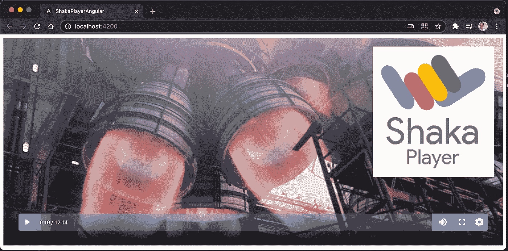
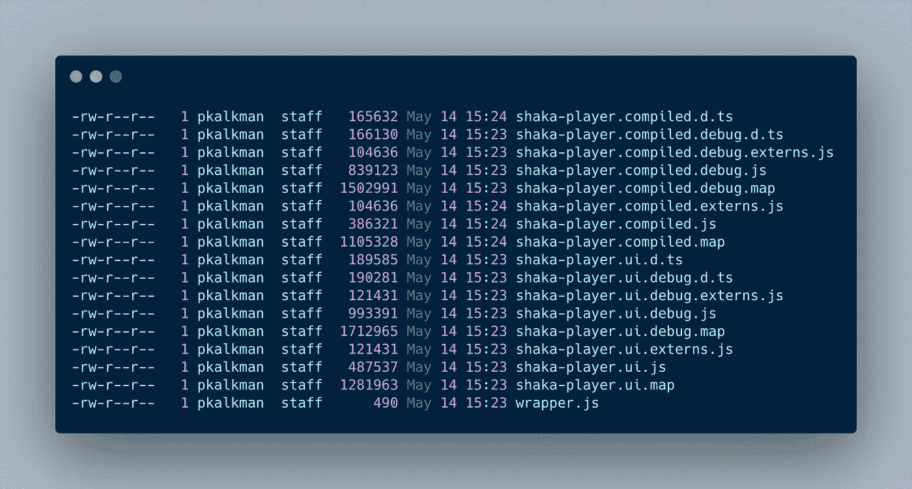
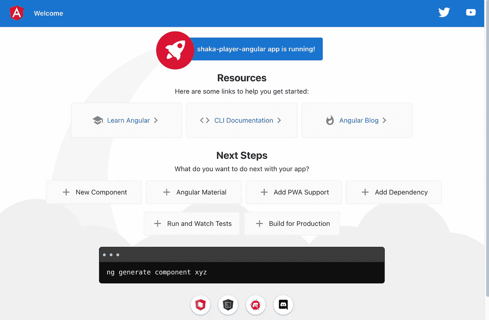
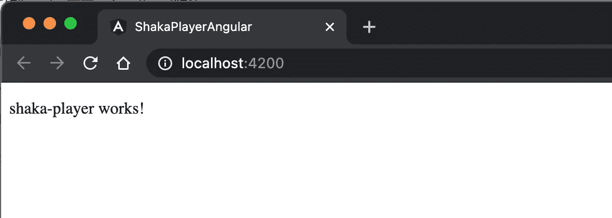
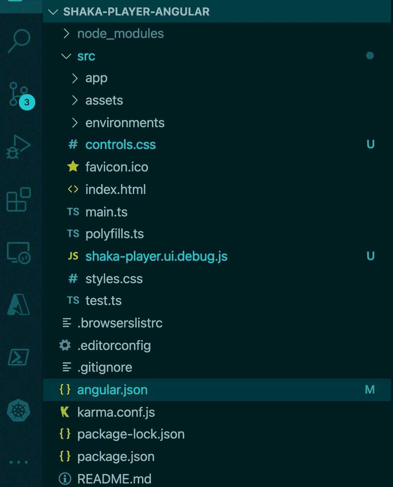
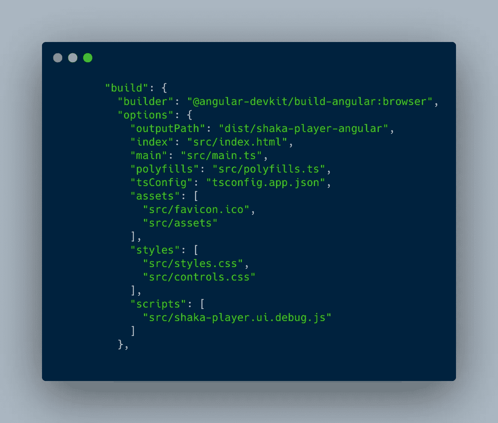
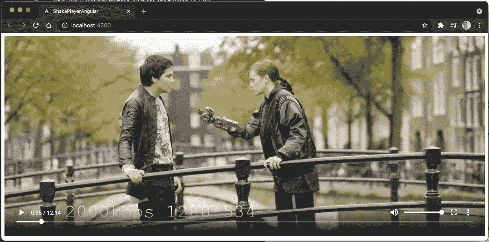
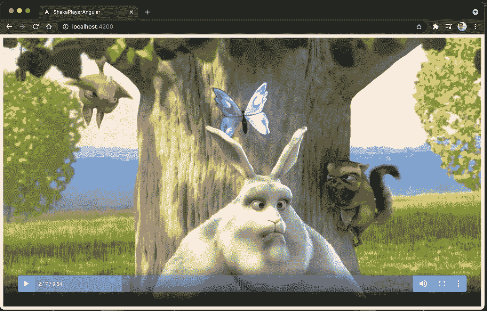
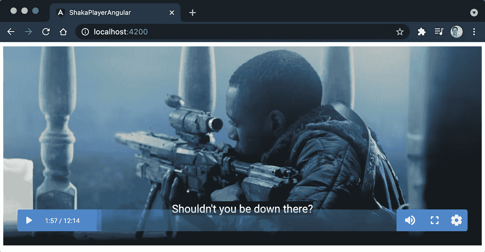
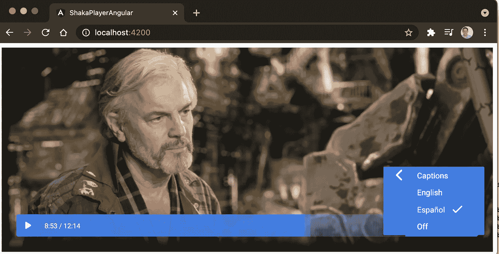

# 与 Angular 应用程序集成的最佳开源媒体播放器

> 原文：<https://betterprogramming.pub/the-best-open-source-media-player-to-integrate-with-your-angular-apps-39a80ff1aedb>

## 在你的角度应用程序中设置沙加播放器



最近，在我的公司，我们开始在网络应用中使用沙加播放器来播放媒体。

[沙加播放器](https://github.com/google/shaka-player)是来自 Google 的一个优秀的开源 JavaScript 库。它可以在不使用任何浏览器插件的情况下播放 DASH 和 HLS。这通过使用标准的[媒体源扩展](http://w3c.github.io/media-source/)和[加密媒体扩展](https://w3c.github.io/encrypted-media/)来实现。

我们有一些使用沙加播放器的经验，但是没有在我们的产品应用中使用它。虽然沙加播放器的文档非常好，但是没有关于如何将沙加播放器库集成到 Angular 的文档。

当我们成功地将沙加播放器集成到我们的 Angular 应用程序中时，这篇文章详细描述了我们是如何做到的。

我们从 Azure Media Player 切换到沙加播放器，因为我们切换到了不同的编码和打包解决方案。微软将 Azure Media Player 与 Azure Media Service 平台紧密耦合，因此打包的媒体无法从我们的新打包平台正确播放。

Angular 应用和沙加播放器 Angular 组件的源代码可以在[这个 Github 库](https://github.com/PatrickKalkman/shaka-player-angular)中找到。

# 如何获取和编译沙加播放器

有三种方法可以得到沙加播放器。

*   您可以从源代码编译它
*   您可以使用 npm 安装它
*   你可以使用谷歌 CDN 直接链接到它

我们将从源代码编译它。这允许我们在必要时从发布版本切换到调试版本。要编译这个库，您必须安装所需的工具，从 GitHub 获取源代码，并运行 Python 中的构建脚本。

我不会在这里重复完整的[文档](https://shaka-player-demo.appspot.com/docs/api/tutorial-welcome.html)，但是，简而言之，它归结为:

1.  从 Github 获取源代码:

```
git clone https://github.com/google/shaka-player.git 
```

2.通过运行 Python 构建脚本来编译源代码

```
python build/all.p
```



编译后的沙加播放器的各种版本

如果一切顺利，您将在`dist`文件夹中拥有各种版本的库。如果没有，请检查[文档](https://shaka-player-demo.appspot.com/docs/api/tutorial-welcome.html)。

# 创建角度演示应用程序

有了编译好的沙加播放器库，我们就可以实现 Angular 应用程序了。在撰写本文时，我们将使用最新版本的 Angular CLI v 12 . 0 . 0 来创建应用程序。

我们通过在命令行执行`ng new shaka-player-angular`来创建 Angular 应用程序。我选择无路由和 CSS 作为选项。生成 app 后，通过在命令行执行`ng serve -o`来确保它正确运行。

如果一切顺利，应该会打开一个浏览器，显示以下屏幕:



创建新应用程序后的欢迎屏幕

# 创建沙加播放器角度组件

现在我们已经生成了 Angular 应用程序，我们将创建沙加播放器组件。这个角组件将包含视频元素和沙加播放器。

我们使用 Angular CLI 通过在命令行上执行命令`ng generate component shared/shaka-player`来创建组件。我使用 shared 是因为我希望组件位于共享文件夹下。

为了确保一切顺利，进入`shaka-player.component.html`文件，删除其中的所有内容，并用`<app-shaka-player></app-shaka-player>`替换。保存文件，用`ng serve -o`再次启动应用程序。

它应该会在您的浏览器中显示以下结果:



运行中的沙加播放器组件

如果您看到这个，那么您已经成功地创建了 shaka-player 组件。

# 将编译好的沙加播放器源码集成到 Angular

现在是有趣的部分:如何将编译好的沙加播放器库集成到应用程序中。下面详细解释一下。

## 添加库和样式表

首先，我们要将编译好的文件复制到 Angular app 中。进入 shaka-player 的`dist`文件夹，将`shaka-player.ui.debug.js`和`controls.css`复制到 angular app 的`src`文件夹。



shaka-player.ui.debug.js 和 controls.css 复制到 Angular app 的 src 文件夹中

现在我们必须告诉 Angular 使用这个脚本和样式表。我们将两个文件都添加到 angular.json 中，将`“src/controls.css”`添加到`styles`数组中，将`“src/shaka-player-ui.debug.js”`添加到`scripts`数组中。



向 Angular.json 添加 control.css 和 shaka-player.ui.debug.js

这确保了 Angular 应用程序可以使用沙加播放器库和样式。

## 初始化播放器

在我们能使用播放器之前，我们必须初始化它。我们必须改变 shaka-player 组件的 HTML。从`shaka-player-component.html`中删除`<p>shaka-player works!</p>`，并替换为以下 HTML:

创建视频和视频容器元素

我们创建了一个由`div`包装的`video`元素。这是沙加播放器的 UI 库所期望的结构。让我们看看如何通过实现`shaka-player.component.ts`来激活沙加播放器:

激活沙加播放器库

在行`10`和`11`上，我们使用`[@ViewChild](http://twitter.com/ViewChild)`通过给定的选择器查询视图。执行完这些语句后，`videoElementRef`包含对视频元素的引用，而`videoContainerRef`包含对包装视频元素的 div 的引用。

在第`20`行，在`ngAfterViewInit`中，我们调用`shaka.polyfill.installAll()`。这修补了所有浏览器的不兼容性。

然后在行`22`和`23`上，我们得到隐藏在`ElementRef`内部的`nativeElement`。我们将使用这些来配置`initPlayer()`中的 UI。这个方法负责配置 UI 和开始回放。

initPlayer 创建沙加播放器，加载并启动视频

在`initPlayer`的第`2`行上发生的第一件事是它创建了 shaka 播放器。然后，在第`4`行，它通过传入播放器、视频容器元素和视频元素来覆盖 UI。

在第`10`行，我们加载电影 T [的 MPEG-DASH 流，如果成功，就开始回放。](https://mango.blender.org/)

如果你用`ng serve -o`再次启动应用程序，它应该会打开一个浏览器并开始播放视频。您应该有几个控件来控制电影的回放，如播放、暂停、分辨率和音量。



沙加玩家播放开源电影[钢铁之泪](https://mango.blender.org/)

# 沙加玩家主题

来自瑞典的阿米莉娅·桑帕斯为《沙加玩家》创作了几个伟大的主题。我们将使用阿姆斯特丹-酸性蓝主题。你可以从这个页面下载主题。

当你下载主题时，你会得到一个包含 JavaScript 和 CSS 文件的 zip 文件。在我们的例子中，我们得到了`amsterdam-acid-blue.js`和`amsterdam-acid-blue.css`。

我们将这两个文件复制到 angular 应用程序的`src`文件夹中，就像我们之前处理 shaka 播放器文件一样。同样，我们将它们添加到`angular.json`中的`scripts`和`styles`数组中。

最后，我们将`class=”amsterdam-acid-blue”`添加到视频容器`div`元素中，如下所示:

向容器 div 元素添加 amsterdam-acid-blue 类

当我们重新加载应用程序时，我们看到阿姆斯特丹酸性蓝主题是活跃的



在沙加播放器上显示阿姆斯特丹酸性蓝主题

# HLS 和 DASH 回放

我们用来测试回放的电影使用 MPEG-DASH 格式。这意味着，如果你在 Windows 或 macOS 上使用 Chrome，它将正确播放视频。

但是，如果您在 iOS 设备上播放视频或使用 Safari，视频将不会播放。这是因为 iOS 上的 Safari 不支持 MPEG-DASH——你需要 HLS 格式的视频。

沙加播放器支持破折号和 HLS 播放。我们必须根据平台选择正确的视频。我们导入 Angular Platform 模块，并使用它来检测 Safari:

使用角度平台模块来检测我们是否在 Safari 上运行

# 添加和选择字幕

沙加播放器支持字幕。如果字幕嵌入在 DASH 或 HLS 流中，您可以直接使用它们。如果您有单独的字幕文件，您可以使用以下源代码添加它们:

加载并选择字幕

视频加载后，我们使用第`5`行的`addTextTrackAsync`来添加字幕。在行`6`到`10`上，我们选择字幕轨道。如果我们不这样做，用户必须使用标题菜单来选择标题。



沙加选手演奏钢之泪，英文字幕

您可以通过多次调用`addTextTrackAsync`来添加多个字幕轨道。UI 自动将字幕轨道添加到菜单中，以便用户能够选择字幕的语言。



通过沙加播放器用户界面选择字幕语言

# 数字版权管理(DRM)

沙加播放器支持以下带有 DASH 和/或 HLS 流的 DRM。

*   谷歌 [Widevine](http://www.widevine.com/) :破折号& HLS
*   微软 [PlayReady](https://www.microsoft.com/playready/) : DASH
*   W3C [清除键](https://w3c.github.io/encrypted-media/#clear-key):破折号
*   [Apple FairPlay 流媒体(FPS)](https://developer.apple.com/streaming/fps/) : HLS

沙加播放器使用加密媒体扩展(EME)，这需要一个安全的网址。因此，为了测试受 DRM 保护的内容，有必要使用 HTTPS。如果站点使用 HTTPS，那么清单和每个段也需要使用 HTTPS。这是因为混合的内容需求。

为了指定 Widevine 或 PlayReady 的许可证服务器 URL，我们使用以下代码。根据浏览器的不同，我们配置苹果 Fairplay 或者谷歌 Widevine。

使用 Fairplay 时，我们需要一个带有公钥的证书。该证书在第 1 行接收，在第 12 行配置。Fairplay 和 Widevine 都需要知道许可证服务器的位置。

Fairplay 许可证服务器配置在第`8`行。Widevine 许可证服务器配置在第`21`行。你只需要插入你的 Widevine 或者 Fairplay 许可服务器的 URL。

# 结论

我们的媒体解决方案成功地从 Azure Media Player 迁移到了沙加播放器。事实上，沙加播放器是开源的，这是一个很大的帮助。

沙加播放器包括优秀的文档，并有一个充满活力的社区，总是乐意提供帮助。您可以使用或不使用 DRM 来播放 MPEG-DASH 和 HLS 流。沙加播放器支持字幕和多语言音频。

我们将沙加播放器集成到我们的 Angular 应用程序中。我通过 PR 向官方的沙加播放器 Github 库提交了源代码，作为展示如何将沙加播放器集成到 Angular 应用程序中的例子。

假设你有一个 Angular 应用，在寻找一种整合媒体的方式。你应该去看看沙加玩家。这个 Github 库中的例子应该会给你一个好的开始。

感谢您的阅读。