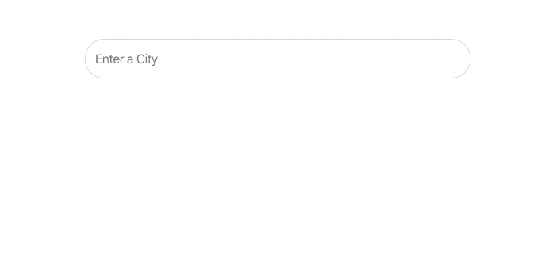
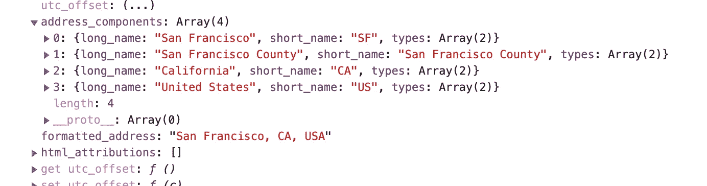

# 如何在没有第三方库的情况下使用 Google Place Autocomplete 和 React

> 原文：<https://betterprogramming.pub/the-best-practice-with-google-place-autocomplete-api-on-react-939211e8b4ce>

## 避免依赖，直接提出你的要求


由[paweczerwiński](https://unsplash.com/@pawel_czerwinski?utm_source=unsplash&utm_medium=referral&utm_content=creditCopyText)在 [Unsplash](https://unsplash.com/s/photos/google?utm_source=unsplash&utm_medium=referral&utm_content=creditCopyText) 上拍摄的照片

我想创建一个 React web 应用程序来查找用户的位置。我设法用[谷歌位置自动完成](https://developers.google.com/places/web-service/autocomplete)做到了这一点。

自动完成是`Maps` JavaScript API 中`Places`库的一个特性。当用户开始键入地址时，自动完成功能会填充其余部分。

我试图在 React 的搜索栏中实现 Google Place 自动完成输入，但很快意识到这比我想象的要复杂。我开始寻找其他方法去做，发现了很多方法。但是，他们都使用了 libs。

我决定写这篇短文来展示我是如何在不使用第三方库的情况下完成的。

# 设置项目

首先，我将使用`[create-react-app](https://create-react-app.dev)`来创建快速的单页 React 应用程序。我们可以通过运行一个简单的命令来设置一个现代化的 web 应用程序:

```
npx create-react-app google-place-autocomplete
```

之后，将其移动到`google-place-autocomplete`目录，并从终端运行:

```
cd google-place-autocomplete
npm start
```

在我们开始之前，您需要 Google Places API 的 API-Key。你可以在这里得到钥匙。我将 Google API 密匙存储在`.env`文件中——你也应该这样做。

您的项目已经准备好开始。您的`package.json`应该是这样的:

# 制作魔法代码

让我们实现主要的`SearchLocationInput`组件来使用 Google Place 自动完成 API。首先，我们必须创建一个函数来加载使用 Google API 的脚本。让我们用`loadScript`函数创建`SearchLocationInput.js`:

我将这个脚本用于动态 JavaScript，以便在我们的公共页面上快速加载页面。它动态加载 JavaScript 文件，并在完成时进行回调。接下来，我们必须在呈现组件时将 Google Place 地图分配给`autoComplete`变量:

在`handleScriptLoad`方法中，我们从声明`authComplete`的选项开始。我们通过`setFields`方法指定从 API 获得的属性。请随意阅读[文档](https://developers.google.com/maps/documentation/javascript/places-autocomplete#add_autocomplete)了解更多详情。

然后，我们附加到自动完成监听器，每当用户选择一个自动完成建议时，它都会监听。让我们创建`handlePlaceSelect`方法来处理选择:

该方法在事件被触发时被调用，并从 API 获取位置数据。然后我们就可以用数据做任何操作了。

最后，我们的`SearchLocationInput.js`:

# 让我们演示一下我们的自动完成功能！



Google Place 自动完成



Google API 结果

如果你想检查所有代码，这里有 [Github](https://github.com/Gapur/google-place-autocomplete) 的链接。

我希望这篇文章对你有用。

# 资源

*   [在 React 应用程序中使用 Google Place 自动完成 JavaScript API](https://medium.com/@hamzaqaisrani/using-the-google-maps-places-autocomplete-javascript-api-in-a-react-project-5742bab4abc9)
*   [自动完成地址和搜索词](https://developers.google.com/maps/documentation/javascript/places-autocomplete)
*   [地点自动完成](https://www.w3docs.com/learn-javascript/places-autocomplete.html)
*   链接到 [Github](https://github.com/Gapur/google-place-autocomplete)