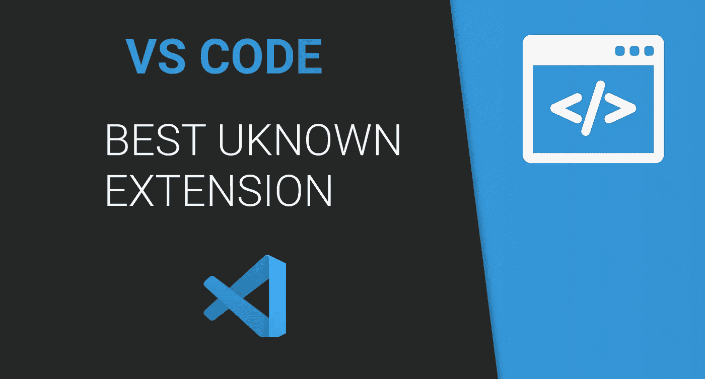
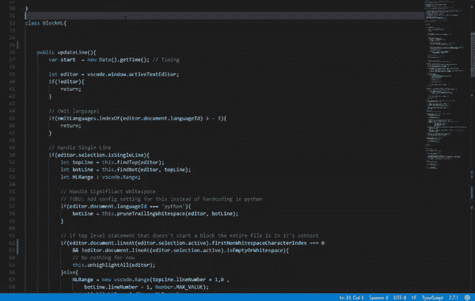

# 你没听说过的最好的 VS 代码扩展

> 原文：<https://betterprogramming.pub/the-best-vs-code-extension-you-havent-heard-of-a5966ebbe820>

## 这个 VS 代码扩展只有不到 10，000 次安装，我每天都在使用它

# 寻找更好的扩展

不知道没有 VS 代码怎么办。我已经尝试了这么多不同的代码编辑器和 ide，并且我不断回到它。除了开发人员经常投入大量工作来更新应用程序之外，扩展是我最喜欢的特性。

几乎每天，我都在寻找新的扩展来使用。我用谷歌搜索、阅读文章、查看热门榜单。有时我会试五分钟，有时会试两天，然后再决定要不要。这导致了一些伟大的发现。

这个扩展可能是我的最爱之一。当我在 VS 代码中搜索该特性时，我偶然发现了它，当然，我找到了覆盖该特性的扩展。

我已经在我写的另一篇[文章](https://medium.com/better-programming/my-7-favorite-vs-code-extensions-that-everyone-hasnt-mentioned-yet-4f3945d82be5)中提到过它，那是一些我最喜欢的扩展的集合。然而，我认为这一个更值得关注。

# 缩进块突出显示

该扩展的名称是[缩进块突出显示](https://marketplace.visualstudio.com/items?itemName=byi8220.indented-block-highlighting)，它确实如名称所暗示的那样——它突出显示了您已经在其中的实际代码块。这在很多方面都很有用。

人类不擅长读代码，或者说，至少不如计算机。这就是为什么我们使用颜色代码、缩进和间距来更容易理解我们正在阅读和书写的内容。

这个扩展使用了相同的原理——借助颜色，您可以很容易地看到光标位于哪个块中，以及它何时结束。在一个嵌套的代码块中，很神奇。

我希望分机能派上用场。我注意到的唯一缺点是它已经两年没有更新了。但是只要它有效，我就非常满意。