# 2021 年 Python 开发者的最佳 VS 代码扩展

> 原文：<https://betterprogramming.pub/the-best-vs-code-extensions-for-python-developers-for-2021-748b2ce16eee>

## Python 生产力

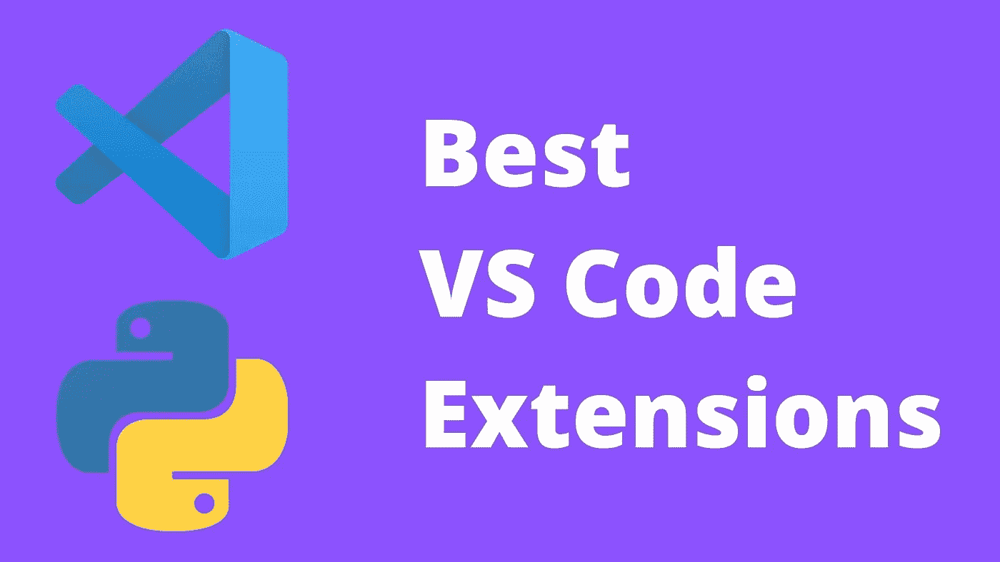

作者图片

我们为 JS 开发者列出了[最佳 VS 扩展](https://livecodestream.dev/post/the-best-vs-code-extensions-for-javascript-developers-for-2021/)。现在，是我们为 Python 社区这样做的时候了。和以前一样:我是 PyCharm 的用户，我爱 PyCharm，我可能不会很快更换编辑。但是，由于围绕 VS 代码的大肆宣传，以及 Reddit 和 Twitter 上这么多人建议我进行切换，我不得不尝试一下。

我的 VS 代码体验非常棒，即使我的心仍然属于 PyCharm，VS 代码是一个神奇的产品，我可以 100%推荐。它是可定制的，快速的，并且有大量的扩展使得它非常强大。

今天我们将讨论 2021 年 Python 的顶级 VS 代码扩展。

# 计算机编程语言

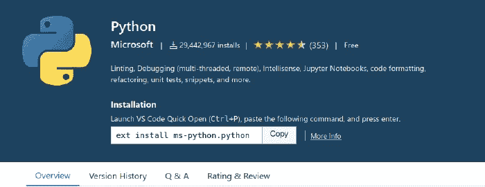

VS 代码支持没有这个扩展的 Python 代码高亮显示。但是，如果您将使用 Python，您应该安装这个扩展。扩展是微软自己开发的，和 VS 代码的创建者一样。这对 Python 开发人员的工作效率非常重要，以至于 VS 代码会自动建议您在打开第一个`.py`文件后立即安装它。

但是如果我已经有了语法高亮，为什么还需要它呢？当使用 Python 时，该扩展是一个强大的功能库，提供如下功能:

*   智能感知:使用自动完成、代码导航、语法检查等功能编辑您的代码
*   林挺:通过`Pylint`、`Flake8`等等获得额外的代码分析
*   代码格式化:用`black`、`autopep` 或`YAPF`格式化你的代码
*   调试:调试您的 Python 脚本、web 应用程序和远程或多线程进程
*   测试:使用`unittest`、`pytest`或`nose`通过测试浏览器运行和调试测试
*   Jupyter 笔记本:创建和编辑 Jupyter 笔记本，添加和运行代码单元，渲染绘图，通过变量浏览器可视化变量，使用数据查看器可视化数据框，等等
*   环境:自动激活并在`virtualenv`、`venv`、`pipenv`、`conda`和`pyenv` 环境之间切换
*   重构:使用变量提取、方法提取和导入排序来重构 Python 代码

看看它的运行情况:

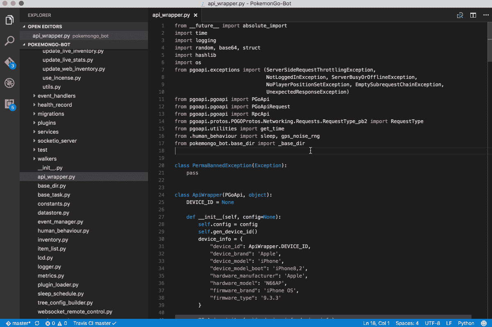

Python 扩展的演示

[下载 Python](https://marketplace.visualstudio.com/items?itemName=ms-python.python)

# Python 片段

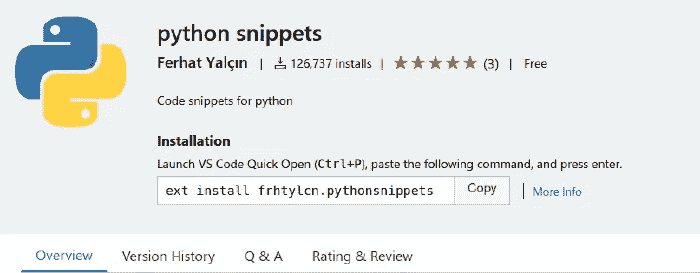

**Python Snippets** 是一个由 Ferhat Yal 开发的内置 Snippets 包的扩展。这个扩展对任何开发者都很棒，但对 Python 初学者来说尤其如此。它包含许多内置的代码片段，如`string`、`list`、`sets`、`tuple`、`dictionary`、`class`等等。使用这个插件的另一个优点是，它还提供了每个代码片段的至少一个示例，这使得它在学习 Python 时非常棒。

[下载 Python 代码片段](https://marketplace.visualstudio.com/items?itemName=frhtylcn.pythonsnippets)

# Python 文档字符串生成器

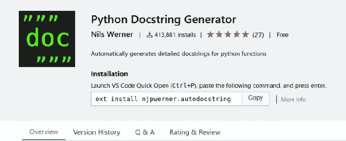

我们已经谈到了文档的重要性，以及我有多么喜欢用代码来记录文档，但是我们都知道这是一项令人沮丧的任务。Python 文档字符串生成器通过自动创建文档字符串减少了开发人员的工作量。

这个扩展最好的一点是它遵循了 docstring 的所有标准格式(包括`Google`、`docBlockr`、`Numpy`、`Sphinx`、`PEP0257` 即将推出)，这很酷。而且，这个 docstring 生成器支持`args`、`kwargs`、`decorators`、`errors`以及具有多行注释特性的参数类型。

只需看看它的实际运行情况，你就会大吃一惊:

Python 文档字符串生成器演示

[下载 Python 文档字符串生成器](https://marketplace.visualstudio.com/items?itemName=njpwerner.autodocstring)

# Visual Studio 代码的 Python 测试资源管理器

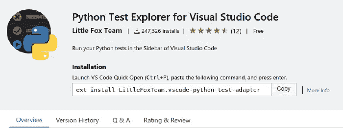

**Python 测试浏览器**扩展允许您使用测试浏览器 UI 运行 Python `unittest` 或 Pytest 测试。这个小而方便的工具将使您能够从 VS Code 的舒适环境中测试您的代码，并具有出色的用户界面和调试功能。

我们知道单元测试的重要性，所以在你的 IDE 或者代码编辑器中拥有这样的工具是必须的。

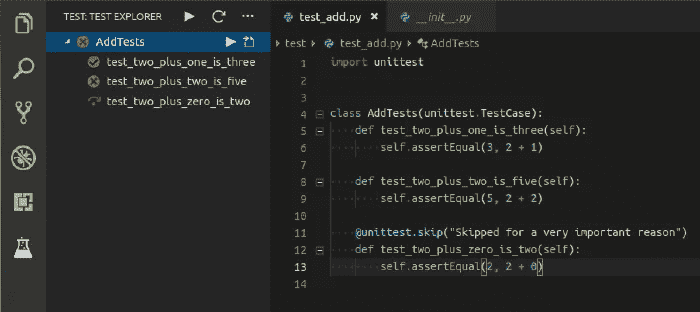

Python 测试资源管理器演示

[下载 Python 测试浏览器](https://marketplace.visualstudio.com/items?itemName=LittleFoxTeam.vscode-python-test-adapter)

# Python 预览

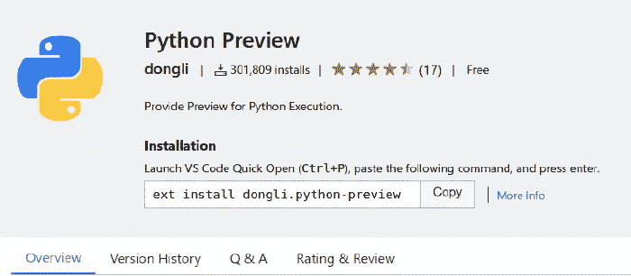

**Python Preview** 是一个为你的 Python 代码增加可视化调试的扩展。它将调试代码转换成一个交互式会话，用动画和图形元素来表示您的应用程序状态。你只需要看到它:

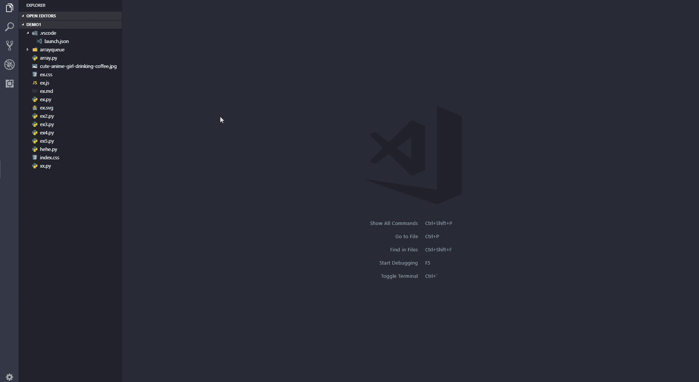

Python 预览的演示

[下载 Python 预览](https://marketplace.visualstudio.com/items?itemName=dongli.python-preview)

# Python 类型提示

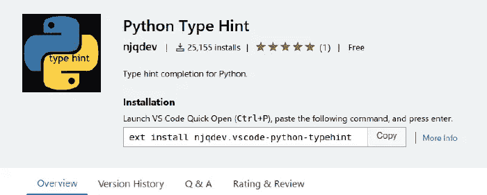

是的，Python 有类似类型的东西，是的，它很棒。可以把 Python 的[类型提示](https://docs.python.org/3/library/typing.html)看作是 JavaScript 的类型脚本。这是一个游戏改变者，我希望我们开始在教程和应用程序中看到更多。 **Python 类型提示**为内置类型、估计类型和类型化模块提供类型提示完成项。此外，它可以在工作空间中搜索 Python 文件，以进行类型估计。

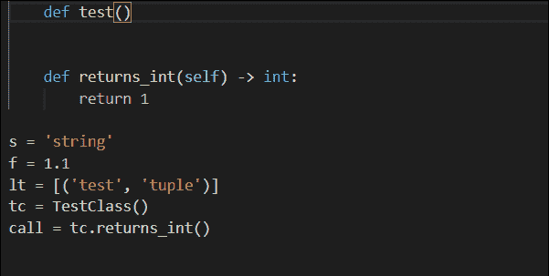

Python 类型提示的演示

[下载 Python 类型提示](https://marketplace.visualstudio.com/items?itemName=njqdev.vscode-python-typehint)

# 朱皮特

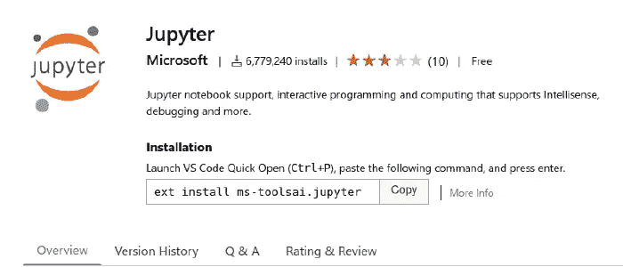

Jupyter 是我最喜欢的 VS 代码扩展之一。是的，它就是你所想的——它是直接用 VS 代码编写的 Jupyter 笔记本。作为一个经常使用 Jupyter 笔记本的人，这个扩展是有益的，我相信我还有很多需要探索的地方。

与 Jupyter 笔记本的集成是我最喜欢的 PyCharm 特性之一，尽管公平地说，我更喜欢 PyCharm 集成而不是 VS 代码集成。尽管如此，Jupyter for VS 代码是免费的，而 PyCharm Jupyter 笔记本集成仅在 pro 版本中可用。

[下载 Jupyter](https://marketplace.visualstudio.com/items?itemName=ms-toolsai.jupyter)

# 结论

正如我在这篇文章的 JS 版本中提到的，VS 代码确实让我吃惊。它是一个可靠的工具，可以快速、灵活地编码，并通过扩展来扩展功能。

有趣的是，我今天在这里列出的所有这些扩展都是我在 PyCharm 中最喜欢的特性，但都是免费的，并且具有出色的用户体验。

尽管如此，关于编辑器的细节仍然困扰着我，因此，我选择的编辑器仍然是 PyCharm，但是有了这样高质量的扩展，我发现很难证明为它付费是合理的。

感谢阅读！