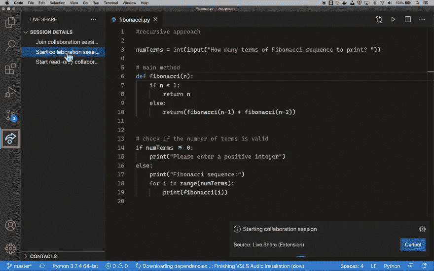
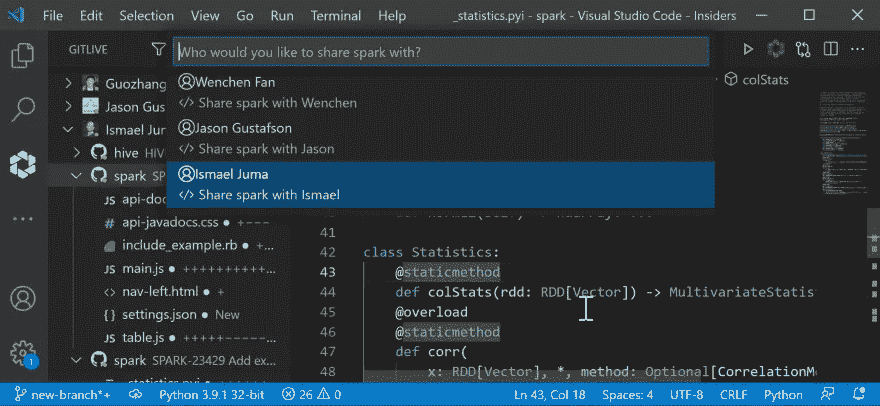
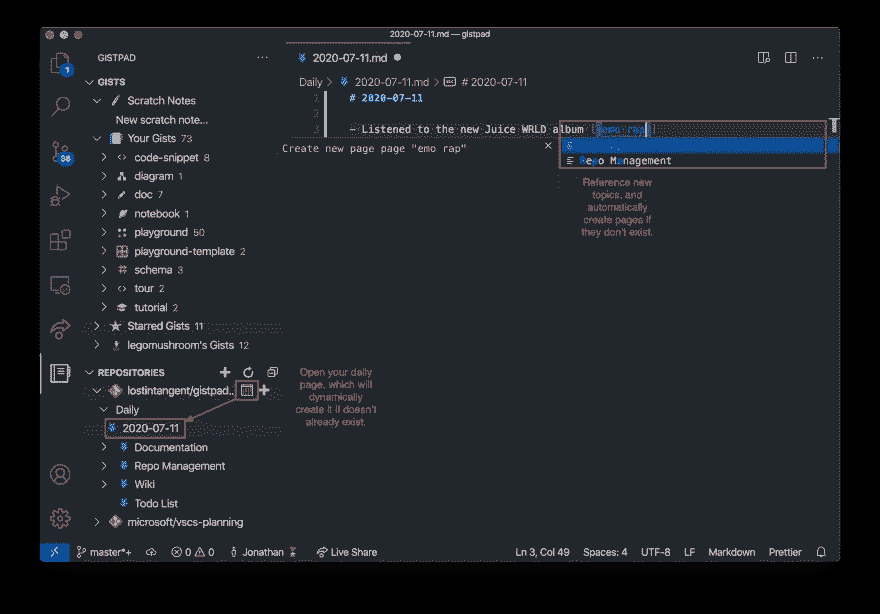
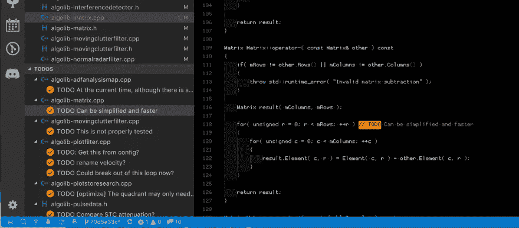
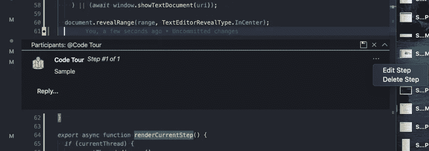
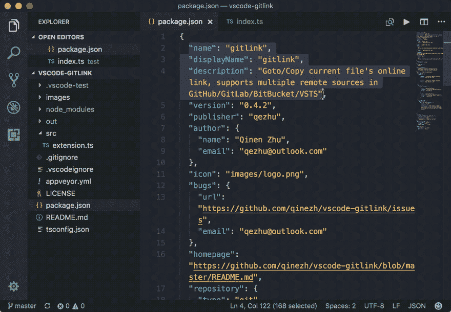

# 远程工作的最佳 VS 代码扩展

> 原文：<https://betterprogramming.pub/the-best-vs-code-extensions-for-remote-working-3b7381aa018d>

## Gistpad、GitLink 等等

诺德伍德主题公司在 [Unsplash](https://unsplash.com/s/photos/computer?utm_source=unsplash&utm_medium=referral&utm_content=creditCopyText) 上拍摄的照片

开发者想要什么？钱，弹性时间表，披萨？当然可以。轻松的远程协作？

地狱，是的！编程是一项团队运动，如果没有适当的交流，你真的不能期待惊人的结果。

远程设置可能会使开发人员之间的交流变得困难，但是如果配备了合适的工具，您就没有什么可担心的了。

让我们来看看可以极大地改善您的远程工作例程的最佳 VS 代码扩展。

# [现场分享](https://marketplace.visualstudio.com/items?itemName=MS-vsliveshare.vsliveshare)

如果你已经远程工作了一段时间，很可能你已经熟悉这个了。这个流行的扩展让你和你的队友一起编辑代码。

它还可以通过其他扩展来增强，例如[实时共享音频](https://marketplace.visualstudio.com/items?itemName=MS-vsliveshare.vsliveshare-audio)允许您进行音频通话，或者[实时共享白板](https://marketplace.visualstudio.com/items?itemName=lostintangent.vsls-whiteboard)在白板上绘图并实时查看彼此的变化。

## **远程团队的优势**

直接从 VS 代码编辑器中，通过实时结对编程来提高团队的生产力！

# [GitLive](https://marketplace.visualstudio.com/items?itemName=TeamHub.teamhub#review-details)

这个强大的工具结合了实时共享的功能和其他对远程团队非常有用的功能。您可以看到您的团队成员是否在线，他们正在处理什么问题和分支，甚至可以看到他们未提交的更改，所有这些都是实时更新的。

但是可能最有用的特性是[合并冲突检测](https://dev.to/gitlive/how-to-enable-real-time-merge-conflict-detection-in-vs-code-l2e)。指示器显示在您的队友对您打开的文件进行了更改的地方，这些指示器会在您和您的队友进行编辑时实时更新，并提供潜在合并冲突的早期警告。

最后，GitLive 通过视频通话和屏幕共享的 LiveShare 增强了代码共享，甚至允许您使用 IntelliJ、WebStorm 或 PyCharm 等其他 ide 与队友共享代码。

## **远程团队的优势**

通过实时跨 IDE 协作、合并冲突检测和视频通话，改善开发人员的沟通！

# [GistPad](https://marketplace.visualstudio.com/items?itemName=vsls-contrib.gistfs)

Gists 是一个很好的方式，不仅可以创建代码片段、笔记或任务列表供您私人使用，还可以轻松地与您的同事共享。使用 GistPad，您可以直接从 VS 代码编辑器无缝地完成它！

您可以从零开始，从本地文件或片段创建新的 gists。您还可以搜索并评论您队友的 gist(所有评论将显示在已打开文件的底部或作为多文件 gist 中的一个线程)。

该扩展有广泛的文档和许多很酷的特性。我真正喜欢的是排序功能，当启用时，它会按类型对您的列表进行分组(例如*注释* —由`.txt, .md/.markdown`或`.adoc`文件组成的列表，或者*图表*—包含`.drawio`文件的列表)，这使得快速找到您想要的内容变得非常容易。

## **远程团队的优势**

Gists 通常与不太正式、随意的合作联系在一起。该扩展使得对代码片段进行头脑风暴、处理和保存经常重用的代码片段或者共享任务列表变得更加容易。

# [待办事宜树](https://marketplace.visualstudio.com/items?itemName=Gruntfuggly.todo-tree)

如果你在编码时创建了很多 TODOs，并且需要帮助来跟踪它们，这个扩展是一个救星。它将在您的工作区中快速搜索注释标签，如 TODO 和 FIXME，并在 explorer 窗格中以树形视图显示它们。

单击树中的 todo 会将您带到需要修复的确切代码行，并额外突出显示文件中的每个 TODO。

## **远程团队的优势**

这个扩展给了你一个所有待办事项的概览，以及一个从编辑器中轻松访问它们的方法。和你的队友一起使用它，确保没有任务会被遗忘！

# [代码浏览](https://marketplace.visualstudio.com/items?itemName=vsls-contrib.codetour)

如果你正在寻找一种方法让一个新成员顺利加入你的团队，Codetour 可能正是你所需要的。这个方便的扩展允许您直接在编辑器中记录和回放代码库的引导遍历。

“代码之旅”是与特定目录、文件或代码行相关的一系列交互式步骤，包括相应代码的描述，并保存在选定的工作区中。该扩展带有内置指南，可帮助您开始执行特定任务(例如录制、导出、开始或导航游览)。您可以随时通过重新安排或删除某些步骤来编辑教程，甚至可以更改与教程相关联的 git ref。

## **远程团队的优势**

这是一个很好的方式来解释代码库，并为团队的每个成员创建随时可以在 VS 代码中使用的项目指南！

# [Git 链接](https://marketplace.visualstudio.com/items?itemName=qezhu.gitlink)

简单而有效的扩展，只有一个作用:允许你从你的编辑器中发送一个选择代码的链接给你的队友，他们可以在 GitHub 中查看。除了与您的团队共享代码的好处之外(注意，只有提交的更改才会反映在链接中)，如果您想要检查历史、贡献者或分支版本，它也是有用的。

## **远程团队的优势**

轻松地将代码片段的链接发送给同事！

分布式团队内部的良好沟通是高效远程工作的关键。希望我在这篇短文中总结的一些工具能够让您的团队协作更快、更高效、更有成果。黑客快乐！