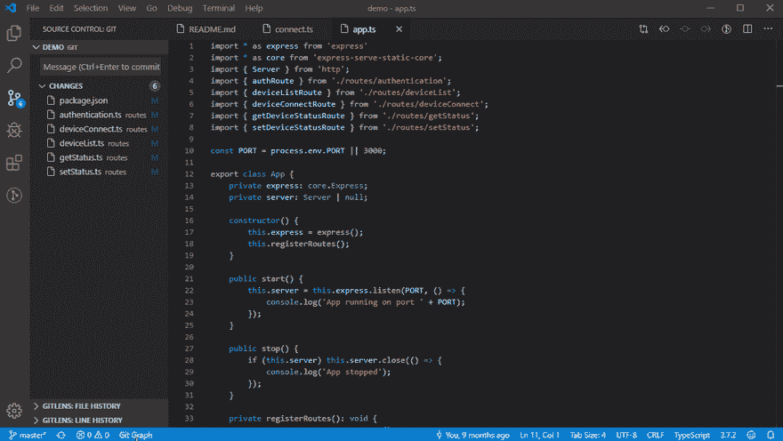
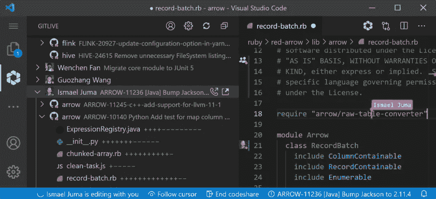
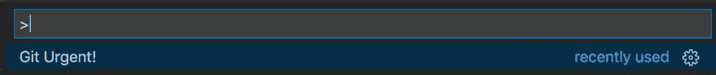
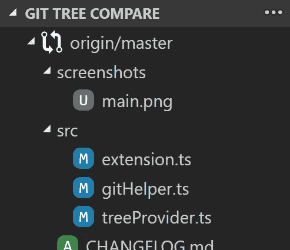
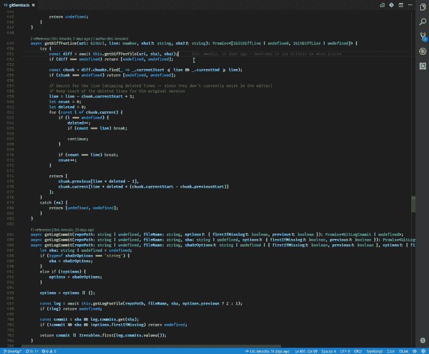

# 增强 Git 性能的最佳 VS 代码扩展

> 原文：<https://betterprogramming.pub/the-best-vs-code-extensions-to-supercharge-your-git-5d5ab3f64f64>

## 是的，不止是 GitLens！

[毗湿奴·R·奈尔](https://unsplash.com/@vishnurnair?utm_source=unsplash&utm_medium=referral&utm_content=creditCopyText)在 [Unsplash](https://unsplash.com/@vishnurnair?utm_source=unsplash&utm_medium=referral&utm_content=creditCopyText) 上的照片

是的，我知道，我们都应该成为终极忍者，记住每一个 git 命令。或者，像穴居人一样，我们可以把两根棍子放在一起(或者在这种情况下，VS 代码)并通过惊人的扩展创建 fire(也就是使用 UI)来使用 Git，这些扩展不仅使使用 Git 变得更容易，而且还用很酷的新特性和超能力来扩展 Git！

# 1. [Git 图](https://marketplace.visualstudio.com/items?itemName=mhutchie.git-graph) —流行的那种

Git Graph 必须是在 VS 代码中与 Git 交互的最具视觉吸引力的方式，当执行更复杂的 Git 操作时，看到这样的提交树会有很大帮助。

它是非常可定制的，并为您提供对 UI 的粒度控制，如图形样式和分支颜色。

您可以单击任何提交来查看细节和文件更改，甚至可以在不离开 IDE 的情况下执行代码审查！

*   安装:150 万
*   优点:一个匹配 GitKraken 或 SourceTree 的用户界面，但直接内置于 VS 代码中以避免上下文切换。

[来源](https://marketplace.visualstudio.com/items?itemName=TeamHub.teamhub)

# 2.[git live](https://marketplace.visualstudio.com/items?itemName=TeamHub.teamhub)后起之秀

这个扩展是给所有团队成员的，GitLive 让 Git，嗯，活起来。它在 VS 代码中添加了一个标签，你可以在这里看到你的同事，如果他们在线，他们正在处理什么问题和分支，甚至他们未提交的更改，所有这些都是实时更新的。

你的队友的修改也会显示在编辑器的空白处，你可以将它们与你的修改进行比较，如果需要的话，你可以将它们直接添加到你的文件副本中。相当酷！

这个扩展的一个额外的好处是，它增加了视频通话和屏幕共享到 LiveShare，你可以直接从 VS 代码拨打电话，启动 LiveShare，而不用复制和粘贴链接。

*   安装:14 000 台
*   优点:获得潜在合并冲突的提前警告，变更指示器显示您的队友在哪里进行变更。

# 3. [Git 自动机](https://marketplace.visualstudio.com/items?itemName=ivangabriele.vscode-git-add-and-commit)

这是为所有懒惰的开发人员准备的，特别是那些不喜欢在提交消息上花费太多时间或精力的人。我看到了足够多的提交消息，知道你们中也有很多人。

Git Automator 允许您通过快捷方式添加和提交文件。它还为提交消息提供自动预填充。当操作很明显时，例如，如果您删除了一个文件，Git Automator 会猜测该操作并将其添加到预填充的提交消息中。

您还可以设置一些自己的快捷方式，并使用它们来生成自动提交消息。

*   安装:53 000
*   优点:自动填充的提交消息！

[来源](https://marketplace.visualstudio.com/items?itemName=ivangabriele.vscode-git-add-and-commit)

# 4.[饭桶急](https://marketplace.visualstudio.com/items?itemName=arafathusayn.git-urgent)

这一个，我把它归入简单，但是有效的一类。安装了这个扩展，你所要做的就是在 VS 代码命令面板中搜索“Git Urgent”，你就可以用一个命令 git add all，commit，push。

伟大的修补程序和其他紧急情况！

*   安装:3 700 个
*   优点:一步到位，提交和推进

作者截图

# 5. [Git 树比较](https://marketplace.visualstudio.com/items?itemName=letmaik.git-tree-compare)

Git Tree Compare 是一个方便的扩展，可以将工作树与分支、标签或提交进行比较。

位于 Source 选项卡中的文件夹树结构(您可以将其配置为显示在 Explorer 选项卡中)快速为您提供有关您正在处理的文件的上下文(在大型项目中非常有用！).文件名称旁边显示的图标使您可以快速了解文件是否被添加、删除或修改。

选择比较的基础后，您可以选择打开所有更改或打开已更改的文件(添加的文件也将打开，但更改不会显示)。您也可以选择是直接与选定的基准参考进行比较(完全模式)，还是先计算合并基准(合并模式)。

*   安装:100 000
*   优点:拉请求准备和合并预览！

作者截图

# 6.[git lens](https://marketplace.visualstudio.com/items?itemName=eamodio.gitlens)

嗯，我们不能真的把它漏掉，对吧？gitLens 安装了近 1000 万次，已经真正成为在代码中使用 Git 的事实上的标准扩展，相比之下，它只附带了相当少的 Git 集成。

他们也许应该开始将它与 VS 代码捆绑在一起(特别是因为作者现在是核心 VS 代码开发团队的一员！)

*   安装:1000 万
*   优点:编辑器栏中的按需文件注释，包括责备(显示每一行的提交和作者)、更改(突出显示本地更改)、热图(显示最近行是如何更改的)。

# 结论

虽然 Git 很棒，但是搜索和输入 Git 命令可能会有点乏味。希望这些扩展中的一些能够减少你需要花费的时间，并帮助你做更多的事情！