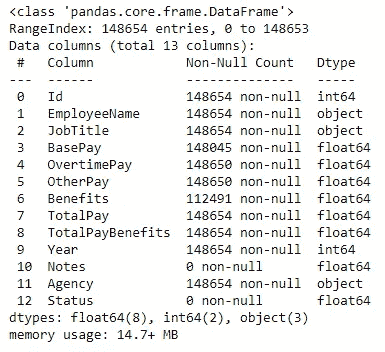
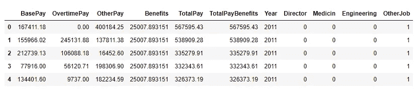
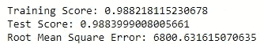
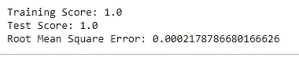
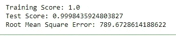
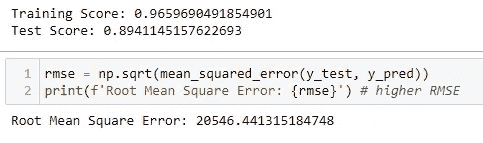
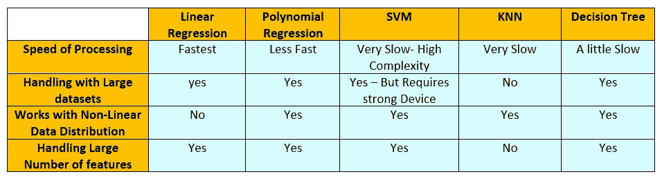

# 选择回归算法的最佳方式

> 原文：<https://betterprogramming.pub/the-best-way-to-choose-a-regression-algorithm-c23992c82d8e>

## 让我们比较一下梯度下降、KNN、决策树和随机森林算法


由[马库斯·斯皮斯克](https://unsplash.com/@markusspiske?utm_source=medium&utm_medium=referral)在 [Unsplash](https://unsplash.com?utm_source=medium&utm_medium=referral) 上拍摄的照片

在我的机器学习之旅的开始，我对我工作的每个数据集应该使用什么模型有很多疑虑。如果我对每个模型的最佳用例有所了解，事情会变得更简单。虽然在机器学习领域，它是关于一遍又一遍地尝试不同的模型，以找到最适合你的数据和目标的模型，但减少选项也是很好的，特别是作为初学者。

在本文中，我们将使用 ka ggle:[https://www.kaggle.com/kaggle/sf-salaries](https://www.kaggle.com/kaggle/sf-salaries)上的 SF 薪水数据集来比较回归问题的基本监督学习技术

我们将要做的是:

*   回归导论
*   对数据集执行一些预处理
*   使用整个 SF 薪水数据集来比较我们的算法
*   结论

# 回归导论

如果你已经知道什么是监督学习，你一定遇到过术语*回归*。

机器学习中的回归可以定义为基于一个或多个预测变量( *x* )的值预测连续结果( *y* )的多种数学方法 */* 模型。

一些回归问题可能是:

*   预测产品的销售
*   洞察消费者行为和盈利能力
*   评估市场趋势，做出估计和预测
*   对学生成绩的期望

在所有这些情况下，预期的输出都是无法分类的连续数值。


监督学习基本算法图(图片来源:作者)

注意:我们不会调查正则化或助推技术。

# 数据预处理

首先，使用以下命令导入所需的库:

```
import numpy as np
import pandas as pd
import seaborn as sns
from matplotlib import pyplot as plt%matplotlib inline
sns.set(rc={'figure.figsize': [10, 10]}, font_scale=1.3)df = pd.read_csv('Salaries.csv')
```

那么是时候调查数据集了。

```
df.info()
```



输出的屏幕截图

输出是可读的，非常简单。它有许多空值和两行没有任何值。为了更好的预测，这些 nan 最好被移除。以下是我如何删除它们。

```
# Dropping the empty columns
df = df.drop(['Notes','Status','Id'], axis=1)
df = df.drop(df[df['OvertimePay'].isna()==True].index)# Filling Nan in values
df['BasePay'].fillna(df['BasePay'].mean(), inplace=True)
df['Benefits'].fillna(df['Benefits'].mean(), inplace=True) # contain outliers so use median (not affected by outliers as mean)
```

对于`BasePay` float 列，最好使用平均值来处理，对于`Benefits`列，最佳实践是使用中位数，因为它不受异常值的影响。

## 处理分类数据

我们有三个分类特征:`Agency`、`EmployeeName`和`JobTitle`。在我们的任务中，`EmployeeName`并不那么重要，而且`Agency`都被同一个国家(三藩市)填满了，所以我们放弃了它们。

`JobTitle`包含了 2158 种不同的工作，所以我决定将它们分成四个基本类别:`Manager`、`Engineer`、`Medicin`和`Other`。

```
job_type = {'Director':['senior','director','chief','supervisor','leader','sheriff','manager','head','department'],
           'Medicin':['nurse', 'doctor', 'sychologist','surgeon', 'pharmacist','patient','health'],
           'Engineering':['engineer','information','architect']}''' Converted JobTitle into 4 categories: Director, Medicin, Engineering, Otherjobs 
and implemented onehotencoder by hand to perform the categorical to numerical transformation'''
```

我创建了`set_job_type`函数来替我完成这项工作。

```
def set_job_type(job, job_category_list):
    job = job.lower()
    words = job.split()
    for word in words:
        if word in job_category_list:
            return 1
        else:
            return 0
```

然后我开始填充新的列。

```
Director = []
for i in list(df['JobTitle'].values):
    Director.append(set_job_type(i,job_type['Director']))Medicin = []
for i in list(df['JobTitle'].values):
    Medicin.append(set_job_type(i,job_type['Medicin']))Engineering = []
for i in list(df['JobTitle'].values):
    Engineering.append(set_job_type(i,job_type['Engineering']))
```

我将它们添加到数据框中，然后添加了`Other`列。

```
df['Director'] = Director
df['Medicin'] = Medicin
df['Engineering'] = EngineeringOtherJob = [1 if not(i or j or k) else 0 for i,j,k in zip(df['Director'], df['Medicin'], df['Engineering'])]
```

更新后的数据框为:



注意:最好增加一个删除异常值的步骤。

# 使用完整的数据集

现在是时候在我们的数据集上比较每个模型的性能了。首先，让我们导入必要的库。

```
from sklearn.linear_model import LinearRegressionfrom sklearn.preprocessing import PolynomialFeatures
from sklearn.svm import SVR
from sklearn.tree import DecisionTreeRegressor
from sklearn.neighbors import KNeighborsRegressor
from sklearn.metrics import mean_squared_error
```

## 梯度下降算法

a)多元线性回归

```
linReg = LinearRegression()
linReg.fit(scaled_x_train, y_train)
y_pred = linReg.predict(scaled_x_test)print(f'Training Score: {linReg.score(scaled_x_train, y_train)}')
print(f'Test Score: {linReg.score(scaled_x_test, y_test)}')rmse = np.sqrt(mean_squared_error(y_test, y_pred))
print(f'Root Mean Square Error: {rmse}')
```



线性回归输出的屏幕截图

b)多项式回归

```
poly = PolynomialFeatures(degree=3)
x_train_poly = poly.fit_transform(scaled_x_train)
x_test_poly = poly.fit_transform(scaled_x_test)linReg.fit(x_train_poly, y_train)
y_pred = linReg.predict(x_test_poly)print(f'Training Score: {linReg.score(x_train_poly, y_train)}')
print(f'Test Score: {linReg.score(x_test_poly, y_test)}')rmse = np.sqrt(mean_squared_error(y_test, y_pred))
print(f'Root Mean Square Error: {rmse}')
```



多项式回归输出的屏幕截图

c) SVM 回归量

```
svm = SVR(kernel='linear') # select linear kernel since the distribution of datapoints is linear
svm.fit(scaled_x_train, y_train)
y_pred = svm.predict(scaled_x_test)print(f'Training Score: {svm.score(scaled_x_train, y_train)}')
print(f'Test Score: {svm.score(scaled_x_test, y_test)}')rmse = np.sqrt(mean_squared_error(y_test, y_pred))
print(f'Root Mean Square Error: {rmse}')
```

SVM 是一个非常复杂的算法。处理具有多个特征的大型数据集需要很长时间。

d)决策树

```
DecTree = DecisionTreeRegressor()
DecTree.fit(scaled_x_train, y_train)
y_pred = DecTree.predict(scaled_x_test)print(f'Training Score: {DecTree.score(scaled_x_train, y_train)}')
print(f'Test Score: {DecTree.score(scaled_x_test, y_test)}')rmse = np.sqrt(mean_squared_error(y_test, y_pred))
print(f'Root Mean Square Error: {rmse}')
```



决策树输出的屏幕截图

e) KNN 回归量

```
KNN = KNeighborsRegressor(n_neighbors=5)
KNN.fit(scaled_x_train, y_train)
y_pred = KNN.predict(scaled_x_test)print(f'Training Score: {KNN.score(scaled_x_train, y_train)}')
print(f'Test Score: {KNN.score(scaled_x_test, y_test)}')rmse = np.sqrt(mean_squared_error(y_test, y_pred))
print(f'Root Mean Square Error: {rmse}')
```



KNN 的输出截图

# 结论

我喜欢将结果放在一个表格中进行比较。因此，比较是根据误差、训练/测试分数和每个模型的性能进行的。现在您可以看到总结的差异。



图片来源:作者

在我们的例子中，我们可以认为决策树有最好的结果。如果不是太理想化，我会选择多项式回归模型，这表明这个结果很可能有问题。

在本文中，我喜欢向您展示如何为我的数据集选择回归算法。你也可以将同样的步骤应用到你的情况中，从而做出最好的决定。您可以在这个 [GitHub repo](https://github.com/NadaAbbasMohamed/Data-science-Diploma/blob/main/Assignment%2015%20-%20Supervised%20Learning/Regression-Large%20Dataset-WITH%20Feature%20Engineering-Salaries%2Ccsv.ipynb) 上探索本文中使用的代码。我也很想知道你们是如何比较算法的。

这篇文章是纳达·阿巴斯在[萨拉姆写的🌿](https://theactivereader.medium.com/)。