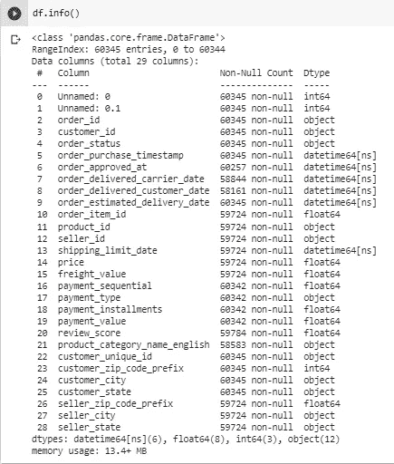
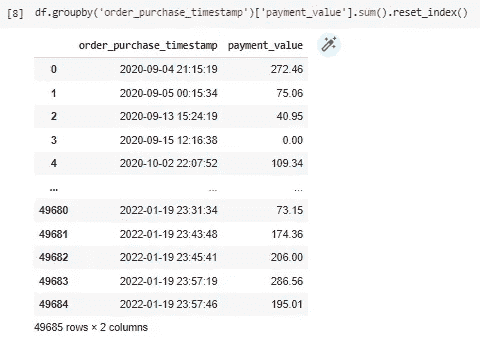
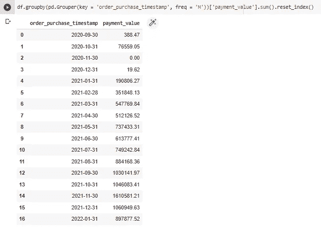
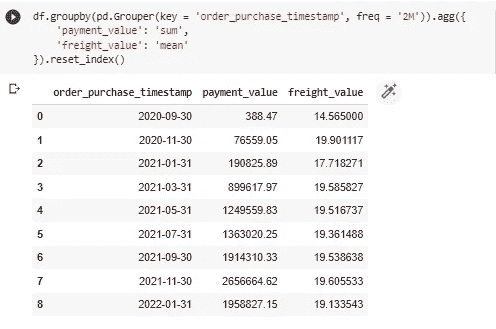
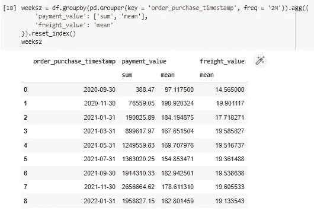
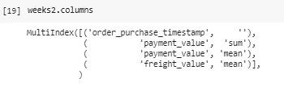
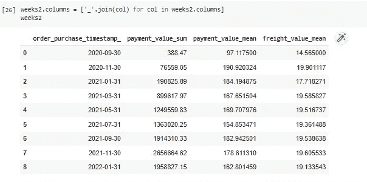

# 熊猫数据分组的最佳方式

> 原文：<https://betterprogramming.pub/the-best-way-to-group-data-in-pandas-7f446a1fc7fa>

## 我不知道你怎么想，但对我来说，熊猫的分组是有史以来最好的！


瑞兰德·迪恩在 [Unsplash](https://unsplash.com/s/photos/code?utm_source=unsplash&utm_medium=referral&utm_content=creditCopyText) 上的照片

我不知道你怎么想，但对我来说，熊猫的分组是有史以来最好的！

对于任何从事数据分析的人来说，我确信“Groupby”应该在你最常用的 5 个函数列表中！

但是，随着每个口袋妖怪的发展，我会在这里告诉你我使用 Groupby 的方式，以及它是如何极其通用的。

跟着走！

我将使用来自 Kaggle 的 [Olist 数据集，做一些修改，并且我已经执行了数据库的合并。](https://www.kaggle.com/olistbr/brazilian-ecommerce)

首先来进口熊猫和 Numpy:

```
import pandas as pd
import numpy as np
```

我使用 Pandas info()函数加载了我的数据帧，它看起来像这样:



那么，假设我想知道订单购买日期之前的支付值的总和，我该怎么做呢？

让我们来看看通常的方法及其输出:

```
df.groupby('order_purchase_timestamp')['payment_value'].sum().reset_index()
```



很好，成功了，不是吗？

但是，这是在一个每日基地，我怎么能这样做每月？我们将使用`pd.Grouper()` 函数，就像这样:

```
df.groupby(pd.Grouper(key = 'order_purchase_timestamp', freq = 'M'))['payment_value'].sum().reset_index()
```



这个*键*参数必须是日期时间列，而 *freq* 是时间的频率，如月(M)、周(W)、三个月(3M)、年(Y)等等…

但是在这段代码中，我只查看一列的和。如何向多个列添加多个度量？

我们将使用`agg()`功能！

跟我来。

假设我想要在 2 个月的时间内，到订单购买日期，支付值和运费值的平均值之和:

```
df.groupby(pd.Grouper(key = 'order_purchase_timestamp', freq = '2M')).agg({'payment_value': 'sum', 'freight_value': 'mean'}).reset_index()
```



`agg()` 函数使用字典作为参数！

我可以对每列使用多个度量吗？

是的，你可以！

让我们在代码中添加支付值的平均值！

```
df.groupby(pd.Grouper(key = 'order_purchase_timestamp', freq = '2M')).agg({'payment_value': ['sum', 'mean'],'freight_value': 'mean'}).reset_index()
```



这将返回一个多索引数据帧:



别担心！解决起来很简单！我们将使用列表理解！

```
weeks2.columns = ['_'.join(col) for col in weeks2.columns]
```



容易吗？

就说说你对它的看法吧:)

.

.

.

如果你想了解更多，请点击这里查看我的指导课程:[https://mentorcruise.com/mentor/NathanLara/](https://mentorcruise.com/mentor/NathanLara/)