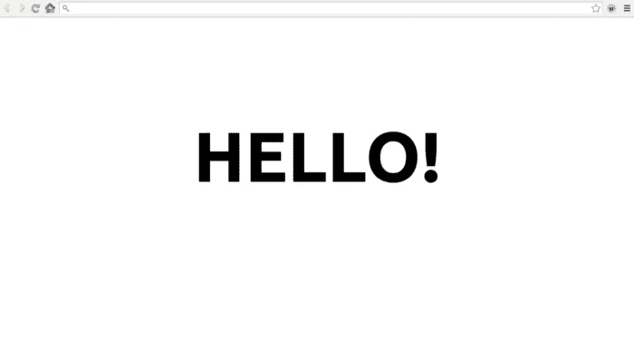
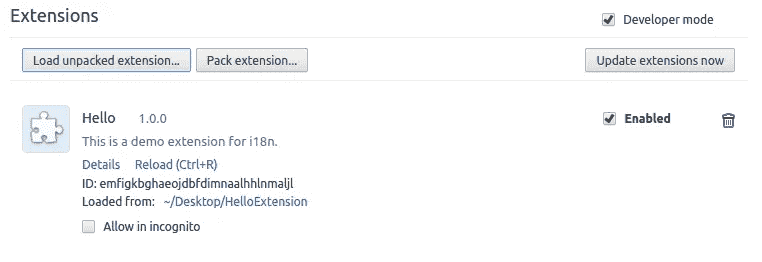
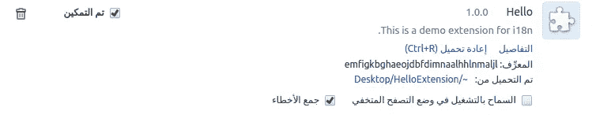
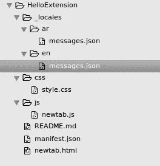
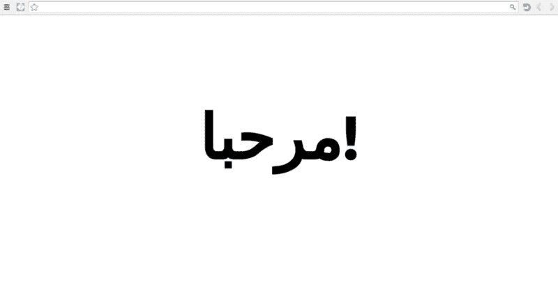
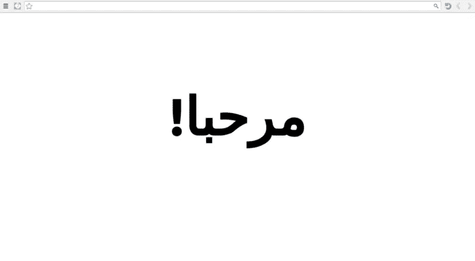

# 本地化 Chrome 扩展的最佳方式

> 原文：<https://betterprogramming.pub/the-best-way-to-localize-your-chrome-extension-a7b283fc520a>

## 一步一步的教程，为你的 Chrome 扩展添加更多的语言，接触更多的用户


图米苏在 [Needpix](https://www.needpix.com/photo/download/820944/hello-hi-bonjour-ciao-hola-words-languages-message-free-pictures) 上的图片

作为一名阿拉伯软件开发人员，我通常会对我的产品进行本地化。阿拉伯语的本地化通常具有挑战性，因为它的方向是从右到左。作为一个 [Chrome 扩展爱好者](https://medium.com/better-programming/11-reasons-to-build-a-chrome-extension-c6e27bb73a72)，我很爱分享我对 Chrome 扩展国际化的认识。在本教程中，我将在一个简单的分步指南中涵盖所有可能的国际化挑战，该指南可能适用于任何其他语言。

***注意:*** *本指南假设你已经了解 Chrome 扩展基础知识。如果你没有，你仍然可以继续，因为我正在一步一步地解释，以帮助你知道你可以多么容易地开发 Chrome 扩展。*

# 目标

在本教程中，您将创建一个 Chrome 扩展，该扩展覆盖新的选项卡页面，以浏览器语言向用户显示“Hello”消息。不要忘记按照 Chrome 的说明来改变你的浏览器的测试语言。



由 font-size: 12em !important;
text-align: center;
margin:0 auto;
padding-top: 15%;
}

`newtab.js`在加载时将`h1`和`id="title"`动态设置为“Hello”。动态设置标题将有助于将来更容易地更改它。

```
function setTitle() {
  document.getElementById('title').innerHTML = 'Hello!';
}window.addEventListener('load', setTitle);
```

# 第四步。是时候做些测试了

转到`chrome://extensions/`，然后启用开发者模式。将出现“加载解压缩的扩展”按钮。点击此按钮并选择您的扩展路径。



使用英文版 Chrome 的截图



使用阿拉伯语 Chrome 的屏幕截图

无论浏览器的语言是什么，扩展的标题和描述都将按照清单中设置的方式显示。

# 步骤 5 前的注意事项。扩展的国际化

该扩展最初只支持一种语言环境`en`。Chrome Platform API 提供了国际化的机会，只需很少的步骤。因此，让我们升级扩展，以便能够根据用户的语言用所有语言说“你好”。首先，您需要决定扩展将支持哪些语言/地区。每种语言/地区都有一个[地区代码](https://developer.chrome.com/webstore/i18n#localeTable)。对于这个演示，我将支持英语(“en”)和阿拉伯语(“ar”)。

# 第五步。将本地化文件添加到扩展中

要本地化扩展，您需要修改`manifest.json`，并在应用程序的主目录中提供一个`_locales`目录。您为您的扩展提供一个用于每个所选地区的`_locales/locale/messages.json`文件。下面是支持英语(“en”)和阿拉伯语(“ar”)的扩展名的文件层次结构。



项目文件夹的屏幕截图

# 第六步。本地化在行动

`messages.json`包含本地化所需的所有用户可见信息。命名每个用户可见的字符串，并将其放入`messages.json`文件。每个名称将包含一条消息、翻译后的字符串和一个描述(可选),用于开发人员的文档。在这个演示中，我们只需要本地化标题`appTitle`和描述`appDesc`。

`_locales/en/messages.json`

```
{
  "appTitle": {
      "message": "Hello"
  },
  "appDesc": {
      "message": "This is a demo application.",
      "description":"The description of the application."
  }
}
```

`_locales/ar/messages.json`

```
{
  "appTitle": {
      "message": "مرحبا"
  },
  "appDesc": {
      "message": "هذه نسخة تجريبة.",
      "description":"The description of the application, displayed in the web store."
  }
}
```

如果扩展有一个`_locales`目录，那么[清单](https://developer.chrome.com/extensions/manifest)必须定义`default_locale`。添加到清单`"default_locale" : "en"`。扩展的清单、CSS 文件和 JavaScript 代码使用每个字符串的名称来获得其本地化版本。`__MSG_messagename__`用于指在支持的语言环境中定义的任何消息。

要本地化应用程序列表，您需要更改清单中的名称和描述，以使用`__MSG_appTitle__`和`__MSG_appDesc__`。

编辑后的清单:

```
{
  "name": "__MSG_appTitle__",
  "description": "__MSG_appDesc__",
  "version": "1.0.0",
  "manifest_version": 2,
  "default_locale": "en",
  "chrome_url_overrides" : {
        "newtab": "newtab.html"
  }
}
```

# 第七步。再次测试

转到`chrome://extensions/`，然后启用开发者模式。将出现“加载解压缩的扩展”按钮。点击此按钮并选择您的扩展路径。


# 第八步。添加“你好”消息

在新标签页中更改“你好”。Chrome API 提供了这个 JavaScript 方法来用`chrome.i18n.getMessage('messagename')`获取消息。

你需要更新`newtab.js`，这样头的值就是`chrome.i18n.getMessage('appTitle')`。

`newtab.js`更新:

```
function setTitle() {
  document.getElementById('title').innerHTML = chrome.i18n.getMessage('appTitle');
}window.addEventListener('load', setTitle);
```

# 第九步。再次测试


英文新标签页—截图



阿拉伯语新标签页-屏幕截图

# 步骤 10 前的注意事项。如何实现 RTL 设置

阿拉伯语是从右向左的语言，所以感叹号应该在左边。Chrome API 为您提供了预定义的消息，有助于国际化。

*   `@@extension_id`:分机或 app ID 您可以使用这个字符串为扩展中的资源构造 URL。甚至未本地化的扩展也可以使用此消息。注意:您不能在清单文件中使用此消息。
*   `@@ui_locale`:当前区域设置；您可以使用这个字符串来构造特定于地区的 URL。
*   `@@bidi_dir:`当前区域设置的文本方向，对于从左到右的语言(如英语)为“ltr ”,对于从右到左的语言(如日语)为“rtl”
*   `@@bidi_reversed_dir`:如果`@@bidi_dir`是“ltr”，那么这是“RTL”；否则就是“ltr”
*   `@@bidi_start_edge`:如果`@@bidi_dir`是“ltr”，那么这是“left”；否则就是“对”
*   `@@bidi_end_edge`:如果`@@bidi_dir`是“ltr”，那么这是“right”；否则就是“左”

# 第十步。改变方向去 RTL

要将 CSS 方向改为 RTL，我们需要`@@bidi_dir`。所以让我们更新 CSS 添加`direction: __MSG_@@bidi_dir__`

`style.css`

```
#title {
  font-size: 12em !important;
  text-align: center;
  margin:0 auto;
  padding-top: 15%;
  direction: __MSG_@@bidi_dir__;
}
```

# 第十一步。测试最终结果


英文新标签页—截图



阿拉伯语新标签页-屏幕截图

就是这样。你可以根据需要使用任意多种语言，只需编辑消息文件来本地化你的 Chrome 扩展。请经常查看 Chrome 开发者指南，了解关于国际化的更多信息。