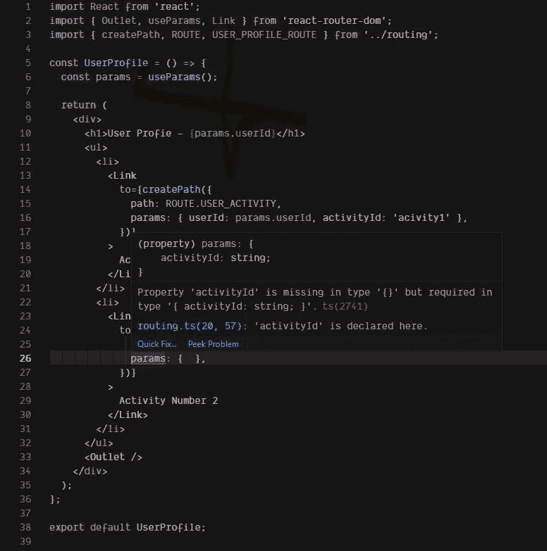

# 使用 TypeScript 管理 React 项目中的路线的最佳方式

> 原文：<https://betterprogramming.pub/the-best-way-to-manage-routes-in-a-react-project-with-typescript-c4e8d4422d64>

## 获得类型的优势，像冠军一样管理您的路线

乔治·巴科斯在拍的照片。

在过去的一年中，我有机会使用 TypeScript 参与了许多 React 项目——其中一些是从零开始的，而另一些则是处理维护或添加新功能。无论是简单的还是复杂的，它们都涉及某种路由。

因此，我有机会在 React 项目中尝试管理路线的最佳方法。

我尝试了很多不同的方法，但是在这篇文章中我将谈论我最喜欢的方法。

这些项目几乎总是使用 [React Router](https://reactrouter.com/) 作为路由解决方案，所以我要展示的方法是在上面测试的。但是它也可以在类似的库中工作，比如 Reach Router 或者甚至是 Next.js。

# 用 TypeScript 键入路线

对我来说最重要的优势是对路线有智能感知。特别是在项目中，会有很多带参数的路线，跟踪这些路线并不是一种愉快的体验。

幸运的是，TypeScript 帮了大忙。您可以为路由定义类型，并获得智能感知和类型安全的好处。

第一部分是定义路线。对此，我更喜欢使用枚举。这样，我可以给每条路线起一个可识别的名字，也可以导入到任何地方以便于使用。这里有一个例子:

如您所见，每条路线都有一个清晰可辨的名称，您可以在任何地方导入`ROUTE` enum 以方便使用。

这里会出现一个关于相对路径的问题:如果您需要相对路径呢？

答案很简单。只需为每个相对路由组创建不同的枚举:

在这里。它有一个明确的名称，表明它的用途。您可以根据需要创建许多这样的。没毛病。

# 输入路径参数

为了使用带参数的路由，您需要一个函数来替换路由定义中的那些参数占位符。但在此之前，您需要考虑如何为这个函数的参数定义类型。这是您开始受益于智能感知和类型安全的地方。

有两种方法可以做到这一点，我将向你们展示这两种方法。

第一种方法是使用元组。您可以将元组与联合类型结合起来，瞧:

您可以在函数定义中使用 spread 运算符，将它用作参数类型。稍后你会看到这个。

另一种方法是使用单个参数作为对象，这是我的首选方法。它让一切都变得更加清晰，也有助于智能感知:

# createPath 函数

正如我所提到的，您还需要一个部件来使一切变得完整:一个可以使用 route enums 和 params 来创建使用路径的函数。

以下是带有元组参数的版本:

以下是将单个参数作为对象的版本:

现在，您可以创建一个路径，如下例所示:

并获得 TypeScript 的好处:

在这里，我用 React Router v6 创建了一个 CodeSandbox 来演示:

# 结论

TypeScript 非常棒，您可以在许多地方从中受益。我在多个 React 项目中使用过这种方法，它让每个人都很开心。

请随意尝试更多，并让我知道你可能有的一些提示！