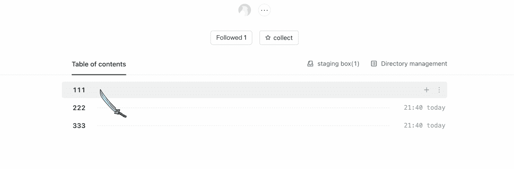
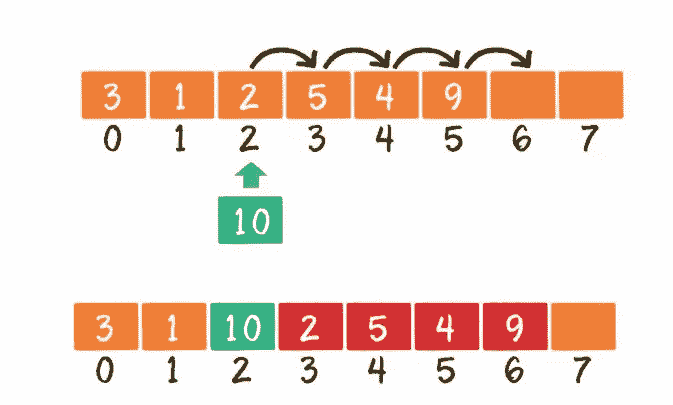
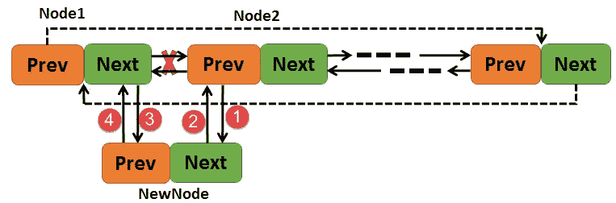
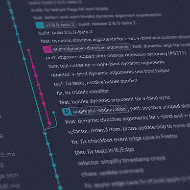

# 通过数据库模式更新拖放排序列表的最佳方式

> 原文：<https://betterprogramming.pub/the-best-way-to-update-a-drag-and-drop-sorting-list-through-database-schemas-31bed7371cd0>

## 利用 SQL 的强大功能

在工作中，开发和管理后台时，经常会遇到“拖拽排序”的要求。比如有一个资源列表，在前端拖拽就可以改变资源的顺序——如上图(头图)。

在我们的项目中实现这个功能的方法是:资源表有一个位置字段。前端查询时根据该字段进行升序或降序排序，拖动时修改表中涉及记录的位置字段值。

但是，这种解决方案有一个问题:我们每次只拖放一条记录，但是对多条记录执行`UPDATE`操作。有没有更好的解决办法？这里有两个我想到的解决方案。

## 方案 1:阵列

在资源表中设置一个位置字段来指示记录的位置。MySQL 的 DDL 如下:

前端查询数据列表时，按职位 ASC 或 DESC 排序:

拖动一条记录时，前端传入该记录的 id 值和新的位置值`newPosition`，服务器根据 id 查询资源的原始位置值`oldPosition`，比较`oldPosition`和`newPosition`，分以下三种情况:

1.`oldPosition == newPosition`

治疗:保持原样

2.`oldPosition ≠ newPosition`

`oldPosition < newPosition`:向后拖动记录
`oldPosition > newPosition`:向前拖动记录

需要修改的数据范围是:所有带`position >= newPosition`的记录，这些数据的位置值加 1。MySQL 语句如下:

## 存在的问题

每次拖放都会修改许多行数据。如果拖拽一条记录到第一行，需要修改表中所有数据的位置值，数据表中会增加一个表锁(X 锁)，导致数据库性能并发。减少。

出现这个问题的原因是，这种方法本质上是以“数组结构”组织数据。每拖放一条记录，就相当于在数组中的某个位置插入一个元素。

数组的本质是:插入一个元素时，插入位置后面的元素集体向后移动。如下图所示，当元素 10 插入位置 2 时，位置 2 及之后的元素应该向后移动:

## 方案 2:双向链表

与数组相比，链表更适合元素插入。每次插入元素时，只需要移动元素的前后指针。如下图所示，要在 Node1 和 Node2 之间插入 NewNode，只需要改变这三个的前后指针:

在数据库中，我们添加了两个字段，`prevId`和`siblingId`，分别代表前后指针。DDL 如下所示:

因为记录之间的关系是由前后指针建立的，所以拖动分为:拖动一条记录到一条记录的后面，拖动到第一条记录的前面，所以下面两种情况分别介绍。

## 移动后

前端传入记录的 id 及其新的`prevId`，后端根据`id`和`prevId`更新数据。更新过程如下:

1.  根据 id `currentData`查询当前记录数据
2.  更新前后记录的指针`currentData`
3.  根据`prevId`查询以前的记录数据`prevData`
4.  设置`prevData`的指针和后续记录的指针

拖动一条记录到一条记录后，最多只需要执行 6 次更新操作。

## 之前移动

前端传入资源的 id 及其`siblingId`，后端根据`id`和`siblingId`更新数据。更新过程如下:

1.  根据 id `currentData`查询当前记录数据
2.  更新前后记录的指针`currentData`
3.  根据`siblingId`更新后一条记录的`prevId`
4.  更新`currentData` `sliblingId`

在将一条记录拖动到第一条之前，只需要 4 次`UPDATE`操作。

可以发现，每次拖拽操作需要执行的`UPDATE`记录数量(最多 6 次`UPDATE`，影响 5 条记录)平均少于方案 1；而方案 2 给数据表增加的是行锁，对数据库并发性能的影响小于方案 1。

## 存在的问题

虽然方案 2 适合插入记录，但它也有链表的缺陷:不适合遍历查询。首先要查询链表的一条记录，然后根据`siblingId`继续查询下一条记录。方案 2 的记录只适用于“全查询”的场景，不能像方案 1 那样按照位置进行排序和分页。

# 结论

拖拽排序的两种后端实现介绍:
1。数组结构方案:插入和更新性能差，容易查询
2。双向链表方案:插入和更新性能很高，并且查询需要额外的处理

在我的公司，方案 1 是最好的方法。

[omgzui](https://medium.com/@omgzui?source=post_page-----31bed7371cd0--------------------------------)

## 更好的编程

[View list](https://medium.com/@omgzui/list/better-programing-9b4c9bb174aa?source=post_page-----31bed7371cd0--------------------------------)108 stories

[omgzui](https://medium.com/@omgzui?source=post_page-----31bed7371cd0--------------------------------)

## 新闻

[View list](https://medium.com/@omgzui/list/news-67ec0a972660?source=post_page-----31bed7371cd0--------------------------------)23 stories