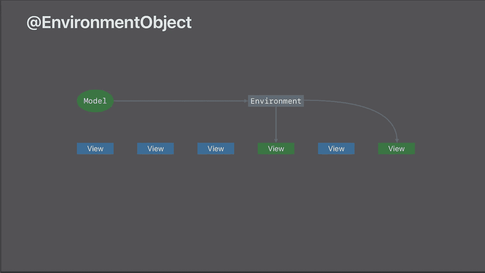

# 在 SwiftUI 中使用环境对象的最佳方式

> 原文：<https://betterprogramming.pub/the-best-way-to-use-environment-objects-in-swiftui-d9a88b1e253f>

## 深入探究环境对象的用途和功能


我们应该尽量减少对环境的影响，即使是在 SwiftUI 应用中。照片由 [Joren](https://unsplash.com/@joren78?utm_source=unsplash&utm_medium=referral&utm_content=creditCopyText) 在 [Unsplash](https://unsplash.com/s/photos/environment?utm_source=unsplash&utm_medium=referral&utm_content=creditCopyText) 上拍摄

SwiftUI 应用中的[数据流不同于我们多年来一直致力于开发的任何其他苹果早期命令式 UI 框架，如 UIKit 或 AppKit。](https://developer.apple.com/videos/play/wwdc2019/226/)

在 SwiftUI 中，我们可以只声明视图，它总是与数据保持同步。

您的视图中的属性可以用`State`、`Binding`或`Observed`、[属性包装器](https://www.swiftbysundell.com/articles/property-wrappers-in-swift/)来包装。每当这些包装器提供的属性值发生变化时，视图就会相应地重新绘制。


在 SwiftUI 视图之间共享数据的属性包装器。更新了本演示文稿的第 82 张幻灯片。

理想情况下，视图应该很小，有私有的`State`属性，有一个或几个`Binding`或`Observed`属性。因为，我们不想经常重新绘制您的视图。

但是后来，苹果给我们提供了`EnvironmentObject`。顾名思义，环境对象可以让我们知道应用程序中任何地方发生的事情，以及许多不相关的视图。



环境对象如何跨视图共享数据 PC: [苹果](https://devstreaming-cdn.apple.com/videos/wwdc/2019/226mq9pvm28zqfqer2a/226/226_data_flow_through_swiftui.pdf?dl=1)

苹果为我们提供了一份[长列表](https://developer.apple.com/documentation/swiftui/environmentvalues)**环境的价值观。**

**在过去的美好时光中，我们通过`ViewController`生命周期方法来了解这些变化，比如当用户改变主题时(是的，`triatCollectionDidChange`)，以及`NotificationCenter`，比如当用户改变设备方向时。**

**这些环境值可以很容易地注入到任何视图中。**

```
**@Environment(\.presentationMode) var presentationMode**
```

**视图中的上述属性有助于了解当前的显示模式或手动关闭视图。**

**我们也可以创建自己的符合`ObservableObject`的类，然后把它们变成`EnvironmentObject` s**

**它被吹捧为下一级[依赖注入](https://cocoacasts.com/nuts-and-bolts-of-dependency-injection-in-swift)。我们可以注射任何你想注射的东西，任何你想注射的地方。听起来很熟悉？首先，让我们看看[苹果文档](https://developer.apple.com/documentation/swiftui/environmentobject)是怎么说的。**

> **每当可观察对象改变时，环境对象使当前视图无效。如果将属性声明为环境对象，请确保通过调用其 *environmentObject(_:)* 方法在祖先视图上设置相应的模型对象。**

**有什么东西很难闻吗？“一定要在祖先视图上设置相应的模型对象”是什么意思？运行时检查？如果检查失败了怎么办？我们马上就知道了。**

**好的，这里有一个简单的使用 Swift 教程中[的例子。](https://www.hackingwithswift.com/quick-start/swiftui/how-to-use-environmentobject-to-share-data-between-views)**

**我们有两个视图，一个用于更改分数，另一个用于显示分数。两个视图读取/写入相同的乐谱`environment object`。**

**为了正常工作，我们必须在场景代理中的主机控制器的根视图中注入环境对象，如教程中所述。**

**但是如果我们不在根视图中注入环境对象会发生什么呢？**

```
**Fatal error: No ObservableObject of type UserSettings found. A View.environmentObject(_:) for UserSettings may be missing as an ancestor of this view.**
```

**猜对了没有奖。应用程序崩溃，出现上述错误。为什么这样**

**环境对象可能只是一个隐式展开的可选对象，我们不知道它的实现细节。**

**但是这个错误消息非常类似于强制展开 nil 对象时抛出的错误。此外，很难想到任何其他实现来实现相同的功能。**

**现在回到选项。自古以来，Apple 开发人员社区就一直在争论使用这些隐式展开的可选属性是否是一个好的实践。**

**不讨论这个问题，让我们找到一种方法来确保这些环境对象在应用程序启动时被初始化，并且可以在任何视图中使用而不会崩溃。**

**记住，我们讨论过在应用的任何视图中使用`Environment`值的能力。你听起来熟悉吗？老好人单身者。**

**这里，我们把`UserSettings`变成了一个`Singleton`类，也就是说，它在应用程序启动时被初始化，随时随地都可以使用。**

**我们已经使它符合了`ObservableObject`协议，所以我们可以在视图中为`UserSettings`属性使用`ObserveredObject`属性包装器，而不是`EnvironmentObject`。**

**这确保了每当`shared` `UserSettings`对象中的分数发生变化时，所有观察它的视图都会得到通知，并且每个视图都会相应地更新。**

**这个`ObservableSingleton`的行为和`EnvironmentObject`完全一样，除了如果你注射失败它不会崩溃。实际上，前者为您提供了编译时安全性。正确编译的代码应该正确运行——没有意外的运行时错误。**

**因此，如果编译时安全性是您的首要任务，或者您正在与许多开发人员一起开发一个大型 SwiftUI 项目(这可能不会在不久的将来发生)，那么符合`Observable`协议的`Singleton`类可能会比`EnvironmentObject` s 更好地为您服务。**

**但是，你知道使用`EnvironmentObject`的最佳方法是什么吗？**

**不要使用它，或者至少减少它的使用。因为，当你的应用程序运行时，`EnvironmentObject`和`ObservableSingleton`一直都在内存(RAM)中。**

**因此，在设计你的应用程序时，需要在多个视图间共享很少的属性，并确保这些属性是基本类型和轻量级的。**

**如果你能设计出没有任何这类属性的 app，对你和 app 都更好。**

**快乐的雨燕！**