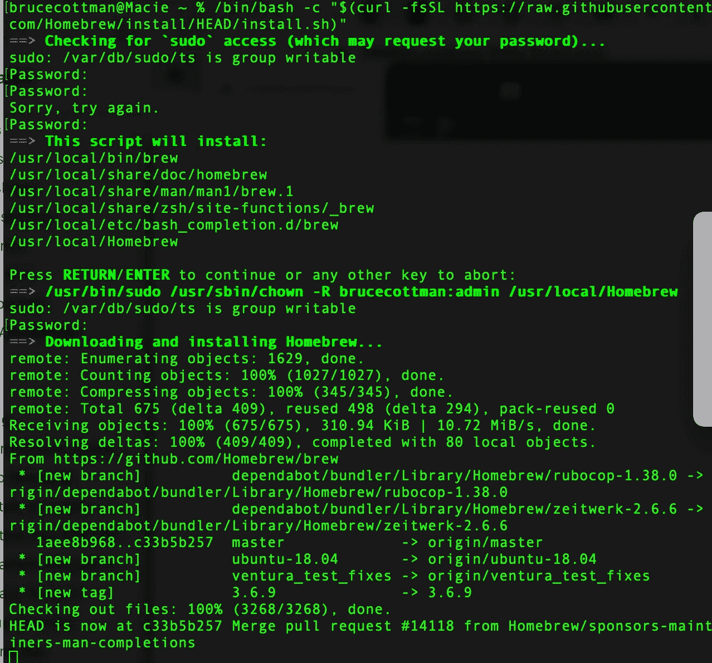
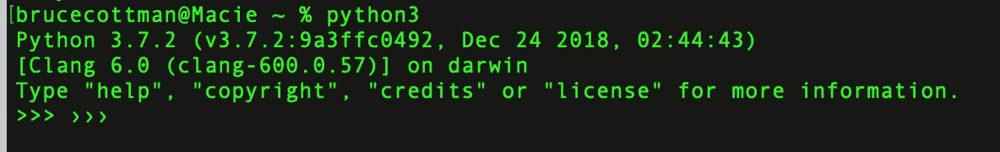
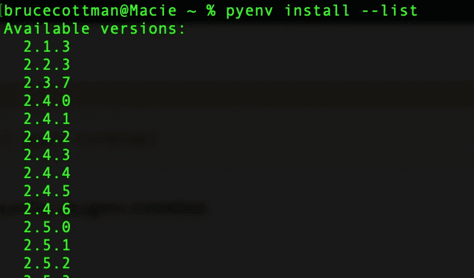
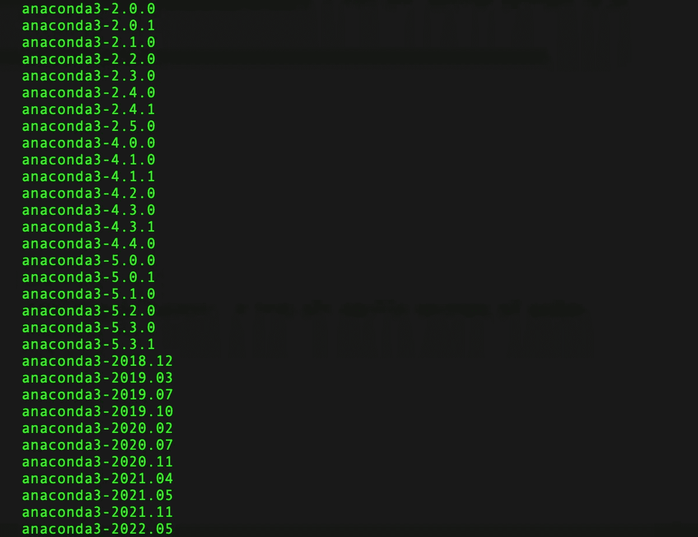
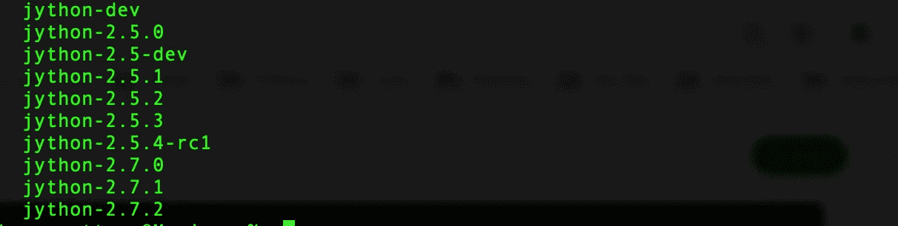
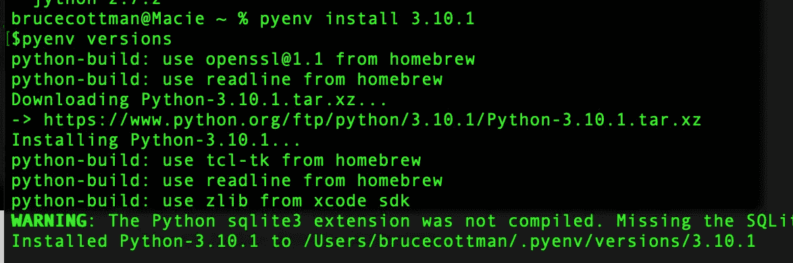
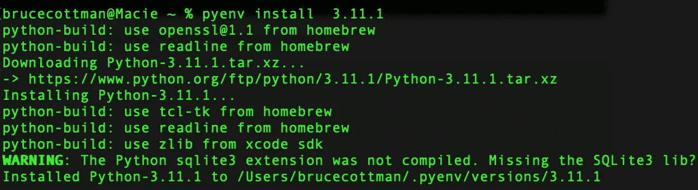
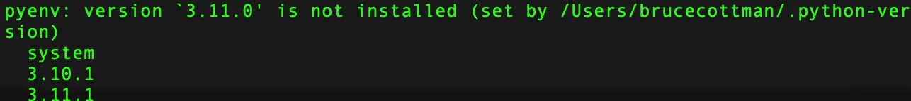
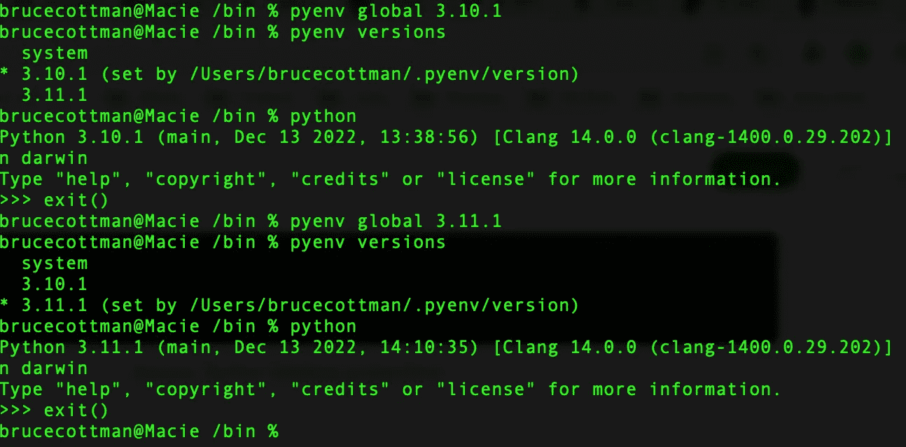

# 我们创建和管理多个 Python 版本的最佳方式

> 原文：<https://betterprogramming.pub/the-best-way-we-create-and-manage-multiple-versions-of-python-22363e065a43>

## pyenv 的完整设置指南


每条眼镜蛇都在自己的环境中。 [David Clode](https://unsplash.com/@davidclode?utm_source=unsplash&utm_medium=referral&utm_content=creditCopyText) 在 [Unsplash](https://unsplash.com/s/photos/pythons?utm_source=unsplash&utm_medium=referral&utm_content=creditCopyText) 上拍摄的照片

我们已经尝试使用本地环境、Docker 容器、`venv`和`pyenv`来安装 Python。我们决定使用`pyenv` 和`virtualenv.`，我会告诉你为什么`pyenv`最适合我们环境中的某些配置。

## pyenv 是一个管理不同版本 Python 虚拟的工具。

当 DevOps 的一名工作人员告诉我时，我了解到了`pyenv`。我们研究并测试了几种管理非云软件产品 python 版本的方法。我们决定用`pyenv`。

`pyenv`2 . 7 . 1 版本于 2022 年 12 月初发布，是一个持续维护的 Python 工具。`pyenv`具有可扩展的架构，其中新插件添加了新功能，并且完全由 Unix/Linux shell 代码构建。

比如`virtualenv`的插件 [pyenv-virtualenv](https://github.com/pyenv/pyenv-virtualenv) ，最新版本是两个月前的。

我们喜欢这个架构决策，因为它允许加载成熟的插件功能，而不加载有问题的插件。此外，您可以使用定制插件定制`pyenv`，添加您的组织所需的特定功能。

对于我们的`pyenv`解决方案，我们部分遵循了以下指南:

[](https://realpython.com/intro-to-pyenv/) [## 使用 pyenv - Real Python 管理多个 Python 版本

### pyenv 是管理多个 Python 版本的优秀工具。即使您的上已经安装了 Python

realpython.com](https://realpython.com/intro-to-pyenv/) 

我们对上面记录的过程进行了例外处理，因为一些`pyenv`命令在我们的一些计算平台上不工作。

**注意**:我们可能已经让一些`pyenv`中断的命令工作了，但是我们不需要它们。我们需要一个工具来为系统工程和测试人员的新虚拟环境带来新的 Python 版本。该组织认为，普通工程人员不需要管理虚拟环境的生命周期，就像他们不需要构建基础机器一样。

**注意**:工程领域的任何人都可以自由学习并在他们自己的机器上尝试。

我只展示了在 macOS 上对我有效的步骤。安装程序在 Ubuntu 上有所不同，我敢打赌 WinOS 版本的安装程序差别更大。

我们大多数人都在运行 macOS Monteray (12.6)，在 macOS 10.4+上安装家酿。我们使用 Home[ `brew` ]和`curl`作为`pyenv`的安装工具。

# 为你想使用的每个 Python 版本创建一个标签`.`

我们本地的企业开发环境由 macOS 和 Ubuntu Linux OS 组成，这两种 OS 都有 Unix 的基因根基。

我们有云上的混合应用程序和隔离的本地网络。企业生产本地服务器是本地 Ubuntu Linux OS 服务器。云解决方案是针对云平台 Azure(微软云)、AWS(亚马逊云)、GCS(谷歌云)的 Kubernetes 和 Docker。

我们用码头集装箱装 Kubernetes。我们的 docker 解决方案将在本文[的](https://levelup.gitconnected.com/our-enterprise-docker-solution-for-migration-to-the-cloud-d7bb9d1a796b)中讨论。

## 步骤 1:为 pyenv 安装 Homebrew

Home[ `brew` ]是我们在 python 生态内外使用的工具。

> **可选**:如果你没有安装自制软件。下面是我们如何安装它。

```
/bin/bash -c "$(curl -fsSL https://raw.githubusercontent.com/Homebrew/install/HEAD/install.sh)"
```

以下是我的 MacPro 上的输出:



来源:作者桌面截图

在安装的这一点上，取决于你如何设置你的 GitHub 安全，也就是说，如果你使用了一个密钥，它可能会要求你输入你的 Mac 平台密码。请不要输入您的 GitHub 密码或 Apple ID 密码。

**注**:一年多以来，Github 要求设置一个本地密钥。

## 步骤 2:安装 pyenv 依赖项

**注意**:如果你还没有安装扩展，你可能会被询问是否要安装这些到这些苹果 xtools extentsion 二进制文件中。

```
brew install openssl readline sqlite3 xz zlib
```

## 步骤 3:安装 pyenv

现在，在这一点上，你可能想安装`pyenv`和`brew.`

你可以但不可以。 Home[ `brew` ]只会安装`pyenv`，不会安装插件。

相反，使用`curl`将基础`pyenv`和插件安装到您的命令行 shell 中:

```
$ curl https://pyenv.run | bash
```

注意:你可以用`zsh`替换`bash`，而`pyenv`在`*zsh*`外壳中也能正常工作。

要测试安装`pyenv`是否成功，运行

```
$pyenv
```

哎呦！我们应该已经为任何登录初始化了`pyenv`。我们将在第 5 节向您展示如何操作。

## 步骤 4A:更新 pyenv

您可以通过以下方式更新`pyenv`:

```
$pyenv update
```

## 步骤 4B:卸载 pyenv 初始化

记住，我说过`pyenv`是用 shell 代码编写的，而不是某种计算机语言，你可能有也可能没有。您将使用 shell 命令，而不是简单的`<cmd> pyenv — init`。

在某个时候，您可能想要重新开始加载到`pyenv.`中的 python 版本。您可以使用以下命令卸载(删除)`pyenv`初始化文件:

```
$cd $HOME       # go to $ home
$rm -rf .pyenv  # remove install 
```

非 pythonic 式但有效。

> **注意** : `pyenv install|uninstall`不安装|卸载`pyenv.`，而是需要一个参数，即你要加载到`pyenv`的 python 版本。

## 步骤 4C:卸载 pyenv

这个直接记载在[这里](https://levelup.gitconnected.com/our-enterprise-docker-solution-for-migration-to-the-cloud-d7bb9d1a796b)。

> 1.要完全卸载 Pyenv，请删除其根目录。这将删除安装在`$(pyenv root)/versions/`目录下的所有 Python 版本:

```
$rm -rf $(pyenv root)
```

2.执行步骤 4B。— `pyenv`需要做更多的工作，才能普遍适用于企业(防弹)。然而，这比以前存在的情况有所改善。

## 步骤 pyenv 的初始化

我们希望为任何用户登录执行一个系统范围的初始化文件。

我们编写了一个 bash shell 脚本。shell 脚本在`bash`或`zsh`中运行，由三个命令组成:

```
export PATH="$HOME/.pyenv/bin:$PATH"
eval "$(pyenv init -)"
eval "$(pyenv virtualenv-init -)"
```

## 第六步:python 版 pyenv“系统”是什么？

不可否认的是，`pyenv`的`versions`命令与`$<cmd> --version`混淆了，后者是一个大家都很熟悉的命令。然而，`pyenv versions`命令列出了 可用的 python 版本 ***，供`pyenv`加载和管理。***

```
$pyenv versions

output==>
system 
```

您可能安装了多个 python 版本。在安装(加载)Python 版本之前，Python 的默认版本是`python`版本。



来源:作者桌面截图

> 注意:`pvenv`需要一个`python`符号。你们中的许多人已经为 python 3.x 版本和`python2`或 python 2.x 版本定义了一个`python3`。忽略 python 2.x 开发者，`cp python3 python.`你现在可以将 Python 2.x 版本加载到`pyenv,`中，如第 7 节和第 8 节所述。

## 步骤 7:列出上传到 pyenv 的所有 python 版本。

如果您希望看到大约 300 个不同的 Python 版本加载到`pyenv`中，那么执行以下命令:



pyenv install-list 命令的前 15 行。来源:作者桌面截图

我发现上面命令的输出令人难以置信。相反，我使用如下命令:

```
pyenv install --list | grep " 3\.[1-9]"  # list all vanilla versions of python
```

或者

```
pyenv install --list | grep " 3\.[8]"  # list all 3.8 sub-sub versions of python
```

或者

```
pyenv install --list | grep "anaconda"  # list all anaconda versions
```



来源:作者桌面截图

或者

```
pyenv install --list | grep "jyhon"  # list all jyhon versions of python
```



来源:作者桌面截图

## 步骤 8:安装 python 版本

您可以安装`pyenv install -- list.`列出的任何 python 版本

```
$pyenv install 3.10.1
```



来源:作者桌面截图

```
$pyenv install 3.11.1
```



来源:作者桌面截图

```
$pyenv versions
```



来源:作者桌面截图

## 步骤 9:在载入 Python 的多个 Python 版本中进行选择

您可以使用`pyenv global <name>.`切换到任何 Python 版本，而不是局限于一个 Python 版本



来源:作者桌面截图

就这么简单。

# 结论和总结

Python 工具开源，除了少数例外，都是针对开发者，而不是用户。python 生态生机勃勃，仅 Github 上就有几千个零星到几十万星的开源包。

开发人员需要不同的全方位环境来试加载他们可能想要保留或清除的新开源包。

*测试*使用已建立的无所不包的环境，称为虚拟环境，来运行单元测试、创建和运行组件集成、压力测试和应用程序测试。

同样*，测试*可能通过换入一个“更快”的 python，比如 pypy 版本，来改善最终用户的响应时间。

`pvenv`在创建虚拟环境之前或之后，可以更容易地换入任何 python 版本。

`pvenv`是我们用来管理虚拟环境生命周期的两个工具之一。

我的下一篇文章将讨论我们使用的第二个工具:`virtualenv.`同时，我的下一篇文章将讨论`pvenv`是如何通过插件支持`virtualenv`的。