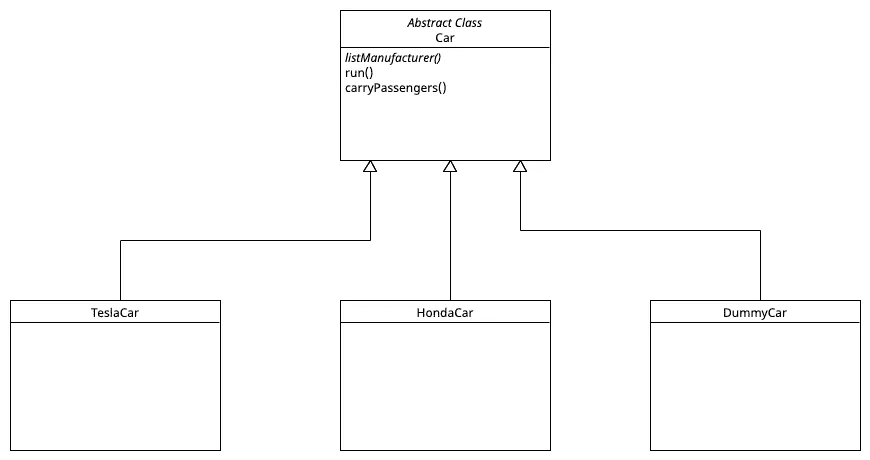
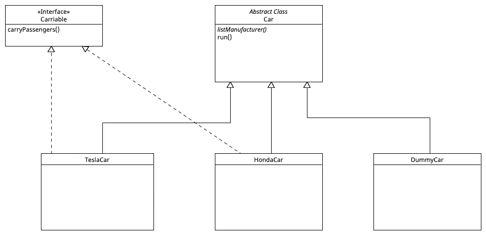
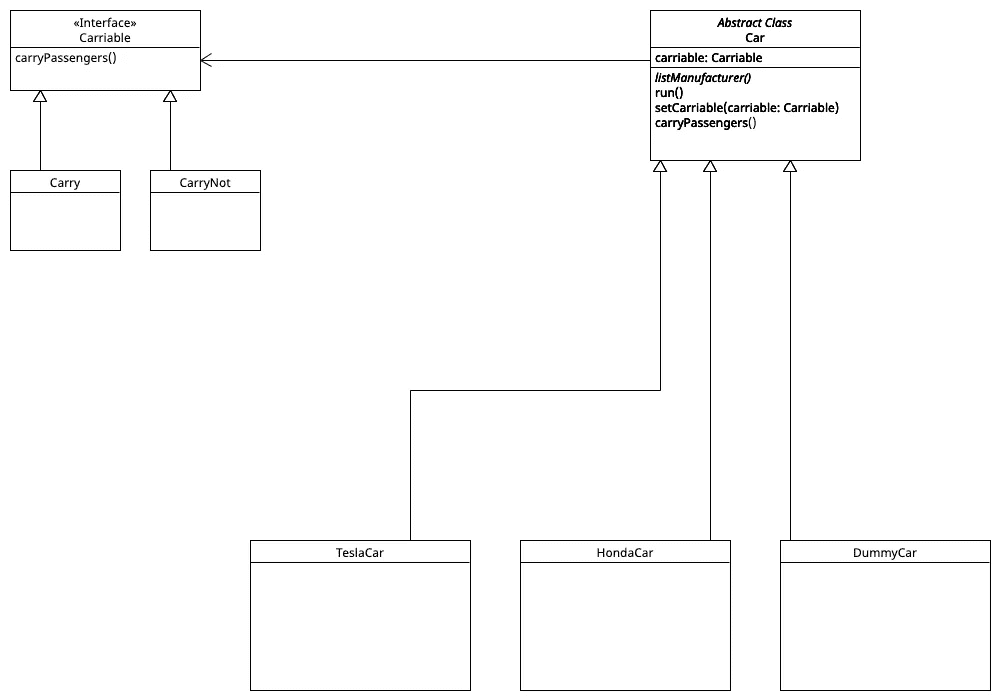

# 大型汽车展厅与战略设计模式

> 原文：<https://betterprogramming.pub/the-big-car-showroom-and-the-strategy-design-pattern-210dbb274dbf>

## 假设我们在一家超市获得了软件开发实习生的职位。我们的任务是为市场开发一个列出所有在售汽车的应用程序。


出售从针头到汽车等日常用品的大型超市。



基本方法

我们从基础开始，让所有的汽车类型都继承自类`Car`。`listManufacturer`方法列出了汽车制造商的详细信息和品牌，在我们的例子中，它因子类而异，这就是为什么它是抽象的，而类`Car`是一个抽象类。方法 run 和`carryPassengers`是普通的泛型方法，如下所示。

```
void run() {
    System.out.println("Run from point A to point B");
}void carryPassengers() {
    System.out.println("Carry passengers and their luggages");
}
```

一切看起来都很完美，而“遗产”似乎像拼图中最完美的一块一样解决了我们所有的问题。

但仿真车或玩具车不具备`carryPassengers`特征，也不应该继承`carryPassengers`方法。在这种情况下，实现以下面向对象的设计原则。

```
Identify aspects of your applications that vary (carryPassengers) and separate them from what remains same. 
```

就继承而言，子类的抽象方法`listManufacturer`和 run 保持不变。而`carryPassengers`方法则不然。让我们封装变更，这样就不会影响代码的其余部分。



改进的方法

我们写了一个接口 Carriable，它有抽象方法`carryPassengers`。并且只有那些车厢(类)实现了可以实际载客的接口。答对了。我们成功地分离了实现中的不同部分。让我们把重点放在代码维护上。

这里，`carryPassengers()`是在每个可承载类中单独实现的。(截至目前，为了简单起见，我们忽略其他方法。)

```
class TeslaCar extends Car implements Carriable {
   void carryPassengers() {
       System.out.println("Carry passengers and their luggages");
   }
}class HondaCar extends Car implements Carriable {
   void carryPassengers() {
       System.out.println("Carry passengers and their luggages");
   }
}
```

现在想象一下，我们需要改变方法`carryPassengers`的行为，而`carryPassengers`由 100 行代码组成，有 100 个类型为`Carriable`的类。

要改变方法`carryPassengers`的行为，我们需要分别单独接触 100 个 Carriable 类型的类。这没有任何作用，但是会在代码中引入错误，使代码维护变得困难。触及 Carriable 类型的每个子类会导致代码设计不灵活。



最后进场

在`Carry`和`CarryNot`类中已经给出了`Carriable`接口的`carryPassengers`的具体实现

```
class Carry implements Carriable {
    public void carryPassengers() {
        System.out.println("Carry passengers and their luggages");
    }
}Class CarryNot implements Carriable {
   public void carryPassengers() {
       System.out.println("Cannot carry passengers and their     luggages");
    }
}
```

另一方面，抽象类`Car`具有实例变量 Carry，可以查看具体类`Carry`或`CarryNot`，从而查看封装在 Carry 和`CarryNot`类中的方法`carryPassengers`的不同实现。

类`Car`的每个子类将通过 carriable 类型的继承实例变量 Carriable 查看 Carry 或 CarryNot。

抽象类 Car 有方法`setCarriable(Carriable carriable)`来决定查看哪种类型的`Carriable`，是查看类`Carry`还是`CarryNot`。

```
void setCarriable(Carriable carriable) {
    this.carriable = carriable;
}
```

类`Car`的每个子类也将从父抽象类`Car`继承`carryPassengers()`方法。方法`carryPassengers`除了已经设置为 carriable 的`calls carryPassengers()`方法之外什么也不做。

```
void carryPassengers() {
    carriable.carryPassengers();
}
```

现在，如果我们需要改变`carry`方法的行为，我们只需要接触一个子类`Carry`。这种方法比以前的方法灵活得多。

策略设计模式定义了一系列的算法(在我们的例子中，`carryPassengers`的可变代码)封装了每一个算法(在我们的例子中，是类`Carry`和`CarryNot`)并使它们可以互换(在我们的例子中，Carriable carriable 变量可以指向类`Carry`和`CarryNot`)。它让算法独立于使用它的客户端而变化。(在我们的例子中，我们可以修改`carryPassengers`的行为，而不触及`Car`类的子类)。