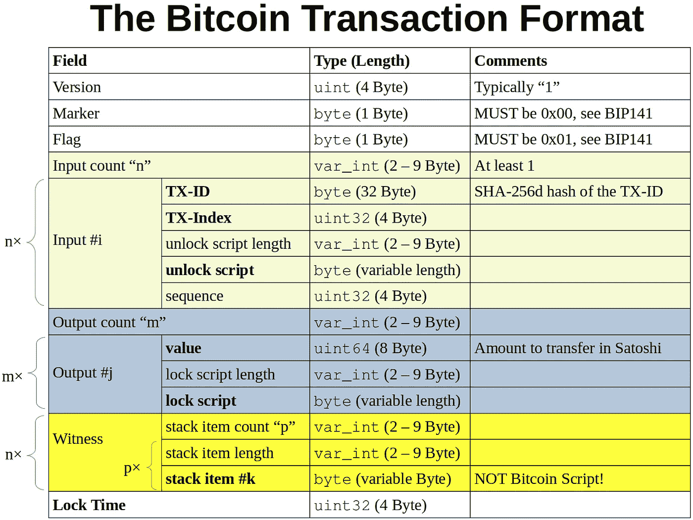

# 比特币脚本语言

> 原文：<https://betterprogramming.pub/the-bitcoin-script-language-e4379908448f>

## 变革管理的完美解决方案


德米特里·德米德科在 [Unsplash](https://unsplash.com?utm_source=medium&utm_medium=referral) 上拍摄的照片。

世界在变，开发者也不是完美的。任何软件的第一次迭代，总会有一些瑕疵或不足，需要过一段时间再调整。由于这两个原因，拥有一个变更管理的机制是很重要的。对于中央服务的 API，通常有一个 API 版本和一个折旧计划。

但是在分布式系统中你做什么呢？如何保持系统的灵活性和安全性？

比特币对于这个问题有一个优雅的解决方案:比特币脚本！看完这篇文章，你就明白了。我们走吧！

# 比特币交易剖析

直到 2140 年左右，每一块加入区块链的比特币都会被挖掘出来。通过跟踪未用完的交易输出(UTXO)来确定谁有权使用哪些比特币:

[](https://medium.com/coinmonks/the-utxo-model-f5eb1fc9a853) [## UTXO 模型

### 比特币的技术基石

medium.com](https://medium.com/coinmonks/the-utxo-model-f5eb1fc9a853) 

转到[比特币区块浏览器](https://www.blockchain.com/explorer)并选择[最新的区块](https://www.blockchain.com/btc/block/00000000000000000004a250beeb23fa5fb47d75491c90b037bfad847d733dc7)，我们看到该区块中有 2738 笔交易。取[一个事务](https://www.blockchain.com/btc/tx/30713d08afa548d3465e380d6e1837354b29a1b6707e2a913b27776cf305fda4)和[显示原始十六进制转储](https://blockchain.info/tx/30713d08afa548d3465e380d6e1837354b29a1b6707e2a913b27776cf305fda4?format=hex):

```
010000000001010000000000000000000000000000000000000000000000000000000000000000ffffffff5403df550a1b4d696e656420627920416e74506f6f6c373138fd004702c13ba070fabe6d6d6d9986fd3aedb9f8b00fab3c74c2e1d399fd0e6bc1d964aa57a08f78ac2d648002000000000000001eb50000c1377c00ffffffff04653c3a2a000000001976a91411dbe48cc6b617f9c6adaf4d9ed5f625b1c7cb5988ac0000000000000000266a24aa21a9ede0721e21cc17367eb4fcccf94c7e6ebc54757a693515f809307d4d6a31e0c8500000000000000000266a24b9e11b6d6eab9aaf2ccdc3cb05fb15989c512b84c8ef5f498559cd4d66e6104de8f9cdb100000000000000002b6a2952534b424c4f434b3a93320d7a461a95b953bd18e40aa031b5470d6258ccd82011999a5b290031529c0120000000000000000000000000000000000000000000000000000000000000000000000000
```

这种格式的结构如下:



图片作者:马丁·托马斯

本文感兴趣的两个字段是“解锁脚本”和“锁定脚本”当添加一个新事务时，它需要提供一个与引用的 UTXO (TX-ID 和 TX-Index)匹配的解锁脚本。输出锁脚本是您希望其他人在将来使用该输出时要做的事情。在非常直接的意义上，你定义了关键。

这两个脚本字段包含比特币脚本。它以一个字节的操作码(`OP_CODE`)开始。这只是一个与操作相关的数字。

# 用比特币核心解码

下面我们以[这个交易](https://blockchain.info/tx/7de75c9a33a687de04c9621ec98d60acf6a830fda6b12b027df227d1c72d2808?format=json)为例。首先，我将 hex 事务解码为:

```
{
    "version_number": 1,
    "marker": null,
    "flag": null,
    "tx_ins": [
        {
            "tx_id": "00f645c7443e367330410e526b152fc799c71dafd4971d8ed6ee37babbd581bb",
            "tx_index": 10,
            "script": "**483045022100b7393ff959120e3ccb5284e3cf2eaa200235643a1549a4e6faaa911619089e2b02207b677827c7beeb53503e016a8dd29164d07cb79f0f1e058df9b8dfa3568d0290014104c4b7a7f7bb2c899f4aeab75b41567c040ae79506d43ee72f650c95b6319e47402f0ba88d1c5a294d075885442679dc24882ea37c31e0dbc82cfd51ed185d7e94**",
            "sequence": 4294967295
        }
    ],
    "tx_outs": [
        {
            "satoshi": 16939,
            "script": "a914c29b367fe...bd1b29ef47a687"
        },
        "... more outs..."
    ],
    "witness": {
        "stack_items": [
            []
        ]
    },
    "locktime": 0
}
```

有趣的是，二进制解锁脚本以十六进制表示法给出了第一个(也是唯一一个)输入。我已经在上面的块中用粗体标出来了。

您可以使用以下脚本(在 Ubuntu 20.04 上)将二进制比特币脚本解码为 ASM(汇编语言):

```
# Download and extract bitcoin-core
$ wget [https://bitcoin.org/bin/bitcoin-core-0.20.0/bitcoin-0.20.0-x86_64-linux-gnu.tar.gz](https://bitcoin.org/bin/bitcoin-core-0.20.0/bitcoin-0.20.0-x86_64-linux-gnu.tar.gz)
$ tar -xvf bitcoin-0.20.0-x86_64-linux-gnu.tar.gz
$ cd bitcoin-0.20.0/bin/# Run the daemon, but do not download blocks
$ ./bitcoind -daemon -connect=0.0.0.0# Finally! Decode a Bitcoin Script hex-encoded program
$ ./bitcoin-cli decodescript "483045022100b7393ff959120e3ccb5284e3cf2eaa200235643a1549a4e6faaa911619089e2b02207b677827c7beeb53503e016a8dd29164d07cb79f0f1e058df9b8dfa3568d0290014104c4b7a7f7bb2c899f4aeab75b41567c040ae79506d43ee72f650c95b6319e47402f0ba88d1c5a294d075885442679dc24882ea37c31e0dbc82cfd51ed185d7e94"
{
  **"asm": "3045022100b7393ff959120e3ccb5284e3cf2eaa200235643a1549a4e6faaa911619089e2b02207b677827c7beeb53503e016a8dd29164d07cb79f0f1e058df9b8dfa3568d029001 04c4b7a7f7bb2c899f4aeab75b41567c040ae79506d43ee72f650c95b6319e47402f0ba88d1c5a294d075885442679dc24882ea37c31e0dbc82cfd51ed185d7e94"**,
  "type": "nonstandard",
  "p2sh": "3QEAyVJgyTXivsKQopPiGngaPwFWmzdHLL",
  "segwit": {
    "asm": "0 64c118d91f54d62936c29915c5cb61d39dc3353b005aca55528a714b607800de",
    "hex": "002064c118d91f54d62936c29915c5cb61d39dc3353b005aca55528a714b607800de",
    "reqSigs": 1,
    "type": "witness_v0_scripthash",
    "addresses": [
      "bc1qvnq33kgl2ntzjdkzny2utjmp6wwuxdfmqpdv542j3fc5kcrcqr0qxaa2gw"
    ],
    "p2sh-segwit": "3EVPaAaNmZtuP4acv63USoRkSXPez4dX4z"
  }
}
```

这是一个典型的解锁脚本(粗体带`“asm”`键)。第一个字符串是脚本签名。第二个是公钥。

接下来，我们从事务(索引 10)中获取锁定脚本[:](https://blockchain.info/tx/00f645c7443e367330410e526b152fc799c71dafd4971d8ed6ee37babbd581bb?format=hex)

1.  [获取十六进制交易](https://blockchain.info/tx/00f645c7443e367330410e526b152fc799c71dafd4971d8ed6ee37babbd581bb?format=hex)。
2.  将 hex 事务放入[我的解码工具](https://github.com/MartinThoma/algorithms/blob/master/Bitcoin/decode_transaction.py)。
3.  查找`tx_outs`的第十个索引，寻找`script`。

```
$ bitcoin-cli decodescript "**76a9147ddb236e7877d5040e2a59e4be544c65934e573a88ac**"
{
  **"asm": "OP_DUP OP_HASH160 7ddb236e7877d5040e2a59e4be544c65934e573a OP_EQUALVERIFY OP_CHECKSIG"**,
  "reqSigs": 1,
  "type": "pubkeyhash",
  "addresses": [
    "1CUTyyxgbKvtCdoYmceQJCZLXCde5akiX2"
  ],
  "p2sh": "3Jp8er9Srb9LMkJqk8jPeWafjDztYGLyLn",
  "segwit": {
    "asm": "0 7ddb236e7877d5040e2a59e4be544c65934e573a",
    "hex": "00147ddb236e7877d5040e2a59e4be544c65934e573a",
    "reqSigs": 1,
    "type": "witness_v0_keyhash",
    "addresses": [
      "bc1q0hdjxmncwl2sgr32t8jtu4zvvkf5u4e64ucrwj"
    ],
    "p2sh-segwit": "37e78P9jyHEZ7dp2as7w817BUPgEEUQDD2"
  }
}
```

`asm`键的值是一个非常典型的锁脚本。

# 解锁交易

为了执行这两个脚本，我们首先放置解锁脚本，然后放置锁定脚本:

```
3045022100b7393ff959120e3ccb5284e3cf2eaa200235643a1549a4e6faaa911619089e2b02207b677827c7beeb53503e016a8dd29164d07cb79f0f1e058df9b8dfa3568d029001
04c4b7a7f7bb2c899f4aeab75b41567c040ae79506d43ee72f650c95b6319e47402f0ba88d1c5a294d075885442679dc24882ea37c31e0dbc82cfd51ed185d7e94
OP_DUP
OP_HASH160
7ddb236e7877d5040e2a59e4be544c65934e573a
OP_EQUALVERIFY
OP_CHECKSIG
```

这就像每个程序从上到下执行一样。比特币脚本是一种基于堆栈的编程语言。这意味着你没有变量，而是把所有的东西放在一个堆栈里。

你肯定想执行这个。有[一个在线工具](https://wschae.github.io/build/editor.html)，但是[好像有 bug](https://bitcoin.stackexchange.com/a/105254/6721)。相反，我推荐使用 [btcdeb](https://github.com/bitcoin-core/btcdeb) 。安装后，您可以运行:

```
$ btcc 3045022100b7393ff959120e3ccb5284e3cf2eaa200235643a1549a4e6faaa911619089e2b02207b677827c7beeb53503e016a8dd29164d07cb79f0f1e058df9b8dfa3568d029001 04c4b7a7f7bb2c899f4aeab75b41567c040ae79506d43ee72f650c95b6319e47402f0ba88d1c5a294d075885442679dc24882ea37c31e0dbc82cfd51ed185d7e94 OP_DUP OP_HASH160 7ddb236e7877d5040e2a59e4be544c65934e573a OP_EQUALVERIFY OP_CHECKSIG483045022100b7393ff959120e3ccb5284e3cf2eaa200235643a1549a4e6faaa911619089e2b02207b677827c7beeb53503e016a8dd29164d07cb79f0f1e058df9b8dfa3568d0290014104c4b7a7f7bb2c899f4aeab75b41567c040ae79506d43ee72f650c95b6319e47402f0ba88d1c5a294d075885442679dc24882ea37c31e0dbc82cfd51ed185d7e9476a9147ddb236e7877d5040e2a59e4be544c65934e573a88ac$ btcdeb 483045022100b7393ff959120e3ccb5284e3cf2eaa200235643a1549a4e6faaa911619089e2b02207b677827c7beeb53503e016a8dd29164d07cb79f0f1e058df9b8dfa3568d0290014104c4b7a7f7bb2c899f4aeab75b41567c040ae79506d43ee72f650c95b6319e47402f0ba88d1c5a294d075885442679dc24882ea37c31e0dbc82cfd51ed185d7e9476a9147ddb236e7877d5040e2a59e4be544c65934e573a88acbtcdeb 0.4.21 -- type `btcdeb -h` for start up options
LOG: sign segwit taproot
notice: btcdeb has gotten quieter; use --verbose if necessary (this message is temporary)
7 op script loaded. type `help` for usage informationscript               |  stack 
---------------------+--------
3045022100b7393ff... | 
04c4b7a7f7bb2c899... | 
OP_DUP               | 
OP_HASH160           | 
7ddb236e7877d5040... | 
OP_EQUALVERIFY       | 
OP_CHECKSIG          | 
btcdeb> step
```

行`3045022...`意味着你把这个值放到堆栈上。线`04c4b...`放在上面。然后执行`OP_DUP`。它需要一个输入:`04c4b...`。这个是复制的。所以`04c4b...`被放入堆栈两次。我们现在有:

```
script             | stack 
-------------------+-------------
OP_HASH160         | 04c4b...
7ddb23...          | 04c4b...
OP_EQUALVERIFY     | 3045022...
OP_CHECKSIG        |
```

`OP_HASH160`接受一个参数(`04c4b...`)并对其应用哈希函数。那么你有:

```
script             | stack 
-------------------+------------
7ddb23...          | 7ddb23...
OP_EQUALVERIFY     | 04c4b...
OP_CHECKSIG        | 3045022...
```

接下来，我们将`7ddb23...`添加到堆栈中。`OP_EQUALVERIFY`接受堆栈上的两个`7ddb23...`。当它们相同时，它评估为`True`并继续执行。否则，它会中断并返回`False`。最后，`OP_CHECKSIG`比较剩下的两个值:公钥和脚本签名。如果匹配，则交易解锁！

# 隐藏的比特币信息

因为你可以在比特币脚本中放一点数据，所以你可以在区块链上放消息。您只需要确保脚本仍然评估为`True`。一个有意思的是[第一笔比特币交易](https://www.blockchain.com/btc/tx/4a5e1e4baab89f3a32518a88c31bc87f618f76673e2cc77ab2127b7afdeda33b)。它包含输入脚本:

```
04ffff001d0104455468652054696d65732030332f4a616e2f32303039204368616e63656c6c6f72206f6e206272696e6b206f66207365636f6e64206261696c6f757420666f722062616e6b73
```

现在我们需要做两个小的修改:

```
**$ ./bitcoin-cli decodescript "04ffff001d0104455468652054696d65732030332f4a616e2f32303039204368616e63656c6c6f72206f6e206272696e6b206f66207365636f6e64206261696c6f757420666f722062616e6b73"**
{
  "asm": "486604799 4 **5468652054696d65732030332f4a616e2f32303039204368616e63656c6c6f72206f6e206272696e6b206f66207365636f6e64206261696c6f757420666f722062616e6b73**",
  "type": "nonstandard",
  "p2sh": "3FimpcNzLCfeJB3zxDAExME4w6BLYryx4z",
  "segwit": {
    "asm": "0 c02688beb2fb8f93780d095ec5ce1a0213fafe72422744f618ab9286e3026020",
    "hex": "0020c02688beb2fb8f93780d095ec5ce1a0213fafe72422744f618ab9286e3026020",
    "reqSigs": 1,
    "type": "witness_v0_scripthash",
    "addresses": [
      "bc1qcqng304jlw8ex7qdp90vtns6qgfl4lnjggn5fasc4wfgdcczvqsqzq3rpk"
    ],
    "p2sh-segwit": "3Nh7AqMGnHaY2x5Lts4BhV3hrU8ANceMmT"
  }
}$ **python**
>>> **from binascii import unhexlify**
>>> **unhexlify**("5468652054696d65732030332f4a616e2f32303039204368616e63656c6c6f72206f6e206272696e6b206f66207365636f6e64206261696c6f757420666f722062616e6b73")
b'**The Times 03/Jan/2009 Chancellor on brink of second bailout for banks**'
```

顺便说一下，还有其他隐藏消息的方法(例如[看看这些公钥](https://www.blockchain.com/btc/tx/fc722ce39094500690a4d4676fe475520d6a0af590336b73202010ca260bbd20)(“我们很好，8chaN poSt Fake”)。如果你看一下这个交易脚本，你会在索引 2 的输出中发现:“不要被恶所胜，要以善胜恶——罗马书 12:21”

# 摘要

比特币脚本是一种基于堆栈的编程语言，用于锁定和解锁交易。这是变更管理的一个聪明的方法，因为它允许修改一个核心的安全特性:交易的“批准过程”。它是一种非常简单的基于堆栈的语言，这一事实防止了脚本本身引入安全问题。

# 资源

非常感谢我的朋友 Rene Pickhardt 帮助我理解这个话题。

*   Rene Pickhardt:“[剖析一个 P2PKH 比特币交易，直到最后一个字节](https://www.youtube.com/watch?v=1n4g3eYX1UI)”，YouTube，2018 年。
*   [bit coin . it 上的脚本](https://en.bitcoin.it/wiki/Script):解释各种 OP 代码。