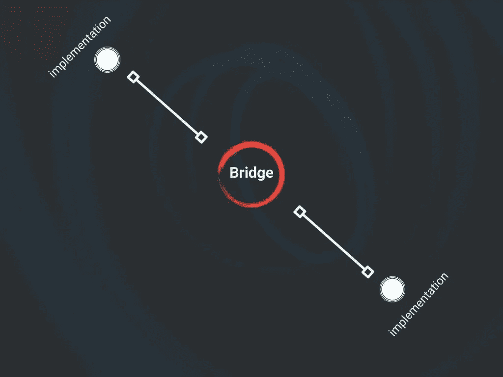
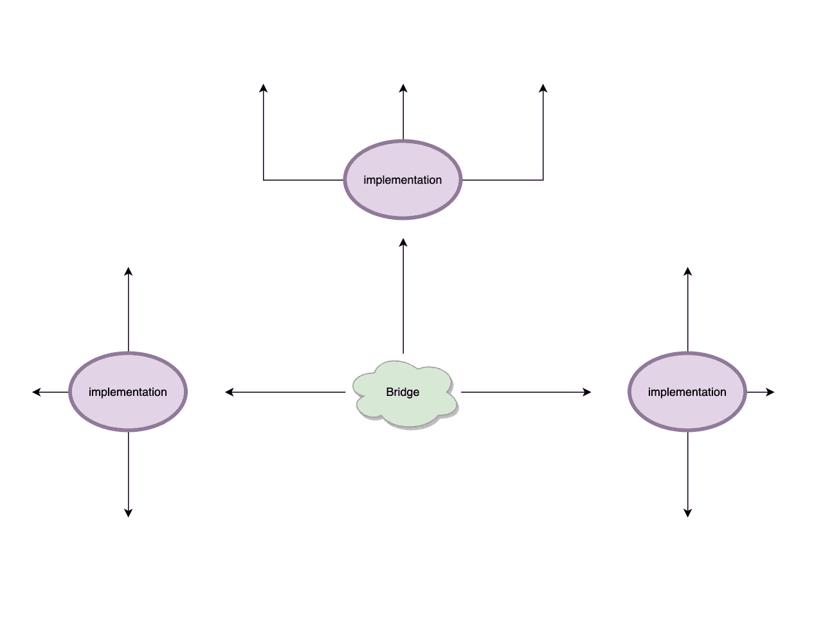
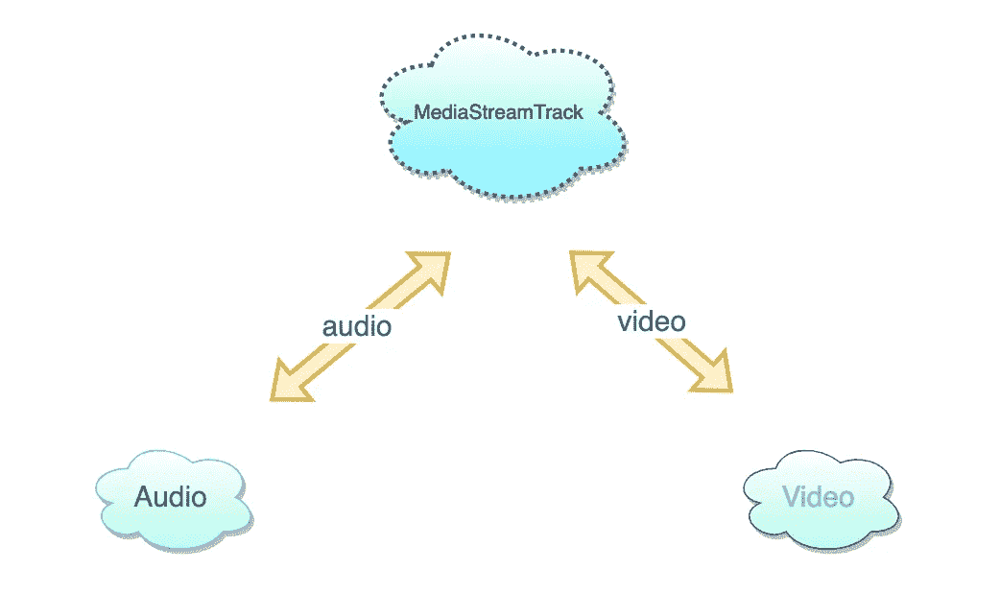

# JavaScript 中的桥设计模式

> 原文：<https://betterprogramming.pub/the-bridge-design-pattern-in-javascript-5427dd1c8660>

## 使用桥梁

图片来源于 [jsmanifest](https://jsmanifest.com)

在本文中，我们将讨论 JavaScript 中的桥设计模式。这是在软件应用中产生重大影响的最常用模式之一。这是一种在其实现中容易促进关注点分离的模式，并且它是*可扩展的*。

下图描述了这种模式:

图片来源 [jsmanifest](https://jsmanifest.com)

通常有两个主要的*参与者*(或者*实体*，无论你想怎么称呼它都可以)参与到桥接模式中。

第一个也是最上面的部分是抽象层。这可以简单地实现为一个类:

在桥接模式中，抽象层声明基本接口方法和/或属性。然而，他们不关心实现细节，因为那不是他们的工作。为了能够获得这种模式的优势，必须保持这种方式，以便我们的代码不会变得紧密耦合，并保持可管理性。

抽象层代替*打开桥*，然后导致模式的第二个主要部分:*实现*层(在实践中通常被实现为*类*)被附加到这些桥上，由*客户端*(或者*你*发号施令。“附加”一词是我的人类可读术语形式，用来理解代码术语，即*引用*或*指针*:

图片来源 [jsmanifest](https://jsmanifest.com)

“桥”可以明显地出现在如下代码中:

如果你访问过像`https://dev.to`或`https://medium.com`这样的网站，它们有一个主题功能，你可以在你的个人资料中访问。通常有一个*拨动*主题按钮。主题是抽象层。在明暗之间切换的实际实现很可能位于实现层内抽象层位置的之外的*。*

# 应该在何时何地使用桥接模式？

现实世界中的一些实现是以一种方式编码的，其中“桥效应”在*运行时间*期间“活跃”。当您需要两个对象之间的这种类型的耦合/绑定时，这就是您可以利用桥接模式的时候。

一个很好的例子就是 [twilio-video](https://github.com/twilio/twilio-video.js) ，这是一个 JavaScript 库，可以让你将实时语音和视频添加到你的 web 应用程序中(比如 Zoom)。在这个库中，[房间](https://github.com/twilio/twilio-video.js/blob/master/lib/room.js)总是实例化为一个空房间。这个类保存了一个指向`LocalParticipant`(当你加入一个视频聊天室*时，你*就是你屏幕上的`LocalParticipant`)的指针，但是`LocalParticipant`并没有真正运行，也没有被实例化*直到它连接并完成了房间的订阅，这只有在运行代码时才有可能。*

如果你浏览他们的代码，你会在很多地方发现桥梁。没有`Room`就无法创建视频聊天会话，房间直到至少有两个`Participant`才会开始。但是`Participant`直到他们开始本地音频/视频`MediaTrack`才能开始流式传输。这些类在自上而下的层次结构中协同工作。当您开始拥有多个耦合在一起的类时，这也是考虑桥接模式的好时机。

桥接模式有用的另一个场景是当您想要与多个对象共享某个对象的实现时。

例如， [MediaStreamTrack](https://developer.mozilla.org/en-US/docs/Web/API/MediaStreamTrack) 类代表一个流的媒体轨道。从中“搭桥”的两个最常见的实现是[音频和视频轨道](https://developer.mozilla.org/en-US/docs/Web/API/MediaStreamTrack/kind)。

图片来源 [jsmanifest](https://jsmanifest.com)

此外，实现细节通常隐藏在派生类中。

# 履行

让我们实现我们自己的桥模式的变体，以便更好地理解问题和它带来的解决方案。

让我们从一个通用的`Thing`类开始，它可以表示任何东西:

我们可以创建一个扩展`Thing`的高级抽象类。我们可以称之为`LivingThing`，并将定义一个名为`eat`的方法。现实世界中的所有生物都生来就具有为了生存而进食的能力。我们可以在代码中模仿这一点。这将停留在高级抽象层:

我们可以看到，我们打开了通往`Mouth`类的桥梁。接下来让我们定义这个类:

现在要考虑的事情(没有双关语)是我们的`Mouth`将是一个实现层，我们在其中编写嘴和食物之间的通信逻辑。

这个实现完全基于`Mouth`。`LivingThing`不关心这些实现细节，而是将这个角色完全委托给它的实现类，在我们的例子中是`Mouth`。

让我们暂停一下，讨论一下这一部分。如果`LivingThing`没有参与它的任何实现，这对我们来说实际上是一个有用的概念。如果我们可以制作其他只需要为实现提供接口的`LivingThing`,那么我们就可以为其他场景制作更广泛的类。

在一个 MMORPG 游戏中，我们可以使用`LivingThing`并制作更多的它们，它们都自动继承 a *指针* a `mouth`:

众所周知，桥模式使开发人员能够构建跨平台的应用程序。我们已经可以在我们的例子中看到这种能力。我们可以通过在新的代码库上重用`LivingThing`来构建同样的 MMORPG 游戏。我们只需要重新实现像`Mouth`这样的实现层，就可以创建到不同平台的绑定。

我们不局限于游戏。由于我们的`LivingThing`是通用的，对任何*移动*的东西都有意义，所以我们可以用它来创建完全不同的东西，比如作为[物联网](https://www.oracle.com/internet-of-things/what-is-iot/)设备程序的机器人，并用`LivingThing`模拟进食行为。

回到我们的假装 MMORPG 游戏，桥可以用来创造更多的桥。MMORPG 通常有一些个人资料页面，用户可以在那里编辑他们的设置。

这个`Profile`本身可以利用桥设计模式来定义一套片段，使其功能类似于 profile API:

如果您读过我的一些其他文章，这可能与适配器或策略模式类似。

然而，解决不同问题的差异是明显的:

在适配器模式中，它解决的问题从代码开始(或在运行时之前的代码),我们首先构建适配器，然后立即开始其余的部分:

[axios 模拟适配器](https://github.com/ctimmerm/axios-mock-adapter)

与我们之前的片段比较，你会立刻感觉到不同。

本帖到此结束！我希望你发现这是有价值的，并期待在未来更多！