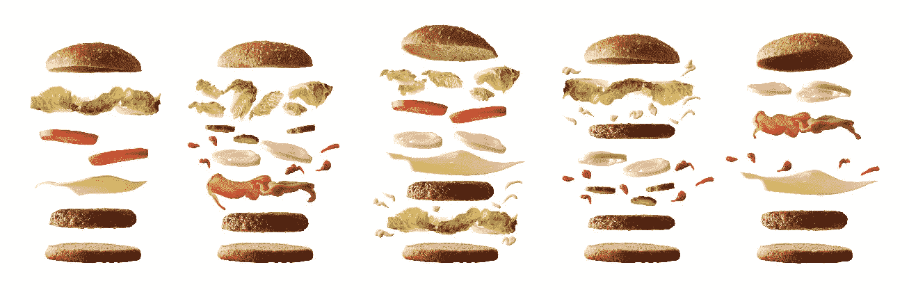

# 汉堡类比:命令式与声明式编程风格

> 原文：<https://betterprogramming.pub/the-burger-analogy-for-imperative-vs-declarative-styles-of-programming-3caf026fd553>

## 理解历史评估系统设计范例的基本方法

照片来自 [Adobe Stock](https://stock.adobe.com/in/)

想过如何向别人解释这种主流行话吗？或者想知道这是怎么回事？嗯，我也想知道！

最近我不得不解释这意味着什么，它是如何工作的，以及它如何影响我们的一个系统。当我努力给它下一个简单的定义的时候，最终我的脑海里出现了一个我们每天都与之相关的东西——汉堡！

# **赛百味 vs 汉堡王**

保持简单——这些大家伙是如何运作的？我指的不是操作部分，而是订购部分。让我们现在不要担心系统，只专注于把我们的汉堡做好！

我如何在赛百味 vs 汉堡王点餐？

赛百味:去餐厅->选择我的鸡肉三明治的所有配料->选择一个面包->选择配料如果有的话->拿我的三明治！

汉堡王:去餐厅->要一个鸡肉汉堡->抢我的汉堡！

好吧，让我们避免争论健康益处或选择自由，但我们在这里观察到什么——在第一种情况下，我知道我想要什么，但我必须解释我想要什么以及如何制造它。但是，在第二种情况下，我知道我想要什么，我要告诉烧烤厨师的只是一件事——回答什么！

这给我们带来了系统/编程/架构的命令式和声明式风格的广义定义，范例:

> 命令式编程指定如何完成(控制流)，而声明式编程指定要做什么(计算逻辑)。

图片来自 [Adobe Stock](https://stock.adobe.com/in/)

# 它是如何关联的？

那我们做了什么？当我们走进赛百味炸鸡店时，我们解释了一步一步的过程，我们只需要告诉汉堡王店我们想要什么汉堡。两者最终都给了我们想要的东西，唯一的区别是在第一种情况下，我必须解释完成它的步骤，而在第二种情况下，我只需要提到我想要的东西。

因此:

> 命令式范式是关于如何完成事情的解释，而陈述式范式是关于最终结果，而不是如何实现它的直接命令。

# **还要汉堡？**

好吧，第二天我去了——虽然我很想尝尝印度的味道——两家店，这次我喜欢赛百味而不是汉堡王，因为他们让我选择我的食材和口味，而汉堡王告诉我从可用的菜单中选择。总之，我对我的潜艇的控制比我的汉堡更好！

这让我们想到了我学到的另一件事:

> 命令式方法会给用户更多的决策控制权，而声明式方法会给编译器更多的控制权(在这种情况下是汉堡店)。

照片来自 [Adobe Stock](https://stock.adobe.com/in/)

# 精彩的部分——重复！

对我来说，汉堡王最棒的部分是我每次点的都是同样的鸡肉汉堡，而在赛百味，我必须记住是什么配料给了我喜欢的味道。这有时看起来像更多的工作要做！是的，我们程序员很懒。

我们从这里学到的是:

> 命令式系统给予用户更多的控制，而声明式系统使重复的过程变得更好，即系统更容易自动化和扩展。

# 结论

我们选择的系统设计范例，无论是命令式的还是声明式的，都是对每个问题陈述的主观选择，因为两者都是唯一能够收敛于同一解决方案的。

换句话说，不管我们是带着三明治还是汉堡去，我们的饥饿感都会被愉快地满足！

感谢您的阅读！我希望下次你去 QSR 的任何一家商店时，你会联想到这些日常商店的运作是如何给我们提供系统设计范例的。让我知道，如果你想有更多这样的类比服务新鲜！