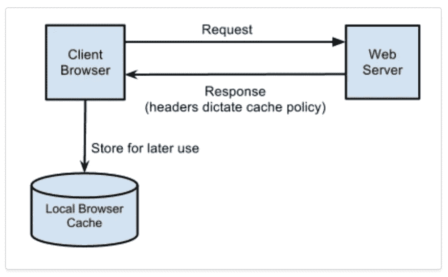
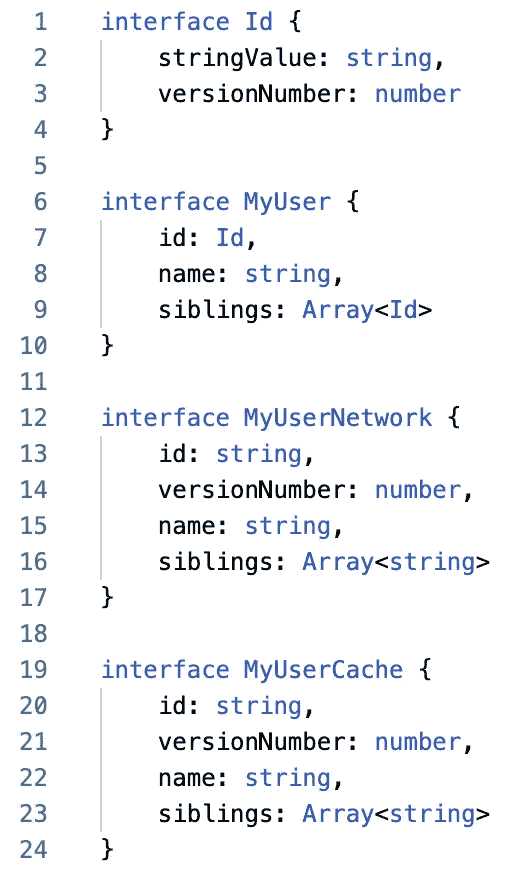
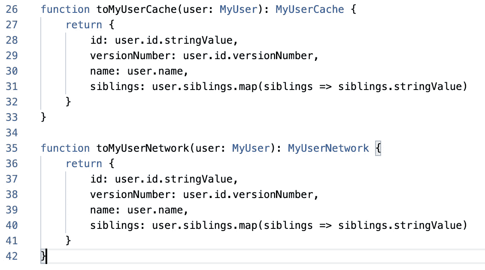
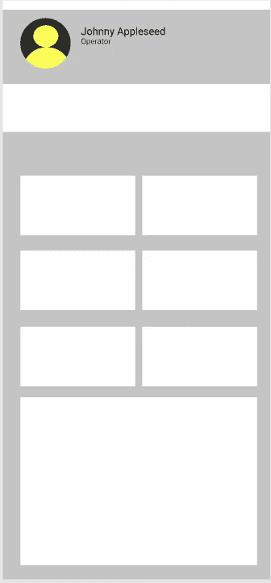
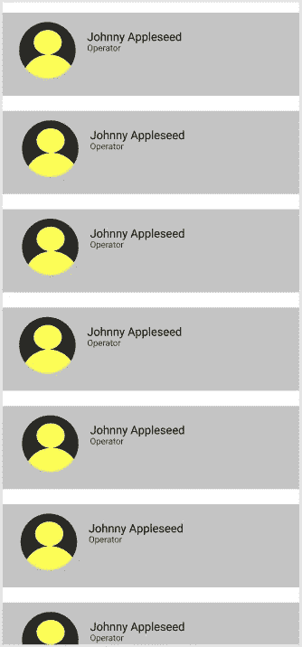

# 重复代码的情况

> 原文：<https://betterprogramming.pub/the-case-for-duplicated-code-5334557bea69>

## 有一个时间和地点的逻辑看起来是一样的。这都是关于代码代表什么

[潘卡杰·帕特尔](https://unsplash.com/@pankajpatel?utm_source=medium&utm_medium=referral)在 [Unsplash](https://unsplash.com?utm_source=medium&utm_medium=referral) 上的照片。

如果您曾经编写过代码，那么您一定听说过“不要重复”原则:

> "每一项知识都必须在系统中有一个单一的、明确的、权威的表示."——[安迪·亨特](https://en.wikipedia.org/wiki/Andy_Hunt_(author))和[迪夫·托马斯](https://en.wikipedia.org/wiki/Dave_Thomas_(author))、[务实的程序员 ](https://en.wikipedia.org/wiki/The_Pragmatic_Programmer)

这个定义很花哨，大多数人把它理解为“每当你复制和粘贴一些东西时，停下来！”使它成为一个可重用的函数、扩展、字段或任何它需要的东西，以便逻辑是共享的——而不是重复的。你可以在考试中写这个，或者在编码面试中说这个。

这是一个伟大的经验法则。代码复制会很快使代码库变得不可维护、臃肿、容易出错，并且很难处理。

大多数时候。

如果你真的考虑一下 DRY 原则，并且真的盯着那个术语定义，它实际上并没有严格地谈论代码复制。它谈到了一个更大的问题:真理的单一来源。

# 干燥，持续一整天

我们将看一些代码来澄清，但首先一些背景。假设我们有一个客户端应用程序从网络获取数据，将其转换为有用的形状显示给用户，并将数据缓存到设备中。网络响应和缓存数据只能使用基本类型和数组。因此，我们需要在我们的“有用形状”和网络响应之间进行转换，并缓存数据。大概是这样的:

图片来自 [Heroku 发展中心](https://devcenter.heroku.com/articles/increasing-application-performance-with-http-cache-headers)。

我们的准则是:

这是我们的界面。`MyUser`是我们希望在应用程序中使用的形状，`MyUserNetwork`是我们从网络中获得的形状，`MyUserCache`是我们需要能够将数据放入缓存的形状。

已经注意到一些类似的代码？让我们来看看一些转换函数:

这些并不是你需要的所有转换函数。他们也不是什么好东西！

这些函数看起来非常相似。人们可能会试图将这些封装到一个函数中，甚至将这些类型完全折叠在一起。我是说，他们看起来一模一样！

但是我认为无论是接口数据类型还是转换函数都不应该折叠在一起。这是因为它们代表的不是同一个东西。他们没有相同的*意图*。如果缓存的工作方式或缓存数据类型需要更改，这应该不会影响网络数据类型。他们长得一样纯粹是巧合。

DRY 的意思是任何问题都有一个真实的来源，而不是“不要重复逻辑”当我问这个问题时，“我如何从`MyUser`转换到`MyUserCache`？”应该只有一个地方可以找到这个答案:这个单一函数。如果这些类中的任何一个发生变化，您只有一个地方来重写如何在它们之间进行转换。

这就是干原理的精髓。我们再举一个例子。

# 相同的观点，不同的视角

我们可以从 UI 层面来考虑这个问题。假设您的应用程序中有用户个人资料，并且您允许用户拥有个人资料图片。假设您有一个如下所示的用户界面:

用户配置文件屏幕。

然后你的任务是做一个这样的屏幕:

用户列表的搜索结果。

你看到什么是可以复制的吗？此用户标识形状:

人们可能想让结果列表中的单元格与用户配置文件顶部的形状共享相同的代码。我是说，他们看起来一模一样！我自己复制粘贴的！

但是，同样，我认为这些应该是具有独立代码的独立视图。如果一个人想改变搜索结果的外观，他不会期望用户简档屏幕改变。事实上，作为一个 QA 人员，甚至不看用户资料也是合理的。他们没有精神上的联系。*

在这种情况下，继续复制样式并查看这些屏幕的代码。把它放在一个新的文件中，并有一些重复的代码。

**这也可以通过测试来发现。+1 表示测试您的代码。*

# 结论

这些是一些非常具体的例子，说明重复代码是可以的。这些并不经常发生，但是当代码被共享而人们没有意识到这一点时，就会产生意想不到的后果。

经验法则是，当代码是一个想法的真实来源时，它应该被共享。这个视图是什么样子的？我如何在这些类型之间转换？答案应该只有一个。

感谢阅读！