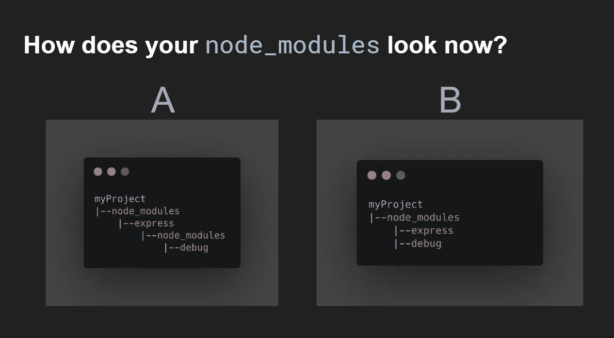
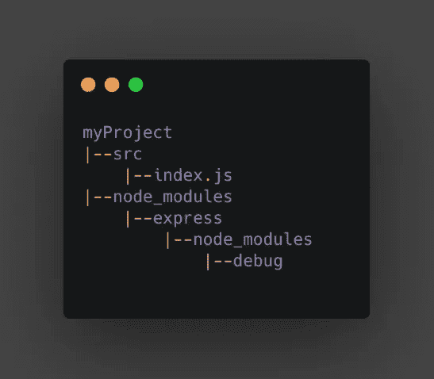
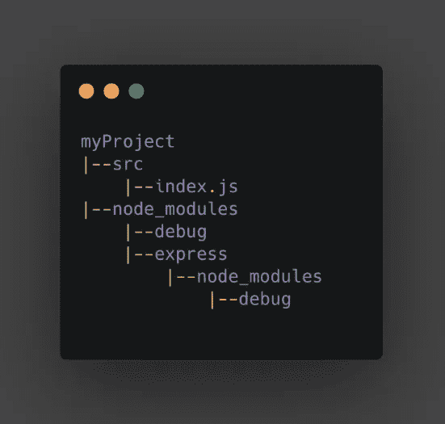
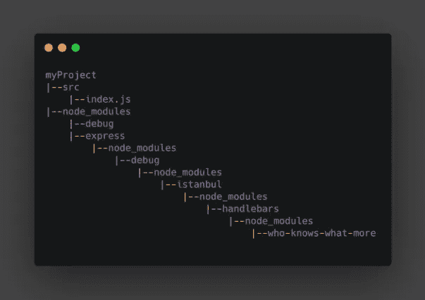
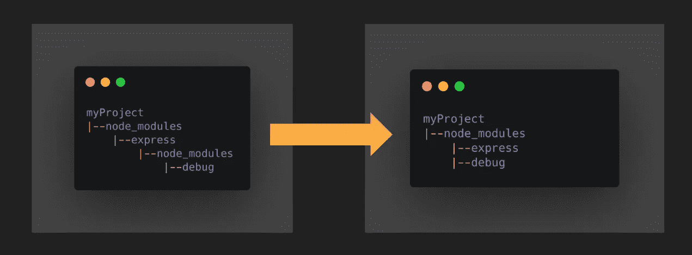
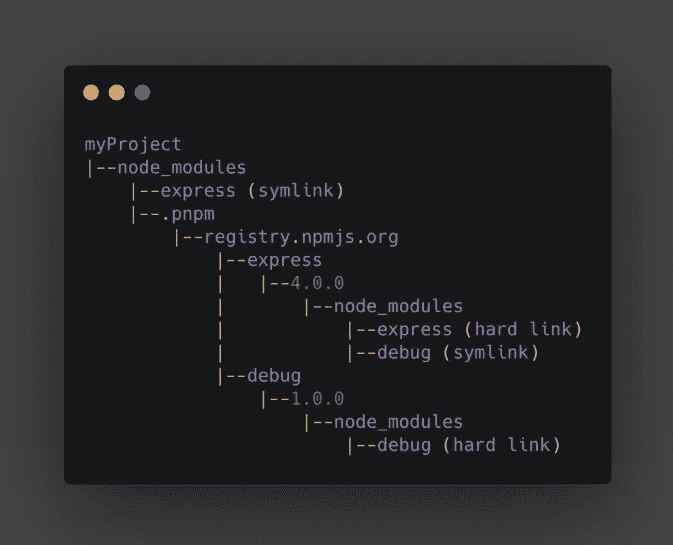
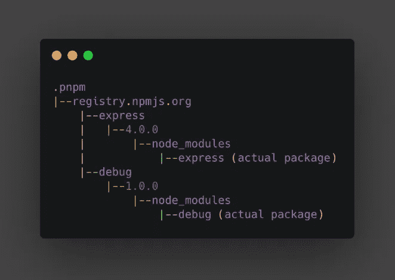

# pnpm 优于 npm 或 Yarn 的情况

> 原文：<https://betterprogramming.pub/the-case-for-pnpm-over-npm-or-yarn-2b221607119>

## 了解这个鲜为人知的 JavaScript 包管理器


[pnpm](https://pnpm.js.org/) 是 JavaScript 的一个包管理器，像 [npm](https://www.npmjs.com/package/npm) 和 [yarn](https://www.npmjs.com/package/yarn) 。我个人觉得 pnpm 不太为人所知。根据[资源库](https://github.com/pnpm/pnpm)中的自述文件，pnpm 是:

> 快速。像 npm 和 Yarn 一样快。
> 
> 高效。包的一个版本在磁盘上只保存一次。
> 
> 对 monorepos 来说很棒。
> 
> 严格。一个包只能访问在其`package.json`中指定的依赖项。
> 
> 确定性。有一个名为`pnpm-lock.yaml`的锁文件。
> 
> 适用于任何地方。可在 Windows、Linux 和 OS X 上运行。

这篇文章分享了我将包含 60 多个包的 monorepo(由 Yarn workspace + Lerna 管理)迁移到 pnpm 的一些心得。为了更好地理解为什么 pnpm 是您项目的好解决方案，让我们从一个测验开始。

# 恶作剧

假设您正在开始一个新的 JavaScript 项目。像大多数人一样，您用 npm 或 Yarn 安装您的依赖项。让我们用 npm 来做这个例子。您的项目需要快递，因此您需要:

```
npm install -g express
```

依赖项已安装！

假设 Express 有一个依赖包叫做`debug`。

你的`node_modules`现在怎么样了？



试着思考几秒钟…

.

.

.

.

.

完成了吗？

如果您回答了 A，您可能会认为这就是依赖关系应该如何工作。

但是如果你用 npm 或者 Yarn 来尝试，你会发现实际答案是 B，这是一个问题。

# 为什么这是个问题？

有了 B 中所示的结构，我们的代码现在可以`require('debug')`，尽管在我们的`package.json`中我们并不明确依赖它。

想想如果发生以下情况会发生什么:

1.  Express 使用重大变更更新其`debug`依赖关系。
2.  Express 决定不再依赖`debug`。

在这两种情况下，我们的代码都将失败，因为它对`debug`有一个隐式的依赖。



*校正*结构

在正确的结构中，我们的代码永远不会访问`debug`。这是因为 Node.js 在`node_modules`中查找内容的方式。

# 那为什么`npm`决定这么做呢？

npm 实际上在 npm3 之前实现了上面的结构 A，但是它有一些问题。

## **重复**

如果我们添加`debug`作为我们的项目依赖，我们可能会有两个不同的`debug`副本。



“调试”模块被复制

这方面的问题:

*   我们磁盘中的副本
*   我们的包中可能有重复项
*   当存在重复时，一些包会被破坏(例如，React)

## **长嵌套目录**



嵌套目录地狱

有些操作系统不能很好地处理长目录。

从版本 3 开始，npm 开始使用扁平化`node_modules`。你可以在这里阅读更多关于这个[的内容。](https://npm.github.io/how-npm-works-docs/npm3/how-npm3-works.html)



扁平的“节点模块”

# 为什么这是个问题？(续)

我们已经知道拥有隐式依赖是不理想的。如果你从事的是规模可观的单边回购，那么问题就更严重了。跟踪一个项目实际使用的依赖项的来源会更加困难。

重复也是一个问题。尽管 Yarn 确实[提升了](https://classic.yarnpkg.com/blog/2017/08/02/introducing-workspaces/)以优化磁盘空间的使用，但在某些情况下[会意外失败](https://github.com/yarnpkg/yarn/issues/7572)。

# **pnpm 如何解决这些**

pnpm 使用[硬链接](https://en.wikipedia.org/wiki/Hard_link)和[符号链接](https://en.wikipedia.org/wiki/Symbolic_link)来实现一个半严格的`node_modules`结构，并确保一个模块只有一个版本保存在磁盘上。

假设我们在项目中执行`pnpm install express`。这就是我们的`node_modules`的样子:



pnpm 的节点模块结构

注意，我们的代码无法访问`debug`，因为它不在根目录`node_modules`下。

pnpm 创建一个特殊的`.pnpm`目录，包含所有模块的硬链接。在`express/4.0.0`下，有`express`模块，它是到全局`pnpm-store`的硬链接，还有一个`debug`符号链接到`debug`硬链接，它也链接到全局`pnpm-store`。



全球“pnpm 商店”

全局`pnpm-store`的结构大致相似。我们使用 pnpm 安装的实际包存储在这里。一般保存在`~/.pnpm-store`下。

# 嗯，它对 npm 注册表上的每个包都有效吗？

不幸的是，如果您从 Yarn/npm 迁移到 pnpm，有些包可能无法工作。大多数情况下，这是由于包的`package.json`文件中缺少依赖项造成的。

让我们以 [antd-table-infinity、](https://github.com/Leonard-Li777/antd-table-infinity)为例。这个包不依赖于`antd`，但是有一些[从](https://github.com/Leonard-Li777/antd-table-infinity/blob/d479e49f36dce40dc07dc150be77041cdcc853ea/src/pages/SumTable.js#L1) `[antd](https://github.com/Leonard-Li777/antd-table-infinity/blob/d479e49f36dce40dc07dc150be77041cdcc853ea/src/pages/SumTable.js#L1)`导入的代码。这个包在发布之前也没有捆绑`antd`。在大多数情况下，当你使用这个包时，你可能已经安装了`antd`。然后，扁平的`node_modules`结构允许这个包找到`antd`。有了 pnpm，这个包就再也找不到`antd`了，并且会失败。

幸运的是，pnpm 提供了[钩子](https://pnpm.js.org/en/3.6/hooks)，所以我们可以在我们这边解决这种问题。我们可以使用这个简单的钩子手动添加`antd`作为`antd-table-infinity`的`peerDependency`。

简单的“pnpmfile.js”挂钩

# pnpm 对我们有什么好处？

在我看来，pnpm 的两个主要好处是:

## **无重复**

*   您的计算机上只能有一个版本的包
*   无论您的机器上有多少 JS 项目，都可以节省磁盘空间
*   不再有重复反应的问题

## 严格的

*   没有对非依赖性的意外访问
*   更稳定、更一致、更可预测
*   [避开愚蠢的虫子](https://medium.com/pnpm/pnpms-strictness-helps-to-avoid-silly-bugs-9a15fb306308)

没有副本意味着无论你的机器中有多少依赖于，比如说，电子的项目，你的机器上只有一个电子版本的副本。[它对 monorepos](https://pnpm.js.org/en/workspaces) 也很有效。没有重复有助于减少磁盘上的 monorepo 的大小。这种严格性有助于尽早发现难以理解的错误。

如果你把你的项目从 npm 或者 Yarn 转移到 pnpm，你可能会发现一些`unable to resolve module "some-module"`错误。您的项目以前可能因为扁平化的`node_modules`结构而工作，但是在更严格的结构下会失败——如果您的目标是长期可维护性，这是一件好事！

# **总结**

总而言之，pnpm 是严格的，它帮助我们节省磁盘空间。这种严格性使得事情更容易预测，并且更早地发现错误。这对你来说是否重要取决于你自己。如果你正在与一个大规模的 monorepo 合作，我强烈推荐你去看看 pnpm。

本文只涵盖了 pnpm 必须提供的一些内容。希望你觉得有用！关于 pnpm 的更多资源可以在下面找到。如果你还没有通读，这是值得的。

# **资源:**

*   pnpm 的严格有助于避免愚蠢的错误
*   [“为什么要用 pnpm？](https://www.kochan.io/nodejs/why-should-we-use-pnpm.html)
*   [“扁平节点模块不是唯一的方式](https://medium.com/pnpm/flat-node-modules-is-not-the-only-way-d2e40f7296a3)
*   [常见问题 pnpm](https://pnpm.js.org/en/faq)