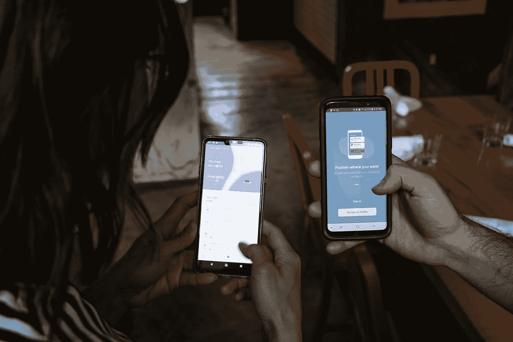

# 移动网络应用的案例

> 原文：<https://betterprogramming.pub/the-case-for-the-mobile-web-app-db7ce1d6c38b>

## 你可能不需要一个本地应用，甚至不需要一个 PWA

照片由[7 班](https://unsplash.com/@7shifts?utm_source=medium&utm_medium=referral)在 [Unsplash](https://unsplash.com?utm_source=medium&utm_medium=referral) 上拍摄

苹果上个月宣布，最新的 Safari 版本将在用户 7 天没有与网站互动后，删除网站在本地存储的所有数据，这再次受到了很多批评。

尽管苹果公司后来[澄清](https://webkit.org/blog/10218/full-third-party-cookie-blocking-and-more/)这并不适用于安装在主屏幕(PWAs)上的应用程序，但许多人仍然感到愤怒，并声称苹果公司试图扼杀 PWAs。

苹果一直是 PWA 故事中的坏人，因为他们在实现开发人员希望在 PWA 中使用的功能方面速度缓慢。当一些功能在 iOS 上的 Safari 中工作时，当应用程序安装在主屏幕上时，它们不受支持。

这是直接访问摄像头和麦克风的情况，幸运的是，从 iOS 13.4 开始，PWAs 现在启用了这一功能。

# 苹果可能有一定道理

尽管苹果一直在默默地改善 iOS 对 PWA 的支持，但他们仍然经常被指责试图扼杀 PWA，以支持原生应用和应用商店。

我确实相信苹果推迟 PWAs 的开发是有商业原因的。但是，由于他们也在默默地提高对艾滋病毒感染者的支持，我也相信他们意识到这种发展是很难停止的，如果他们想停止的话。

尽管他们不再是指 Safari，但是应用程序商店审查指南的第 4.2 节仍然告诉开发者将使用网络技术构建的应用程序转移到网络上。

我不一定同意这个政策，我也希望苹果能进一步改善对 PWAs 的支持，但这让我思考。

考虑到 web 应用程序可以做本地应用程序可以做的大多数事情，并且许多本地应用程序可以很容易地被一个精心制作的 web 应用程序取代，苹果的立场可能并不那么疯狂。

# 你可能只需要一个移动网络应用程序

看到有多少网站没有针对移动设备进行优化，并且[通过要求用户安装他们无用的原生应用来主动赶走用户](https://medium.com/better-programming/were-killing-the-mobile-web-be5c5662c807)，我仍然感到震惊。

即使你不想或不需要一个原生应用或 PWA，你的网站也可以提供一个类似应用的行为，给你的用户一个好得多的体验。

在旧版本的 iOS 中，当一个 web 应用程序作为 PWA 安装在主屏幕上时，有些功能不受支持，*但只要你在 Safari* 中运行你的应用程序，这些功能就可以工作。

例如，在早于 13.4 的 iOS 版本上，你不能在 PWA 中使用`navigator.getUserMedia`直接访问摄像头和麦克风，但在 Safari 中这就可以了。

如果你为移动应用优化你的站点并增加一个服务人员，*它也可以离线工作*。

你甚至可以像应用程序一样将你的网站添加到主屏幕上。当你添加正确的`apple-touch-icon` `link`标签时，它甚至会为你的网站显示一个漂亮的图标，而不是截图。

与 PWA 的唯一真正区别是，你的应用程序将在 Safari 中运行，地址栏将可见。除此之外，你的网站将像一个应用程序。它在主屏幕上，离线工作。

iOS 上的网络应用仍然缺少的主要东西是推送通知，但除此之外，[许多功能已经得到支持](https://whatpwacando.today)。Android 已经支持这一功能和许多其他功能。

# 您的 Web 应用程序已准备就绪

这里的要点是，您已经可以为您的用户提供出色的体验，而无需构建原生应用或 PWA。

它已经可以离线工作，安装在你的主屏幕上，使用所有现代的网络应用编程接口。

忘记原生应用。忘了 PWAs。把你的网站变成一个伟大的移动网络应用，给你的用户最好的体验。

可以的。这是应该的。