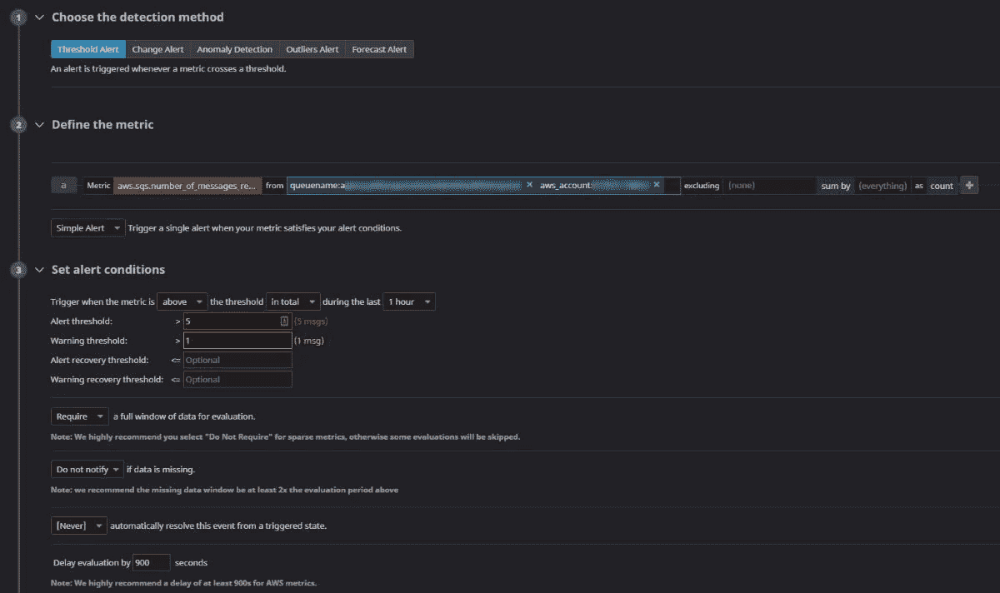

# 无状态架构的挑战以及如何监控无服务器应用程序

> 原文：<https://betterprogramming.pub/the-challenges-of-stateless-architecture-and-how-to-monitor-your-serverless-application-94c0e8b8dd1>

## 无服务器应用并非没有挑战。主动监控以应对新的困难

格伦·卡丽在 [Unsplash](https://unsplash.com/s/photos/spying?utm_source=unsplash&utm_medium=referral&utm_content=creditCopyText) 上拍摄的照片。

所以你决定不用服务器。恭喜你。欢迎来到高可用性、纵向和横向可伸缩性、快速开发以及只为您使用的东西付费的世界。

业务功能是游戏的名称。软件工程师开始花时间解决业务问题，而不是解决网络和基础设施问题。您的应用程序将会得到开发团队的充分关注。

但是，无服务器应用带来了一些新的有趣的挑战——这些挑战曾经是解决的问题，比如[如何预测应用成本](https://medium.com/better-programming/5-steps-to-making-a-predictable-cost-model-for-aws-serverless-projects-78d78909bb82)。既然您的应用程序是“按使用付费”，那么这如何转化为执行次数和计算时间呢？

其他问题包括[如何大规模测试你的应用](https://medium.com/better-programming/how-to-easily-load-test-serverless-apps-with-postman-and-aws-912de7f1f7e0)。你如何测试所有这些 lambda 函数、API 网关端点和 SNS 主题？

应用健康如何？您需要知道您的应用程序是否已经启动并运行，并且正在做它应该做的事情。对于这个问题，传统的开发有一个简单的答案。只需添加一个运行状况检查端点。创建一个 web 服务来检查服务器的状态及其连接性。

但是如果你的应用没有服务器呢？无服务器应用程序是无状态的。它是分布式的。您不能控制代码运行的服务器。见鬼，大多数时候，你的代码甚至没有运行！

# 了解您的无服务器问题

与传统的客户机/服务器甚至容器化的应用程序相比，无服务器应用程序会有不同的问题。信不信由你，你那些“你有没有试着把它关了再开？”现在都结束了。没什么可关的。

当一个 AWS Lambda 函数被调用时，一个[小鞭炮容器](https://aws.amazon.com/blogs/aws/firecracker-lightweight-virtualization-for-serverless-computing/)被启动，你的代码被执行，然后它被关闭(除非有更多的调用紧随其后)。本质上，你的整个应用程序整天都在自我关闭和重新打开。

您更可能看到的是基础设施设置问题、配置问题和外部集成事故。

## 基础设施设置问题

如果您正在使用类似 [CloudFormation](https://aws.amazon.com/cloudformation/) 的可重复基础设施设置脚本，有许多工具可以确保您的无服务器应用程序配置正确。

[AWS SAM](https://aws.amazon.com/serverless/sam/) 是一个框架，允许你轻松地将无服务器组件连接在一起。它把云结构的重担卸下来，抽象成几行 YAML 或 JSON。这允许您在向 S3 上传文档时触发 lambda 函数，或者只用几行代码构建 DynamoDB 表。

它不会验证您的 IAM 权限。IAM 是 AWS 用于身份和访问管理的工具。如果你遵循 [AWS 最佳实践](https://aws-quickstart.github.io/best-practices.html)，你就是在实践最小特权原则(PoLP)。这意味着您已经将您的角色设置为只使用他们绝对需要的东西。

这在理论上听起来很棒，最终这是一个有安全意识的人的梦想。但是在开始的时候，这是非常困难的。找到正确的权限，知道何时限制权限，以及弄清楚如何构建 IAM 角色需要一点学习过程。

当你第一次构建你的应用时，你会遇到一个服务不允许与另一个服务对话的问题。这很容易解决，但它肯定会一次又一次地出现。

## 配置问题

尽管我们都喜欢认为自己写出了完美的代码，但事实并非如此。会有 bug，而且会有很多。对于无服务器应用程序，这些错误肯定会在配置问题中表现出来。

标准的无服务器模式是开始执行>加载配置>执行业务逻辑>保存结果>完成执行。

如果你没有一个严密的配置，你的应用程序将会失控。在保存和加载租户配置时，请自行确保记录适当数量的详细信息。

## 外部整合失败

我们都经历过。一切都很好。你的应用程序看起来和感觉上都是防弹的。

突然，轮子掉了。警铃、警笛和灯光都在响，而你不知道刚刚发生了什么。

原来是第三方依赖出了问题。您依赖它们来执行任务，而它们的应用程序开始出现故障。

您的 SLA 只和您的依赖项的最差 SLA 一样好。选择他们时要小心，当事情变糟时要有一个计划。

## 了解你的(软)极限

你必须担心的一个新问题是触及软限制。软限制是由你的云供应商设置的约束，以确保你不会做任何…愚蠢的事情。

例如，AWS 在任何给定时间都有 1，000 个并发 lambdas 运行的软限制。如果您试图让 1001+lambda 同时运行，您将开始受到限制，并收到 429 个 HTTP 响应。

幸运的是，在这种情况下，*软*意味着它们是可调的。如果您遇到需要合法更新限额的情况，您可以向 AWS 支持部门发送电子邮件，他们会为您提高限额。

*照片由* [*查得*](https://unsplash.com/@chadpeltola?utm_source=unsplash&utm_medium=referral&utm_content=creditCopyText) *上* [*下*](https://unsplash.com/s/photos/mail?utm_source=unsplash&utm_medium=referral&utm_content=creditCopyText) *。*

# 向 dlq 中抛出错误

在一个无服务器的应用程序中，你不能登录到一个应用服务器去查看日志。不再有持久的连接。应用服务器日志不是一个东西。

你有 CloudWatch 日志，但如果你只是浏览，找到你要找的东西可能是一场噩梦。每一个旋转起来的 lambda 都会创建自己的日志组，在一天中，你可能会有数千个组需要梳理。

您必须将错误发送到一个[死信队列(DLQ)](https://aws.amazon.com/blogs/compute/designing-durable-serverless-apps-with-dlqs-for-amazon-sns-amazon-sqs-aws-lambda/) 。DLQ 是一种队列类型，您可以在其中发送例外以进行人工审查。它们让您可以直接访问错误的细节，此外，您还可以了解错误发生时应用程序正在做什么。

如果操作失败，您的无服务器应用程序应该总是尝试重试操作。

如果你的重试失败了，并且没有一个明确的解决方法，那么就把你正在尝试做的事情的上下文和细节发送到一个特定的队列中。对于应用程序中的每个故障点，应该有一个单独的队列。

是的，这确实意味着大量的队列，但也意味着如果有什么东西出现，您可以确切地知道是什么出了问题。

# 配置 DLQ 警报

在理想的世界里，不会有任何问题。

在一个接近理想的世界里，软件公司会在客户报告问题之前识别并修复问题。

为了在问题发生的那一刻就意识到它们，您需要在死信队列上设置警报。警报监控 dlq，并在有消息传入时提醒负责方。

你可以直接在 [AWS CloudWatch](https://aws.amazon.com/cloudwatch/) 中建立警报，或者你可以使用像 [Datadog](https://datadoghq.com/) 这样的外部服务来管理它们。这些服务允许您对特定的死信队列设置警报，监视给定时间段内的传入消息阈值，并通过发送电子邮件、垃圾消息、电话等方式提醒相关人群。

*配置一个* [*中的死信队列监视器*](https://datadoghq.com) *。*

DLQ 的警报示例如下:

> 一个小时内:
> —如果没有消息排队，一切正常。
> —如果队列中有 1-4 条消息，则在 Slack 中发出警告，表示可能有问题。
> —如果队列中有 5 条以上的消息，则说明有问题。通知待命工程师。

一旦您有了一套强大的警报，您就能够在问题出现时快速做出响应。

# 运行自动化业务流程

让一个 QA 分析师一直在你的系统中运行测试是不现实的。但是你需要测试来确保系统健康，一切正常。

相反，您可以设置自动化测试来测试您的应用程序，并让它们定期运行。

*照片由*[*Filtore F*](https://unsplash.com/@daseine?utm_source=unsplash&utm_medium=referral&utm_content=creditCopyText)*on*[*Unsplash*](https://unsplash.com/s/photos/robot?utm_source=unsplash&utm_medium=referral&utm_content=creditCopyText)*。*

使用 [Postman](https://getpostman.com) ，您可以在您的系统中构建模拟用户的工作流。您可以[记录您的应用程序在业务流中发出的所有 web 请求](https://learning.postman.com/docs/sending-requests/capturing-request-data/interceptor/)，将它们参数化，并让它们以随机值定期回放。

在我的一个项目中，我们将这些工作流(称为[集合](https://www.postman.com/collection/))配置为在我们的测试和生产环境中运行。我们有一整套测试整个系统的工作流程，在测试环境中每四小时运行一次，在生产环境中每两小时运行一次。

这些集合运行一系列 web 请求，然后执行测试来验证状态代码、响应时间和预期的响应模式是否正确。

由于系统每隔几个小时就进行这样的自检，我们确信系统在任何时候都是可操作的。

如果测试出现问题，我们通过与 Datadog 的[本地集成进行报告，这将在 Slack 中向团队发送一条消息，以便立即采取行动。](https://learning.postman.com/docs/integrations/available-integrations/datadog/)

如果你建立了这些集合，你不仅会对你的系统是可操作的有信心，而且你也为自己设置了[简单负载测试](https://medium.com/better-programming/how-to-easily-load-test-serverless-apps-with-postman-and-aws-912de7f1f7e0)。

# 尝试受管监控

有许多本地工具可以监控您的无服务器应用程序。您可以配置仪表板、测试、警报、通知、限值、阈值等。，但是你仍然需要维护你正在收集的所有数据。

除了自己构建之外，另一种方法是尝试托管监控服务，如 [Datadog](https://epsagon.com/get-started/) 、[桑德拉](https://www.thundra.io/)或 [Epsagon](https://epsagon.com/get-started/) 。像这样的服务不仅为您提供了增强的监控数据，还通过绘制您的架构图为您提供了组装系统的可观察性。

拥有可视化的架构图和基础设施图有助于发现瓶颈和其他节流机会。

万一出现问题，托管监控服务还将提供增强的调试措施。调试速度越快，系统恢复运行的速度就越快。

# 结论

监控无服务器应用程序是应用程序开发的一个必要部分，这一点经常被认为有点太晚了。

它提供了对系统的深入了解，有助于故障排除，并让您确信您的设置是正确的。

花点时间为自己准备一些工具，以便在客户发现问题之前发现问题。将所有错误发送到死信队列。当错误出现时触发警报。无论您是手动设置还是使用托管服务，未来的自己都会感谢您。

尽可能在任何地方构建自动化。让您的系统可靠。确信你已经构建了正确的软件。

最重要的是，让你的开发者专注于开发。拥有一个全面监控的系统可以让他们把精力投入到真正重要的事情上:解决业务问题。