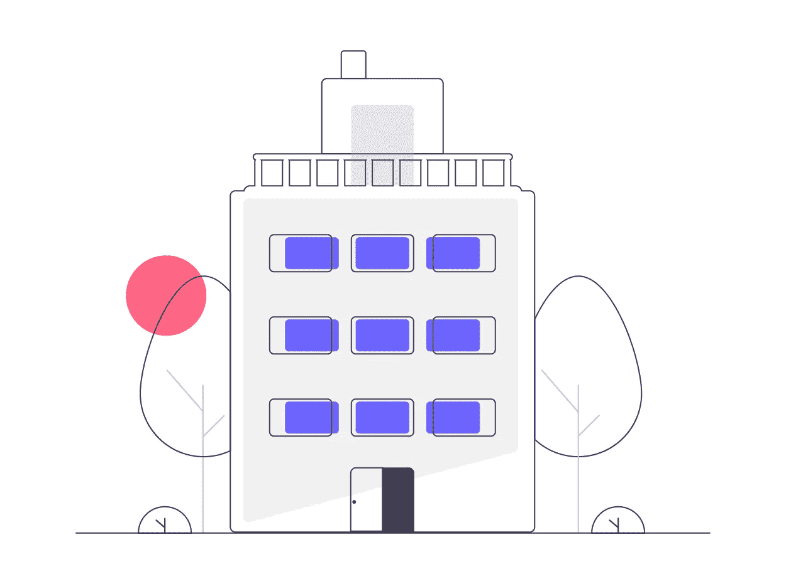
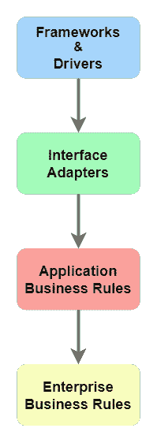
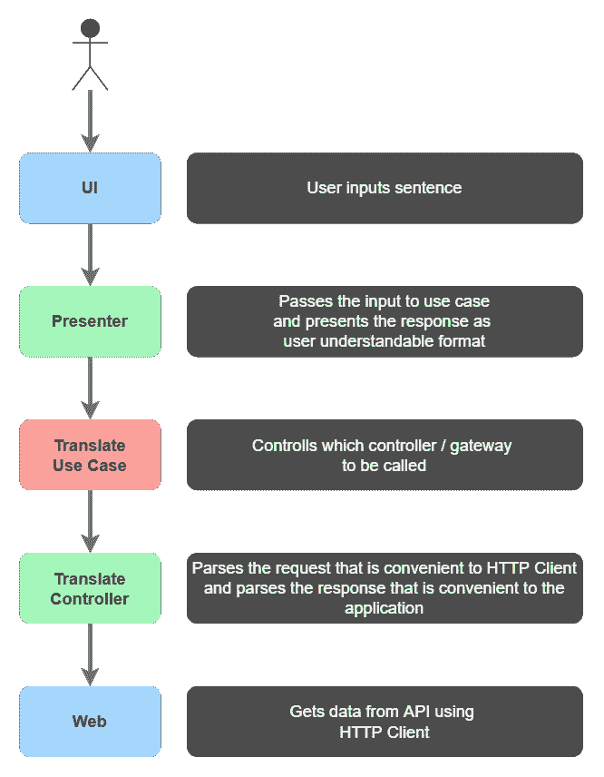
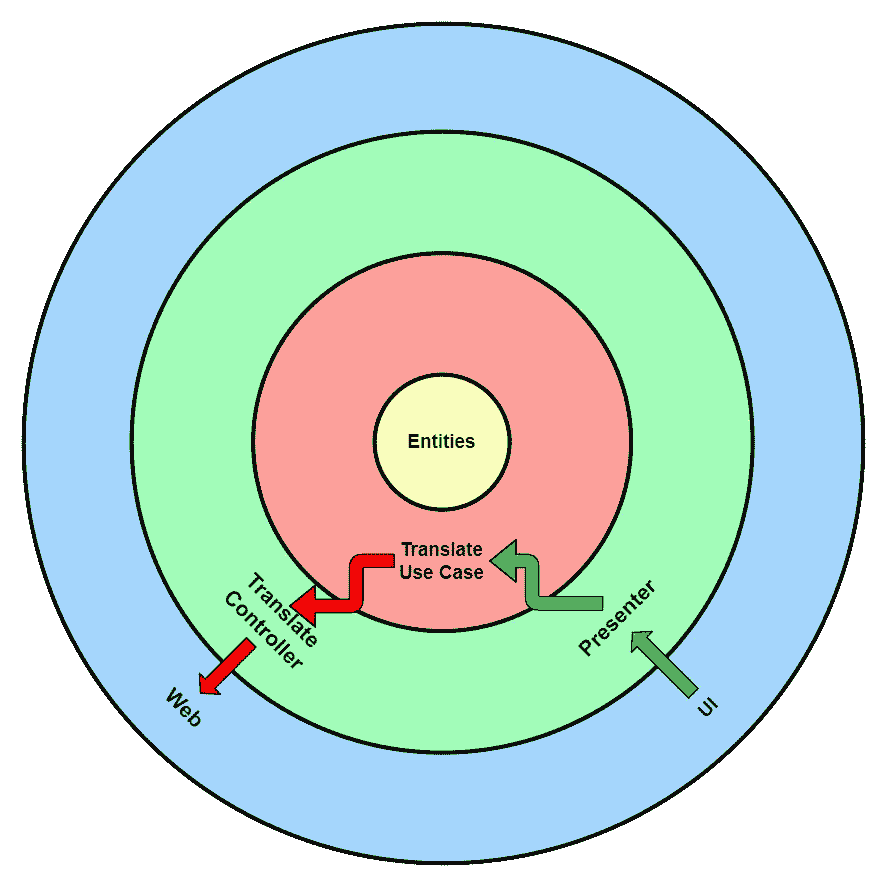
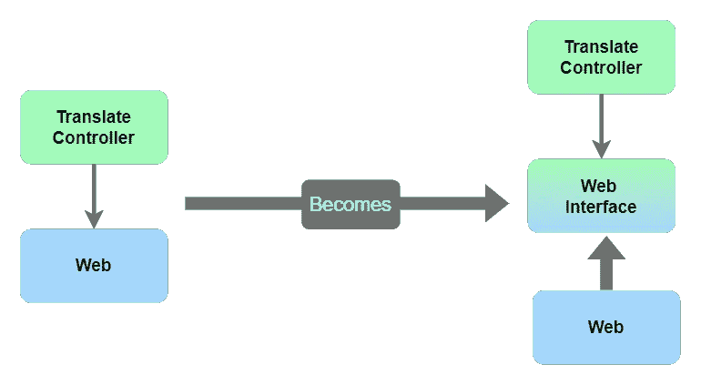
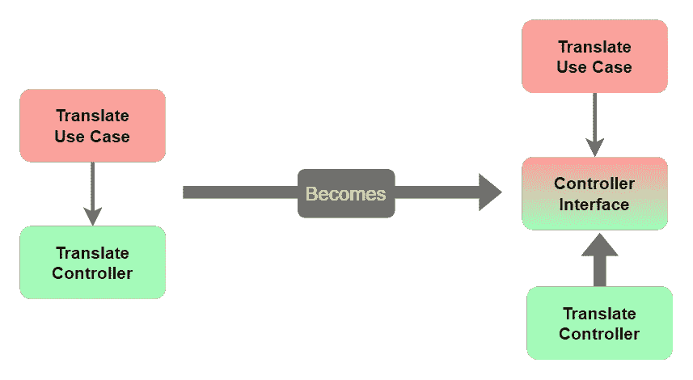
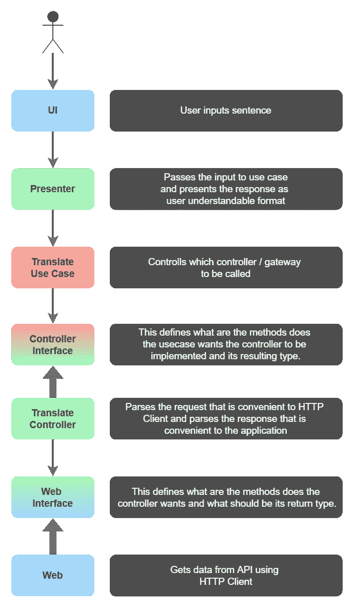
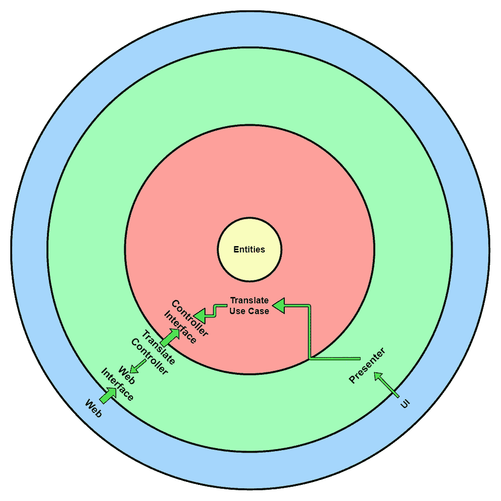

# 干净的建筑——初学者指南

> 原文：<https://betterprogramming.pub/the-clean-architecture-beginners-guide-e4b7058c1165>

## 如用视觉图示所解释的

来源: [Undraw](https://undraw.co/)

[干净架构](https://blog.cleancoder.com/uncle-bob/2012/08/13/the-clean-architecture.html)是罗伯特·c·马丁(鲍勃大叔)提出的系统架构指南，来源于许多架构指南，如六角形架构、洋葱架构等...这些年来。

这是软件工程师在构建可伸缩、可测试和可维护的软件时遵循的准则之一。

## 为什么我们需要架构师？

“软件架构的目标是最小化构建和维护所需系统所需的人力资源。” *―罗伯特·c·马丁，清洁建筑*

# 适当架构的优势

*   可试验的
*   可维持的
*   易变的
*   易于开发
*   易于部署
*   自主的

# 干净的建筑

这是罗伯特·马丁创作的干净建筑插图:

罗伯特·c·马丁拍摄的图片

我们可以看到图中有四层。蓝色层、绿色层、红色层和黄色层。

每个圆圈代表软件的不同区域。最外层是软件的最低级别，随着我们越深入，级别会越来越高。总的来说，当我们越深入，这个层就越不容易改变。

# **依赖规则**

依赖规则声明源代码依赖只能指向内部。

这意味着内圈的任何东西都不可能了解外圈的任何东西。也就是说，内圈不应该依赖外圈的任何东西。图中的黑色箭头显示了依赖规则。

这是使这个架构工作的重要规则。还有，这个很难理解。所以我会先打破这个规则，让你明白它会带来什么问题，然后解释，让我们看看如何跟上这个规则。所以请原谅我。

首先，这种循环表示可能会让许多人感到困惑。所以我们试着垂直表示。

作者图片

这里表示的颜色与干净的架构图中表示的颜色相同。

记住，箭头应该读作“依靠”。即`Frameworks and Drivers`应该依赖`Interface Adapters`，T1 依赖`Application Business Rules`，T1 依赖`Enterprise Business Rules`。

底层的任何东西都不应该依赖于顶层。

## 框架和驱动因素

位于这一层的软件领域有

*   用户界面
*   数据库ˌ资料库
*   外部接口(例如:本地平台 API)
*   Web(例如:网络请求)
*   设备(例如:打印机和扫描仪)

## 接口适配器

这一层适用

*   `Presenters` (UI 逻辑，状态)
*   `Controllers`(保存由 Web、设备或外部接口实现的应用程序所需方法的接口)
*   `Gateways`(保存应用程序执行的每个 CRUD 操作的接口，由 DB 实现)

## 应用程序业务规则

不是核心业务规则，但对该特定应用程序至关重要的规则属于这一类。这一层持有`Use Cases` **。**顾名思义，它应该提供应用的每一个用例。即它拥有应用程序提供的每一个功能。

此外，这是决定特定用例调用哪个`Controller` / `Gateway`的层。有时我们需要来自不同模块的控制器。

这是不同模块协调的地方。例如，我们想为一个月内购买了 x 笔金额的用户提供折扣。

在这里，我们需要从`purchase module`中获取用户这个月的消费金额，然后根据结果，我们需要在`checkout module` **中为用户应用折扣。**此处`applyDiscountUseCase` 调用采购模块的控制器获取数据，然后在结账模块中应用折扣。

## 企业业务规则

这是保存核心业务规则或特定于领域的业务规则的层。此外，这一层是最不容易改变的。

任何外层的变化都不会影响这一层。由于`Business Rules`不会经常变化，所以这一层的变化非常罕见。这一层保存实体。

实体可以是业务规则所必需的核心数据结构，也可以是包含业务逻辑的方法的对象。

比如:银行应用中的计算`Interest`模块，就是应该在这一层里面的核心业务逻辑。

让我们看一个简单的例子来更好地理解这一点。

该示例演示了一个只有一个网络请求的简单应用程序。

我们如何构建一个应用程序，使用翻译 API 翻译用户给出的句子？让我们试着设计。

作者图片

每一层都做一件特定的事情。看起来不错吧？让我们检查一下上面这个架构的依赖流，看看是否有什么地方出错了。

还记得依赖规则吗？“依赖关系规则规定源代码依赖关系只能指向内部”。

作者图片

UI →演示者(✅不违反)

演示者→翻译用例(✅不违反)

翻译用例→翻译控制器(违反❌)

转换控制器→网络(违反❌)

但是好像是对的吧？

`UI`向`Presenter`请求数据，T1 向`Use Case`请求数据，而`Controller`向`Web`请求数据。

> 毕竟，在没有`*Controller*` 依赖的情况下，我们怎么能指望`*web*`将一些数据扔给*`*Controller*`*？同样，我们怎么能指望`*Use Case*`从`*Controller*` 中获得适当的数据而不依赖它呢？**

**但是依赖规则严格地说依赖只能指向内部。总而言之，这是使架构工作的规则。**

**为了通过这条规则，我们需要将箭头反向。这可能吗？多态性**来了。当我们在这里包含一些多态性时，神奇的事情发生了。****

**简单地通过在这两层之间有一个`Interface` ，我们可以颠倒依赖关系。这就是所谓的依赖性反转原则。**

**让我们在违反依赖规则的情况下实现依赖倒置原则。**

****

**作者图片**

****

**作者图片**

**因此，流程变为:**

****

**作者图片**

**现在让我们检查一下依赖流，看看是否有什么违反了它。**

****

**作者图片**

**现在我们可以看到，没有内层依赖于任何外层。相反，外层依赖于内层。**

> ***那么为什么外层要依赖于内层而不是相反呢？***

**想象你在一家酒店里。我们希望酒店提供我们想要的服务，而不是他们提供的服务，对吗？。这里发生了同样的事情，我们希望数据库提供应用程序需要的数据，而不是它拥有的数据。**

**应用程序订购它想要的数据，它不关心数据库或 API 如何准备数据。这样，应用程序不依赖于 DB 或 API。如果我们将来需要/想要改变 DB 或 API 模式，我们可以简单地改变它。至于它给出了应用程序所要求的，应用程序甚至不知道 DB 或 API 中的变化。**

**此外，单向依赖关系规则将应用程序从死锁状态中拯救出来。即，想象在 2 层架构中，第一层依赖于第二层，第二层依赖于第一层。在这种情况下，如果我们需要更改第一层中的任何内容，就会破坏第二层。如果我们需要改变第二层中的任何东西，就会破坏第一层。这可以通过跟踪死锁状态来拒绝。**

**这就是鲍勃大叔描述的干净的建筑。**

**我们还没有看到如何跨边界移动数据以及如何处理错误。我们将在以后的文章中这样做。**

**感谢阅读。**