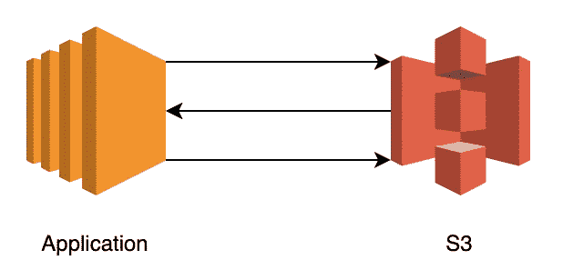
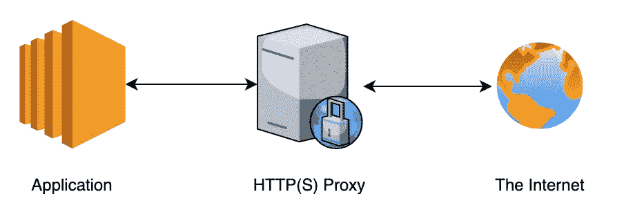

# 云不再对开发者友好

> 原文：<https://betterprogramming.pub/the-cloud-isnt-developer-friendly-anymore-9f57ad55d6be>

## 这是生产中断的主要原因


[西格蒙德](https://unsplash.com/@sigmund?utm_source=medium&utm_medium=referral)在 [Unsplash](https://unsplash.com?utm_source=medium&utm_medium=referral) 上拍照。

当我提到配置管理时，我知道身经百战的开发人员会发抖。我无法计算由于一个看似无关紧要的配置改变而导致的失败发布的数量。甚至谷歌也发布了七份与配置错误相关的事后报告。[在一次事件](https://github.com/danluu/post-mortems#config-errors)中，他们拒绝列出`/`提示每个网址显示警告。

现在，使用现代部署策略，我们的发布应该在进入生产之前就失败了。那么，这些问题究竟为什么会持续存在呢？残酷的事实是懒惰的实例化是懒惰的，现在是我们为各方解决问题的时候了。

# 让我们从简单的开始

那么，惰性实例化到底是什么，它与配置更改导致的生产中断有什么关系呢？解释这一点最简单的方法是通过一个例子。

下面是用 Go 编写的一段代码，其中一个应用程序使用外部 MySQL 数据库:

如果变量`connStr`不正确，这个代码会不会死机？

在这种情况下，答案实际上是否定的。虽然看起来代码打开了一个到数据库的连接，但它实际上只是延迟地实例化了一个数据库池对象，并等待第一个请求。

这可能因数据库驱动程序而异。`[sql.Open](https://golang.org/pkg/database/sql/#Open)` [文档](https://golang.org/pkg/database/sql/#Open)建议实际确认来源有效:

> "若要验证数据源名称是否有效，请调用 Ping 命令."

假设您有一个 API 服务器，它将这个数据库对象传递给请求处理程序。在这种情况下，当每个传入的请求随后失败时，服务器将启动并看起来很健康。

简单地说，惰性实例化就是在急切地工作之前等待第一件事去做的过程(在本例中，打开一个到数据库的连接)。这就产生了一个大问题:除非服务失败，否则无法知道我们的服务是否被破坏了。这里的教训是服务应该在启动时验证配置选项。否则，由于纯粹的懒惰或无知，我们有排除错误检测的风险。

如果比仅仅运行`Ping`来确认要困难得多，会发生什么？让我们看看如何验证 S3 木桶策略，这个问题在哪里出现。

# 木桶策略

如果你不知道，S3 是亚马逊的一项对象存储服务，它让云文件存储的问题变得非常简单。这里的问题是，为了正确使用，它需要相当多的设置和配置。

一般来说，当与 S3 交互时，我们有一些凭证，可以有各种权限，如`ListBucket`、`GetObject`、`PutObject`或`DeleteObject`。

假设我们的应用程序依赖于需要获取、放置和删除对象的凭证。我们如何确保这个给定的凭证在启动时是正确的呢？



应用程序需要权限才能在互联网上对 S3 存储桶执行不同的操作。使用[app.diagrams.net](https://app.diagrams.net/)设计的图表。

如果您认为我们需要尝试获取、放置和删除一个对象，那么您是对的！不幸的是，S3 不支持任何测试凭证的行为。下面是这种情况下验证的一个例子:

这里的要点应该是:当编写开发人员软件时，我们应该尽力支持用户的全部需求。是的，一个具有“11 个 9”的持久性的工作 API 是很棒的，但是当你考虑持续集成和交付这样的事情时，它如何适应整个画面呢？

你可能会认为这只是亚马逊的问题，或者是 SaaS 或 PaaS 提供商的问题，但是让我们看看最后一个例子，它应该会改变你的想法。

# 什么代理？在哪里？

最近刚面临这个问题。假设您的应用程序支持一个[出站 HTTP(S)代理](https://en.wikipedia.org/wiki/Proxy_server)。这意味着您的应用程序向代理发送传出的 HTTP 请求，然后代理与互联网通信。您如何确保代理正确配置*而不*向互联网发出请求？



通过代理发送所有 HTTP(S)流量的应用程序拓扑示例。使用[app.diagrams.net](https://app.diagrams.net/)设计的图表。

也许我们可以用正确的头向代理发出一个`[HEAD](https://developer.mozilla.org/en-US/docs/Web/HTTP/Methods/HEAD)` [请求](https://developer.mozilla.org/en-US/docs/Web/HTTP/Methods/HEAD)，如果我们得到一个`[200 OK](https://httpstatuses.com/)`返回，一切就都好了？

如果不知道更多关于特定代理或实现的信息，这可能行不通。我们可能会有不好的证书，无论如何会得到一个`200 OK` ！我们可以通过使用 [hprox](https://hackage.haskell.org/package/hprox) 来确认这一点:

```
> hprox -p 1122 -a userpass.txt &
> curl -I localhost:1122
HTTP/1.1 200 OK
Date: Thu, 04 Mar 2021 21:03:10 GMT
Server: Apache
Vary: Accept-Encoding
Content-Type: text/html
```

所以这是行不通的。代替一些现有的标准，我们将不得不自己凑合。 [RFC 7231 第 4.3.6 节](https://tools.ietf.org/html/rfc7231#section-4.3.6)谈到了`CONNECT`方法，甚至提到了`[Proxy-Authorization](https://developer.mozilla.org/en-US/docs/Web/HTTP/Headers/Proxy-Authorization)`头。当我们这样做时:

```
> hprox -p 1122 -a userpass.txt &
> curl -X CONNECT -v localhost:1122
...
< HTTP/1.1 407 Proxy Authentication Required
< Transfer-Encoding: chunked
< Date: Thu, 04 Mar 2021 21:06:37 GMT
< Server: Apache
< Vary: Accept-Encoding
< Proxy-Authenticate: Basic realm="hprox"
...
```

这为我们提供了正确的响应，直到我们提供正确的凭证。现在，利用这一点，我们可以编写一些在引导时使用的验证代码，以确保任何糟糕的配置都不会进入生产环境:

是时候从一开始就努力支持配置验证了。我认为最简单的方法是通过更彻底的契约测试。

> “契约测试断言应用程序间的消息符合契约中记录的共享理解。”— [契约文件](https://docs.pact.io/)

最简单的契约测试之一是`Connect`或`Ping`，所以通过在我们的应用程序中实现更多的契约测试，我们可以隐式地解决这个问题。

# 结论

直到世界发生变化，每个服务都公开一个 API 来帮助应用程序验证配置选项并确保运行时的可用性，我们才能想出办法来确保一切都是正确的。如果我们希望减少应用在部署后崩溃的次数，我们需要:

*   让应用程序在启动时验证每个配置选项。
*   编写支持完整 CI/CD 方法的开发人员软件。
*   引入合同测试作为标准实践，以发现我们服务中的漏洞。