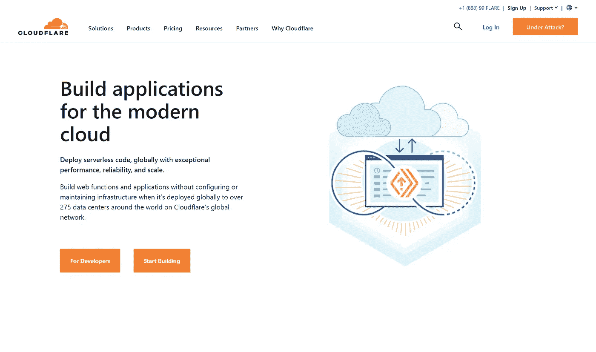
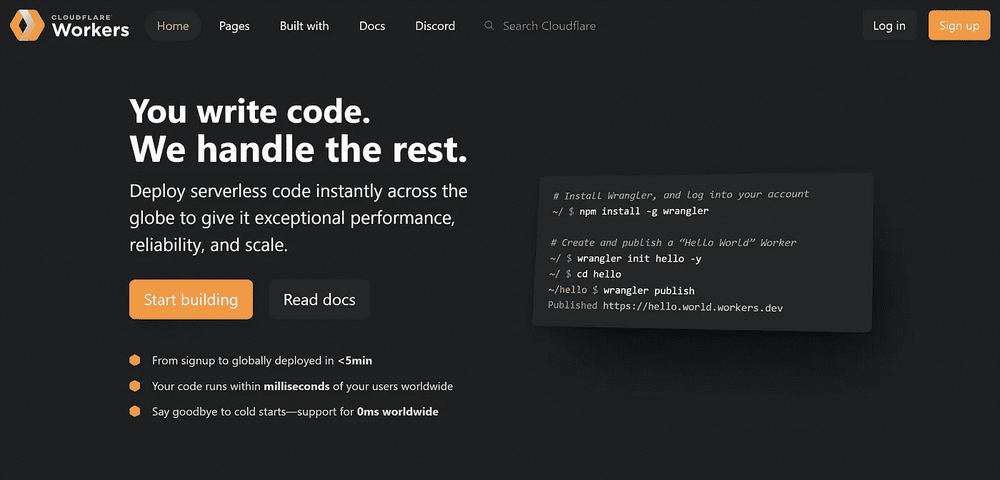
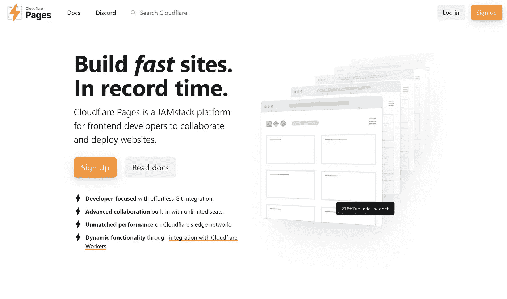
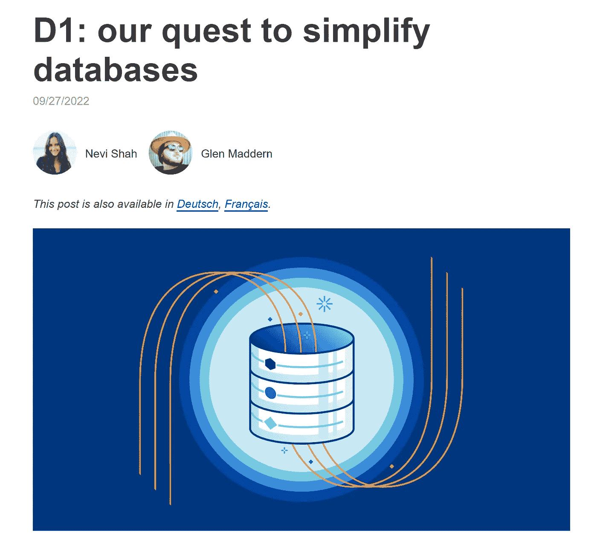
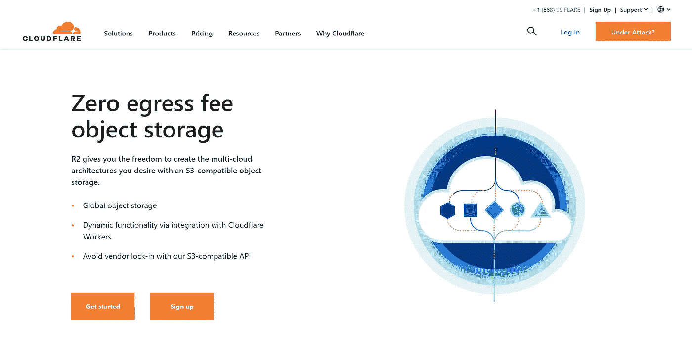

# cloud flare Stack:2023 年构建无服务器 Web 应用的高效、经济、零维护方式

> 原文：<https://betterprogramming.pub/the-cloudflare-stack-the-performant-cost-effective-zero-maintenance-way-to-build-your-apps-93433a63ead8>

## Cloudflare 不断扩大的云计算产品范围为开发人员提供了更少的妥协和难以置信的新机会

面向 Cloudflare 工作人员的产品页面

*2012 年 11 月 26 日更新:添加了关于 Cloudflare Workers 和 Cloudflare 页面语言支持的信息*

无服务器计算的承诺始终是部署无维护负担、低成本且可立即扩展的应用程序。然而，在实践中，重大问题总是让它变得不那么令人信服。对供应商锁定、与关系数据库的不良集成、冷启动和大规模高成本的担忧，都导致无服务器产品变得有点像只适合特定用例的利基产品。

然而，近年来，Cloudflare 对构建全栈云计算平台的尝试终于使我们更接近于实现无服务器的最初承诺。基于他们的边缘计算网络的能力，我们终于看到了无服务器，它可以提供性能、成本效益和低维护的组合。

# 边缘计算的魔力

Cloudflare 存在的基础是其边缘计算网络，计算能力分布在世界各地，因此您可以尽可能靠近您的用户提供内容和运行代码。这为 Cloudflare 众所周知的长期运行的内容交付网络(CDN)提供了动力，也是他们后来构建云产品的基础。

这对他们的云平台意味着什么？您的代码/内容/数据将始终由离您的用户最近的服务器提供，而不是将资源部署到特定的区域。您可以获得令人难以置信的全球范围的性能，而无需担心在多个地区部署应用或资源的运营负担，或者手动扩展资源以满足需求。

与其他无服务器平台相比，这一关键设计特性使得 Cloudflare 的许多产品如此引人注目和独特。让我们回顾一下这对他们的一些产品意味着什么，并讨论一些利弊。

# Cloudflare 的服务

## 云闪工人

Cloudflare 工作人员登录页面

Cloudflare 向构建全栈云计算平台的演进始于 Workers，即其无服务器功能产品。基于 Cloudflare 的边缘计算网络，它不像 AWS Lambda 和 Google Cloud 函数那样以基于容器的方式运行代码。相反，Cloudflare Workers 作为 V8 隔离(如 Chrome 的 JavaScript 引擎)运行，这些隔离的 JavaScript 片段可以在没有容器的情况下运行，基于 Web 平台 API(现代浏览器中可用的标准化 API)而不是 Node.js。这意味着令人难以置信的快速性能和零冷启动，因为您不需要等待容器启动来服务请求。这解决了一个关键的性能问题，这个问题从一开始就困扰着许多无服务器计算平台。

## **这种架构的优势如下:**

*   零冷启动
*   由于 Cloudflare 的边缘网络，代码将始终在离用户最近的地方运行，从而带来最佳性能，无需任何开发人员配置或干预
*   使用符合标准的 Web 平台 API 意味着您的无服务器功能是可移植的，减少了供应商锁定(Cloudflare Workers 运行时也是[开源的](https://github.com/cloudflare/workerd)，这意味着如果您愿意，您可以自托管 Workers)

## **但是，也有明显的缺点:**

*   不支持 V8 之外的其他运行时，[对 JavaScript 和 TypeScript 之外的语言的支持](https://developers.cloudflare.com/workers/platform/languages/)只对编译成 JavaScript 或编译成 WebAssembly 的语言可用
*   没有 Node.js 支持意味着工人只能兼容 NPM 包的一小部分
*   因为代码不在沙盒容器中运行，所以您不能直接建立 TCP 连接(例如，到 PostgreSQL 数据库)，而是需要通过基于 HTTP 的代理运行请求

尽管有这些限制，最近的一些发展已经极大地改变了这个等式。Deno 等基于 Web 平台 API 的运行时的兴起，以及 ESM (ES 模块)在 JavaScript 生态系统中日益普遍的使用，使得流行的 JavaScript 库支持 Workers 等运行时变得更加普遍。

第二个主要发展是 Cloudflare 现在正在构建一整套无服务器云产品来补充工作人员，使您无需离开平台即可轻松构建全栈应用程序。

# Cloudflare 页面

Cloudflare 页面登录页面

Cloudflare Pages 是一个前端部署平台，您的前端可以立即部署到 Cloudflare 的边缘网络中。鉴于类似的服务已经存在，如 Vercel 和 Netlify，这并不是一个独特的服务。您可以获得类似 Vercel 的功能，如自动部署、预览构建、部署到边缘网络，以及无服务器功能的全栈支持。

然而，Pages 的真正价值主张是它位于 Cloudflare 的边缘网络上和 Cloudflare 的云堆栈中。您拥有网络的性能和可靠性，世界上一些最大的网站通过该网络运行其流量，并且与 Cloudflare 的其他优秀云服务相集成。

## **优点:**

*   您的前端位于 Cloudflare 出色的边缘网络上，这意味着出色的性能
*   可以通过 Pages 函数(基于 Cloudflare Workers)将无服务器功能部署为您前端的一部分，用于构建全栈应用
*   请求数量或带宽没有上限

## **缺点:**

*   您可能无法将您喜爱的框架、UI 组件或库与全栈 Cloudflare 页面一起使用(由于 Cloudflare Workers 中缺少 Node.js 支持)。对于没有后端组件或服务器端渲染的项目来说，这**不是**问题，因为这些项目不能在 Cloudflare Workers 上运行。Cloudflare Pages 将很乐意用各种各样的语言和运行时(包括 Node.js)构建一个前端专用项目。
*   对 Next.js 的支持仍处于早期阶段，即使构建完成，Vercel 与框架的深度集成可能仍会更加引人注目

# D1: Cloudflare 的无服务器数据库

Cloudflare 博客上的 D1 帖子

Cloudflare 工作人员无法通过 TCP 直接连接到数据库，这使得 Cloudflare 堆栈中的数据库非常有限。为了帮助缓解这一问题，并为员工提供一个集成良好的数据库解决方案，Cloudflare 最近发布了他们的 D1 SQL 数据库服务。

按照通常的 Cloudflare 方式，它是基于其边缘计算网络的无服务器产品。该服务建立在 SQLite 上，这是一个非常轻量级的 SQL 数据库，可以作为一个文件运行(它非常轻，甚至可以在嵌入式和移动设备上运行)。

这种架构意味着 D1 可以提供一些非常不可思议的功能，并且没有维护负担，也不需要担心长期运行的服务器。这些功能包括自动读取复制和冗余，以及带恢复功能的自动备份。

没有区域可供选择，没有要启用的复制，也没有要扩展的数据库服务器。开箱即可获得全球范围的性能。对于传统数据库来说，这种功能要么成本高昂，要么价值不菲。而且，因为 D1 是基于 SQLite，一个开源数据库，你的数据库仍然是完全可移植的，如果你选择把它移到其他地方。

## **优点:**

*   全球范围的开箱即用性能，无需额外配置
*   由于基于 SQLite，该数据库是完全可移植的。你可以很容易地进出 D1。

## **缺点:**

*   D1 只能从 Cloudflare 工作人员内部访问，目前还不清楚这种情况是否会改变。允许在 Cloudflare 之外访问 D1 数据需要用 Cloudflare Workers 构建一个面向公众的 API。
*   SQLite 不像 Postgres 等其他 SQL 风格那样功能齐全

D1 目前在阿尔法。上面提到的一些功能仍在开发中，可能会有变化。

# R2

Cloudflare R2 产品页面

R2 是 Cloudflare 的存储产品，使用 AWS S3 兼容 API 构建。R2 在其存储竞争对手中解决的最大问题是消除出口费用。对离开提供商云网络的数据收取出口费。传统上，这意味着您不仅要为写入、读取和存储付费，还要为每次数据发送到任何地方付费。

这不仅会导致您为数据支付两次费用，还会阻碍您将数据转移到不同的提供商(因为要将所有数据转移到当前提供商的网络之外，您必须支付高昂的费用)。几年来，Cloudflare 一直致力于通过他们的[带宽联盟](https://www.cloudflare.com/bandwidth-alliance/)来降低和消除出口费用，并且现在已经通过他们自己的存储产品做到了这一点。

## **优点:**

*   对于频繁访问的数据，比 S3 便宜得多
*   没有出口费
*   与 Cloudflare Workers 直接集成
*   与 S3 兼容的 API
*   不需要为每个桶选择一个区域。未来，这将允许 R2 自动分析数据访问模式，以优化数据存储位置。

## **缺点:**

*   与 S3 相比，可用的配置选项有限
*   不完全等同于 S3 的 API
*   无存档存储率(对于不常访问的数据，S3 可能会更便宜)

# 结论

Cloudflare 的产品现在首次允许您完全在其生态系统内构建全栈应用。虽然一些产品仍然很年轻，有明显的局限性，但 Cloudflare 的架构使无服务器计算的最初承诺比以往任何时候都更加真实。虽然这个堆栈对每个应用程序都没有意义，但今天许多应用程序都可以从中受益。整个平台也在快速发展，不断增加新的服务和功能。

我认为 Cloudflare 的总体愿景是许多开发人员都可以接受的。他们没有尝试在墙上贴上云服务，也没有尝试在服务上与更大的云竞争对手相匹敌，而是构建了一些经过精心设计的服务，旨在解决特定的开发人员痛点。

我认为，还有其他一些价值使它们比其他平台对开发者更友好。作为一家公司，Cloudflare 做出了巨大努力，以比竞争对手更具成本效益。他们的服务通常不收取外出费，他们的定价极具竞争力，他们的定价等级通常比竞争对手更宽松。

他们也一直在更广泛的开发者生态系统和他们自己的产品中推动开放标准。如上所述，Cloudflare 的许多产品都以这种方式专门减轻了对供应商锁定的担忧。

如果您对无服务器计算感兴趣，但对已经存在的东西不感兴趣，那么值得看看 Cloudflare。虽然堆栈不会适用于所有用例，尤其是在今天的早期阶段，但我认为它可以为正确的应用程序提供大量价值。即使它现在对你不起作用，但它快速进化的本性意味着它很快就会起作用。