# 代码父亲:关系数据库基础

> 原文：<https://betterprogramming.pub/the-coddfather-relational-database-fundamentals-533b96f87651>

## 探索关系数据库及其无处不在的原因

在 20 世纪中期 IBM 时代——有一个人名叫 Edgar F. Codd，又名“Ted ”,他对数据充满热情。他提出了关系数据库理论，50 年后，它仍然是绝大多数网站和应用程序的主要数据存储架构。他的工作达到了顶峰，给我们带来了脸书、Snapchat、Instagram、LinkedIn、YouTube 和所有其他基于用户的社交媒体网络应用的 pie ce de resistance 是一个强大的概念:自我连接表。

本系列是为那些对学习关系数据库的基础知识以及为什么它们无处不在感兴趣的人编写的。它还针对那些对自连接及其稍微高级一点的应用程序(比较三重连接)感兴趣的人。在接下来的两篇文章中，我将使用 Ruby on Rails 演示后者:

[**在 Ruby on Rails**](https://medium.com/@jdprince555/building-self-joins-and-triple-joins-in-ruby-on-rails-455701bf3fa7) 中构建自连接和三连接。

[**Ruby on Rails 中的电影对比网站**](https://medium.com/@jdprince555/movie-comparison-website-in-ruby-on-rails-4632f2e1dee2)

我们开始吧！

# 首先，基本面

想象你和我想要复制脸书。只不过这是 20 世纪 60 年代中期，在 Ted 的提议之前，我们所有的相关信息都必须存储在一个巨大的类似 Excel 的电子表格中。大概是这样的:

请记住，你和我刚刚开始复制脸书(24 亿用户，[过去 6 个月 200 亿次访问](https://www.similarweb.com/website/facebook.com))，这意味着它不是 7 列 15 行，而是 10，000 列和 100，000，000，000 行。(这需要滚动浏览超过 2.5 亿英里的数据。)

注意:由于脸书的数据量深不可测，他们使用非关系数据库系统以及关系系统。非关系系统允许它们变得更加具体。然而，出于本文的目的，让我们回到 21 世纪初，假设他们仍然完全依赖关系系统。

每次你添加一个朋友，评论一个帖子或者添加一部电影到你的收藏夹——这些小信息(“贝基”或者“嘿，妈妈！!"或者“比尔和特德的精彩冒险”)被添加到 Excel 表格的新行的一个单元格中。这一添加将触发一系列自动计算，波及整个电子表格:“在我的‘朋友总数’一栏中加 1”。

此外，每次你想直接*改变*一些信息[“新的个人资料图片”或“编辑最后的评论”]，计算机将挖掘数十亿，可能数万亿行，加上几千列，找到并改变那一个，单个单元格。

可能吗？当然可以。

是数据大决战吗？是的。是的，它是。事实上，这是一场真正的噩梦。一场血腥、不可靠的数据噩梦。

特德·科德带着激进的解决方案和整洁的小胡子走进来:

泰德·科德

Ted 的理论是，我们可以将这个巨大的电子表格分解成许多彼此“相关”的小电子表格。

要将数据之间的“关系”概念化，请考虑家庭关系。我和父母有血缘关系，我的孩子和我有血缘关系。我们整个系列都有一些共同的特点。这些特征由一条独特的 DNA 链决定。DNA 让我们成为一家人。

想想这张家长表:

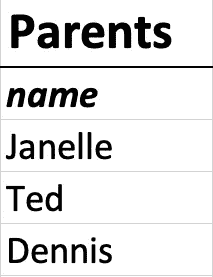

这些孩子:

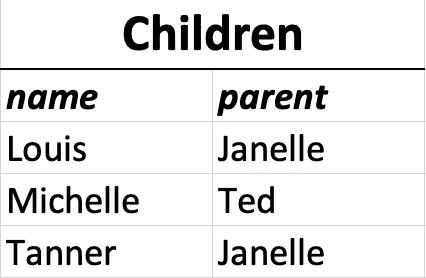

c*children*表保存了一条将孩子与父母联系起来的重要信息:与孩子相关联的父母的名字。通过在 children 表中查找所有孩子，我可以看到 Janelle 的所有孩子(Louis 和 Tanner ),她的名字出现在 parent 列中。

这是有意义的，也是有帮助的。然而，事实上，孩子并不是通过父母的*名字*与父母唯一联系在一起的。基于任意的、可变的因素将父母和孩子联系在一起，例如*名字*是灾难性的:

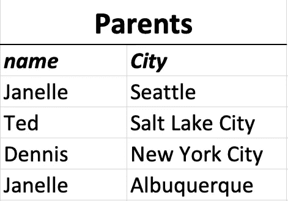

突然，路易斯和坦纳的妈妈把自己克隆成了两个相距一千英里的人。…但是路易斯和坦纳是兄弟姐妹吗？也许他们只是碰巧有同名的母亲。那样的话，谁的妈妈是谁的？啊哦。

因此，我们需要每个人都有一个唯一的标识符。我们需要更像 DNA 的东西。更好的是，如果我们能得到数字形式的 DNA 呢？计算机特别喜欢这样。

# *输入:唯一 id！*

惟一 id 是关系数据库中信息存储的基础。下面是它们的使用方法:

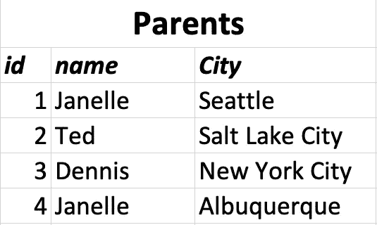

您会注意到 children 表中的“name”列现在完全没有用了。因此，我们删除该列，并将父代的 *id* (标识号)保留在一个名为 parent_id 列的修订列中。

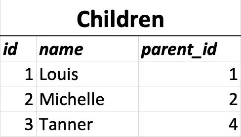

只要我们确保没有父母拥有相同的 id，id 就可以有效地充当“DNA”他们是唯一的，分配给每个父母的不可变因素，使得每个父母都是独一无二的。

随着身份识别系统的引入，我们现在可以绝对肯定地知道路易斯的母亲 Janelle 住在西雅图，而坦纳的母亲 Janelle 也住在阿尔伯克基:

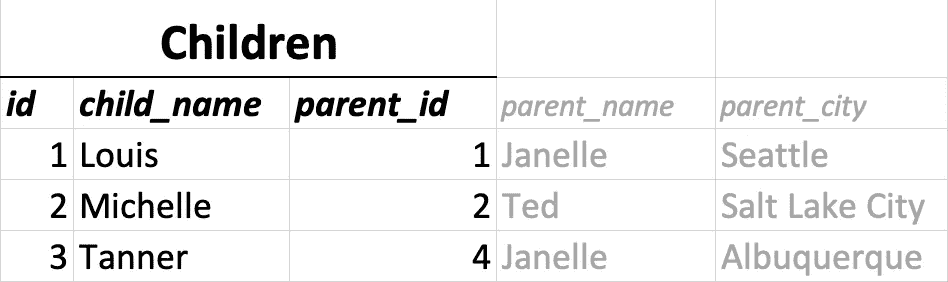

就像单链 DNA 包含了决定我们外表和行为的属性一样，每个 id 号包含了定义一个人的数据。因此，我们不需要后两列， *parent_name* 和 *parent_city — t* 帽子信息隐含在 *parent_id 中。*

最重要的是，我们的桌子非常简单！我们不会左右上下滚动来寻找我们需要的东西。我们有两个独立的表，分别负责数据库的一个方面:一个是孩子的，一个是父母的。

让我们来看看实际情况。如果我们想发现一个父表的信息，我们在父表中搜索一个相关的行。在那里，我们可以看到父母的姓名、年龄、地点等。

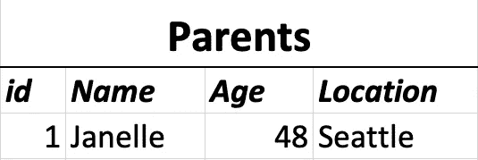

我们爱管闲事，所以我们也对查看父母的孩子的信息感兴趣(姓名、年龄、地点、学习)。这很简单:只需获取父 id (1)，跳到子表，在 *parent_id* 列中搜索所有匹配数字(1)的结果。

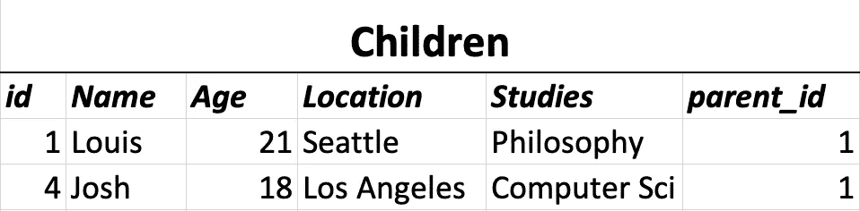

我们只剩下精选的高度相关的数据。

简而言之，这就是关系数据库系统的优点和用处。它允许我们通过分离关注点来集中我们的活动。我们有两个表，处理非常不同的数据，但它们很容易与 id 相关联。

在最初的例子中，我们被要求将我们所有的信息包含在一个单一的源中，这将迫使我们不断地重写和重新链接元素。有了 Ted 的关系系统和强大的惟一 id，大量的工作得以避免。

# 脸书怎么样？

让我们回到重建脸书的探索上来。现在，有了 Ted 的工具，我们可以通过把它分成许多更小的、高度集中的表格来管理我们的噩梦般的数据堆，每个表格关注更大画面的一个方面。用户、帖子、评论和喜欢现在是由一个简单的数字公分母链接在一起的单个表格:*唯一 id*。

让我们用用户(父)到帖子(子)的关系来想象一下:

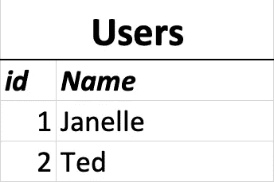

每个用户有许多帖子，每个帖子有一个用户，所以我们说 posts 是子表，user 是父表。为了正确设置这种关系，我们只需要确保每个帖子都包含用户的“DNA”，将两者不可分割地联系在一起: *User_id* 。

帖子的每个实例包括帖子的 id(T12)和一些数据(在本例中是文本(T16)和时间(T19)以及一个用户 id(T20)和 T21，它建立了与用户的关系

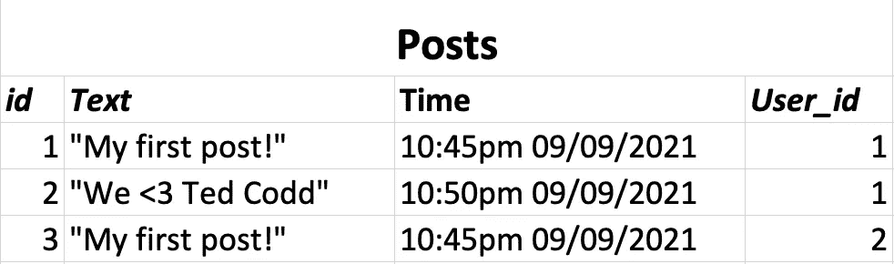

不错！尽管第一篇和第三篇帖子是在完全相同的时间发布的，并且包含完全相同的文本，但它们在 id*和作者*方面是独一无二的，*由*用户 id 表示。*我们很确定的知道 Janelle 写了第一个帖子( *id 等于 1)，*Ted 写了第三个帖子( *id 等于 3)。**

此外，因为所有帖子数据都存在于单个表格中，所以我们可以轻松地从所有*帖子或所有*Ted 的*帖子中提取信息并分析数据，而不必先删除不相关的信息。*

最重要的是，我们没有重写任何东西。更干净。更清晰。少干活。错误更少。

瞧啊。现在，评论和帖子通过帖子的 DNA 或唯一 id(即父帖子)相关联。首先，我们的表中没有不必要的空白，定位数据的整体效率得到了极大的提高。

# “喜欢”和这有什么关系？

“喜欢”是社交媒体网站中一个有趣的功能。单个 Like 包含两个重要的信息位:*谁*创建了 Like，以及*什么*接收了 Like。

如果我们从一个表的角度来考虑这个问题，我们会看到每个 Like 都有一个用户。它*也*正好有一个职位。因此，赞是用户和帖子的*子*。它包含了他们每个人的 DNA:

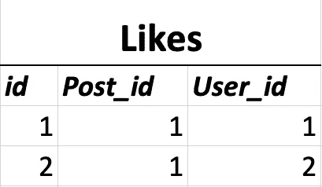

我们把这个描述为:一个喜欢的*属于*单个用户；那个同样喜欢也*属于*的单个帖子。它有两个父母。那些父母通过知道单身的和*有关系的。*

通过创建此表，我们意味着:

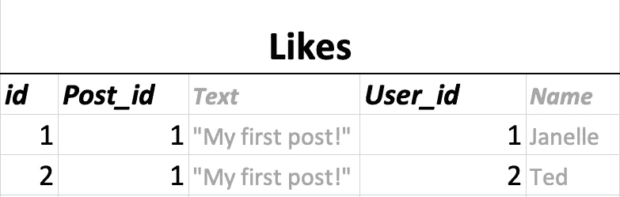

灰色列是不必要的，但它们说明了该表的行为:

Janelle 的第一篇帖子( *Post_id = 1* )“我的第一篇帖子！”，写于 2021 . 08 . 09 晚上 10:45，已经积累了两个赞。一封来自 Janelle 本人(*1*的 User_id)，另一封来自 Ted(*2*的 User_id)。

这种类型的关系经常出现在关系数据库中。之所以称之为*多对多关系* **，**是因为一个帖子可以有很多赞，而每个赞都有一个用户。因此，每个帖子可以有许多相关联的用户。同样，每个用户都有许多赞，每个赞都有一个帖子。因此，每个用户*都有许多相关联的 p*ost。

有了这种关系，我们就可以通过搜索 like 表中出现他的 id ( *2* )的所有实例来查找*Ted 的所有 like*。然后，我们可以很容易地分析泰德的偏好，这也是真正的脸书喜欢的。

# 朋友呢？

好的，所以我们在用户和帖子之间有一个*一对多*的关系，我们通过喜欢有一个*多对多*的关系。朋友呢？如果 Janelle 和我成为朋友，谁是父母，谁是孩子？答案是:都不是。我们都只是用户。我们都是通过友谊联系在一起的用户。

与用户发帖模型不同，在这种模型中，一个用户有许多帖子，一个帖子有*一个用户，这种新的“友谊”挑战要求两个用户都有许多其他用户。Janelle *有很多*朋友(用户)。我*有很多*朋友(用户)。因此，我们只有一个表可以使用:users。*

我们如何显示这些信息？我们可以创建一个“我的朋友”表，包含我所有的朋友和他们的唯一 id，如下所示:

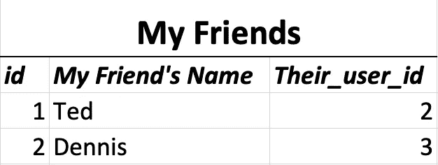

如果我们走这条路，我们必须为每个用户创建一个新的“我的朋友”表*。相反，我们想要一个包含所有友谊的表。为此，我们创建了所谓的*自连接*关系。*

创建自连接表是为了将一个表连接到自身，即 Janelle 和我都是用户的实例，友谊是将我们连接在一起的表。所以，友情是一种自我加入，因为它把用户加入到自己身上。

自连接的优点在于它的简单性。我们仍然只需要三列:一列用于我的 id(代表我和我的所有信息)，一列用于 Janelle 的 id(代表她的所有信息)，还有一列用于描述友谊本身，它对我们来说是完全唯一的:一个友谊 id。就是这样。它看起来是这样的:

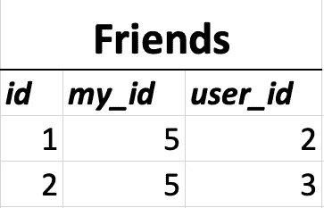

如果我们将此抽象为所有的友谊，而不仅仅是我的友谊，我们会看到这样的情况:

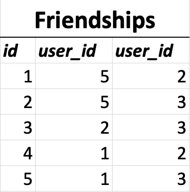

我现在可以很容易地看到我的 id(在这个例子中是 5)出现在 friendships 表的 2 行中。因此，我有两个朋友。我知道他们是哪些朋友，因为他们的 id 在相邻的列中(Ted 2 和 Dennis 3)。为了检索关于他们中任何一个的数据，我所要做的就是获取他们的 id 并在用户表中进行搜索。他们对我也是如此！

这三个简单的栏目使得像脸书这样的社交媒体网站成为可能。

# 创建比较自连接和三连接！

在上面的例子中，两个用户平等地分享一个友谊。我的 id 在第二列还是第三列没有区别。这种设计对脸书和 LinkedIn 这样的网站很有效。但在 Twitter、Instagram 和 YouTube 上，一个用户是“关注者”，而另一个用户是“被关注者”，这又是怎么回事呢？在这种情况下，第一个*用户 id* 变成“跟随者 id”，第二个*用户 id* 变成类似“the_one_being_followed_id”

我不确定这种类型的自连接关系的确切术语，但是“比较”自连接对我来说是有意义的，因为我们同时*链接*来自同一个表的两个元素并且*比较*它们:一个元素是 X ( *追随者)*，另一个是 Y ( *跟随)*。

如果你想实时看到这种使用 Ruby on Rails 创建的 twitter 风格的比较自加入，这里有两篇我在学习这个概念时不断回顾的优秀文章:

 [## Rails 中的自引用关系(也称为自连接)

### 在我学习 web 开发时，Rails 关系是我最难以理解的事情之一…

medium.com](https://medium.com/@TheDickWard/self-referential-relationships-aka-self-joins-in-rails-64f8f36ac311)  [## 活动记录:多对多自联接表

### 从普通的到多对多的自连接表

medium.com](https://medium.com/@jbmilgrom/active-record-many-to-many-self-join-table-e0992c27c1e) 

如果你想了解在我看来更直观的比较自加入的例子，请点击下面的链接:从头到尾演示如何创建一个电影比较应用程序。

我们将通过一个比较表(自连接)将两部电影联系起来，然后将这个比较与一个特定的用户联系起来。结果是一个三重连接。

潜行高峰:

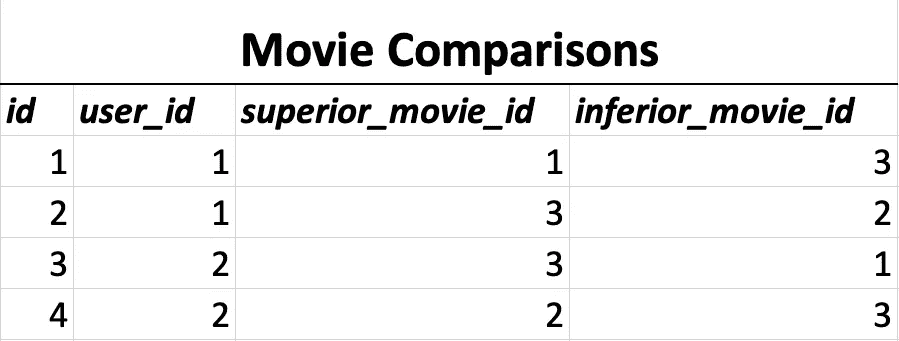

根据以上所述，我们推断当涉及到电影 1、2 和 3 时，用户 1 和用户 2 具有相反的偏好。

太棒了。

如果你要离开这里，那么感谢你的阅读！否则，点击这里，我马上就来。

[**在 Ruby on Rails 中构建自连接和三元连接**](https://medium.com/@jdprince555/building-self-joins-and-triple-joins-in-ruby-on-rails-455701bf3fa7)

为你干杯，泰德。

快乐编码

杰克逊